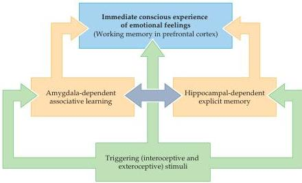

Chapter Twenty-Eight

Figure 28.7 Neural model for the awareness of emotional feelings.
The highly subjective feelings associated with emotional experience presumably arise from neural systems in the prefrontal cortex that produce awareness of emotional processing.
(After LeDoux, 2000.)

to express emotion by modulation of their speech patterns (recall that this loss of emotional expression is referred to as aprosody or aprosodia, and that similar lesions in the left hemisphere give rise to Broca's aphasia).
Patients with aprosodia tend to speak in a monotone, no matter what the circumstances or meaning of what is said.
For example, one such patient, a teacher, had trouble maintaining discipline in the classroom.
Because her pupils (and even her own children) couldn't tell when she was angry or upset, she had to resort to adding phrases such as "I am angry and I really mean it" to indicate the emotional significance of her remarks.
The wife of another patient felt her husband no longer loved her because he could not imbue his speech with cheerfulness or affection.
Although such patients cannot express emotion in speech, they nonetheless experience normal emotional feelings.

A second way in which the hemispheric processing of emotionality is asymmetrical concerns mood.
Both clinical and experimental studies indicate that the left hemisphere is more importantly involved with what can be thought of as positive emotions, whereas the right hemisphere is more involved with negative ones.
For example, the incidence and severity of depression (see Box E) is significantly higher in patients with lesions of the left anterior hemisphere compared to any other location.
In contrast, patients with lesions of the right anterior hemisphere are often described as unduly cheerful.
These observations suggest that lesions in the left hemisphere result in a relative loss of positive feelings, facilitating depression, whereas lesions of the right hemisphere result in a loss of negative feelings, leading to inappropriate optimism.

Hemispheric asymmetry related to emotion is also apparent in normal individuals.
For instance, auditory experiments that introduce sound into one ear or the other indicate a right-hemisphere superiority in detecting the emotional nuances in speech.
Moreover, when facial expressions are specifi-