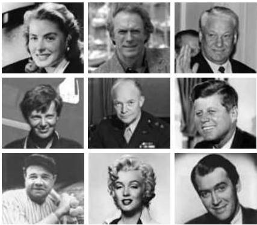

Emotions

Figure 28.8 Asymmetrical smiles on some famous faces.
Studies of normal subjects show that facial expressions are often more quickly and fully expressed by the left facial musculature than the right, as suggested by examination of these examples (try covering one side of the faces and then the other).
Since the left lower face is governed by the right hemisphere, some psychologists have suggested that the majority of humans are "left-faced," in the same general sense that most of us are right-handed.
(After Moscovitch and Olds, 1982; images from Microsoft® Encarta Encyclopedia 98.)

cally presented to either the right or the left visual hemifield, the depicted emotions are more readily and accurately identified from the information in the left hemifield (that is, the hemifield perceived by the right hemisphere; see Chapters 11 and 26).
Finally, kinematic studies of facial expressions show that most individuals more quickly and fully express emotions with the left facial musculature than with the right (recall that the left lower face is controlled by the right hemisphere, and vice versa) (Figure 28.8).
Taken together, this evidence is consistent with the idea that the right hemisphere is more intimately concerned with both the perception and expression of emotions than is the left hemisphere.
However, it is important to remember that, as in the case of other lateralized behaviors (language, for instance), both hemispheres participate in processing emotion.

# Emotion, Reason, and Social Behavior

The experience of emotion—even on a subconscious level—has a powerful influence on other complex brain functions, including the neural faculties