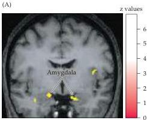
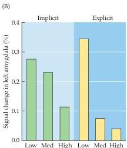
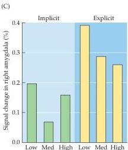

Emotions 709

Figure 28.9 Activation of the amygdala during judgments of trustworthiness.
(A) Functional MRI shows increased neural activation bilaterally in the amygdala when normal subjects appraise the trustworthiness of human faces; activity is also increased in the right insular cortex.
(B, C) The degree of activation is greatest when subjects evaluate faces that are considered untrustworthy (Low, Med and High indicate ratings of trustworthiness; Low = untrustworthy).
The same effect was observed when subjects were instructed to evaluate the trustworthiness of the faces (explicit condition) or whether the faces were those of high school or university students (implicit condition).
(After Winston et al., 2002; A courtesy of J.
Winston.)

the hypothalamus, the amygdala, and several regions of the cerebral cortex.
Although a good deal is known about the neuroanatomy and transmitter chemistry of the different parts of the limbic system, there is still a dearth of information about how this complex circuitry mediates specific emotional states.
Similarly, neuropsychologists, neurologists and psychiatrists are only now coming to appreciate the important role of emotional processing in other complex brain functions, such as decision-making and social behavior.
A variety of other evidence indicates that the two hemispheres are differently specialized for the governance of emotion, the right hemisphere being the more important in this regard.
The prevalence and social significance of human emotions and their disorders ensure that the neurobiology of emotion will be an increasingly important theme in modern neuroscience.