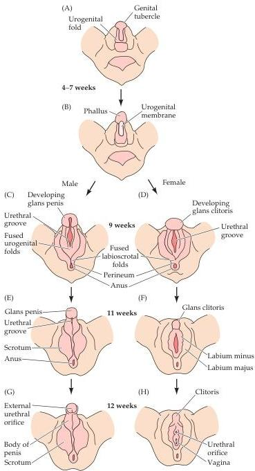

Chapter Twenty-Nine

# Box A

## The Development of Male and Female Phenotypes

The presence of either two X chromosomes or an X and a Y chromosome in the cells of an embryo sets in motion events that establish phenotypical sex, including the sexually dimorphic development of the brain.
The relevant neural effects are determined by the production of hormones, which depends in turn on the presence of either female or male gonads.

The early stages of human embryonic development follow a plan that produces common precursors for the gonads.
By about the sixth week of gestation, the primordial gonads have formed from somatic mesenchyme tissue, near the developing kidneys.
Cells in the gonads differentiate into supporting and hormone-producing cells; the germline cells, which divide by meiosis rather than mitosis and eventually become ova or sperm have a different origin, and migrate to the gonads from the yolk sac.
Attached to the primordial gonads are two sets of tubes—the Müllerian and Wolffian ducts—that are the progenitors of the internal genitalia.
Developing simultaneously is an undifferentiated structure called the urogenital groove, the progenitor of the external genitalia.

The primary genetic influence on the development of the typical male phenotype is the sex-determining region on the Y chromosome, the Sry gene.
When this region of the chromosome is activated during development, it turns on the production of a protein called testicular determining factor (TDF).
It is TDF that instructs the testes to begin developing.
Once activated, the male primordial gonads begin to produce testosterone (elaborated by the Leydig cells).
The cells of the testes also secrete Müllerian-inhibiting hormone, which prevents the Müllerian ducts from developing and allows the Wolffian ducts to develop into the epididymis, vas deferens, and semi-

Development of human female and male external genitalia.
(A, B) Indifferent stage, weeks 4-7 of gestation.
(D, F, H) Differentiation in the female genitalia at weeks 9, 11, and 12, respectively.
(C, E, G) Differentiation in the male genitalia at the same intervals.
(After Moore, 1977.)