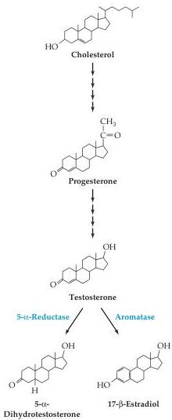

Sex, Sexuality, and the Brain 717

Figure 29.1 All sex steroids are synthesized from cholesterol.
Cholesterol is first converted to progesterone, the common precursor, by four enzymatic reactions (represented by the four arrows).
Progesterone can then be converted into testosterone via another series of enzymatic reactions; testosterone in turn is converted to 5-α-dihydrotestosterone via 5-α-reductase, or to 17-β-estradiol via an aromatase.
17-β-estradiol mediates most of the known hormonal effects in the brains of both female and male rodents.

mammals generally, fetuses are exposed to estrogens generated by the maternal ovary and placenta.
Why doesn't this estrogen interfere with sexual differentiation in female offspring? Apparently, the answer is that developing mammals have a circulating protein called α-fetoprotein that binds circulating estrogens.
The female brain is kept from early exposure to large amounts of estrogens, since estrogens are bound by α-fetoprotein; the male brain, however, is exposed via early testosterone surge; testosterone is not affected by α-fetoprotein, and is aromatized to estradiol only once inside neurons.

The conversion of testosterone to estrogen may not be as important in humans and other primates, where evidence suggests that sexual differentiation of the brain relies more on androgens and androgen receptors.
It is also androgens that bear most of the responsibility for stimulating sex drive in females as well as males.
For this reason, XY individuals with AIS can be "super-feminine" in their behavior and rarely choose females as sexual partners.

Finally, the influence of hormones in humans and other animals may be reinforced by sex differences established by genetic effects that are unrelated to hormonal differences during development.
For example, Ingrid Reisert, working at the Universitat Albert-Einstein in Germany established that there are sex differences in the development of dopaminergic fibers in cell cultures prepared from the diencephalon prior to sexual differentiation.
More recently, Geert DeVries and his colleagues at the University of Massachusetts created unusual male (XX with Sry; see Box A) and female (XY without Sry) transgenic mice.
In these animals, testes development occurred independently of the X or Y chromosome, thus demonstrating that XY mice with ovaries are, at least in some respects, more masculinized (measured by the density of vasopressin-immunoreactive fibers in the lateral septum) than XX mice with testes.
Complex as this configuration of chromosomal sex and phenotype may be, the experiment shows that at least one sexually dimorphic trait (the density of vasopressin fibers in the midbrain) depends on the presence of the Y chromosome, but not on the presence of testes and the androgens they secrete postnatally.
This observation supports the notion that hormone-independent sex differences are a part of the developmental plan.
This idea has also been examined in birds.
Arthur Arnold and his group at the University of California at Los Angeles have shown that the well-known song patterns existing in male but not in female zebra finches are driven in part by genetic mechanisms that operate independently of hormone levels.

These several studies raise the possibility that mechanisms in addition to hormones contribute to the sexual diversity of humans—a point that is important to bear in mind during the following discussion of the hormone-driven sex differences in rodents.

