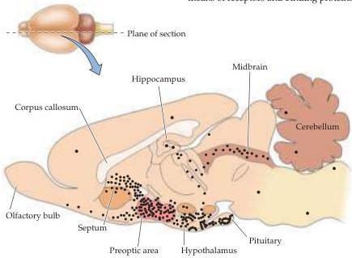

Chapter Twenty-Nine

# Box C

## The Actions of Sex Hormones

Sex hormones, which include progestins, androgens, and estrogens, are all steroids derived from a common precursor, cholesterol (see Figure 29.1).
Despite the common tendency to the contrary, it is not really correct to think of estrogens as "female" and androgens as "male." Females and males synthesize both estrogens and androgens, but in ratios that are very different.
Both sexes also have androgen and estrogen receptors in the brain, although there are some regional sex differences in receptor density.

Because sex steroids are lipids, they do not need membrane receptors to enter cells; they simply diffuse through the lipid bilayer.
However, neurons and other cells have the capacity to select, concentrate, and retain specific steroids by means of receptors and binding proteins in both the cytoplasm and nucleus.
Different areas of the adult brain have different steroid receptor patterns, with overlapping distributions of receptor types.
Thus, particular brain regions can be targets for the actions of different classes of steroids (Figure A).
For instance, estradiol receptors are sparsely distributed in the neocortex of rodents, but are prevalent in preoptic and hypothalamic areas and the anterior pituitary.
Conversely, whereas receptors for 5-α-dihydrotestosterone (5-DHT) are found only in certain nuclei in the septum and hypothalamus, both estradiol and 5-DHT receptors are abundant in the frontal, prefrontal, and cingulate areas of the cortex.

Some neurons express receptors for more than one steroid and, as a result, hormones can have a synergistic effect.
For example, all neurons with progesterone receptors also express estrogen

(A) Distribution of estradiol-sensitive neurons illustrated in a sagittal section of the rat brain.
Animals were given radioactively labeled estradiol; dots represent regions where the label accumulated.
In the rat, most estradiol-sensitive neurons are located in the preoptic area, hypothalamus, and amygdala.
(After McEwen, 1976.)

(A)

## The Effect of Sex Hormones on Neural Circuitry

Gonadal steroids—whether estrogens or androgens—stimulate sexually dimorphic patterns of development by binding to estrogen or androgen receptors.
These receptors, which are transcription factors activated by hormone binding, influence gene transcription and, ultimately, the development of an array of targets, including sexually dimorphic neural circuits.
(See Box C for further details about the actions of sex hormones.)

During development, and to some extent throughout life, estradiol stimulates brain dimorphisms by increasing size, nuclear volume, dendritic length, dendritic branching, dendritic spine density, and synaptic connectivity of the sensitive neurons.
One of the first demonstrations of such effects was provided by Dominique Toran-Allerand at Columbia University, who