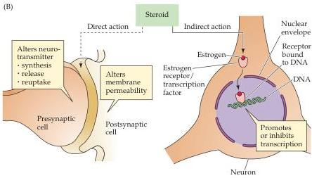

Sex, Sexuality, and the Brain 719

receptors.
Although female reproductive behaviors can be elicited by estrogen alone, the behavior is greatly facilitated in females given estrogen followed by progesterone.

Steroids can have a direct effect on neural activity by altering the permeability of the membrane to neurotransmitters and their precursors, or by altering the function of neurotransmitter receptors (Figure B).
This type of effect has a latency-to-onset of seconds to minutes and makes it possible for sex steroids to explicitly modulate the efficacy of neural signaling.

Sex steroids can also have an indirect effect on neural activity by forming non-covalent bonds with steroid receptors, or by affecting other signaling pathways.
Binding to a steroid receptor causes a conformational change that allows the receptor to bind to specific DNA-recognition elements called hormone-responsive elements.
Steroid receptor co-activators, which are members of a family of co-activators that modulate the activity of steroid receptors, can enhance the effects of steroids by (1) opening up chromatin structure and (2) stabilizing the preinitiation complex at the level of the relevant promoter.
Consequently, hormones can alter gene expression, leading to changes in the synthesis of specific proteins (Figure B).
Such indirect hormonal actions have a latency-to-onset of minutes to hours.

Most sexually dimorphic differences in the brains of females and males are thought to arise by the indirect actions of hormones on gene expression.

## References

BROWN, T.
J., J.
YU, M.
GAGNON, M.
SHARMA AND N.
J.
MACLUSKY (1996) Sex differences in estrogen receptor and progestin receptor induction in the guinea pig hypothalamus and preoptic area.
Brain Res.
725: 37-48.
McEWEN, B.
S., P.
G.
DAVIS, B.
S.
PARSONS AND D.
W.
PFAFF (1979) The brain as a target for steroid hormone action.
Annu.
Rev.
Neurosci.
2: 65-112.
Rowan, B.
G., N.
L.
WEIGEL AND B.
W.
O'MALLEY (2000) Phosphorylation of steroid receptor coactivator-1: Identification of the phosphorylation sites and phosphorylation through the mitogen-activated protein kinase pathway.
J.
Biol.
Chem.
275: 4475-4483.
TSAI, M.-J.
AND B.
W.
O'MALLEY (1994) Molecular mechanisms of action of steroid/thyroid receptor superfamily members.
Annu.
Rev.
Biochem.
63: 451-486.

(B) Steroids have direct and indirect effects on neurons.
Dashed line shows direct effects of hormones on the pre- or postsynaptic membrane, which alters neurotransmitter release, and affects neurotransmitter receptors.
Solid line shows indirect effects of hormones, which act at the level of the nucleus to alter protein synthesis.
(After McEwen et al., 1978.)

noted the striking consequences of adding estrogens to fetal hypothalamic explants (Figure 29.2).
Estradiol can also stimulate an increase of the number of synaptic contacts neurons receive in adult animals.
For example, during periods of high circulating estrogen in the estrous cycle of female rodents (or after administration of estrogens) there is an increase in the density of spines and synapses on the apical dendrites of pyramidal neurons in the hippocampus (Figure 29.3).
These changes in neuronal circuitry presumably underlie differences in learning and memory over the estrous cycle (e.g., differences in the spatial navigation of rodents).

Other hormonally generated differences in brain circuits leading to differences in reproductive behaviors in both female and male rodents have been documented by administering testosterone (or estrogens) to females, or by