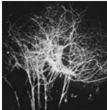
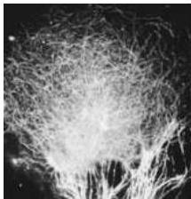

Chapter Twenty-Nine

(A)

(B)
Figure 29.2 Estrogen causes exuberant outgrowth of neurites in hypothalamic explants from newborn mice.
(A) Control explant showing only a few silver-impregnated processes growing from the explant.
(B) An estradiol-treated explant has many more neurites growing from its center.
(From Toran-Allerand, 1978.)

depriving males of testosterone by castrating them at birth.
Geoffrey Raisman and Pauline Field, then working at Oxford University, found a greater number of synapses on spines in the preoptic region of the hypothalamus in normal female rats compared to the equivalent region in males.
This difference is directly under the influence of hormones during development.
Castrating males within 12 days of birth increased the density of these synapses to female levels, whereas administration of testosterone to developing females led to a reduction of preoptic spine synapses to male levels.
Neonatal castration also affects other aspects of brain function.
Unlike intact males, male rats castrated soon after birth respond to estradiol with a surge of luteinizing hormone (which, in the presence of ovaries, would lead to ovulation); and treatment of newborn females with testosterone leads to the loss of the luteinizing hormone surge.

Subsequently, Roger Gorski and his colleagues at the University of California at Los Angeles discovered a nucleus in the male rodent hypothalamus that is so small as to be essentially missing in the female; logically enough, they called this structure the sexually dimorphic nucleus (SDN).
This sex difference also develops under the influence of hormones; Gorski found that the SDN in male rats could be reduced in size to that of the female by castration within the first 2 weeks after birth.
Similarly, the size of the female SDN could be increased to that of the male by early administration of androgens.
Since the preoptic area is crucial for the display of male sex behavior in many species, the sex difference in the SDN seemed likely to be related to male sexual function.
Indeed, female rodents given testosterone early in development exhibit mounting behavior, whereas male rodents deprived of testosterone exhibit lordosis (i.e., a behavior receptive to mounting).
Nonetheless, the exact role of the SDN plays in these behavioral sex differences is not clear.

In short, the development of sexually dimorphic structures in the rodent brain is primarily under the control of circulating sex hormones, with some determined at least in part by genes on the Y chromosome.
Again, the effect of hormones is less certain and may be more complex in the primate brain.
For example, Kim Wallen at Emory University investigated the role of social conditions in establishing some of the sex-typical behaviors of rhesus monkeys that were once thought to be solely determined by hormones.
He found that although rough-and-tumble play and mounting (typical juvenile behavior for this species) were exhibited less frequently by females than by males, the environment in which the animals were reared affected the degree of this sex difference.
Moreover, when reared with only their own sex, males displayed more and females less of these behaviors.
Thus, while the propensity for such sex-typical juvenile behaviors may be established by hormonal actions, their expression is shaped by the environment in which the animal develops.
It is not difficult to extrapolate from these studies to humans, where it seems especially important to consider both nature and nurture in the development of differences between sexes.

## Other Central Nervous System Dimorphisms Specifically Related to Reproductive Behaviors

Other sexual dimorphisms in the central nervous system influence behaviors ranging from the control of motor responses in reproductive behaviors to aspects of cognition.
This section briefly reviews additional examples specifically related to reproductive behavior; the following section considers sexual dimorphisms related to cognitive abilities.