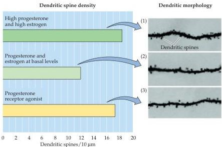

Sex, Sexuality, and the Brain 721

Figure 29.3 Changes in the dendrites of rat hippocampal neurons following various hormonal regimes.
Left: Dendritic spine density under each of the indicated conditions (recall that dendritic spines, which are small extensions from the dendritic shaft, are sites of synapses).
Right: Tracings of representative apical dendrites from hippocampal pyramidal neurons: (1) After administration of progesterone and estrogen in high dosage.
(2) After administration of progesterone and estrogen at basal levels.
(3) After administration of a progesterone receptor antagonist.
(After Woolley and McEwen, 1992.)

Perhaps the best example of sexual dimorphism related to motor control of a reproductive behavior is the difference in size of a nucleus in the lumbar segment of the rat spinal cord called the spinal nucleus of the bulbocavernosus.
The motor neurons of this nucleus innervate two striated muscles of the perineum, the bulbocavernosus and levator ani (Figure 29.4A).
In males, the bulbocavernosus and levator ani attach to the penis and play a role both in urination and copulation.
In female rats, the bulbocavernosus is absent and the levator ani is dramatically reduced in size.
Marc Breedlove and his colleagues first showed that the spinal nucleus containing the motor neurons that innervate the bulbocavernosus is absent in female rats but is quite large in males (Figure 29.4B,C).
Breedlove and Nancy Forger then demonstrated that the development of this dimorphism in the spinal cord depends on the maintenance of target muscles by circulating androgens.
Since developing males have high levels of circulating sex steroids and females do not, these muscles largely degenerate in developing female rats, leaving the motor neurons to atrophy in the absence of trophic support (see Chapter 23).

As with most sexual dimorphisms, the analogous situation in humans is considerably less clear than in experimental animals.
In humans, the spinal cord structure that corresponds to the spinal nucleus of the bulbocavernosus in rats is called Onuf's nucleus.
Onuf's nucleus consists of two cell groups in the sacral cord, the dorsal medial and the ventral lateral groups.
The dorsal medial group is not sexually dimorphic; however, human females have fewer neurons in the ventral lateral group than males (Figure 29.4D).
In con