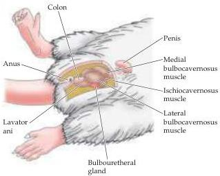
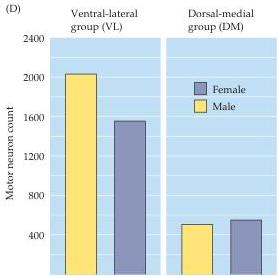
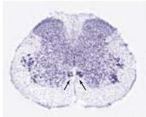
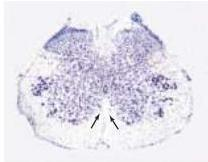

Chapter Twenty-Nine

(A) Male rat pelvis

Figure 29.4 The number of spinal motor neurons related to the perineal muscles is different in female and male rodents.
(A) Diagram of the perineal region of a male rat.
(B) A histological cross section through the fifth lumbar segment of the male.
Arrows indicate the spinal nucleus of the bulbocavernosus.
(C) Same region of the spinal cord in the female rat.
There is no equivalent grouping of densely stained neurons.
(D) Histograms showing motor neuron counts in the dorsal-medial and ventral-lateral groups of Onuf's nucleus in human females and males.
(A after Breedlove and Arnold, 1984; B and C from Breedlove and Arnold, 1983; D after Forger and Breedlove, 1986.)

(B)

(C)

trast to rodents, human females retain a bulbocavernosus muscle throughout life (which serves to constrict the vagina), but the muscle is smaller than in the male.
The difference in nuclear size in humans, as in rats, presumably reflects the difference in the number of muscle fibers the motor neurons must innervate.

A variety of reproductive behaviors, including desire, priming, and parenting behaviors, are governed by the hypothalamus.
Neurons in the medial preoptic area of the primate anterior hypothalamus apparently mediate at least some of these behaviors (Figure 29.5).
In rhesus monkeys, physiological recordings from hypothalamic neurons during sexual activity show that neurons of the medial preoptic area of the anterior hypothalamus fire during different components of the sexual act.
Such recordings have been carried out on male monkeys sitting in a flexible restraining chair that allows the male to gain access to a receptive female by pressing a bar, which brings the female close enough to allow the male to mount her.
In this way, the responses of hypothalamic neurons can be correlated with "desire" (number of bar presses) and mating behavior (contact, mounting, intromission, thrusting).
Neurons in the medial preoptic area of the male hypothalamus fire rapidly before sexual behavior, but decrease their activity upon contact with the female and mating (Figure 29.6).
In contrast, neurons in the dorsal anterior hypothalamus begin firing at the onset of mating and continue to fire vigorously during intercourse.
Although these studies do not speak to sexual dimorphism, they provide direct evidence about the variety of sexual behaviors mediated by the hypothalamus.