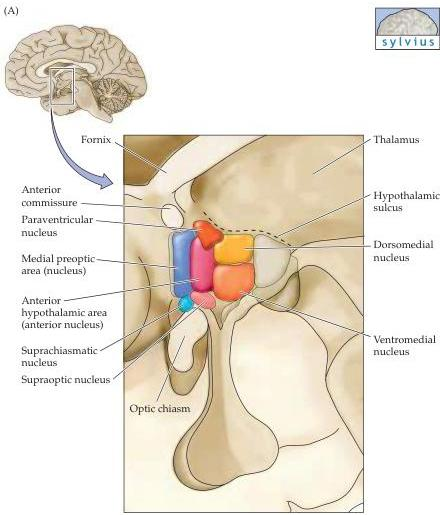
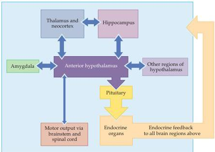

Sex, Sexuality, and the Brain 723

(A)

(B)

Figure 29.5 Organization of the components of the hypothalamus involved in regulating sexual functions.
(A) The human hypothalamus, illustrating the location of the anterior hypothalamic area and other nuclei in which sexual dimorphisms have been observed in either humans or experimental animals.
(B) Diagram of the major relationships of the anterior hypothalamus with other brain regions.
Blue arrows denote neural connections; yellow arrows denote hormonal links; purple arrow denotes a combination of hormonal and neural connections.
Although this information comes largely from studies of rodents, it is reasonable to assume that these interactions are characteristic of mammals.