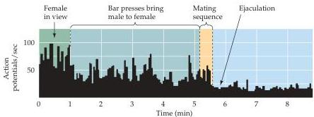

Chapter Twenty-Nine

Figure 29.6 Many neurons in the primate hypothalamus are actively associated with sexual behavior.
This example shows a histogram of neuronal activity recorded in the medial preoptic area in a male monkey exposed to a receptive female (see text).
The firing rate of the neuron changes during different phases of sexual activity.
(After Oomura et al., 1983.)

Such studies of rodents and non-human primates have stimulated a variety of further observations in the human hypothalamus.
The most thoroughly documented examples of sexually dimorphic hypothalamic nuclei in humans have been described by Laura Allen and Roger Gorski at the University of California at Los Angeles and by Dick Swaab and his colleagues at the Netherlands Institute for Brain Research.
Swaab first found a sex difference in the anterior hypothalamus of humans in a cell group that they named the sexually dimorphic nucleus (by analogy with the SDN of rats).
Subsequently, Allen and Gorski discovered that there are actually four cell groupings within the anterior hypothalamus of humans, which they called the interstitial nuclei of the anterior hypothalamus (INAH).
The INAH are numbered 1 to 4, from dorsolateral to ventromedial; INAH-1 corresponds to the nucleus initially discovered by Swaab (Figure 29.7).
Allen and Gorski reported that INAH-2 and INAH-3 can be more than twice as large in males as they are in females.

What might account for these somewhat discrepant findings? First, human studies are always complicated by the difficulty of obtaining human brains that meet the criteria of uniformity applied to the brains of experimental animals.
Second, it takes a long time to acquire a large enough number of human brains to confidently interpret the results.
Swaab and colleagues suggested that INAH-1 and 2 change in size over time; thus the age of the subjects studied might also influence observed sex differences.
For instance, INAH-1 is evidently about the same size in females and males up until 2-4 years of age; it then becomes larger in males until approximately 50 years of age, when it decreases in size in both sexes.
Although generally larger in males, INAH-2 is larger in females of childbearing age than in prepubescent and postmenopausal females.
Changes in nuclear size with age in humans presumably arise as a result of changing levels of circulating sex steroids.

Despite the difficulties inherent in the interpretation of such studies, one aspect of human reproduction in which these hypothalamic nuclei have been implicated is the choice of a sexual partner.
In addition to heterosexual behavior, some humans express sexual behaviors toward both females and males (bisexuality), and some only toward members of their own phenotypic sex (homosexuality).
Still other people are interested the opposite sex