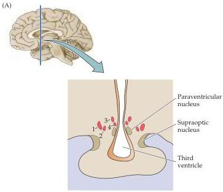
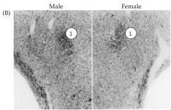
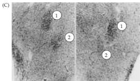
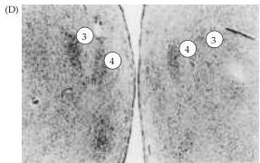

Sex, Sexuality, and the Brain 725

Figure 29.7 Sexual dimorphisms in the interstitial nuclei of the human anterior hypothalamus (INAH).
(A) Diagrammatic coronal section through the anterior hypothalamus.
The four interstitial nuclei of the anterior hypothalamus (red) are indicated by the numbers 1-4.
(B-D) Micrographs showing the interstitial nuclei from a male (left column) and a female (right column).
The male examples were taken from the left side of the brain, female examples from the right side at the same level.
(B) INAH-1.
(C) INAH-1 and 2.
Note that INAH-2 is less compact in the female.
(D) INAH-3 and 4.
INAH-4 is well represented in both the male and female, whereas INAH-3 is clearly less distinct in the female.
(B-D from Allen et al., 1989.)

but with a gender identity that is at odds with their phenotypic sex (transgenderism).
Based on experimental work in animals and evidence that relatively simple sexual behaviors are influenced by brain dimorphisms, explaining these more complex behaviors in the same general way has been an attractive possibility.
To investigate this issue, Simon LeVay, then working at the Salk Institute, compared the INAH of females, heterosexual males, and homosexual males.
LeVay first confirmed Allen and Gorski's findings that of the four INAH nuclei, at least two are sexually dimorphic.
He went on to discover that one of these nuclei—INAH-3—is more than twice as large in male heterosexuals as in male homosexuals (Figure 29.8A) and suggested that this difference is related to sexual orientation.

These studies have since been replicated by William Byne at the Mount Sinai School of Medicine, who confirmed the sexual dimorphism in INAH-3, although the difference was less than that reported by Allen and by LeVay.
Byne concluded that INAH-3 in the gay men studied was intermediate in