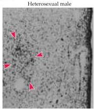
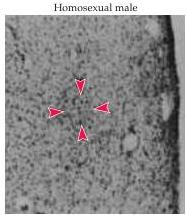
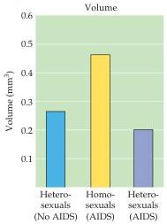
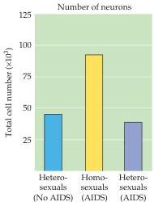

Chapter Twenty-Nine

(A) INAH-3

(B) Suprachiasmatic nucleus

Figure 29.8 Brain dimorphisms in heterosexual and homosexual human males.
(A) Micrographs showing difference in INAH-3 between heterosexual and homosexual males.
Arrowheads outline the nucleus.
(B) The suprachiasmatic nucleus may also differ between homosexual and heterosexual males.
The suprachiasmatic nucleus of homosexual males appears to be larger (left histogram) and to contain more neurons (right histogram) than that of heterosexual males with or without AIDS (which could be a significant variable in such studies).
(A from LeVay, 1991; B after Swaab and Hofman, 1990.)

size between heterosexual men and women.
The difference between the size of INAH-3 in the heterosexual and gay men in the study was of borderline significance, and thus neither a strong confirmation nor a refutation of earlier work.

Other researchers have suggested that dimorphisms of additional hypothalamic nuclei are related to sexual orientation and gender identity.
Dick Swaab and Michel Hofman at the Netherlands Institute for Brain Research studied the suprachiasmatic nucleus of the hypothalamus, which lies just above the optic chiasm in both rodents and humans and generates circadian