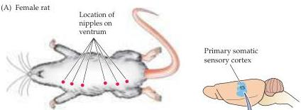
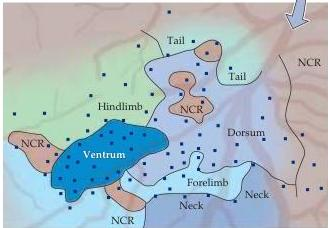
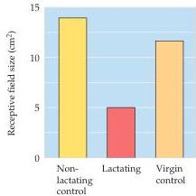
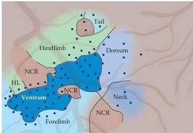

Chapter Twenty-Nine

(B) Nonlactating rat (18 days postpartum)

(D)

(C) Lactating rat (19 days postpartum)
Figure 29.9 Changes in the cortical representation of the chest wall in the rat primary somatic sensory cortex during lactation.
(A) Ventrum of the female rat; dots mark the position of nipples.
(B) Diagram of somatic sensory cortex in a nonlactating control rat, showing the amount of cortex normally activated by stimulation of the ventrum.
Squares mark electrode penetrations; colors signify the estimated representation.
(C) Similar diagram from a 19-day postpartum, lactating rat.
Note the expansion of the representation of the ventrum.
NCR, no cutaneous response.
(D) Histogram of receptive field sizes of single neurons in nonlactating control, lactating, and virgin control rats.
The receptive field sizes of neurons in lactating mothers are decreased.
(B-C after Xerri et al., 1994.)