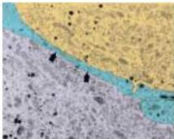
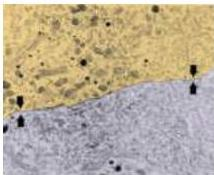

Sex, Sexuality, and the Brain 731

Figure 29.10 Changes in neurons of the rat supraoptic nucleus during lactation.
Left: Before birth, the relevant neurons and their dendrites are isolated from each other by astrocytic processes (blue).
Right: During nursing of the young, the astrocytic processes withdraw, and neurons and their dendrites show close apposition (arrow pairs) that allows electrical synapses to form between adjacent neurons (see Chapter 5).
(From Modney and Hatton, 1990.)

## Summary

Differences in female and male behaviors ranging from copulation to cognition are linked to differences in brain structure.
Although the neural basis for these sexual dimorphisms is much clearer in experimental animals, the evidence for sex-related differences in the human brain has grown rapidly in recent years.
The region of the brain in which the most clear-cut structural dimorphisms occur is the anterior hypothalamus, which governs reproductive behavior.
In rats and monkeys, the nuclei in this region play a role not only in the mechanics of sex, but also in desire, parenting, and sexual orientation.
In the rodent, sexual dimorphisms develop primarily as a result of hormonal action on neurons during early development.
On the strength of this knowledge about sexual development in experimental animals, neurobiological explanations for a variety of human sexual behaviors have been proposed.
Such models remain controversial because the sexual dimorphisms of the human brain and their functional significance are neither fully established nor well understood.
In addition, only a few such studies have been replicated.
Nevertheless, it seems likely that a deeper understanding of how the dynamic interplay between behavior, genetics, hormones, and environment influence the brain throughout life will eventually explain the fascinating continuum of human sexuality.

## Additional Reading

### Reviews

BLACKLISS, M., A.
CHARUVASTRA, A.
DERRYCK, A.
FAUSTO-STERLING, K.
LAUZANNE AND E.
LEE (2000) How sexually dimorphic are we? Review and synthesis.
Am.
J.
Human Biol.
12: 151-166.
MACLUSKY, N.
J.
AND F.
NAFTOLIN (1981) Sexual differentiation of the central nervous system.
Science 211: 1294-1302.
McEWEN, B.
S.
(1999) Permanence of brain sex differences and structural plasticity of the adult brain.
PNAS 96: 7128-7129.
SMITH, C.
L AND B.
W.
O'MALLEY (1999) Evolving concepts of selective estrogen receptor action: From basic science to clinical applications.
Trends Endocrinol.
Metab.
10: 299-300.

SWAAB, D.
F.
(1992) Gender and sexual orientation in relation to hypothalamic structures.
Horm.
Res.
38 (Suppl.
2): 51-61.
SWAAB, D.
F.
AND M.
A.
HOFMAN (1984) Sexual differentiation of the human brain: A historical perspective.
In Progress in Brain Research, Vol.
61.
G.
J.
De Vries (ed.).
Amsterdam: Elsevier, pp.
361-374.

### Important Original Papers

ALLEN, L.
S., M.
HINES, J.
E.
SHRYNE AND R.
A.
GORSKI (1989) Two sexually dimorphic cell groups in the human brain.
J.
Neurosci.
9: 497-506.
ALLEN, L.
S., M.
F.
RICHEY, Y.
M.
CHAI AND R.
A.
GORSKI (1991) Sex differences in the corpus callosum of the living human being.
J.
Neurosci.
11: 933-942.

BEYER, C., B.
EUSTERSCHULTE, C.
PILGRIM, AND I.
REISERT (1992) Sex steroids do not alter sex differences in tyrosine hydroxylase activity of dopaminergic neurons in vitro.
Cell Tissue Res.
270: 547-552.
BREEDLOVE, S.
M.
AND A.
P.
ARNOLD (1981) Sexually dimorphic motor nucleus in the rat lumbar spinal cord: Response to adult hormone manipulation, absence in androgen-insensitive rats.
Brain Res.
225: 297-307.
BYNE, W., M.
S.
LASCO, E.
KERUETHER, A.
SHINWARI, L.
JONES AND S.
TOBET (2000) The interstitial nuclei of the human anterior hypothalamus: Assessment for sexual variation in volume and neuronal size, density, and number.
Brain Res.
856: 254-258.