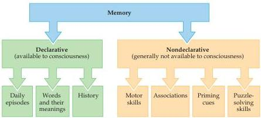
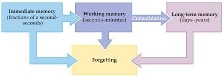

Chapter Thirty

Figure 30.1 The major qualitative categories of human memory.
Declarative memory includes those memories that can be brought to consciousness and expressed as remembered events, images, sounds, and so on.
Nondeclarative, or procedural, memory includes motor skills, cognitive skills, simple classical conditioning, priming effects, and other information that is acquired and retrieved unconsciously.

While it makes good sense to divide human learning and memory into categories based upon the accessibility of stored information to conscious awareness, this distinction becomes problematic when considering learning and memory processes in animals.
From an evolutionary point of view, it is unlikely that declarative memory arose de novo in humans with the development of language.
Although some researchers continue to argue for different classifications in humans and other animals, recent studies suggest that similar memory processes operate in all mammals and that these memory functions are subserved by homologous neural circuitry.
In other mammals, declarative memory typically refers to the storage of information which could, in principle, be declared through language (e.g., "the cheese is in the box in the corner") and that is dependent on the integrity of the medial temporal lobe and its associated structures (discussed later in the chapter).
Nondeclarative memory in other animals, as in humans, can be thought of as referring to the learning and storage of sensory associations and motor skills that are not dependent on the medial temporal portions of the brain.

## Temporal Categories of Memory

In addition to the types of memory defined by the nature of what is remembered, memory can also be categorized according to the time over which it is effective.
Although the details are still debated by both psychologists and neurobiologists, three temporal classes of memory are generally accepted (Figure 30.2).
The first of these is immediate memory.
By definition, immediate memory is the routine ability to hold ongoing experiences in mind for

Figure 30.2 The major temporal categories of human memory.