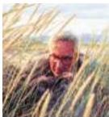
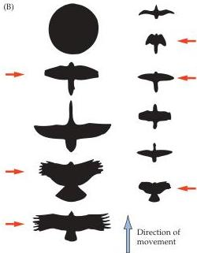

Memory 735

# Box A

## Phylogenetic Memory

A category of information storage not usually considered in standard accounts is memories that arise from the experience of the species over the eons, established by natural selection acting on the cellular and molecular mechanisms of neural development.
Such stored information does not depend on postnatal experience, but on what a given species has typically encountered in its environment.
These "memories" are no less consequential than those acquired by individual experience and are likely to have much underlying biology in common with the memories established during an individual's lifetime.
(After all, phylogenetic and ontogenetic memories are based on neuronal connectivity.)

Information about the experience of the species, as expressed by endogenous or "instinctive" behavior, can be quite sophisticated, as is apparent in examples collected by ethologists in a wide range of animals, including primates.
The most thoroughly studied instances of such behaviors are those occurring in young birds.
Hatchlings arrive in the world with an elaborate set of innate behaviors.
First is the complex behavior that allows the young bird to emerge from the egg.
Having hatched, a variety of additional behaviors indicate how much of its early life is dependent on inherited information.
Hatchlings of precocial species "know" how to preen, peck, gape their beaks, and carry out a variety of other complex acts immediately.
In some species, hatchlings automatically crouch down in the nest when a hawk passes overhead but are oblivious to the over

(A)

(B)

(A) Niko Tinbergen at work.
(B) Silhouettes used to study alarm reactions in hatchlings.
The shapes that were similar to the shadow of the bird's natural predators (red arrows) when moving in the appropriate direction elicited escape responses (crouching, crying, seeking cover); silhouettes of songbirds and other innocuous species (or geometrical forms) elicited no obvious response.
(From Tinbergen, 1969.)

flight of an innocuous bird.
Konrad Lorenz and Niko Tinbergen used handheld silhouettes to explore this phenomenon in naïve herring gulls, as illustrated in the figure shown here.
"It soon became obvious," wrote Tinbergen, "that ...
the reaction was mainly one to shape.
When the model had a short neck so that the head protruded only a little in front of the line of the wings, it released alarm, independent of the exact shape of the dummy." Evidently, the memory of what the shadow of a predator looks like is built into the nervous system of this species.
Examples in primates include the innate fear that newborn monkeys have of snakes and looming objects.

Despite the relatively scant attention paid to this aspect of memory, it is probably the most important component of the stored information in the brain that determines whether or not an individual survives long enough to reproduce.

## References

TINBERGEN, N.
(1969) Curious Naturalists.
Garden City, NY: Doubleday.
TINBERGEN, N.
(1953) The Herring Gull's World.
New York: Harper &amp; Row.
LORENZ, K.
(1970) Studies in Animal and Human Behaviour.
(Translated by R.
Martin.) Cambridge, MA: Harvard University Press.
DUKAS, R.
(1998) Cognitive Ecology.
Chicago: University of Chicago Press.

fractions of a second.
The capacity of immediate memory is very large and each sensory modality (visual, verbal, tactile, and so on) appears to have its own memory register.

Working memory, the second temporal category, is the ability to hold information in mind for seconds to minutes once the present moment has