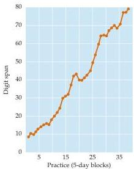
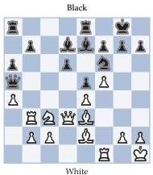
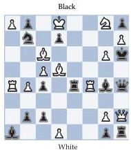
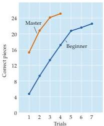
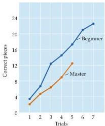

Memory 737

by making subsets of the string of numbers he was given signify dates or times at track meets (he was a competitive runner)—in essence, giving meaningless items a meaningful context.
This same strategy of association is used by most professional “mremonists,” who amaze audiences by apparently prodigious feats of memory.
Similarly, a good chess player can remember the position of many more pieces on a briefly examined board than a poor player, presumably because the positions have much more significance for individuals who know the intricacies of the game than for neophytes (Figure 30.4).
Thus, the capacity of working memory very much depends on

Figure 30.3 Increasing the digit span by practice (and the development of associational strategies).
During many months involving one hour of practice a day for 3–5 days a week, this subject increased his digit span from 7 to 79 numbers.
Random digits were read to him at the rate of one per second.
If a sequence was recalled correctly, one digit was added to the next sequence.
(After Ericsson et al., 1980.)

(A)

(B)

(C) Real game

(D) Randomly arranged
Figure 30.4 The retention of briefly presented information depends on past experience, context, and its perceived importance.
(A) Board position after white’s twenty-first move in game 10 of the 1985 World Chess Championship between A.
Karpov (white) and G.
Kasparov (black).
(B) A random arrangement of the same 28 pieces.
(C, D) After briefly viewing the board from the real game, master players reconstruct the positions of the pieces with much greater efficiency than beginning players.
With a randomly arranged board, however, beginners perform as well or better than accomplished players.
(After Chase and Simon, 1973.)