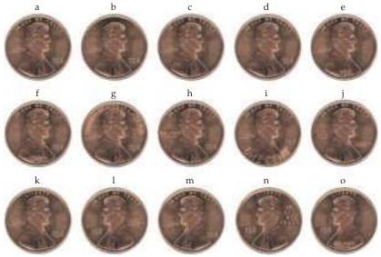
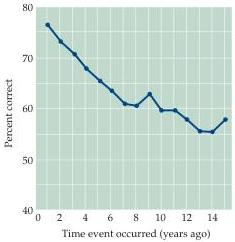

Chapter Thirty

(A)

(B)
Figure 30.5 Forgetting.
(A) Different versions of the "heads" side of a penny.
Despite innumerable exposures to this familiar design, few people are able to pick out (a) as the authentic version.
Clearly, repeated information is not necessarily retained.
(B) The deterioration of long-term memories was evaluated in this example by a multiple-choice test in which the subjects were asked to recognize the names of television programs that had been broadcast for only one season during the past 15 years.
Forgetting of stored information that is no longer used evidently occurs gradually and progressively over the years (chance performance = 25%).
(A after Rubin and Kontis, 1983; B after Squire, 1989.)

subject simply as "S." Luria's description of an early encounter gives some idea why S, then a newspaper reporter, was so interesting:

I gave S a series of words, then numbers, then letters, reading them to him slowly or presenting them in written form.
He read or listened attentively and then repeated the material exactly as it had been presented.
I increased the number of elements in each series, giving him as many as thirty, fifty, or even seventy words or numbers, but this too, presented no problem for him.
He did not need to commit any of the material to memory; if I gave him a series of words or numbers, which I read slowly and distinctly, he would listen attentively, sometimes ask me to stop and enunciate a word more clearly, or, if in doubt whether he had heard a word correctly, would ask me to repeat it.
Usually during an experiment he would close his eyes or stare into space, fixing his gaze on one point; when the experiment was over, he would ask that we pause while he went over the material in his mind to see if he had retained it.
Thereupon, without another moment's pause, he would reproduce the series that had been read to him.

A.
R.
Luria (1987), The Mind of a Mnemonist, pp.
9-10

S's phenomenal memory, however, did not always serve him well.
He had difficulty ridding his mind of the trivial information that he tended to focus on, sometimes to the point of incapacitation.
As Luria put it:

Thus, trying to understand a passage, to grasp the information it contains (which other people accomplish by singling out what is most important)