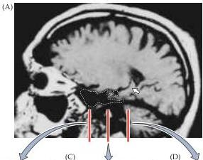
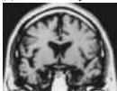
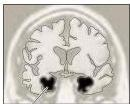
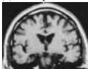
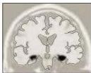
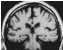
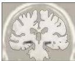

Memory 743

who has come to visit him.
He has only vague impressions of political, social, and sporting events that have occurred since his injury.
Watching television is difficult because he tends to forget the storyline during commercials.
On the other hand, his memory for events prior to 1960 is extremely good; indeed, his lifestyle tends to reflect the 1950s.

## The Case of R.B.

At the age of 52, R.B.
suffered an ischemic episode during cardiac bypass surgery.
Following recovery from anesthesia, a profound amnesic disorder was apparent.
As in the cases of H.M.
and N.A., his IQ was normal (111), and he showed no evidence of cognitive defects other than memory impairment.
R.B.
was tested extensively for the next five

years, and, while his amnesia was not as severe as that of H.M.
or N.A., he consistently failed the standard tests of the ability to establish new declarative memories.
When R.B.
died in 1983 of congestive heart failure, a detailed examination of his brain was carried out.
The only significant finding was bilateral lesions of the hippocampus—specifically, cell loss in the CA1 region that extended the full rostral-caudal length of the hippocampus on both sides.
The amygdala, thalamus, and mammillary bodies, as well as the structures of the basal forebrain, were normal.
R.B.'s case is particularly important because it suggests that hippocampal lesions alone can result in profound anterograde amnesia for declarative memory.

(A)
(A)
(A)
(A)
(A)
(A)

(C)
(C)
(A)
(A)
(A)

Posterior

## References

CORKIN, S.
(1984) Lasting consequences of bilateral medial temporal lobectomy: Clinical course and experimental findings in H.M.
Semin.
Neurol.
4: 249-259.
CORKIN, S., D.
G.
AMARAL, R.
G.
GONZÁLEZ, K.
A.
JOHNSON AND B.
T.
HYMAN (1997) H.
M.'s medial temporal lobe lesion: Findings from MRI.
J.
Neurosci.
17: 3964-3979.
HILTS, P.
J.
(1995) Memory's Ghost: The Strange Tale of Mr.
M.
and the Nature of Memory.
New York: Simon and Schuster.
MILNER, B., S.
CORKIN AND H.-L.
TEUBER (1968) Further analysis of the hippocampal amnesic syndrome: A 14-year follow-up study of H.M.
Neuropsychologia 6: 215-234.
SCOVILLE, W.
B.
AND B.
MILNER (1957) Loss of recent memory after bilateral hippocampal lesions.
J.
Neurol.
Neurosurg.
Psychiat.
20: 11-21.
SQUIRE, L.
R., D.
G.
AMARAL, S.
M.
ZOLA-MORGAN, M.
KRITCHEVSKY AND G.
PRESS (1989) Description of brain injury in the amnesic patient N.A.
based on magnetic resonance imaging.
Exp.
Neurol.
105: 23-35.
TEUBER, H.
L., B.
MILNER AND H.
G.
VAUGHN (1968) Persistent anterograde amnesia after stab wound of the basal brain.
Neuropsychologia 6: 267-282.
ZOLA-MORGAN, S., L.
R.
SQUIRE AND D.
AMARAL (1986) Human amnesia and the medial temporal region: Enduring memory impairment following a bilateral lesion limited to the CA1 field of the hippocampus.
J.
Neurosci.
6: 2950-2967.

## sylvius

MRI images of the brain of patient H.M.
(A) Sagittal view of the right hemisphere; the area of the anterior temporal lobectomy is indicated by the white dotted line.
The intact posterior hippocampus is the banana-shaped object indicated by the white arrow.
(B-D) Coronal sections at approximately the levels indicated by the red lines in (A).
Image (B) is the most rostral and is at the level of the amygdala.
The amygdala and the associated cortex are entirely missing.
Image (C) is at the level of the rostral hippocampus; again, this structure and the associated cortex have been removed.
Image (D) is at the caudal level of the hippocampus; the posterior hippocampus appears intact, although somewhat shrunken.
Outlines below give a clearer indication of the parts of H.M.'s brain that have been ablated (black shading).
(From Corkin et al., 1997.)