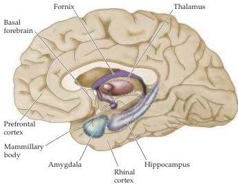
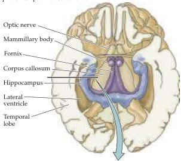
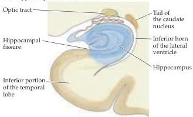

Chapter Thirty

(A) Brain areas associated with declarative memory disorders

(B) Ventral view of hippocampus and related structures with part of temporal lobes removed

Figure 30.6 Brain areas that, when damaged, tend to give rise to declarative memory disorders.
By inference, declarative memory is based on the physiological activity of these structures.
(A) Studies of amnesic patients have shown that the formation of declarative memories depends on the integrity of the hippocampus and its subcortical connections to the mammillary bodies and dorsal thalamus.
(B) Diagram showing the location of the hippocampus in a cutaway view in the horizontal plane.
(C) The hippocampus as it would appear in a histological section in the coronal plane, at approximately the level indicated by the line in (B).

lesions associated with head trauma and neurodegenerative disorders, such as Alzheimer's disease (Box D).
Although a degree of retrograde amnesia can occur with the more focal lesions that cause anterograde amnesia, the long-term storage of memories is presumably distributed throughout the brain (see the next section).
Thus, the hippocampus and related diencephalic structures indicated in Figure 30.6 form and consolidate declarative memories that are ultimately stored elsewhere.

Other causes of amnesia have also provided some insight into the parts of the brain relevant to various aspects of memory (see Table 30.2).
Korsakoff's syndrome, for example, occurs in chronic alcoholics as a result of thiamine (vitamin  $\mathbf{B}_1$ ) deficiency.
In such cases, loss of brain tissue occurs bilaterally in the mammillary bodies and the medial thalamus, for reasons that are not well understood.

Studies of animals with lesions of the medial temporal lobe have largely corroborated these findings with human patients.
For example, one test of the presumed equivalent of declarative memory formation in animals involves placing rats into a pool filled with opaque water, thus concealing a submerged platform; note that the pool is surrounded by prominent visual landmarks (Figure 30.7).
Normal rats at first search randomly until they find