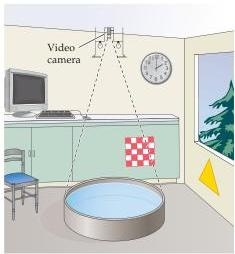
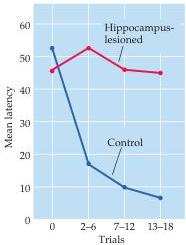
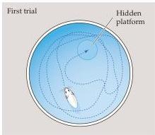
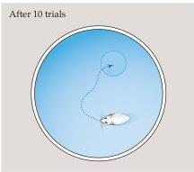
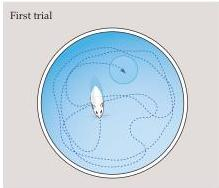
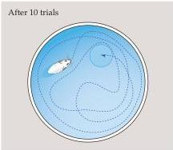

Memory 745

the submerged platform.
After repeated testing, however, they learn to swim directly to the platform no matter where they are initially placed in the pool.
Rats with lesions to the hippocampus and nearby structures cannot learn to find the platform, suggesting that remembering the location of the platform

(A)

(B)

(C) Control rat

Figure 30.7 Spatial learning and memory in rodents depends on the hippocampus.
(A) Rats are placed in a circular tank about the size and shape of a child's wading pool filled with opaque (milky) water.
The surrounding environment contains visual cues such as windows, doors, a clock, and so on.
A small platform is located just below the surface.
As rats search for this resting place, the pattern of their swimming (indicated by the traces in C) is monitored by a video camera.
(B) After a few trials, normal rats rapidly reduce the time required to find the platform, whereas rats with hippocampal lesions do not.
Sample swim paths of normal rats (C) and hippocampal lesioned rats (D) on the first and tenth trials.
Rats with hippocampal lesions are unable to remember where the platform is located (B after Eichenbaum, 2000; C,D after Schenk and Morris, 1985).

(D) Rat with hippocampus lesioned

