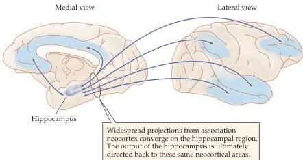

Memory 747

Figure 30.8 Connections between the hippocampus and possible declarative memory storage sites.
The rhesus monkey brain is shown because these connections are much better documented in non-human primates than in humans.
Projections from numerous cortical areas converge on the hippocampus and the related structures known to be involved in human memory; most of these sites also send projections to the same cortical areas.
Medial and lateral views are shown, the latter rotated $180^{\circ}$ for clarity.
(After Van Hoesen, 1982.)

information comes from neuroimaging of human subjects recalling vivid memories.
In one such study, subjects first examined words paired with either pictures or sounds.
Their brains were then scanned while they were asked to recall whether each test word was associated with either a picture or a sound.
Functional images based on these scans showed that the cortical areas activated when subjects viewed pictures or heard sounds were reactivated when these percepts were vividly recalled.
In fact, this sort of reactivation can be quite specific.
Thus, different classes of visual images—such as faces, houses, or chairs—tend to reactivate the same small regions of the visual association cortex that were activated when the objects were actually perceived (Figure 30.9).

These neuroimaging studies reinforce the conclusion that declarative memories are stored widely in specialized areas of the cerebral cortex.
Retrieving such memories appears to involve the medial temporal lobe, as well as regions of the frontal cortex.
Frontal cortical areas located on the dorsolateral and anterolateral aspect of the brain, in particular, are activated when normal subjects attempt to retrieve declarative information from long-term memory.
Moreover, patients with damage to these areas often fail to accurately recall the details of a memory and sometimes resort to confabulation to fill in the missing information.
Finally, whereas the ability of patients such as H.M., N.A., and R.B.
to remember facts and events from the period of their lives preceding their lesions clearly demonstrates that the medial temporal lobe is not necessary for retrieving declarative information held in long-term memory, other studies have suggested that these structures may be important for recalling declarative memories during the early stages of consolidation and storage in the cerebral cortex.