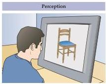
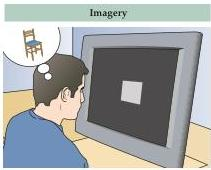
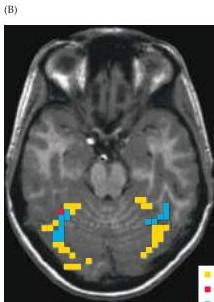
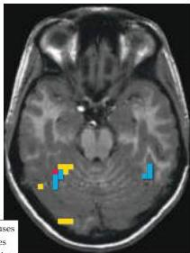

Chapter Thirty

Figure 30.9 Reactivation of visual cortex during vivid remembering of visual view images.
(A) Subjects were instructed to view either images of objects (houses, faces, and chairs) (left) or imagine the objects in the absence of the stimulus (right).
(B) (Left) Bilateral regions of ventral temporal cortex are specifically activated during perception of houses (yellow), faces (red), and chairs (blue).
(Right) When subjects recall these objects, the same regions preferentially activated during the perception of each object class are reactivated.
(After Ishai et al., 2000).

(B)

# Brain Systems Underlying Nondeclarative Learning and Memory

H.M., N.A., and R.B.
had no difficulty establishing or recalling nondeclarative memories, indicating that this information is laid down by using an anatomical substrate different from that used in declarative memory formation.
Nondeclarative memory apparently involves the basal ganglia, prefrontal cortex, amygdala, sensory association cortex, and cerebellum, but not the medial temporal lobe or midline diencephalon.
In support of this interpretation, perceptual priming (the influence of previously studied information on subsequent performance, unavailable to conscious recall) depends critically on the integrity of sensory association cortex.
For example, lesions of the visual association cortex produce profound impairments in visual priming but leave declarative memory formation intact.
Likewise, simple sensory-motor conditioning, such as learning to blink following a tone that predicts a puff of air directed at the eye, relies on the normal activation of neural circuits in the cerebellum.
Ischemic damage to the cerebellum following infarcts of the superior cerebellar artery or the posterior inferior cerebellar artery cause profound deficits in classical eyeblink conditioning without interfering with the