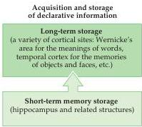
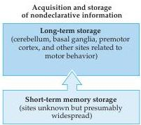

Memory 749

Figure 30.10 Summary diagram of the acquisition and storage of declarative versus nondeclarative information.

ability to lay down new declarative memories.
Evidence from such double-dissociations endorses the idea that independent brain systems govern the formation and storage of declarative and nondeclarative memories.

A brain system that appears to be especially important for complex motor learning involves the signaling loops that connect the basal ganglia and prefrontal cortex (see Chapter 17).
Damage to either structure profoundly interferes with the ability to learn new motor skills.
Thus, patients with Huntington's disease, which causes atrophy of the caudate and putamen (see Figure 17.9B), perform poorly on motor skill learning tests such as manually tracking a spot of light, tracing curves using a mirror, or reproducing sequences of finger movements.
Because the loss of dopaminergic neurons in the substantia nigra interferes with normal signaling in the basal ganglia (see Figure 17.9A), patients with Parkinson's disease show similar deficits in motor skill learning, as do patients with prefrontal lesions caused by tumors or strokes.
Neuroimaging studies have largely corroborated these findings, revealing activation of the basal ganglia and prefrontal cortex in normal subjects performing these same skill-learning tests.
Activation of the basal ganglia and prefrontal cortex has also been observed in animals carrying out rudimentary motor learning and sequencing tasks.

The dissociation of memory systems supporting declarative and nondeclarative memory suggests the scheme for long-term information storage diagrammed in Figure 30.10.
The generality of the diagram only emphasizes the rudimentary state of present thinking about exactly how and where long-term memories are stored.
A reasonable guess is that each complex memory is instantiated in an extensive network of neurons whose activity depends on synaptic weightings that have been molded and modified by experience.

## Memory and Aging

Although it is all too obvious that our outward appearance changes with age, we tend to imagine that the brain is much more resistant to the ravages of time.
Unfortunately, the evidence suggests that this optimistic view is not justified.
From early adulthood onward, the average weight of the normal human brain, as determined at autopsy, steadily decreases (Figure 30.11).
In elderly individuals, this effect can also be observed with noninvasive imaging as a slight but nonetheless significant shrinkage of the brain.
Counts of synapses in the cerebral cortex generally decrease in old age (although the number of neurons probably does not change very much), suggesting that it is mainly the connections between neurons (i.e., neuropil) that are lost as