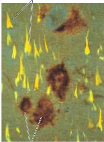
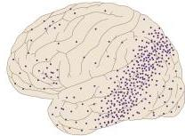
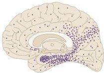

Chapter Thirty

# Box D

## Alzheimer's Disease

Dementia is a syndrome characterized by failure of recent memory and other intellectual functions that is usually insidious in onset but steadily progresses.
Alzheimer's disease (AD) is the most common dementia, accounting for 60–80% of cases in the elderly.
It afflicts 5–10% of the population over the age of 65, and as much as 45% of the population over 85.
The earliest sign is typically an impairment of recent memory function and attention, followed by failure of language skills, visual–spatial orientation, abstract thinking, and judgment.
Inevitably, alterations of personality accompany these defects.

The tentative diagnosis of Alzheimer's disease is based on these characteristic clinical features, and can only be confirmed by the distinctive cellular pathology evident on postmortem examination of the brain.
The histopathology consists of three principal features (illustrated in the figure): (1) collections of intraneuronal cytoskeletal filaments called neurofibrillary tangles; (2) extracellular deposits of an abnormal protein in a matrix called amyloid in so-called senile plaques; and (3) a diffuse loss of neurons.
These changes are most apparent in neocortex, limbic structures (hippocampus, amygdala, and their associated cortices), and selected brainstem nuclei (especially the basal forebrain nuclei).

Although the vast majority of AD cases arise sporadically, the disorder is inherited in an autosomal dominant pattern in a small fraction (less than 1%) of patients.
Identification of the mutant gene in a few families with an early-onset autosomal dominant form of the disease has provided considerable insight into the kinds of processes that go awry in Alzheimer's.

Investigators suspected that the mutant gene responsible for familial AD

(A) Neurofibrillary tangle
Amyloid plaque

(B)

might reside on chromosome 21, primarily because similar clinical and neuropathologic features often occur in individuals with Down's syndrome (a syndrome typically caused by an extra copy of chromosome 21), but with a much earlier onset (at about age 30 in most cases).
The prominence of amyloid deposits in AD further suggested that a mutation of a gene encoding amyloid precursor protein is somehow involved.
The gene for amyloid precursor protein (APP) was cloned by D.
Goldgaber and colleagues, and found to reside on chromosome 21.
This discovery eventually led to the identification of mutations of the APP gene in almost 20 families with

the early-onset autosomal dominant form of AD.
It should be noted, however, that only a few of the early-onset families, and none of the late-onset families, exhibited these particular mutations.
The mutant genes underlying two additional autosomal dominant forms of AD have been subsequently identified (presenilin 1 and presenilin 2).
Thus, mutation of any one of several genes appears to be sufficient to cause a heritable form of AD.

The most common form of Alzheimer's occurs late in life, and although the relatives of affected individuals are at a greater risk, the disease is clearly not inherited in any simple sense.
The central role of APP in the families with