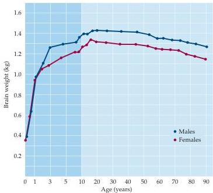
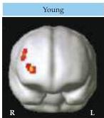
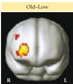
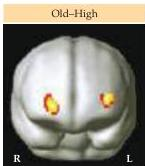

Chapter Thirty

Figure 30.11 Brain size as a function of age.
The human brain reaches its maximum size (measured by weight in this case) in early adult life and decreases progressively thereafter.
This decrease evidently represents the gradual loss of neural circuitry in the aging brain, which presumably underlies the progressively diminished memory function in older individuals.
(After Dekaban and Sadowsky, 1978.)

humans grow old (consistent with the idea that the networks of connections that represent memories—i.e., the engrams—gradually deteriorate).

These several observations accord with the difficulty older people have in making associations (e.g., remembering names or the details of recent experiences) and with declining scores on tests of memory as a function of age.
The normal loss of some memory function with age means that there is a large gray zone between individuals undergoing normal aging and patients suffering from age-related dementias such as Alzheimer's disease (see Box D).

Just as regular exercise slows the deterioration of the neuromuscular system with age, age-related neurodegeneration and associated cognitive decline may be slowed in elderly individuals who make a special effort to continue using the full range of human memory abilities (i.e., both declarative and nondeclarative memory tasks).
Although cognitive decline with age is ultimately inevitable, neuroimaging studies suggest that high-performing older adults may to some degree offset declines in processing efficacy through compensatory activation of cortical tissue that is less fully used during remembering in poorly performing older adults (Figure 30.12).

Figure 30.12 Compensatory activation of memory areas in high-functioning older adults.
During remembering, activity in prefrontal cortex was restricted to the right prefrontal cortex (following radiological conventions, the brain images are left-right reversed) in both young participants and elderly subjects with poor recall.
In contrast, elderly subjects with relatively good memory showed activation in both right and left prefrontal cortex.
(After Cabeza et al., 2002).

