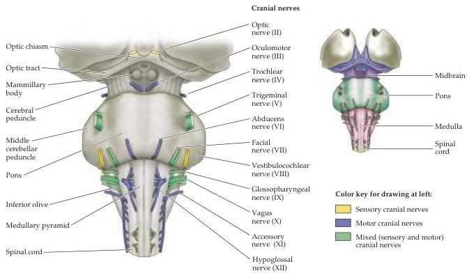

Appendix A

Figure A1 At left is a ventral view of the brainstem showing the locations of the cranial nerves as they enter or exit the midbrain, pons, and medulla.
Nerves that are exclusively sensory are indicated in yellow, motor nerves are in blue, and mixed sensory/motor nerves are in green.
At right, the territories included in each of the brainstem subdivisions (midbrain, violet; pons, green; medulla, pink) are indicated.

|  Location | Somatic motor | Branchial motor | Visceral motor | General sensory | Special sensory | Visceral sensory  |
| --- | --- | --- | --- | --- | --- | --- |
|  Midbrain | Oculomotor nucleus (III) |  | Edinger-Westphal nucleus (III) | Trigeminal sensory: mesencephalic nucleus (V, VII, IX, X) |  |   |
|   |  Trochlear nucleus (IV) |  |  |  |  |   |
|  Pons | Abducens nucleus (VI) | Trigeminal motor nucleus (V) | Superior salivatory nucleus (VII) | Trigeminal sensory: principal nucleus (V, VII, IX, X) |  |   |
|   |   | Facial nucleus (VII) | Inferior salivatory nucleus (IX) |  | Vestibular nuclei (VIII) |   |
|  Medulla | Hypoglossal nucleus (XII) | Nucleus ambiguus (IX, X) | Dorsal motor nucleus of vagus (X) | Trigeminal sensory: spinal nucleus (V, VII, IX, X) | Cochlear nuclei (VIII) | Nucleus of the solitary tract (VII, IX, X)  |
|   |   | Spinal accessory nucleus (XI) |  |  |  |   |

${}^{a}$  Associated cranial nerves are shown in parentheses.