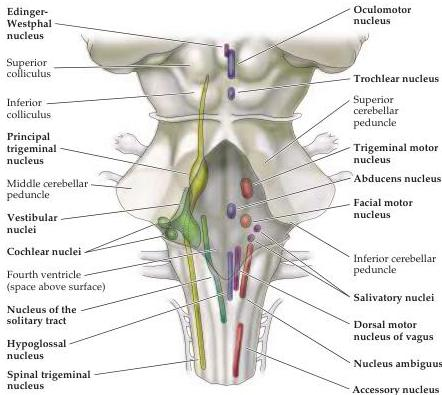
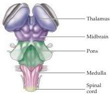

The Brainstem and Cranial Nerves 759

many enteric and visceral targets.
In the pons, the sensory and motor nuclei are primarily concerned with somatic sensation from the face (the principal trigeminal nuclei); movement of the jaws and the muscles of facial expression (the trigeminal motor and facial nuclei); and abduction of the eye (the abducens nuclei).
Further rostrally, in the mesencephalic portion of the brainstem, are nuclei concerned primarily with eye movements (the oculomotor and trochlear nuclei) and preganglionic parasympathetic innervation of the iris (the Edinger-Westphal nuclei).
While this list is not complete, it indicates the basic order of the rostral-caudal organization of the brainstem.

Neurologists assess combinations of cranial nerve deficits to infer the location of brainstem lesions, or to place the source of brain dysfunction either in the spinal cord or brain.
The most common brainstem lesions reflect the vascular territories that supply subsets of cranial nerve nuclei as well as ascending and descending tracts (see Appendix B, Figure B7).
For example, an occlusion of the posterior inferior cerebellar artery (PICA), a branch of the vertebral artery that supplies the lateral region of the mid- and rostral medulla, results in damage to three cranial nerve nuclei and several tracts (see the "Upper medulla" section in Figure A3).
Accordingly, there are functional deficits that reflect the loss of the spinal trigeminal nucleus, the vestibular nucleus, and the nucleus ambiguus (which contains motor neurons that project to the larynx and pharynx) on the same side as the lesion.
In addition, ascending pathways from the spinal cord that relay pain and temperature from the contralateral body surface are disrupted, leading to a contralateral loss of these functions.
Finally, the inferior cerebellar peduncle, which contains projections that relay information about body position to the cerebellum for postural control, is damaged.
This loss results in ataxia (clumsiness) on

Color key for drawing at left:

|  Somatic motor | General sensory  |
| --- | --- |
|  Branchial motor | Visceral sensory  |
|  Visceral motor | Special sensory  |

Figure A2 At left, a "phantom" view of the dorsal surface of the brainstem shows the locations of the brainstem cranial nerve nuclei that are either the target or the source of the cranial nerves.
(See Table A1 for the relationship between each cranial nerve and cranial nerve nuclei.) With the exception of the cranial nerve nuclei associated with the trigeminal nerve, there is fairly close correspondence between the location of the cranial nerve nuclei in the midbrain, pons, and medulla and the location of the associated cranial nerves.
At right, the territories of the major brainstem subdivisions are indicated (viewed from the dorsal surface).

