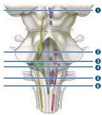
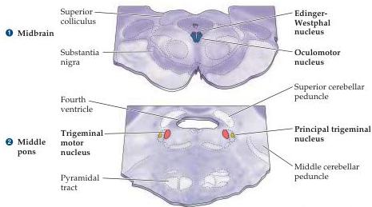
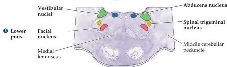
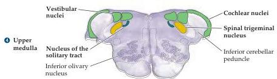
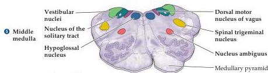
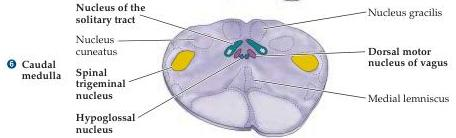

Appendix A

Color key for cranial nerve nuclei:

Somatic motor
Branchial motor
Visceral motor
General sensory
Visceral sensory
Special sensory

Figure A3 Transverse sections through the brainstem and spinal cord showing internal organization along the rostral-caudal axis.
The locations of the cranial nerve nuclei, ascending, and descending tracts are indicated in each representative section.
The identity of the nuclei (somatic sensory or motor; visceral sensory or motor; branchial sensory or motor) is indicated using the same color key as in Figure A2.
The vascular territories for these brainstem sections are illustrated in Appendix B, Figure B7.

sylvius