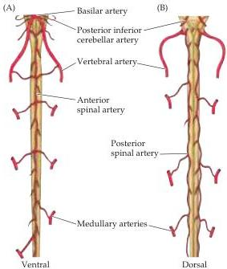
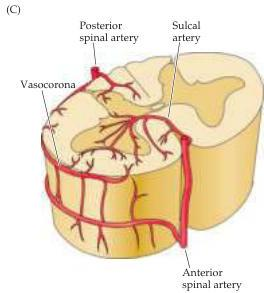

Appendix B

Figure B1 Blood supply of the spinal cord.
(A) View of the ventral (anterior) surface of the spinal cord.
At the level of the medulla, the vertebral arteries give off branches that merge to form the anterior spinal artery.
Approximately 10 to 12 segmental arteries (which arise from various branches of the aorta) join the anterior spinal artery along its course.
These segmental arteries are known as medullary arteries.
(B) The vertebral arteries (or the posterior inferior cerebellar artery) give rise to paired posterior spinal arteries that run along the dorsal (posterior) surface of the spinal cord.
(C) Cross section through the spinal cord, illustrating the distribution of the anterior and posterior spinal arteries.
The anterior spinal arteries give rise to numerous sulcal branches that supply the anterior two-thirds of the spinal cord.
The posterior spinal arteries supply much of the dorsal horn and the dorsal columns.
A network of vessels known as the vasocorona connects these two sources of supply and sends branches into the white matter around the margin of the spinal cord.

structures such as the basal ganglia, thalamus, and internal capsule.
Particularly prominent are the lenticulostriate arteries that branch from the middle cerebral artery.
These arteries supply the basal ganglia and thalamus.
The posterior circulation of the brain supplies the posterior cerebral cortex, the midbrain, and the brainstem; it comprises arterial branches arising from the posterior cerebral, basilar, and vertebral arteries.
The pattern of arterial distribution is similar for all the subdivisions of the brainstem: midline arteries supply medial structures, lateral arteries supply the lateral brainstem, and dorsal-lateral arteries supply dorsal-lateral brainstem structures and the cerebellum (Figures B2 and B3).
Among the most important dorsal-lateral arteries (also called long circumferential arteries) are the posterior inferior cerebellar artery (PICA) and the anterior inferior cerebellar artery (AICA), which supply distinct regions of the medulla and pons.
These arteries, as well as branches of the basilar artery that penetrate the brainstem from its ventral and lateral surfaces (called paramedian and short circumferential arteries), are especially common sites of occlusion and result in specific functional deficits of cranial nerve, somatic sensory, and motor function (see Appendix A).

The physiological demands served by the blood supply of the brain are particularly significant because neurons are more sensitive to oxygen deprivation than other kinds of cells with lower rates of metabolism.
In addition, the brain is at risk from circulating toxins, and is specifically protected in this respect by the blood-brain barrier (see below).
As a result of the high metabolic rate of neurons, brain tissue deprived of oxygen and glucose as a result of compromised blood supply is likely to sustain transient or permanent damage.
Brief loss of blood supply (referred to as ischemia) can cause cellular changes, which, if not quickly reversed, can lead to cell death.
Sustained loss of blood supply leads much more directly to death and degeneration of the deprived cells.
Strokes—an anachronistic term that refers to the death or dysfunction of brain tissue due to vascular disease—often follow the occlu