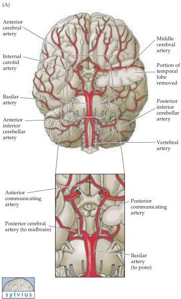
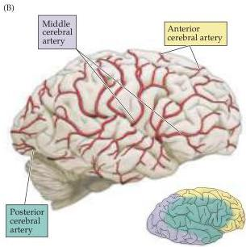
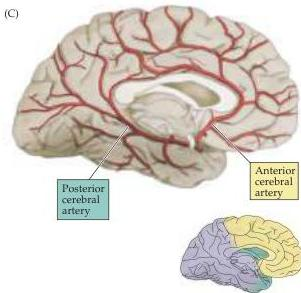
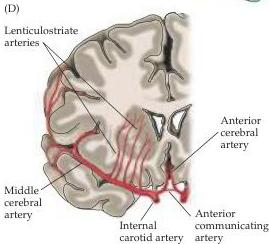

Vascular Supply, the Meninges, and the Ventricular System 765

Figure B2 The major arteries of the brain.
(A) Ventral view (compare with Figure 1.13B).
The enlargement of the boxed area shows the circle of Willis.
(B) Lateral and (C) midsagittal views showing the location of the cerebral arteries.
Colorized insets below illustrate the cortical territories supplied by the anterior (yellow), middle (green), and posterior (purple) cerebral arteries.
(D) Idealized frontal section showing course of middle cerebral artery.

