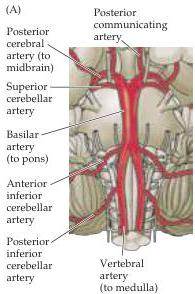
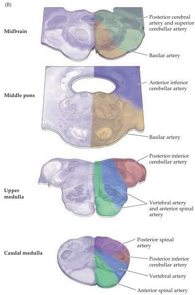

Appendix B

Figure B3 Blood supply of the three subdivisions of the brainstem.
(A) Diagram of major blood supply.
(B) Sections through different levels of the brainstem indicating the territory supplied by each of the major brainstem arteries.

sion of (or hemorrhage from) the brain's arteries (Box A).
Historically, studies of the functional consequences of strokes, and their relation to vascular territories in the brain and spinal cord, provided information about the location of various brain functions.
The location of the major language functions in the left hemisphere, for instance, was discovered in this way in the latter part of the nineteenth century (see Chapter 26).
Now, noninvasive functional imaging techniques based on blood flow (see Box A In Chapter 1) have largely supplanted the correlation of clinical signs and symptoms with the location of tissue damage observed at autopsy.

# The Blood-Brain Barrier

The interface between the walls of capillaries and the surrounding tissue is important throughout the body, as it keeps vascular and extravascular concen