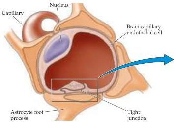
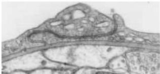

Appendix B

(A)
Figure B4 The cellular basis of the blood-brain barrier.
(A) Diagram of a brain capillary in cross section and reconstructed views, showing endothelial tight junctions and the investment of the capillary by astrocytic end feet.
(B) Electron micrograph of boxed area in (A), showing the appearance of tight junctions between neighboring endothelial cells (arrows).
(A after Goldstein and Betz, 1986; B from Peters et al., 1991.)

(B)

traffic.
The structure of tight junctions was first demonstrated in the 1960s by Tom Reese, Morris Karnovsky, and Milton Brightman.
Using electron microscopy after the injection of electron-dense intravascular agents such as lanthanum salts, they showed that the close apposition of the endothelial cell membranes prevented such ions from passing (panel B in Figure B4).
Substances that traverse the walls of brain capillaries must move through the endothelial cell membranes.
Accordingly, molecular entry into the brain should be determined by an agent's solubility in lipids, the major constituent of cell membranes.
Nevertheless, many ions and molecules not readily soluble in lipids do move quite readily from the vascular space into brain tissue.
A molecule like glucose, the primary source of metabolic energy for neurons and glial cells, is an obvious example.
This paradox is explained by the presence of specific transporters for glucose and other critical molecules and ions.

In addition to tight junctions, astrocytic "end feet" (the terminal regions of astrocytic processes) surround the outside of capillary endothelial cells.
The reason for this endothelial-glial allegiance is unclear, but may reflect an influence of astrocytes on the formation and maintenance of the blood-brain barrier.

The brain, more than any other organ, must be carefully shielded from abnormal variations in its ionic milieu, as well as from the potentially toxic molecules that find their way into the vascular space by ingestion, infection, or other means.
The blood-brain barrier is thus important for protection and homeostasis.
It also presents a significant problem for the delivery of drugs to the brain.
Large (or lipid-insoluble) molecules can be introduced to the brain, but only by transiently disrupting the blood-brain barrier with hyperosmotic agents like mannitol.

# The Meninges

The cranial cavity is conventionally divided into three regions called the anterior, middle, and posterior cranial fossae.
Surrounding and supporting the brain within this cavity are three protective tissue layers, which also extend down the brainstem and the spinal cord.
Together these layers are