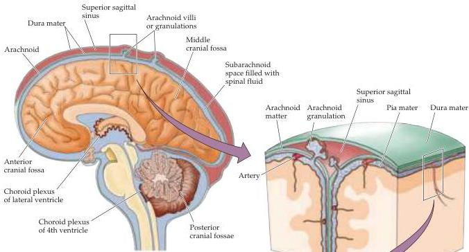
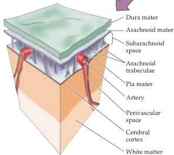

Vascular Supply, the Meninges, and the Ventricular System 769

Figure B5 The meninges.
Upper left panel is a midsagittal view showing the three layers of the meninges in relation to the skull and brain.
Right panels are blowups to show detail.

called the meninges (Figure B5).
The outermost layer of the meninges is called the dura mater (meaning “hard mother,” because it is thick and tough).
The middle layer is called the arachnoid mater because of spiderlike processes called arachnoid trabiculae that extend from it toward the third layer, the pia mater, a thin, delicate layer of cells that closely invests the surface of the brain.
Since the pia closely adheres to the brain as its surface curves and folds, whereas the arachnoid does not, there are places—called cisterns—where the subarachnoid space enlarges to form significant collections of CSF.
The major arteries supplying the brain course through the sub-