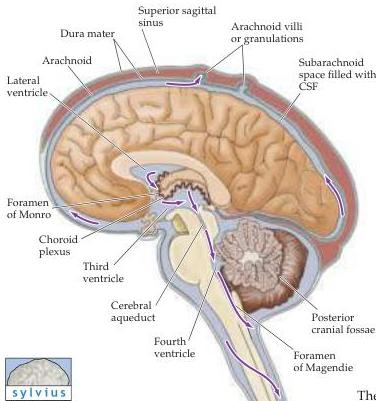

Appendix B

Figure B6 Circulation of cerebrospinal fluid.
CSF is produced by the choroid plexus and flows from the lateral ventricles through the interventricular foramen (foramen of Monro) into the third ventricle, through the cerebral aqueduct and into the fourth ventricle.
CSF exits the ventricular system through several foramen associated with the fourth ventricle into the subarachnoid space surrounding the central nervous system.
CSF is eventually absorbed by arachnoid granulations and returned to the venous circulation.

arachnoid space where they give rise to branches that penetrate the substance of the hemispheres.
The subarachnoid space is therefore a frequent site of bleeding following trauma.
A collection of blood between the meningeal layers is referred to as a subdural or subarachnoid hemorrhage, as distinct from bleeding within the brain itself.

# The Ventricular System

The cerebral ventricles are a series of interconnected, fluid-filled spaces that lie in the core of the forebrain and brainstem (Figures B6 and B7).
These spaces are filled with cerebrospinal fluid (CSF) that is produced by a modified vascular structure referred to as the choroid plexus, which is present in each of the ventricles.
The cerebrospinal fluid percolates through the ventricular system and flows into the subarachnoid space through perforations in the thin covering of the fourth ventricle (see Figure B6); it is eventually absorbed by specialized structures called arachnoid villi or granulations (see Figure B5), and returned to the venous circulation.

The presence of ventricular spaces in the various subdivisions of the brain reflects the fact that the ventricles are the adult derivatives of the open space or lumen of the embryonic neural tube (see Chapter 21).
Although they have no unique function, the ventricular spaces present in sections through the brain provide another useful guide to location (Figure B8).
The largest of these spaces are the lateral ventricles (formerly called the first and second ventricles), one within each of the cerebral hemispheres.
These particular ventricles are best seen in frontal sections, where their ventral surface is usually defined by the basal ganglia, their dorsal surface by the corpus callosum, and their medial surface by the septum pellucidum, a membranous tissue sheet that forms part of the midline sagittal surface of the cerebral hemispheres.
The lateral ventricles, like several telencephalic structures, possess a "C" shape that is formed by the non-uniform growth of the cerebral hemispheres during embryonic development (see Figure 21.5).
CSF flows from the lateral ventricles through small openings (called the interventricular foramen, or the foramen of Monro) into a narrow midline space between the right and left thalamus, the third ventricle.
The third ventricle is continuous caudally with the cerebral aqueduct (also referred to as the aqueduct of Sylvius), which runs though the midbrain.
At its caudal end, the aqueduct opens into the fourth ventricle, a larger space in the dorsal pons and medulla.
The fourth ventricle, covered on its dorsal aspect by the cerebellum, narrows caudally to form the central canal of the spinal cord.