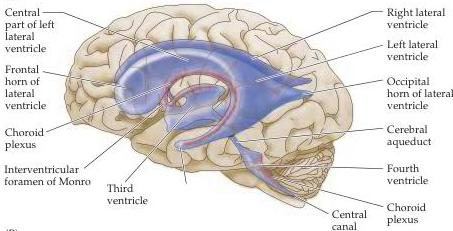
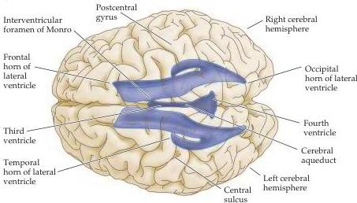

Vascular Supply, the Meninges, and the Ventricular System 771

(A)
Figure B7 The ventricular system of the human brain.
(A) Location of the ventricles as seen in a transparent left lateral view.
(B) Dorsal view of the ventricles.
(C) Table showing the ventricular spaces associated with each of the major subdivisions of the brain.
(See Chapter 21 for an account of brain development that more fully explains the origin of the ventricular spaces.)

(B)

|  EMBRYONIC BRAIN |   | ADULT BRAIN DERIVATIVES | ASSOCIATED VENTRICULAR SPACE  |
| --- | --- | --- | --- |
|  Proencephalon | Telencephalon (forebrain) | Cerebral cortex Basal ganglia Hippocampus Olfactory bulb Basal forebrain | Lateral ventricles  |
|   |  Diencephalon | Dorsal thalamus Hypothalamus | Third ventricle  |
|   |  Mesencephalon | Midbrain (superior and inferior colliculi) | Cerebral aqueduct  |
|  Rhombencephalon | Metencephalon | Cerebellum Pons | Fourth ventricle  |
|   |  Myelencephalon | Medulla | Fourth ventricle  |
|   |  Spinal cord | Spinal cord | Central canal  |