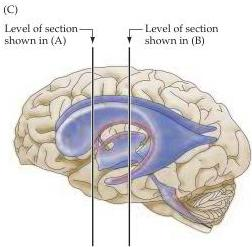
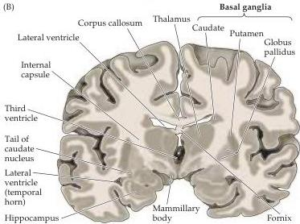

Appendix B

Figure B8 The ventricular system as seen in coronal brain sections.
(A, B) Location the ventricles in coronal section.
Notice that the lateral ventricle appears twice in section (B).
(C) A transparent view of the ventricular system indicating the approximate location of the sections in (A) and (B).

The normal total volume of CSF in the ventricular system is approximately  $140~\mathrm{mL}$ .
The choroid plexus produces approximately  $500~\mathrm{mL}$  of CSF per day, so that the entire volume present in the system is turned over several times a day.
Thus, impaired absorption or obstruction of CSF flow results in an excess of cerebrospinal fluid in the intracranial cavity, a condition called hydrocephalus (literally, "water head").