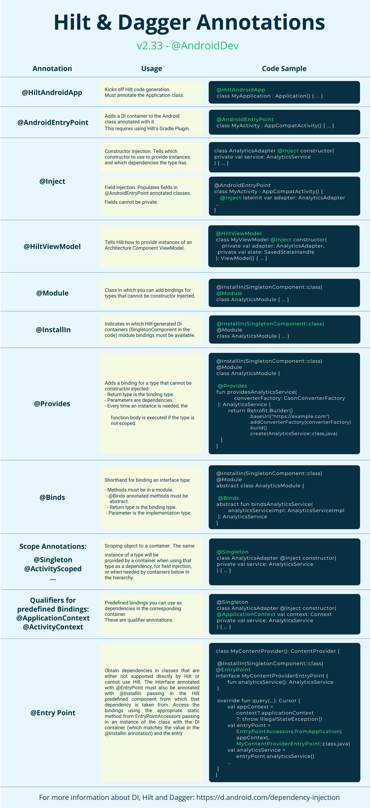

# 안드로이드 개발 기본 구조
//todo: 정리 필요
```
//todo: 정리 필요
매니페스트 : 이것앱 구성에 필수적인 단일 AndroidManifest.xml 파일이 있습니다. 매니페스트 파일은 .xml 확장자를 가지고 있으며 앱에 중요한 정보를 포함합니다. 이 정보를 Android 시스템에 전달합니다. 이 파일에서 앱에 필요한 권한, 앱 이름 및 아이콘을 정의합니다. 또한 이 파일에 액티비티와 서비스를 선언합니다. 이를 선언하지 않으면 앱에서 사용하기 어렵습니다 .
java 패키지 : 이 패키지는 java 라는 이름을 가지고 있지만 , 우리 프로젝트의 모든 Kotlin 파일을 가지고 있습니다. 파일을 추가해야 하는 경우, 여기에 파일을 추가합니다. 관련 기능이 있는 파일을 그룹화하는 데 도움이 되는 패키지를 만들 수도 있습니다. 이 디렉토리는 다음과 같이 더 세분화됩니다.
com.packt.chaptertwo : 이것은 우리 앱 의 Kotlin 파일을 위한 것입니다.
com.packt.chaptertwo(androidTest) : 여기에 계측 테스트를 위한 모든 파일을 추가합니다.
com.packt.chaptertwo(test) : 여기에 단위 테스트를 위한 모든 파일을 추가합니다.
리소스: 이 디렉토리는 일반적으로 res 로 축약되며 , 앱에 필요한 모든 리소스가 있습니다. 이러한 리소스에는 이미지, 문자열 및 자산이 포함될 수 있습니다. 그림 2.6 에서 다음 하위 디렉토리 가 있음을 알 수 있습니다 .
drawable : 이 폴더에는 앱 에서 사용되는 사용자 정의 드로어블, 벡터 드로어블 또는 PNG 및 JPEG가 들어 있습니다 .
mipmap : 이 폴더는 런처 아이콘을 저장하는 폴더입니다 .
values : 이 폴더는 우리가 color, string, style, theme 파일을 두는 곳입니다. 이 폴더에서 우리는 앱 전체에서 사용할 global values를 정의합니다 .
xml : 이 폴더에는 XML 파일을 저장합니다.
```
# Hilt 가이드




