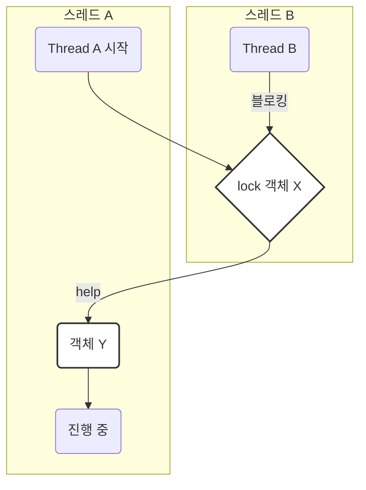
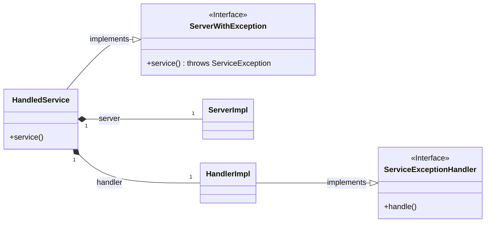

**[SYSTEM]** (2025. 11. 1. 오전 11:58:16)

Welcome to Documentation Browser! You're currently browsing content from: "Docs Overview". Just ask me questions, or try one of the suggestions below to get started

---

**[USER]** (2025. 11. 1. 오전 11:58:36)

Summarize one of the uploaded documents.

---

**[MODEL]** (2025. 11. 1. 오전 11:58:36)

다음은 업로드된 문서인 **"Concurrent Programming in Java™, Second Edition: Design Principles and Patterns"**에 대한 요약입니다.

### **개요**

이 문서는 Doug Lea가 저술한 "Java 동시성 프로그래밍, 제2판"으로, Java 프로그래밍 언어를 사용하여 동시성 프로그램을 설계하고 구현하는 원칙과 디자인 패턴을 다루는 전문 서적입니다. 이 책은 스레드 사용에 내장된 지원을 제공하는 Java 플랫폼의 강력한 기능을 활용하고자 하는 **중급에서 고급 수준의 프로그래머**를 대상으로 합니다 `[p. 2]`. 디자인 패턴 접근 방식을 통해 일반적인 동시성 프로그래밍 문제를 해결하기 위한 표준 설계 기법과 컴포넌트 구현 방법을 제시합니다 `[p. 2]`.

### **주요 내용**

이 책은 Java 2 플랫폼에 대한 업데이트된 내용을 다루며, 다음과 같은 주제를 중점적으로 설명합니다 `[p. 2]`:

*   **메모리 모델 (Memory model)**
*   **취소 (Cancellation)**
*   **이식 가능한 병렬 프로그래밍 (Portable parallel programming)**
*   **동시성 제어를 위한 유틸리티 클래스 (Utility classes for concurrency control)**

독자는 `java.lang.Thread` 클래스, `synchronized` 및 `volatile` 키워드, 그리고 `wait`, `notify`, `notifyAll` 메서드를 사용하여 동시성 활동을 시작, 제어 및 조정하는 방법을 배우게 됩니다 `[p. 2]`. 또한 교착 상태(deadlock), 비동기 메시지 전달, 웹 기반 서비스 구조화 등 동시성 프로그래밍의 모든 측면을 상세히 다룹니다 `[p. 2]`.

### **핵심 구조**

이 책은 크게 네 개의 장으로 구성되어 있으며, 특히 Java 프로그래밍 언어의 세 가지 핵심 동시성 구성 요소를 중심으로 구조화되어 있습니다 `[p. 5]`.

1.  **상호 배제 (Exclusion)**
    *   여러 동시 활동 간의 원치 않는 간섭을 방지하여 객체의 상태를 일관성 있게 유지하는 기법입니다.
    *   주로 `synchronized` 메서드를 사용하여 구현됩니다 `[p. 5]`.

2.  **상태 의존성 (State dependence)**
    *   객체가 특정 상태에 있는지 여부에 따라 작업의 실행을 촉발, 방지, 연기 또는 복구하는 것을 다룹니다.
    *   `Object.wait`, `Object.notify`, `Object.notifyAll`과 같은 모니터 메서드를 사용하여 처리됩니다 `[p. 5]`.

3.  **스레드 생성 (Creating threads)**
    *   `Thread` 객체를 사용하여 동시성을 설정하고 관리하는 방법을 설명합니다 `[p. 6]`.

첫 번째 장에서는 동시성 객체 지향 프로그래밍의 개념적 기반을 다루고, 이후 세 개의 장에서 각각 위의 세 가지 핵심 구성 요소를 심도 있게 탐구합니다 `[p. 5]`.

---

#### **출판 정보**
*   **저자**: Doug Lea
*   **출판사**: Addison Wesley
*   **출판일**: 1999년 10월 1일
*   **ISBN**: 0-201-31009-0
*   **페이지 수**: 432 `[p. 2]`

---

**[SYSTEM]** (2025. 11. 1. 오후 12:03:29)

Starting translation for pages 5-58...

---

**[MODEL]** (2025. 11. 1. 오후 12:03:29)

**Page 5 Translation:**

랄프 존슨의 패턴 세미나 회원들(특히 브라이언 푸트와 이안 차이)은 일부 패턴의 초기 버전을 읽고 많은 개선점을 제안해 주었습니다. 뉴욕시 패턴 그룹의 라지 다타, 스털링 바렛, 필립 에스켈린과 실리콘 밸리 패턴 그룹의 러스 루퍼, 밍 쿽, 무스타파 오즈겐, 에드워드 앤더슨, 돈 친은 2판의 예비 버전에 대해 비슷한 귀중한 도움을 주었습니다.

1판과 2판 원고의 공식 및 비공식 검토자들은 빡빡한 일정 속에서도 유용한 의견과 제안을 해주었습니다. 켄 아놀드, 조쉬 블로흐, 조셉 보우비어, 패트릭 챈, 게리 크레이그, 데스몬드 드수자, 빌 푸트, 팀 해리슨, 데이비드 헨더슨, 팀 린드홀름, 톰 메이, 오스카 니어스트라즈, 제임스 로빈스, 그렉 트래비스, 마크 웨일스, 피터 웰치, 데보라 주코스키가 그들입니다. 톰 카길에게는 그의 많은 통찰력과 수정, 그리고 그의 특정 알림(Specific Notification) 패턴에 대한 설명을 포함하도록 허락해 준 것에 대해 특별한 감사를 드립니다. 또한 데이비드 홈즈에게도 많은 기여 중에서도 튜토리얼 자료를 개발하고 확장하여 2판에 포함될 수 있도록 도와준 것에 대해 특별한 감사를 드립니다.

로즈마리 심슨은 색인을 만드는 과정에서 수많은 개선에 기여했습니다. 켄 아놀드는 제가 FrameMaker를 다룰 수 있도록 끈기 있게 도와주었습니다. 마이크 헨드릭슨과 Addison-Wesley의 편집팀은 지속적으로 지원을 아끼지 않았습니다.

이 책은 Sun Labs의 아낌없는 지원 없이는 불가능했을 것입니다. 특히 재미있고 흥미로운 연구 개발 프로젝트에서 협력할 기회를 제공해 준 조스 말로우와 스티브 헬러에게 감사합니다.

무엇보다도 이 모든 것을 참아준 캐시, 키스, 콜린에게 감사합니다.

더그 리, 1999년 9월

---

# **제1장. 동시성 객체 지향 프로그래밍**

이 책은 Java™ 프로그래밍 언어로 동시성 프로그램을 생각하고, 설계하고, 구현하는 몇 가지 방법에 대해 논의합니다. 이 책의 대부분의 설명은 독자가 객체 지향(OO) 프로그래밍에 익숙한 숙련된 개발자이지만 동시성에 대해서는 거의 경험이 없다고 가정합니다. 반대의 배경, 즉 다른 언어에서 동시성 경험이 있는 독자에게도 이 책이 유용할 수 있습니다.

이 책은 네 개의 큰 챕터로 구성되어 있습니다. (아마도 '부(part)'라는 용어가 더 적절할 것입니다.) 이 첫 번째 챕터는 자주 사용되는 몇 가지 구성 요소를 간략하게 둘러보는 것으로 시작하여, 동시성 객체 지향 프로그래밍의 개념적 기초를 다집니다. 즉, 동시성과 객체가 어떻게 조화를 이루는지, 그로 인해 발생하는 설계상의 제약이 클래스와 컴포넌트 구성에 어떤 영향을 미치는지, 그리고 몇 가지 일반적인 디자인 패턴을 사용하여 솔루션을 구조화하는 방법을 다룹니다.

이어지는 세 개의 챕터는 Java 프로그래밍 언어에서 발견되는 세 가지 종류의 동시성 구성 요소의 사용(및 회피)을 중심으로 다룹니다.

**배제(Exclusion).** 동시 활동 간의 원치 않는 간섭을 방지하여 객체의 일관된 상태를 유지하는 것. 종종 `synchronized` 메서드를 사용합니다.

**상태 의존성(State dependence).** 객체가 특정 작업을 성공적으로 수행할 수 있거나 수행했던 상태에 있는지 여부에 따라 작업을 트리거, 방지, 연기 또는 복구하는 것. 때때로 모니터 메서드인 `Object.wait`, `Object.notify`, `Object.notifyAll`을 사용합니다.

---

**[MODEL]** (2025. 11. 1. 오후 12:03:56)

**Page 6 Translation:**

스레드 생성하기. `Thread` 객체를 사용하여 동시성(concurrency)을 구축하고 관리하기.

각 챕터는 독립적인 주제를 다루는 여러 개의 주요 섹션으로 구성됩니다. 이 섹션들은 높은 수준의 설계 원칙과 전략, 구성 요소(constructs)를 둘러싼 기술적 세부 사항, 일반적인 사용법을 캡슐화하는 유틸리티, 그리고 특정 동시성 문제를 해결하는 관련 디자인 패턴을 제시합니다. 대부분의 섹션은 선택된 주제에 대한 더 많은 정보를 제공하는 주석이 달린 추가 읽기 자료 목록으로 마무리됩니다. 이 책의 온라인 부록에는 추가 온라인 자료, 업데이트, 정오표, 코드 예제로 연결되는 링크가 포함되어 있습니다. 다음 링크를 통해 접근할 수 있습니다:

http://java.sun.com/Series 또는 http://gee.cs.oswego.edu/dl/cpj

이미 기초에 익숙하다면, 제시된 순서대로 이 책을 읽으며 각 주제를 더 깊이 탐구할 수 있습니다. 하지만 대부분의 독자는 다양한 순서로 이 책을 읽고 싶어 할 것입니다. 대부분의 동시성 개념과 기법은 서로 상호작용하기 때문에, 각 섹션이나 챕터를 다른 모든 부분과 완전히 분리하여 이해하는 것이 항상 가능한 것은 아닙니다. 그러나 관심 있는 부분에 대한 더 자세한 내용을 진행하기 전에, (이 챕터를 포함한) 각 챕터를 간략하게 훑어보는 너비 우선(breadth-first) 접근 방식을 취할 수 있습니다. 책의 뒷부분에 나오는 많은 내용은 광범위한 상호 참조(cross-references)로 표시된 이전 자료를 선택적으로 읽은 후에 접근할 수 있습니다.

지금 다음의 예비 사항들을 훑어보면서 이를 연습해 볼 수 있습니다.

**용어.** 이 책은 표준 객체 지향(OO) 용어 규칙을 사용합니다: 프로그램은 명시된 클래스의 모든 인스턴스(객체)에 적용되는 메서드(연산을 구현)와 필드(속성을 표현)를 정의합니다.

객체 지향 프로그램에서의 상호작용은 일반적으로 어떤 동작을 수행해야 하는 `클라이언트(client)` 객체에 부여된 책임과, 그 동작을 수행하는 코드를 포함하는 `서버(server)` 객체를 중심으로 이루어집니다. `클라이언트`와 `서버`라는 용어는 여기서 분산 클라이언트/서버 아키텍처의 전문적인 의미가 아닌, 일반적인 의미로 사용됩니다. `클라이언트`는 다른 객체에 요청을 보내는 모든 객체이며, `서버`는 그러한 요청을 받는 모든 객체입니다. 대부분의 객체는 클라이언트와 서버의 역할을 모두 수행합니다. 논의 중인 객체가 클라이언트, 서버 또는 둘 다로 작동하는지가 중요하지 않은 일반적인 경우, 그 객체는 보통 `호스트(host)`라고 불립니다. 그리고 호스트가 상호작용할 수 있는 다른 객체들은 종종 `헬퍼(helpers)`나 `피어(peers)`라고 불립니다. 또한, `obj.msg(arg)` 형태의 호출을 논의할 때, 수신자(즉, 변수 `obj`에 바인딩된 객체)는 `타겟 객체(target object)`라고 불립니다.

이 책은 일반적으로 동시성과 직접 관련이 없는 특정 클래스 및 패키지에 대한 일시적인 사실을 다루는 것을 피합니다. 그리고 Enterprise JavaBeans™나 서블릿(Servlets)과 같은 특화된 프레임워크에서의 동시성 제어에 대한 세부 사항은 다루지 않습니다. 하지만 때때로 Java™ 플랫폼과 관련된 상표가 있는 소프트웨어나 상표 등록된 제품을 언급하기도 합니다. 이 책의 저작권 페이지에서 더 많은 정보를 제공합니다.

**코드 목록.** 이 책의 대부분의 기법과 패턴은 아주 작은 규모의 장난감 같은 실행 예제들의 변형을 통해 설명됩니다. 이는 지루하게 만들려는 노력이 아니라, 명확하게 설명하기 위함입니다. 동시성 구성 요소는 종종 너무 미묘해서 다른 의미 있는 예제 속에서는 놓치기 쉽습니다. 실행 예제를 재사용하면 주요 설계 및 구현 문제를 부각시켜 작지만 중요한 차이점을 더 명확하게 만들 수 있습니다. 또한, 설명에는 구현 기법을 보여주는 코드 스케치와 클래스 단편이 포함되지만, 이것들이 완전하거나 컴파일 가능하도록 의도된 것은 아닙니다. 이러한 클래스들은 목록의 맨 앞에 있는 주석으로 표시됩니다.

`import` 문, 접근 지정자, 심지어 메서드와 필드도 문맥에서 유추할 수 있거나 관련 기능에 영향을 미치지 않을 때는 목록에서 생략되기도 합니다. `protected`

---

**[MODEL]** (2025. 11. 1. 오후 12:04:35)

**Page 7 Translation:**

서브클래스 접근을 제한할 특별한 이유가 없을 때마다 비공개(non-public) 기능에 대한 기본값으로 한정자가 사용됩니다. 이는 동시성 클래스 설계에서의 확장성 기회를 강조합니다(§ 1.3.4 및 § 3.3.3 참조). 클래스는 기본적으로 접근 한정자가 없습니다. 예제 목록은 때때로 페이지에 함께 표시하거나 관심 있는 주요 구문을 강조하기 위해 비표준적인 방식으로 형식화되기도 합니다.

이 책의 모든 예제 클래스에 대한 코드는 온라인 부록에서 제공됩니다. 이 책의 대부분의 기법과 패턴은 가장 일반적인 형태를 보여주는 단일 코드 예제로 설명됩니다. 부록에는 사소한 변형을 보여주는 추가 예제와 다른 알려진 사용법에 대한 몇 가지 링크가 포함되어 있습니다. 또한 목록으로 읽는 것보다 온라인에서 둘러보고 실험하는 데 더 유용한 몇 가지 더 큰 예제도 포함되어 있습니다.

부록은 이 책에서 논의된 유틸리티 클래스의 상용 수준 버전을 포함하는 `util.concurrent` 패키지에 대한 링크를 제공합니다. 이 코드는 자바 2 플랫폼에서 실행되며 1.2.x 릴리스로 테스트되었습니다. 때때로 나오는 논의, 여담, 각주에서는 이전 릴리스의 변경 사항, 이 글을 쓰는 시점에 알려진 잠재적인 향후 변경 사항, 그리고 주의해야 할 몇 가지 구현상의 특이점에 대해 간략하게 언급합니다. 추가 업데이트는 온라인 부록을 확인하십시오.

**다이어그램.** 상호작용 및 클래스 다이어그램에는 표준 UML 표기법이 사용됩니다(§ 1.1.3의 추가 읽을거리 참조). 첨부된 다이어그램(마틴 파울러 제공)은 이 책에서 사용된 유일한 형태를 보여줍니다. UML 표기법, 방법론, 용어의 다른 측면들은 특별히 의존하지 않습니다.

***

### 다이어그램 설명

페이지 하단에는 "상호작용 다이어그램(Interaction diagram)"이라는 제목의 UML 시퀀스 다이어그램이 있습니다. 이 다이어그램은 두 객체 간의 상호작용을 시간의 흐름에 따라 보여줍니다.

*   **제목:** 상호작용 다이어그램(Interaction diagram)
*   **참여자:**
    *   `an Object`: 상호작용을 시작하는 객체
    *   `new Object`: `an Object`에 의해 생성되는 객체
*   **시간 흐름:** 다이어그램 오른쪽의 `time`이라는 레이블이 붙은 아래쪽 화살표는 시간이 위에서 아래로 흐름을 나타냅니다.

**상호작용 순서:**

1.  **create:** `an Object`가 `new Object`를 생성하기 위해 `create` 메시지를 보냅니다.
2.  **message:** `an Object`가 새로 생성된 `new Object`에게 `message`를 보냅니다.
3.  **self-call:** `new Object`는 메시지를 받은 후 스스로의 메서드를 호출합니다 (`self-call`).
4.  **return:** `new Object`가 `an Object`에게 점선 화살표로 표시된 `return` 메시지를 보내 상호작용을 완료합니다.

---

**[MODEL]** (2025. 11. 1. 오후 12:04:57)

Translating page 8...

---

**[USER]** (2025. 11. 1. 오후 12:15:01)

중지

---

**[MODEL]** (2025. 11. 1. 오후 12:15:01)

사용자께서 입력하신 '중지'는 어떤 동작이나 프로세스를 멈추라는 의미입니다.

이 요청만으로는 어떤 정보를 원하시는지 명확하지 않습니다. 제공된 파일은 Doug Lea가 저술한 **"Concurrent Programming in Java™, Second Edition"**이라는 책에 대한 정보입니다.

요청하신 '중지'에 대한 정보는 제공된 문서에서 찾을 수 없습니다. 만약 이 책의 내용이나 자바(Java) 동시성 프로그래밍과 관련하여 구체적인 질문이 있으시면 알려주시기 바랍니다. 예를 들어, 다음과 같은 질문을 하실 수 있습니다.

*   이 책의 목차는 무엇인가요?
*   자바에서 스레드(Thread)를 생성하는 방법에 대해 설명해주세요.
*   동기화(Synchronization)란 무엇인가요?

---

**[SYSTEM]** (2025. 11. 1. 오후 12:15:24)

Starting translation for pages 8-28...

---

**[MODEL]** (2025. 11. 1. 오후 12:15:24)

**Page 8 Translation:**

### UML 클래스 다이어그램 표기법

페이지 상단에는 UML(Unified Modeling Language) 클래스 다이어그램에서 사용되는 여러 표기법을 보여주는 다이어그램이 있습니다.

*   **클래스 표현:**
    *   **기본 클래스 상자:** `Class Name` (클래스 이름)이 표시된 간단한 사각형.
    *   **상세 클래스 상자:** 세 부분으로 나뉜 사각형.
        *   상단: `Class Name` (클래스 이름)
        *   중간: `attribute [:Type = initialValue]` (속성 [:타입 = 초기값])
        *   하단: `operation [(arg list): return type]` (오퍼레이션 [(인자 목록): 반환 타입])

*   **관계 및 기타 요소:**
    *   **인터페이스와 구현:**
        *   `<<Interface>> Interface` (인터페이스) 상자에서 `Implementing Class` (구현 클래스) 상자로 점선과 속이 빈 삼각형 화살표가 이어져 인터페이스 구현을 나타냅니다.
    *   **노트:**
        *   모서리가 접힌 사각형으로 표시되며, `Note some useful text or sample code` (노트, 유용한 텍스트 또는 샘플 코드)가 포함되어 있습니다. 점선으로 관련 요소에 연결됩니다.
    *   **상속 (일반화):**
        *   `Superclass` (슈퍼클래스)에서 `Subclass 1` (서브클래스 1)과 `Subclass 2` (서브클래스 2)로 속이 빈 삼각형 화살표가 이어져 상속 관계를 나타냅니다.
    *   **연관 관계:**
        *   **다중성 (Multiplicity):**
            *   `* Class`: `many (zero or more)` (다수, 0개 이상)
            *   `0..1 Class`: `optional (zero or one)` (선택적, 0개 또는 1개)
        *   **집합 (Aggregation):**
            *   `Class` 옆에 속이 빈 마름모가 있는 선으로 `aggregation` (집합) 관계를 나타냅니다.
        *   **방향성 있는 연관:**
            *   `Source` (소스)에서 `Target` (타겟)으로 향하는 화살표로, 화살표 위에 `field or role name` (필드 또는 역할 이름)이 표시될 수 있습니다.

---

다른 대부분의 다이어그램은 *타임스레드(timethreads)*를 보여주는데, 여기서 자유로운 형태의 회색 곡선은 객체 컬렉션을 통과하는 스레드를 추적합니다. 납작한 화살촉은 블로킹(blocking)을 나타냅니다. 객체는 타원형으로 묘사되며, 때로는 잠금(lock), 필드, 코드 조각과 같은 선택된 내부 특징을 보여줍니다. 객체 사이의 얇은 선(보통 레이블이 붙음)은 객체 간의 관계(일반적으로 참조 또는 잠재적 호출)를 나타냅니다. 다음은 스레드 A가 객체 X에 대한 잠금을 획득하고, X의 도우미 역할을 하는 객체 Y의 어떤 메서드를 통해 진행 중임을 보여주는, 그 외에는 의미 없는 예시입니다. 한편, 스레드 B는 객체 X의 어떤 메서드로 진입하는 동안 어떤 이유로 블로킹되어 있습니다:

### 타임스레드 다이어그램 설명

이 다이어그램은 두 스레드(스레드 A, 스레드 B)와 두 객체(객체 X, 객체 Y) 간의 상호작용을 보여줍니다.

*   **스레드 A:** 굵은 회색 선으로 표시됩니다. `객체 X` 내부의 `lock` (잠금)을 획득한 후, `객체 X`에서 `객체 Y`로 `help` (도움)라고 표시된 관계를 따라 이동하여 `객체 Y`의 작업을 수행하고 있습니다.
*   **스레드 B:** 또 다른 굵은 회색 선으로 표시됩니다. `객체 X`에 진입하려고 시도하지만, 스레드 A가 잠금을 보유하고 있어 납작한 화살촉으로 표시된 것처럼 블로킹(차단)되어 있습니다.
*   **객체 X:** 타원형으로 표시되며, 내부에 `lock`이라는 상자가 있습니다.
*   **객체 Y:** 타원형으로 표시됩니다.
*   **관계:** `객체 X`에서 `객체 Y`로 `help`라는 레이블이 붙은 얇은 화살표가 있어, X가 Y를 호출하거나 참조하는 관계임을 나타냅니다.



---

### 1.1 동시성 구성 요소 사용하기

이 섹션에서는 예제를 통해 기본적인 동시성 지원 구성 요소를 소개하고, 이어서 `Thread` 클래스의 주요 메서드에 대한 단계별 설명을 진행합니다. 다른 동시성 구성 요소들은 간략하게

---

**[MODEL]** (2025. 11. 1. 오후 12:15:50)

**Page 9 Translation:**

소개될 때 설명되지만, 전체 기술적 세부 사항은 이후 챕터(주로 § 2.2.1과 § 3.2.2)로 미뤄집니다. 또한, 동시성 프로그램은 종종 다른 곳에서는 널리 사용되지 않는 몇 가지 일반적인 자바 프로그래밍 언어 기능을 사용합니다. 이러한 기능들은 필요할 때 간략하게 검토됩니다.

### 1.1.1 파티클 애플릿

`ParticleApplet`은 무작위로 움직이는 파티클(입자)을 표시하는 `Applet`입니다. 이 예제는 동시성 구성 요소 외에도, GUI 기반 프로그램에서 스레드를 사용할 때 발생하는 몇 가지 문제점을 보여줍니다. 여기에 설명된 버전은 시각적으로 매력적이거나 현실적으로 보이려면 많은 꾸밈이 필요합니다. 연습 삼아 추가 기능이나 변형을 실험해 보는 것도 재미있을 것입니다.

일반적인 GUI 기반 프로그램처럼, `ParticleApplet`은 대부분의 작업을 수행하는 여러 보조 클래스를 사용합니다. `ParticleApplet`을 논의하기 전에 `Particle`과 `ParticleCanvas` 클래스의 구성을 단계별로 살펴보겠습니다.

***

### 파티클 애플릿 클래스 다이어그램

이 다이어그램은 파티클 애플릿을 구성하는 클래스들과 그들 간의 관계를 보여주는 UML 클래스 다이어그램입니다.

*   **`java.applet.Applet`**
    *   `ParticleApplet`의 부모 클래스입니다.

*   **`ParticleApplet`** ( `java.applet.Applet`을 상속받음)
    *   **메서드:**
        *   `init`
        *   `start`
        *   `stop`
    *   **관계:**
        *   `canvas`라는 이름으로 `ParticleCanvas` 객체 하나를 가리킵니다.
        *   `threads`라는 이름으로 여러 개의 `java.lang.Thread` 객체를 가리킵니다.

*   **`java.awt.Canvas`**
    *   `ParticleCanvas`의 부모 클래스입니다.

*   **`ParticleCanvas`** ( `java.awt.Canvas`를 상속받음)
    *   **메서드:**
        *   `paint`
    *   **관계:**
        *   `particles`라는 이름으로 여러 개의 `Particle` 객체를 가리킵니다.

*   **`Particle`**
    *   **속성:**
        *   `x, y`
    *   **메서드:**
        *   `move`
        *   `draw`
    *   **관계:**
        *   `java.lang.Runnable` 인터페이스와 관계를 맺습니다 (스레드에 의해 실행됨).

*   **`java.lang.Thread`**
    *   **메서드:**
        *   `start`
        *   `interrupt`
        *   `sleep`
        *   ...
    *   **관계:**
        *   `runnable`이라는 이름으로 `(anon)Runnable` 객체 하나를 가리킵니다.

*   **`<<Interface>> java.lang.Runnable`**
    *   **메서드:**
        *   `run`

*   **`(anon)Runnable`** ( `java.lang.Runnable`을 구현함)
    *   **메서드:**
        *   `run`

***

### 1.1.1.1 Particle

`Particle` 클래스는 움직이는 물체에 대한 완전히 비현실적인 모델을 정의합니다. 각 파티클은 (x, y) 위치로만 표현됩니다. 또한 각 파티클은 자신의 위치를 무작위로 변경하는 메서드와, 제공된 `java.awt.Graphics` 객체를 사용하여 자신을 (작은 사각형으로) 그리는 메서드를 지원합니다.

`Particle` 객체 자체는 내재적인 동시성을 보이지 않지만, 그 메서드들은 여러 동시 활동에 걸쳐 호출될 수 있습니다. 한 활동이 `move`를 수행하고 다른 활동이 거의 동시에 `draw`를 호출할 때, 우리는 `draw`가 `Particle`의 현재 위치를 정확하게 그리도록 보장하고 싶습니다. 여기서 우리는 `draw`가 이동 *전* 또는 *후*의 위치 값을 사용하도록 요구합니다. 예를 들어, `draw` 작업이 특정 이동 전의 y-값과 이동 후의 x-값을 사용하여 표시하는 것은 개념적으로 잘못된 것입니다. 만약 이를 허용한다면, `draw` 메서드는 때때로 파티클이 실제로는 차지한 적 없는 위치에 파티클을 표시하게 될 것입니다.

---

**[MODEL]** (2025. 11. 1. 오후 12:16:15)

**Page 10 Translation:**

이러한 보호는 `synchronized` 키워드를 사용하여 얻을 수 있으며, 이 키워드는 메서드나 코드 블록을 수정할 수 있습니다. `Object` 클래스의 모든 인스턴스(및 그 하위 클래스)는 `synchronized` 메서드에 진입할 때 획득되고 종료 시 자동으로 해제되는 잠금(lock)을 소유합니다. 코드 블록 버전은 잠글 객체를 명시하는 인수를 받는다는 점을 제외하고는 동일한 방식으로 작동합니다. 가장 일반적인 인수는 `this`이며, 이는 메서드가 실행 중인 객체를 잠그는 것을 의미합니다. 하나의 스레드가 잠금을 보유하고 있을 때, 다른 스레드들은 잠금을 보유한 스레드가 잠금을 해제할 때까지 대기(block)해야 합니다. 잠금은 `synchronized`가 아닌 메서드에는 영향을 미치지 않으며, 이러한 메서드들은 다른 스레드가 잠금을 보유하고 있더라도 실행될 수 있습니다.

잠금은 동일한 객체에 대해 `synchronized`된 메서드와 코드 블록 간의 *원자성(atomicity)*을 강제함으로써 상위 수준 및 하위 수준의 충돌 모두에 대한 보호를 제공합니다. 원자적 동작은 다른 스레드의 동작이 끼어들지 않고 하나의 단위로 수행됩니다. 그러나 § 1.3.2와 2장에서 논의된 바와 같이, 과도한 잠금은 프로그램이 멈추는 활성(liveness) 문제를 일으킬 수도 있습니다. 지금 이러한 문제들을 자세히 탐구하는 대신, 간섭 문제를 배제하는 메서드를 작성하기 위한 몇 가지 간단한 기본 규칙에 의존할 것입니다:

*   객체 필드를 업데이트할 때는 항상 잠급니다.
*   업데이트될 수 있는 객체 필드에 접근할 때는 항상 잠급니다.
*   다른 객체의 메서드를 호출할 때는 절대 잠그지 않습니다.

이 규칙들에는 많은 예외와 개선 사항이 있지만, `Particle` 클래스를 작성하기에는 충분한 지침을 제공합니다:

```java
import java.util.Random;

class Particle {
    protected int x;
    protected int y;
    protected final Random rng = new Random();

    public Particle(int initialX, int initialY) {
        x = initialX;
        y = initialY;
    }

    public synchronized void move() {
        x += rng.nextInt(10) - 5;
        y += rng.nextInt(20) - 10;
    }

    public void draw(Graphics g) {
        int lx, ly;
        synchronized (this) { lx = x; ly = y; }
        g.drawRect(lx, ly, 10, 10);
    }
}
```

**참고:**

---

**[MODEL]** (2025. 11. 1. 오후 12:16:37)

**Page 11 Translation:**

*   난수 생성기 `rng` 선언에 `final`을 사용하는 것은 이 참조 필드가 변경될 수 없다는 우리의 결정을 반영하며, 따라서 우리의 락킹 규칙에 영향을 받지 않습니다. 많은 동시성 프로그램은 동기화의 필요성을 줄이는 설계 결정을 자동으로 강제하는 유용한 문서화의 일부로서 `final`을 광범위하게 사용합니다 (섹션 2.1 참조).
*   `draw` 메서드는 x와 y 값 모두에 대한 일관된 스냅샷을 얻어야 합니다. 단일 메서드는 한 번에 하나의 값만 반환할 수 있고, 여기서는 x와 y 값이 모두 필요하기 때문에, 필드 접근을 `synchronized` 메서드로 쉽게 캡슐화할 수 없습니다. 대신 `synchronized` 블록을 사용합니다. (몇 가지 대안은 섹션 2.4를 참조하십시오.)
*   `draw` 메서드는 다른 객체에 대한 메서드 호출 중에는 락을 해제한다는 우리의 경험 법칙을 따릅니다 (여기서는 `g.drawRect`). `move` 메서드는 `rng.nextInt`를 호출함으로써 이 규칙을 위반하는 것처럼 보입니다. 하지만 각 `Particle`이 자신의 `rng`를 한정하기 때문에 여기서는 합리적인 선택입니다. 개념적으로 `rng`는 `Particle` 자체의 일부일 뿐이므로, 규칙에서 말하는 "다른" 객체로 간주되지 않습니다. 섹션 2.3에서는 이러한 종류의 추론이 적용되는 더 일반적인 조건들을 설명하고, 이 결정이 타당한지 확인하기 위해 고려해야 할 요소들을 논의합니다.

### 1.1.1.2 ParticleCanvas

`ParticleCanvas`는 모든 `Particle`을 위한 그리기 영역을 제공하는 `java.awt.Canvas`의 간단한 서브클래스입니다. 주요 책임은 `paint` 메서드가 호출될 때마다 모든 기존 파티클에 대해 `draw`를 호출하는 것입니다.

하지만 `ParticleCanvas` 자체는 파티클을 생성하거나 관리하지 않습니다. 파티클에 대해 전달받거나, 파티클에 대해 물어봐야 합니다. 여기서는 전자를 선택합니다.

인스턴스 변수 `particles`는 기존 `Particle` 객체의 배열을 보유합니다. 이 필드는 필요할 때 애플릿에 의해 설정되지만, `paint` 메서드에서 사용됩니다. 우리는 다시 기본 규칙을 적용할 수 있으며, 이 경우 `particles`에 대한 작은 `synchronized` `get` 및 `set` 메서드(접근자 및 할당 메서드라고도 함)를 생성하게 되어, `particles` 변수 자체에 대한 직접적인 접근을 피하게 됩니다. 단순화하고 올바른 사용을 강제하기 위해, `particles` 필드는 절대 `null`이 될 수 없습니다. 대신 빈 배열로 초기화됩니다:

```java
class ParticleCanvas extends Canvas {
    private Particle[] particles = new Particle[0];

    ParticleCanvas(int size) {
        setSize(new Dimension(size, size));
    }

    // 애플릿에 의해 호출되도록 의도됨
    protected synchronized void setParticles(Particle[] ps) {
        if (ps == null)
            throw new IllegalArgumentException("Cannot set null");
        
        particles = ps;
    }
}
```

---

**[MODEL]** (2025. 11. 1. 오후 12:16:59)

**Page 12 Translation:**

```java
protected synchronized Particle[] getParticles() {
    return particles;
}

public void paint(Graphics g) { // Canvas.paint를 오버라이드
    Particle[] ps = getParticles();
    for (int i = 0; i < ps.length; ++i)
        ps[i].draw(g);
}
}
```

### 1.1.1.3 ParticleApplet

`Particle`과 `ParticleCanvas` 클래스는 여러 다른 프로그램의 기반으로 사용될 수 있습니다. 하지만 `ParticleApplet`에서는 입자 모음을 각각 자율적인 "연속" 동작 상태로 설정하고, 그에 따라 디스플레이를 업데이트하여 입자의 위치를 보여주는 것만을 원합니다. 표준 애플릿 관례를 따르기 위해, 이러한 활동은 `Applet.start`가 외부에서(일반적으로 웹 브라우저 내에서) 호출될 때 시작되어야 하며, `Applet.stop`이 호출될 때 끝나야 합니다. (사용자가 직접 입자 애니메이션을 시작하고 중지할 수 있는 버튼을 추가할 수도 있습니다.)

이 모든 것을 구현하는 데는 여러 가지 방법이 있습니다. 가장 간단한 방법 중 하나는 각 입자에 독립적인 루프를 연결하고 각 루프 동작을 다른 스레드에서 실행하는 것입니다.

새 스레드 내에서 수행될 작업은 `java.lang.Runnable`을 구현하는 클래스에 정의되어야 합니다. 이 인터페이스는 인자를 받지 않고, 결과를 반환하지 않으며, 검사 예외(checked exception)를 던지지 않는 단일 메서드 `run`만을 나열합니다.

```java
public interface java.lang.Runnable {
    void run();
}
```

`인터페이스(interface)`는 이 기능을 특정 객체나 코드에 할당하지 않으면서 일관된 서비스 및 속성 집합(넓게는 *역할*)을 캡슐화합니다. 인터페이스는 표현이나 코드에 대해 전혀 언급하지 않기 때문에 클래스보다 더 추상적입니다. 인터페이스가 하는 일은 이를 수행할 수 있는 객체의 클래스를 지정하지도 않고, 공개 작업의 *시그니처*(이름, 인자, 결과 유형 및 예외)를 설명하는 것뿐입니다. `Runnable`을 지원할 수 있는 클래스들은 일반적으로 `run` 메서드를 포함한다는 점 외에는 공통점이 없습니다.

`Thread` 클래스의 각 인스턴스는 자신의 동작을 구성하는 호출 시퀀스를 실행하고 관리하는 데 필요한 제어 상태를 유지합니다. `Thread` 클래스에서 가장 일반적으로 사용되는 생성자는 `Runnable` 객체를 인자로 받으며, 이는 스레드가 시작될 때 `Runnable`의 `run` 메서드를 호출하도록 준비합니다. 어떤 클래스든 `Runnable`을 구현할 수 있지만, `Runnable`을 익명 내부 클래스(anonymous inner class)로 정의하는 것이 편리하고 유용할 때가 많습니다.

`ParticleApplet` 클래스는 이런 방식으로 스레드를 사용하여 입자를 움직이게 하고, 애플릿이 종료될 때 스레드를 취소합니다. 이는 표준 `Applet` 메서드인 `start`를 오버라이딩하여 수행됩니다.

---

**[SYSTEM]** (2025. 11. 1. 오후 12:17:20)

Error translating page 13: Failed to get translation from AI: {"error":{"code":500,"message":"Rpc failed due to xhr error. uri: https://alkalimakersuite-pa.clients6.google.com/$rpc/google.internal.alkali.applications.makersuite.v1.MakerSuiteService/ProxyUnaryCall, error code: 6, error:  [0]","status":"UNKNOWN"}}

---

**[SYSTEM]** (2025. 11. 1. 오후 12:17:26)

Error translating page 14: Failed to get translation from AI: {"error":{"code":500,"message":"Rpc failed due to xhr error. uri: https://alkalimakersuite-pa.clients6.google.com/$rpc/google.internal.alkali.applications.makersuite.v1.MakerSuiteService/ProxyUnaryCall, error code: 6, error:  [0]","status":"UNKNOWN"}}

---

**[SYSTEM]** (2025. 11. 1. 오후 12:17:26)

Error translating page 15: Failed to get translation from AI: {"error":{"code":500,"message":"Rpc failed due to xhr error. uri: https://alkalimakersuite-pa.clients6.google.com/$rpc/google.internal.alkali.applications.makersuite.v1.MakerSuiteService/ProxyUnaryCall, error code: 6, error:  [0]","status":"UNKNOWN"}}

---

**[SYSTEM]** (2025. 11. 1. 오후 12:17:27)

Error translating page 16: Failed to get translation from AI: {"error":{"code":500,"message":"Rpc failed due to xhr error. uri: https://alkalimakersuite-pa.clients6.google.com/$rpc/google.internal.alkali.applications.makersuite.v1.MakerSuiteService/ProxyUnaryCall, error code: 6, error:  [0]","status":"UNKNOWN"}}

---

**[SYSTEM]** (2025. 11. 1. 오후 12:17:27)

Error translating page 17: Failed to get translation from AI: {"error":{"code":500,"message":"Rpc failed due to xhr error. uri: https://alkalimakersuite-pa.clients6.google.com/$rpc/google.internal.alkali.applications.makersuite.v1.MakerSuiteService/ProxyUnaryCall, error code: 6, error:  [0]","status":"UNKNOWN"}}

---

**[SYSTEM]** (2025. 11. 1. 오후 12:17:27)

Error translating page 18: Failed to get translation from AI: {"error":{"code":500,"message":"Rpc failed due to xhr error. uri: https://alkalimakersuite-pa.clients6.google.com/$rpc/google.internal.alkali.applications.makersuite.v1.MakerSuiteService/ProxyUnaryCall, error code: 6, error:  [0]","status":"UNKNOWN"}}

---

**[SYSTEM]** (2025. 11. 1. 오후 12:17:28)

Error translating page 19: Failed to get translation from AI: {"error":{"code":500,"message":"Rpc failed due to xhr error. uri: https://alkalimakersuite-pa.clients6.google.com/$rpc/google.internal.alkali.applications.makersuite.v1.MakerSuiteService/ProxyUnaryCall, error code: 6, error:  [0]","status":"UNKNOWN"}}

---

**[SYSTEM]** (2025. 11. 1. 오후 12:17:28)

Error translating page 20: Failed to get translation from AI: {"error":{"code":500,"message":"Rpc failed due to xhr error. uri: https://alkalimakersuite-pa.clients6.google.com/$rpc/google.internal.alkali.applications.makersuite.v1.MakerSuiteService/ProxyUnaryCall, error code: 6, error:  [0]","status":"UNKNOWN"}}

---

**[MODEL]** (2025. 11. 1. 오후 12:17:28)

**Page 21 Translation:**

이러한 효과를 위한 언어 구조는, 새로운 운영 체제 프로세스를 생성하는 데 사용되는 시스템 수준의 구조와는 대조적입니다. 관례적으로, 이 개념은 여러 컴퓨터 시스템에 상주하는 여러 JVM을 포함하는 원격 메소드 호출(RMI)을 사용하는 분산 프로그래밍과 달리, 단일 JVM에 영향을 미치는 구조로 더욱 제한됩니다.

동시성과 이를 사용하는 이유는 몇 가지 일반적인 유형의 동시성 애플리케이션의 특성을 고려함으로써 더 잘 파악할 수 있습니다:

**웹 서비스.** 대부분의 소켓 기반 웹 서비스(예: HTTP 데몬, 서블릿 엔진, 애플리케이션 서버)는 다중 스레드 방식입니다. 일반적으로 여러 동시 연결을 지원하는 주된 동기는 새로 들어오는 연결이 다른 연결의 완료를 기다릴 필요가 없도록 보장하는 것입니다. 이는 일반적으로 서비스 지연 시간을 최소화하고 가용성을 향상시킵니다.

**수치 연산(Number crunching).** 많은 계산 집약적인 작업은 병렬화될 수 있으며, 따라서 여러 CPU가 있는 경우 더 빠르게 실행됩니다. 여기서 목표는 병렬성을 활용하여 처리량을 극대화하는 것입니다.

**I/O 처리.** 명목상 순차적인 컴퓨터에서도 디스크, 유선 등에 읽고 쓰는 장치들은 CPU와 독립적으로 작동합니다. 동시성 프로그램은 느린 I/O를 기다리며 낭비될 수 있는 시간을 활용하여 컴퓨터의 자원을 더 효율적으로 사용할 수 있습니다.

**시뮬레이션.** 동시성 프로그램은 순수 순차 프로그램에서는 포착하기 어려운 독립적이고 자율적인 행동을 하는 물리적 객체를 시뮬레이션할 수 있습니다.

**GUI 기반 애플리케이션.** 대부분의 사용자 인터페이스는 의도적으로 단일 스레드로 만들어지지만, 종종 다중 스레드 서비스와 연결을 설정하거나 통신합니다. 동시성을 통해 시간이 많이 걸리는 작업 중에도 사용자 컨트롤이 응답성을 유지할 수 있습니다.

**컴포넌트 기반 소프트웨어.** 큰 단위의 소프트웨어 컴포넌트(예: 레이아웃 편집기와 같은 디자인 도구를 제공하는 컴포넌트)는 내부적으로 스레드를 생성하여 부기(bookkeeping)를 지원하거나, 멀티미디어 지원을 제공하거나, 더 큰 자율성을 확보하거나, 성능을 향상시킬 수 있습니다.

**모바일 코드.** `java.applet` 패키지와 같은 프레임워크는 알 수 없는 코드의 영향을 격리, 모니터링 및 제어하는 데 도움이 되는 정책의 일부로 다운로드된 코드를 별도의 스레드에서 실행합니다.

**임베디드 시스템.** 소규모 전용 장치에서 실행되는 대부분의 프로그램은 실시간 제어를 수행합니다. 여러 컴포넌트가 각각 센서나 다른 장치로부터의 외부 입력에 지속적으로 반응하고, 시기적절하게 외부 출력을 생성합니다. *The Java™ 언어 명세*에 정의된 바와 같이, 자바 플랫폼은 시스템의 정확성이 특정 마감 시간까지 수행되는 작업에 의존하는 *하드(hard)* 실시간 제어를 지원하지 않습니다. 특정 런타임 시스템은 일부 안전이 중요한 하드 실시간 시스템에서 요구되는 더 강력한 보장을 제공할 수 있습니다. 그러나 모든 JVM 구현은 적시성과 성능이 정확성 문제라기보다는 서비스 품질(quality-of-service) 문제로 간주되는 *소프트(soft)* 실시간 제어를 지원합니다(§ 1.3.3 참조). 이는 JVM이 현대의 기회주의적이고 다목적인 하드웨어 및 시스템 소프트웨어에서 구현될 수 있도록 하는 이식성 목표를 반영합니다.

### 1.2.2 동시 실행 구조

스레드는 코드를 동시에 실행하는 데 사용할 수 있는 여러 구조 중 하나일 뿐입니다. 새로운 활동을 생성한다는 아이디어는 자율성과 오버헤드 간의 트레이드오프를 반영하는 세분성 연속체(granularity continuum)를 따라 여러 추상화 중 하나에 매핑될 수 있습니다. 스레드 기반 설계가 항상 제공하는 것은 아닙니다.

---

**[MODEL]** (2025. 11. 1. 오후 12:17:53)

**Page 22 Translation:**

주어진 동시성 문제에 대한 최상의 해결책. 아래에서 논의될 대안 중 하나를 선택함으로써, 관련 오버헤드의 증감과 함께 보안, 보호, 결함 허용성, 관리 제어 수준을 높이거나 낮출 수 있습니다. 이러한 옵션들(그리고 관련된 프로그래밍 지원 구조) 간의 차이점은 각각을 둘러싼 세부 사항들보다 설계 전략에 더 큰 영향을 미칩니다.

### 1.2.2.1 컴퓨터 시스템

만약 컴퓨터 시스템을 많이 가지고 있다면, 각 논리적 실행 단위를 다른 컴퓨터에 매핑할 수 있습니다. 각 컴퓨터 시스템은 단일 프로세서, 다중 프로세서, 또는 단일 단위로 관리되고 공통 운영 체제를 공유하는 기계들의 클러스터일 수도 있습니다. 이는 무한한 자율성과 독립성을 제공합니다. 각 시스템은 다른 모든 시스템과 별도로 관리되고 제어될 수 있습니다.

그러나 이러한 엔티티를 생성, 탐색, 회수하고 메시지를 전달하는 것은 비용이 많이 들 수 있습니다. 또한 로컬 자원을 공유할 기회가 사라지며, 이름 지정, 보안, 결함 허용성, 복구, 도달 가능성과 관련된 문제에 대한 해결책은 모두 동시성 프로그램에서 보이는 것들에 비해 상대적으로 무겁습니다. 따라서 이 매핑 선택은 본질적으로 분산 솔루션을 필요로 하는 시스템의 측면에만 일반적으로 적용됩니다. 그리고 이 경우에도, 가장 작은 임베디드 컴퓨터 장치를 제외한 모든 장치는 하나 이상의 프로세스를 호스팅합니다.

### 1.2.2.2 프로세스

프로세스는 하나의 컴퓨터 시스템이 많은 실행 단위를 지원할 수 있도록 하는 운영 체제 추상화입니다. 각 프로세스는 일반적으로 별도의 실행 중인 프로그램을 나타냅니다. 예를 들어, 실행 중인 JVM이 있습니다. '컴퓨터 시스템'의 개념과 마찬가지로, '프로세스'는 물리적인 것이 아닌 논리적인 추상화입니다. 따라서, 예를 들어, 프로세스에서 CPU로의 바인딩은 동적으로 변경될 수 있습니다.

운영 체제는 동시에 실행되는 프로세스들 간에 어느 정도의 독립성, 간섭 부재, 그리고 보안을 보장합니다. 프로세스는 일반적으로 서로의 저장 공간 위치에 접근하는 것이 허용되지 않으며(보통 몇 가지 예외는 있지만), 대신 파이프와 같은 프로세스 간 통신 기능을 통해 통신해야 합니다. 대부분의 시스템은 프로세스가 어떻게 생성되고 스케줄될 것인지에 대해 최소한 최선 노력(best-effort)의 약속을 합니다. 이는 거의 항상 선점형 시분할(pre-emptive time-slicing)을 수반하는데, 이는 다른 프로세스에게 실행 기회를 주기 위해 주기적으로 프로세스를 일시 중단하는 것입니다.

프로세스를 생성, 관리하고 통신하는 데 드는 오버헤드는 머신별 솔루션보다 훨씬 낮을 수 있습니다. 그러나 프로세스는 기본 계산 자원(CPU, 메모리, IO 채널 등)을 공유하기 때문에 자율성이 떨어집니다. 예를 들어, 한 프로세스가 야기한 머신 충돌은 모든 프로세스를 종료시킵니다.

---

**[MODEL]** (2025. 11. 1. 오후 12:18:21)

**Page 23 Translation:**

이 페이지 상단에는 `call`(호출), `task`(태스크), `thread`(스레드), `process`(프로세스), `system`(시스템) 간의 계층적 관계를 보여주는 순서도가 있습니다. 이 다이어그램은 여러 개의 `call`이 `task`로 그룹화되고, 여러 `task`가 `thread`로, 여러 `thread`가 `process`로, 그리고 여러 `process`가 하나의 `system`을 구성하는 흐름을 나타냅니다.

**다이어그램 구조**

여러 개의 `call` 박스들이 여러 개의 `task` 박스로 연결됩니다.
```
call ---↘
         task ---↘
call ---↗           thread ---↘
call ---→ task ---↗              process ---↘
call ---→ task ---↘                           system
         ...         thread ---→ process ---→
call ---↘           ...         ...           ...
         task ---↗              process ---↗
call ---↗
```

---

### **1.2.2.3 스레드**

다양한 형태의 스레드 구조는 부분적으로 더 낮은 오버헤드를 위해 자율성에서 추가적인 트레이드오프를 만듭니다. 주요 트레이드오프는 다음과 같습니다:

**공유 (Sharing).** 스레드는 단일 프로세스와 연관된 메모리, 열린 파일 및 기타 자원에 대한 접근을 공유할 수 있습니다. 자바 프로그래밍 언어의 스레드는 이러한 모든 자원을 공유할 수 있습니다. 일부 운영 체제는 일부 자원만 공유하거나, 명시적인 요청이 있을 때만 공유하거나, 다른 제한을 두는 "경량 프로세스(lightweight processes)" 및 "커널 스레드(kernel threads)"와 같은 중간 구조도 지원합니다.

**스케줄링 (Scheduling).** 더 저렴한 스케줄링 정책을 지원하기 위해 독립성 보장이 약화될 수 있습니다. 한 극단에서는 모든 스레드가 단일 스레드 프로세스로 함께 처리될 수 있으며, 이 경우 한 번에 하나의 스레드만 실행되도록 서로 협력적으로 경쟁하며, 해당 스레드가 블록될 때까지(§ 1.3.2 참조) 다른 스레드에게 실행 기회를 주지 않을 수 있습니다. 다른 극단에서는 기본 스케줄러가 선점형 스케줄링 규칙을 통해 시스템의 모든 스레드가 서로 직접 경쟁하도록 허용할 수 있습니다. 자바 프로그래밍 언어의 스레드는 이 두 극단에 있거나 그 사이의 어떤 정책을 사용해서든 스케줄될 수 있습니다.

**통신 (Communication).** 시스템은 유선 또는 무선 채널을 통해 통신하며 상호 작용합니다(예: 소켓 사용). 프로세스도 이러한 방식으로 통신할 수 있지만, 파이프나 프로세스 간 신호 기능과 같은 더 가벼운 메커니즘을 사용할 수도 있습니다. 스레드는 이러한 모든 옵션을 사용할 수 있으며, 추가로 여러 스레드에서 접근 가능한 메모리 위치에 대한 접근에 의존하고, 락(lock)이나 대기 및 알림 메커니즘과 같은 메모리 기반 동기화 기능을 사용하는 더 저렴한 전략을 사용할 수 있습니다. 이러한 구조는 더 효율적인 통신을 지원하지만, 때로는 더 큰 복잡성과 그에 따른 프로그래밍 오류 가능성의 대가를 치릅니다.

### **1.2.2.4 태스크와 경량 실행 프레임워크**

스레드를 지원하면서 만들어지는 트레이드오프는 광범위한 애플리케이션을 포괄하지만, 항상 주어진 활동의 요구에 완벽하게 부합하지는 않습니다. 성능 세부 사항은 플랫폼마다 다르지만, 스레드를 생성하는 오버헤드는 여전히 코드 블록을 호출하는 가장 저렴한 (하지만 독립성은 가장 낮은) 방법, 즉 현재 스레드에서 직접 호출하는 것보다 훨씬 큽니다.

---

**[MODEL]** (2025. 11. 1. 오후 12:18:43)

**Page 24 Translation:**

스레드 생성 및 관리 오버헤드가 성능 문제가 될 때, 더 가벼운(lighter-weight) 실행 프레임워크를 직접 만들어 자율성(autonomy)에 대한 추가적인 절충(trade-off)을 할 수 있습니다. 이러한 프레임워크는 (예를 들어 특정 형태의 블로킹 사용을 금지함으로써) 사용에 추가적인 제약을 가하거나, 스케줄링 보장을 줄이거나, 동기화 및 통신을 더 제한된 선택지로 한정합니다. § 4.1.4에서 논의된 바와 같이, 이러한 태스크들은 스레드가 프로세스 및 컴퓨터 시스템에 매핑되는 것과 거의 동일한 방식으로 스레드에 매핑될 수 있습니다.

가장 친숙한 경량 실행 프레임워크는 이벤트 기반 시스템 및 서브시스템입니다(§ 1.2.3, § 3.6.4, § 4.1 참조). 여기서는 개념적으로 비동기적인 활동을 유발하는 호출이 백그라운드 스레드에 의해 큐에 추가되고 처리될 수 있는 이벤트로 유지됩니다. 몇 가지 추가적인 경량 실행 프레임워크는 4장에서 설명합니다. 적용 가능한 경우, 이러한 프레임워크의 구축 및 사용은 동시성 프로그램의 구조와 성능을 모두 향상시킬 수 있습니다. 이를 사용하면 논리적으로 비동기적인 활동과 논리적으로 자율적인 객체(§ 1.2.4 참조)를 표현하기 위한 동시 실행 기법의 사용을 저해할 수 있는 우려(§ 1.3.3 참조)를 줄일 수 있습니다.

### 1.2.3 동시성과 객체지향(OO) 프로그래밍

객체와 동시성은 각각의 초기 시절부터 연결되어 왔습니다. 최초의 동시성 객체지향 프로그래밍 언어(1966년경 생성)인 Simula는 최초의 객체지향 언어이기도 했으며, 최초의 동시성 언어 중 하나였습니다. Simula의 초기 객체지향 및 동시성 구성 요소는 다소 원시적이고 다루기 어려웠습니다. 예를 들어, 동시성은 코루틴(coroutines)을 기반으로 했는데, 이는 프로그래머가 한 태스크에서 다른 태스크로 제어권을 명시적으로 넘겨줘야 하는 스레드와 유사한 구성 요소입니다. 동시성과 객체지향 구성 요소를 모두 제공하는 여러 다른 언어들이 뒤따랐으며, 실제로 C++의 초기 프로토타입 버전 중 일부에도 몇 가지 동시성 지원 라이브러리 클래스가 포함되어 있었습니다. 그리고 Ada는 (초기 버전에서는 거의 객체지향 언어가 아니었지만) 동시성 프로그래밍을 전문화된 저수준 언어 및 시스템의 세계에서 벗어나게 하는 데 도움을 주었습니다.

객체지향 설계는 1970년대에 등장한 멀티스레드 시스템 프로그래밍 관행에서 실질적인 역할을 하지 못했습니다. 그리고 동시성은 1980년대에 시작된 객체지향 프로그래밍의 광범위한 수용에서 실질적인 역할을 하지 못했습니다. 그러나 객체지향 동시성에 대한 관심은 연구소와 선진 개발 그룹에서 계속 살아남았고, 부분적으로는 Java 플랫폼의 인기와 보편성 덕분에 프로그래밍의 필수적인 측면으로 다시 부상했습니다.

동시성 객체지향 프로그래밍은 모든 종류의 프로그래밍과 대부분의 특징을 공유합니다. 그러나 아래에서 논의하는 바와 같이, 여러분이 가장 익숙할 수 있는 종류의 프로그래밍과는 중요한 방식에서 차이가 있습니다.

#### 1.2.3.1 순차적 객체지향 프로그래밍

동시성 객체지향 프로그램은 종종 순차적 객체지향 프로그램과 동일한 프로그래밍 기법 및 디자인 패턴을 사용하여 구조화됩니다(예: § 1.4 참조). 그러나 본질적으로 더 복잡합니다. 한 번에 둘 이상의 활동이 발생할 수 있을 때, 프로그램 실행은 필연적으로 비결정적(nondeterministic)입니다. 코드는 예상치 못한 순서로 실행될 수 있습니다 — 명시적으로 배제되지 않은 모든 순서가 허용됩니다(§ 2.2.7 참조). 따라서 코드를 순차적으로 읽는 것만으로는 동시성 프로그램을 항상 이해할 수 없습니다. 예를 들어, 추가적인 예방 조치 없이는, 코드의 한 줄에서 특정 값으로 설정된 필드가 다음 줄의 코드가 실행될 때쯤에는 (다른 동시 활동의 작용으로 인해) 다른 값을 가질 수 있습니다. 이러한 형태 및 다른 형태의 *간섭(interference)*을 다루는 것은 종종 설계에 있어 좀 더 엄격함과 보수적인 관점을 필요로 하게 만듭니다.

#### 1.2.3.2 이벤트 기반 프로그래밍

---

**[MODEL]** (2025. 11. 1. 오후 12:19:10)

**Page 25 Translation:**

일부 동시성 프로그래밍 기법은 `java.awt` 및 `javax.swing`에서 지원하는 GUI 툴킷이나 Tcl/Tk 및 Visual Basic과 같은 다른 언어에서 사용되는 이벤트 프레임워크의 기법과 많은 공통점을 가집니다. GUI 프레임워크에서는 마우스 클릭과 같은 이벤트가 `Event` 객체로 캡슐화되어 단일 `EventQueue`에 배치됩니다. 이 이벤트들은 일반적으로 별도의 스레드에서 실행되는 단일 *이벤트 루프*에서 하나씩 디스패치되고 처리됩니다. § 4.1에서 논의된 바와 같이, 이 설계는 (다른 전략들 중에서) 여러 이벤트 루프 스레드를 생성하여 각 스레드가 동시에 이벤트를 처리하거나, 심지어 각 이벤트를 별도의 스레드에서 디스패치함으로써 추가적인 동시성을 지원하도록 확장될 수 있습니다. 이는 새로운 설계 가능성을 열어주지만, 동시에 동시성 활동 간의 간섭과 조율에 대한 새로운 우려를 낳기도 합니다.

### 1.2.3.3 동시성 시스템 프로그래밍

객체 지향 동시성 프로그래밍은 주로 C에서는 부족한 캡슐화, 모듈성, 확장성, 보안 및 안전성 기능 때문에 C와 같은 언어의 다중 스레드 시스템 프로그래밍과 다릅니다. 또한, 동시성 지원은 라이브러리로 제공되는 것이 아니라 자바 프로그래밍 언어에 내장되어 있습니다. 이는 일부 일반적인 오류의 가능성을 제거하고, 컴파일러가 C에서 수동으로 수행해야 할 일부 최적화를 자동적이고 안전하게 수행할 수 있게 해줍니다.

자바 프로그래밍 언어의 동시성 지원 구조는 일반적으로 C에서 사용되는 표준 POSIX pthreads 라이브러리 및 관련 패키지의 구조와 유사하지만, 특히 대기 및 알림의 세부 사항에서 몇 가지 중요한 차이점이 있습니다(§ 3.2.2 참조). POSIX 루틴과 거의 동일하게 작동하는 유틸리티 클래스를 사용하는 것이 매우 가능합니다(§ 3.4.4 참조). 하지만 언어가 직접 지원하는 버전을 활용하기 위해 약간의 조정을 하는 것이 종종 더 생산적입니다.

### 1.2.3.4 기타 동시성 프로그래밍 언어

본질적으로 모든 동시성 프로그래밍 언어는, 모든 동시성 언어가 올바른 동시성 기능을 정의하지 못했다고 널리 알려져 있다는 의미에서만 본다면, 어느 정도 수준에서는 동등합니다. 그러나 다른 언어에 내장된 기능을 모방하는 패키지, 클래스, 유틸리티, 도구 및 코딩 규칙을 개발함으로써 한 언어의 프로그램을 다른 언어의 프로그램이나 다른 구조를 사용하는 프로그램과 거의 동등하게 *보이도록* 만드는 것은 그리 어렵지 않습니다. 이 책의 과정에서 세마포어 기반 시스템(§ 3.4.1), 퓨처(§ 4.3.3), 장벽 기반 병렬 처리(§ 4.4.3), CSP(§ 4.5.1) 등의 기능과 프로그래밍 스타일을 제공하는 구조가 소개됩니다. 필요에 맞는다면 이러한 스타일 중 *하나만* 사용하여 프로그램을 작성하는 것은 아주 좋은 생각입니다. 그러나 많은 동시성 설계, 패턴, 프레임워크 및 시스템은 절충적인 유산을 가지고 있으며 가능한 모든 곳에서 좋은 아이디어를 차용합니다.

### 1.2.4 객체 모델과 매핑

객체에 대한 개념은 순차적 객체 지향 프로그래밍과 동시성 객체 지향 프로그래밍 간에, 심지어는 동시성 객체 지향 프로그래밍의 여러 스타일 간에도 종종 다릅니다. 기본 객체 모델과 매핑을 고찰하면 이전 섹션에서 암시된 프로그래밍 스타일 간의 차이의 본질을 파악할 수 있습니다.

대부분의 사람들은 소프트웨어 객체를 임의의 정밀도로 표현된 실제 객체의 모델로 생각하기를 좋아합니다. 물론 "실제"라는 개념은 보는 사람에 따라 다르며, 종종 계산의 영역 내에서만 의미가 있는 인공적인 요소를 포함합니다.

---

**[MODEL]** (2025. 11. 1. 오후 12:19:58)

**Page 26 Translation:**

간단한 예시로, `WaterTank` 클래스에 대한 개략적인 UML 클래스 다이어그램과 코드 스케치를 살펴보겠습니다:

### WaterTank UML 클래스 다이어그램

아래 다이어그램은 `WaterTank` 클래스를 나타냅니다. 이 클래스는 `overflow`라는 이름으로 자기 자신을 참조하는 연관 관계를 가집니다.

| WaterTank             |
|-----------------------|
| capacity              |
| currentVolume         |
|-----------------------|
| addWater              |
| removeWater           |

```java
class WaterTank {
  // 코드 스케치
  final float capacity;
  float currentVolume = 0.0f;
  WaterTank overflow;

  WaterTank(float cap) { capacity = cap; ... }

  void addWater(float amount) throws OverflowException;
  void removeWater(float amount) throws UnderflowException;
}
```

여기서의 의도는 다음과 같은 특징을 가진 물탱크를 표현하거나 시뮬레이션하는 것입니다:

*   `capacity` 및 `currentVolume`과 같은 속성들은 `WaterTank` 객체의 필드로 표현됩니다. 우리는 특정 사용 맥락에서 중요하게 여기는 속성들만 선택할 수 있습니다. 예를 들어, 모든 실제 물탱크는 위치, 모양, 색상 등을 가지고 있지만, 이 클래스는 오직 부피만을 다룹니다.

---

**[MODEL]** (2025. 11. 1. 오후 12:20:12)

**Page 27 Translation:**

### 이미지 시각 요소 설명

이미지 상단에는 물탱크 시스템을 설명하는 다이어그램이 있습니다.

*   **주요 구성 요소:**
    *   왼쪽에는 더 큰 주 물탱크가 있습니다. 이 탱크에는 `capacity`(용량)와 `currentVolume`(현재 수위)이라는 속성이 표시되어 있습니다.
    *   오른쪽에는 더 작은 오버플로우(넘침) 탱크가 있습니다.
*   **프로세스 흐름:**
    *   `addwater`(물 추가)라고 표시된 화살표가 주 탱크 상단으로 향합니다. 이는 물이 탱크에 추가되는 과정을 나타냅니다.
    *   `removeWater`(물 제거)라고 표시된 화살표가 주 탱크 하단에서 바깥쪽으로 향합니다. 이는 물이 탱크에서 빠져나가는 과정을 나타냅니다.
    *   `overflow`(넘침)라고 표시된 화살표가 주 탱크 상단에서 나와 오버플로우 탱크로 향합니다. 이는 주 탱크의 용량을 초과하는 물이 오버플로우 탱크로 이동하는 것을 나타냅니다.

---

*   **불변 상태 제약 조건(Invariant state constraints)**, `currentVolume`이 항상 0과 `capacity` 사이에 유지되고, `capacity`는 음수가 아니며 생성 후에는 절대 변경되지 않는다는 사실과 같은 것.
*   **연산(Operations)**, `addWater` 및 `removeWater`와 같은 동작을 설명합니다. 이러한 연산의 선택은 정확성, 세분성 및 정밀도에 관한 몇 가지 암묵적인 설계 결정을 다시 반영합니다. 예를 들어, 우리는 밸브와 스위치 수준에서 물탱크를 모델링할 수도 있었고, 각 물 분자를 연관된 연산의 결과로 위치를 변경하는 객체로 모델링할 수도 있었습니다.
*   **연결(Connections)**, 객체가 통신하는 다른 객체(예: 파이프 또는 다른 탱크)와의 (그리고 잠재적인) 연결. 예를 들어, `addWater` 연산에서 발생하는 초과된 물은 각 탱크가 알고 있는 오버플로우 탱크로 보내질 수 있습니다.
*   **사전조건 및 사후조건(Preconditions and postconditions)**, 빈 탱크에서 물을 제거하는 것이 불가능하거나, 사용 가능한 오버플로우 탱크가 없는 가득 찬 탱크에 물을 추가하는 것이 불가능하다는 규칙과 같이 연산의 효과에 대한 것.
*   **프로토콜(Protocols)**, 메시지(연산 요청)가 언제 어떻게 처리되는지를 제약합니다. 예를 들어, 특정 시점에는 최대 하나의 `addWater` 또는 `removeWater` 메시지만 처리된다는 규칙을 부과하거나, 대안으로 `addWater` 연산 도중에 `removeWater` 메시지가 허용된다는 규칙을 명시할 수 있습니다.

### 1.2.4.1 객체 모델

`WaterTank` 클래스는 현실을 모델링하기 위해 객체를 사용합니다. 객체 모델은 객체를 보다 일반적으로 정의하기 위한 규칙과 프레임워크를 제공하며, 다음을 포함합니다:

**정적(Statics).** 각 객체의 구조는 내부 속성(상태), 다른 객체와의 연결, 로컬(내부) 메서드, 그리고 다른 객체로부터 메시지를 수신하기 위한 메서드나 포트의 관점에서 (일반적으로 클래스를 통해) 설명됩니다.

**캡슐화(Encapsulation).** 객체는 내부와 외부를 분리하는 막을 가지고 있습니다. 내부 상태는 오직 객체 자신에 의해서만 직접 수정될 수 있습니다. (이 규칙을 깰 수 있게 하는 언어 기능은 일단 무시합니다.)

---

**[MODEL]** (2025. 11. 1. 오후 12:20:32)

**Page 28 Translation:**

**통신(Communication).** 객체는 오직 메시지 전달(message passing)을 통해서만 통신합니다. 객체는 다른 객체의 행동을 유발하는 메시지를 발행합니다. 이러한 메시지의 형태는 간단한 프로시저 호출에서부터 임의의 통신 프로토콜을 통해 전송되는 것까지 다양할 수 있습니다.

**정체성(Identity).** 새로운 객체는 (시스템 리소스 제약에 따라) 어떤 객체에 의해서든 언제든지 생성될 수 있습니다(접근 제어에 따름). 일단 생성되면, 각 객체는 자신의 생명주기 동안 지속되는 고유한 정체성을 유지합니다.

**연결(Connections).** 한 객체는 다른 객체의 정체성을 알 경우 메시지를 보낼 수 있습니다. 일부 모델은 객체 정체성 대신 또는 추가로 채널(channel) 정체성에 의존합니다. 추상적으로, 채널은 메시지를 전달하는 수단입니다. 채널을 공유하는 두 객체는 서로의 정체성을 모르더라도 그 채널을 통해 메시지를 전달할 수 있습니다. 일반적인 객체 지향(OO) 모델과 언어는 직접적인 메서드 호출을 위한 객체 기반 기본 요소, 유선(wire)을 통한 IO 및 통신을 위한 채널 기반 추상화, 그리고 두 관점 모두에서 볼 수 있는 이벤트 채널과 같은 구조에 의존합니다.

**연산(Computation).** 객체는 네 가지 기본 종류의 연산을 수행할 수 있습니다:
*   메시지 수신.
*   내부 상태 업데이트.
*   메시지 전송.
*   새로운 객체 생성.

이러한 추상적인 특징은 여러 가지 방식으로 해석되고 구체화될 수 있습니다. 예를 들어, `WaterTank` 객체를 구현하는 한 가지 방법은 명시된 상태, 명령어, 연결만을 유지하는 작은 특수 목적 하드웨어 장치를 만드는 것입니다. 하지만 이 책은 하드웨어 설계에 관한 책이 아니므로, 이러한 옵션은 무시하고 소프트웨어 기반 대안에만 집중하겠습니다.

### 1.2.4.2 순차적 매핑(Sequential mappings)

---

### 다이어그램 설명: 순차적 JVM (Sequential JVM)

이 다이어그램은 순차적 자바 가상 머신(JVM)이 어떻게 객체를 표현하고 해석하는지를 보여주는 흐름도입니다.

**구성 요소:**

*   **인터프리터 (Interpreter):** JVM의 핵심 부분으로, 다음과 같은 요소를 포함합니다.
    *   **상태 (State):** "프로그램 카운터, 객체 주소 (program counter, object addresses)"를 저장합니다.
    *   **interpret() { ... }:** 객체의 연산을 해석하고 실행하는 메서드입니다.
*   **WaterTank 객체의 표현 (Representation of a WaterTank object):** `WaterTank` 객체 인스턴스의 메모리상 표현입니다.
*   **WaterTank 클래스의 표현 (Representation of WaterTank Class):** `WaterTank` 클래스 자체의 메모리상 표현입니다.

**흐름 및 관계:**

| 시작점 | 끝점 | 관계 | 설명 |
| :--- | :--- | :--- | :--- |
| `interpret()` 메서드 | `WaterTank` 객체의 표현 | 실행 흐름 (화살표) | 인터프리터가 객체의 연산을 해석합니다. |
| `WaterTank` 객체의 표현 | `WaterTank` 클래스의 표현 | 참조 (화살표) | 객체 인스턴스는 자신의 클래스 정의를 참조합니다. |
| 인터프리터 | 외부 시스템 | 입출력 (IO, 양방향 화살표) | 인터프리터는 외부와 입출력 통신을 수행합니다. |

---

일반적인 범용 컴퓨터(CPU, 버스, 약간의 메모리, 일부 IO 포트)의 기능은 이 컴퓨터가 예를 들어 `WaterTank`와 같은 어떤 객체인 척할 수 있도록 활용될 수 있습니다. 이는 `WaterTanks`에 대한 설명(`.class` 파일을 통해)을 JVM에 로드하여 준비할 수 있습니다. 그러면 JVM은 인스턴스의 *수동적(passive)* 표현을 생성한 다음 연관된 연산을 해석할 수 있습니다. 이 매핑 전략은 연산이 바이트코드로 해석되는 대신 네이티브 코드로 컴파일될 때 CPU 수준에서도 적용됩니다. 또한 이는 ...

---

**[SYSTEM]** (2025. 11. 1. 오후 12:21:00)

Translation finished.

---

**[SYSTEM]** (2025. 11. 1. 오후 12:24:30)

Starting translation for pages 135-234...

---

**[MODEL]** (2025. 11. 1. 오후 12:24:31)

**Page 135 Translation:**

**외부적.** 객체는 어떤 동작을 수행하라는 요청 메시지를 받습니다.

**내부적.** 객체는 그 동작을 수행하기에 적절한 상태에 있습니다.

프로그래밍이 아닌 예로, 전화 메시지를 받아 적으라는 요청을 받았다고 가정해 봅시다. 이를 위해서는 연필과 종이(또는 다른 기록 장치)가 필요합니다.

배제 기법은 주로 불변식(invariants)을 유지하는 데 관련이 있습니다. 상태 종속적인 동시성 제어는 사전조건(preconditions)과 사후조건(postconditions)을 둘러싼 추가적인 고려사항을 부과합니다. 동작은 클라이언트가 호스트 객체의 메서드를 호출할 때 항상 유지될 필요는 없는 상태 기반 사전조건을 가질 수 있습니다. 반대로, 호스트 객체가 적절한 상태가 아니거나, 의존하는 다른 객체의 동작이 자신의 사후조건을 달성하지 못하거나, 다른 스레드의 동작이 의존 대상인 다른 객체들의 상태를 변경했을 때, 동작은 달성 불가능한 사후조건을 가질 수 있습니다.

상태 종속적인 동작을 가진 클래스의 대부분의 설계 문제는 다음과 같이 가능한 모든 메시지와 상태의 조합을 고려하여 설계를 완성하는 데 필요한 고려사항을 중심으로 전개됩니다:

| | 연필 있음 | 연필 없음 |
| :--- | :--- | :--- |
| **전화벨 울림** | 전화 받기 | 전화 받기 |
| **메시지 받기** | 메시지 쓰기 | ? |

표에서 암시하듯이, 설계는 보통 객체가 "정상적인" 동작을 허용하지 않는 상태에 있는 상황을 고려해야 합니다. 이상적인 시스템에서는 모든 메서드가 상태 기반 사전조건을 갖지 않으며 항상 사후조건을 충족할 것입니다. 타당하다면, 클래스와 메서드는 이런 방식으로 작성되어야 하며, 이를 통해 이 장에서 논의된 거의 모든 문제를 피할 수 있습니다. 그러나 많은 활동은 본질적으로 상태에 종속적이며 모든 상태에서 사후조건을 달성하도록 프로그래밍될 수 없습니다.

상태 종속적인 동작의 설계 및 구현에는 활성 우선(liveness-first) 대 안전성 우선(safety-first) 설계 관점에서 비롯된 두 가지 일반적인 접근 방식이 있습니다:

**낙관적(Optimistic) 시도-후-확인(try-and-see) 메서드**는 호출될 때 항상 시도될 수 있지만, 항상 성공하는 것은 아니므로 실패를 처리해야 할 수 있습니다.

**보수적(Conservative) 확인-후-실행(check-and-act) 메서드**는 사전조건이 충족되지 않으면 진행을 거부합니다. 사전조건이 충족되면 동작은 항상 성공합니다.

만약 메서드가 사전조건이나 사후조건을 모두 확인하지 않는다면, 그 메서드는 사전조건이 어떻게든 충족된다고 알려진 문맥에서만 호출될 수 있습니다. 동시성 시스템에서 이러한 관행에 의존하는 것은 기껏해야 문제가 될 소지가 있습니다.

낙관적 접근법과 보수적 접근법은 거의 동등하게 널리 퍼져 있으며, 다양한 설계 요인에 대해 각각의 적절한 형태는 똑같이 좋거나 나쁠 수 있습니다. 그러나 이들의 일반적인 형태는 통제 범위를 벗어날 수 있는 문제에 의해 좌우되기 때문에, 이 둘이 항상 상호 교환 가능한 것은 아닙니다. 낙관적 접근법은 사후조건이 충족되지 않을 때를 나타내는 예외 및 관련 메커니즘의 존재에 의존합니다. 보수적 접근법은 사전조건이 충족될 때를 나타내고, 이를 의존하는 동작이 진행되는 동안 사전조건이 계속 유지됨을 보장하는 가드(guard) 구문의 가용성에 의존합니다. 물론 혼합도 가능하며 실제로 흔합니다. 특히, 많은 보수적 설계에는 예외를 마주칠 수 있는 코드가 포함되어 있으므로 실패에 대처할 준비가 되어 있어야 합니다.

---

**[MODEL]** (2025. 11. 1. 오후 12:24:57)

**Page 136 Translation:**

상태 의존적(state-dependent) 동작을 다루는 동시성 제어 수단은 동시성 프로그래밍에서 상당한 노력과 주의를 요구할 수 있습니다. 이 장에서는 다음과 같이 내용을 나눕니다:

*   § 3.1에서는 예외와 취소에 대해 논의합니다.
*   § 3.2에서는 보수적인 설계에 사용되는 가드(guard) 구조와 이를 구현하는 데 사용되는 메커니즘을 소개합니다.
*   § 3.3에서는 동시성 제어를 사용하는 클래스를 위한 구조적 패턴을 제시합니다.
*   § 3.4에서는 유틸리티 클래스가 어떻게 신뢰성, 성능, 유연성을 향상시키면서 복잡성을 줄일 수 있는지 보여줍니다.
*   § 3.5에서는 여러 참여자의 상태에 의존하는 *공동 동작(joint actions)*을 다루기 위해 문제와 해결책을 확장합니다.
*   § 3.6에서는 트랜잭션 동시성 제어에 대한 간략한 개요를 제공합니다.
*   § 3.7에서는 동시성 제어 유틸리티 클래스 구축에서 볼 수 있는 몇 가지 기법으로 마무리합니다.

## 3.1 실패 처리하기

순수 낙관적 제어 설계는 낙관적 업데이트 및 트랜잭션 프로토콜에서 비롯됩니다. 하지만 어떤 종류의 낙관적 접근 방식은 실패를 겪을 수 있는 메서드를 호출하는 거의 모든 코드에서 볼 수 있습니다. '시도하고 보기(Try-and-see)' 설계는 성공을 보장하는 제약 조건을 확인할 수 없는 경우가 많기 때문에, 성공할 것이라는 보장 없이 먼저 동작을 시도합니다. 그러나 낙관적 메서드는 항상 사후조건(postconditions)을 확인하고(주로 실패 예외를 잡아내는 방식으로), 만약 사후조건이 충족되지 않으면 선택된 실패 정책을 적용합니다.

'시도하고 보기' 접근 방식의 필요성은 대개 사전조건(preconditions) 및 관련 제약 조건을 확인하지 못하거나 확인하지 않으려는 데서 비롯됩니다. 이는 다음과 같은 방식으로 발생할 수 있습니다:

*   특정 언어나 실행 컨텍스트에서 사용 가능한 구성 요소로는 일부 조건을 계산할 수 없습니다. 예를 들어, 특정 락(lock)이 점유되었는지 또는 특정 참조가 고유한지 확인하는 것은 불가능합니다(§ 2.3 참조).
*   동시성 프로그램에서 사전조건은 시간적 범위(이 경우 *활성화 제약 조건(activation constraints)*이라고도 함)를 가질 수 있습니다. 제약 조건이 호스트 객체의 제어 하에 있지 않다면, 순간적으로는 충족되는 것으로 알려져 있더라도 그에 의존하는 동작이 진행되는 내내 유지될 필요는 없습니다. 예를 들어, 메시지를 작성하는 동안 연필이 부러질 수 있습니다. 메서드 진입 시점에 파일을 쓸 충분한 공간이 있는 것으로 알려진 파일 시스템이라도, 메서드가 파일 쓰기를 마치기 전에 (다른 독립적인 프로그램의 동작으로 인해) 공간이 부족해질 수 있습니다. 마찬가지로, 특정 원격 기계가 현재 사용 가능하다는 사실은 그에 의존하는 메서드가 진행되는 동안 해당 기계가 다운되거나 접근 불가능하게 될지에 대해 아무것도 말해주지 않습니다.
*   일부 조건은 다른 스레드의 신호 동작으로 인해 변경됩니다. 가장 흔한 예는 취소 상태로, 어떤 스레드가 어떤 동작을 수행하는 동안 비동기적으로 참(true)이 될 수 있습니다(§ 3.1.2 참조).
*   일부 제약 조건은 확인하는 데 계산 비용이 너무 많이 듭니다. 예를 들어, 행렬이 상삼각 행렬(upper-triangular form)로 정규화되어야 한다는 요구사항이 있습니다. 동작이 간단하고 되돌리기 쉽거나 실패 확률이 극히 낮은 경우, 간단한 사전조건조차 계산할 가치가 없을 수 있으며, 대신 나중에 실패를 감지했을 때 대체 전략(fallback strategies)에 의존할 수 있습니다.

이 모든 경우에, 성공을 보장할 수 있는 장치가 없기 때문에 메서드는 사후조건을 달성하기 위해 잠재적인 실패를 감지하고 처리해야만 합니다.

---

**[MODEL]** (2025. 11. 1. 오후 12:25:23)

**Page 137 Translation:**

### 3.1.1 예외

실패에 대한 대비책은 멀티스레드 프로그램 설계에 스며들어 있습니다. 동시성은 프로그램의 한 부분이 실패하는 동안 다른 부분은 계속 실행될 가능성을 도입합니다. 하지만 주의를 기울이지 않으면, 실패한 작업은 다른 스레드가 성공할 수 없는 상태로 객체를 남겨둘 수 있습니다.

메서드는 의도한 효과나 사후조건을 달성할 수 없다고 감지했을 때 예외를 던질 수 있습니다 (상태 표시자를 설정하거나 알림을 발행하는 것과 마찬가지로). 이러한 실패한 작업에 대한 여섯 가지 일반적인 대응 방식이 있습니다: 갑작스러운 종료, 계속 진행 (실패 무시), 롤백, 롤포워드, 재시도, 그리고 핸들러에 위임입니다. 갑작스러운 종료와 계속 진행은 가장 극단적인 두 가지 대응 방식입니다. 롤백과 롤포워드는 객체가 일관된 상태를 유지하도록 보장하는 중간적인 옵션입니다. 재시도는 실패 지점을 국소적으로 억제합니다. 위임은 객체와 활동 전반에 걸쳐 실패에 대한 협력적인 대응을 가능하게 합니다.

이러한 옵션들 중에서의 선택은 합의되고 알려져야 합니다. 때로는 여러 정책을 지원하고 클라이언트 코드가 어떤 것을 사용할지 결정하게 하는 것이 가능합니다 — 예를 들어, 사용자에게 디스크 읽기를 재시도할지 묻는 대화 상자를 통해서 말입니다. 이러한 옵션들의 추가적인 예는 이 책 전반에 걸쳐 설명됩니다.

#### 3.1.1.1 갑작스러운 종료

실패에 대한 극단적인 대응은 현재 객체의 상태나 현재 활동의 상태와 관계없이 메서드를 즉시 중단시키고 (보통 예외를 통해) 반환하게 하는 것입니다. 이는 국소적인 실패가 전체 활동의 실패를 강제하고, 해당 활동에 참여한 객체들이 다시는 사용되지 않을 것이라고 확신할 때 적용될 수 있습니다 (예를 들어, 객체들이 세션 내에 완전히 국한된 경우 — § 2.3.1 참조). 예를 들어, 변환할 파일을 열지 못하는 파일 변환 컴포넌트의 경우가 이에 해당할 수 있습니다.

갑작스러운 종료는 또한 대부분 프로그래밍 오류를 나타내는 `NullPointerException`과 같이 잡히지 않은 (그리고 선언되지 않은) `RuntimeException`에 대한 기본 전략이기도 합니다. 일반적으로 복구 가능한 실패를 처리할 수 없을 때, 이를 `RuntimeException`이나 `Error`를 던지는 것으로 격상시켜 더 극단적인 대응을 강제할 수 있습니다.

`System.exit`를 통한 완전한 프로그램 종료를 제외하면, 이러한 오류로부터 추가적으로 복구할 수 있는 옵션은 종종 매우 제한적입니다. 객체들이 본질적으로 여러 활동에 걸쳐 공유되고, 실패 시 일관된 객체 상태를 재설정할 방법이 없으며, 실패한 작업을 되돌릴 수 있는 (또는 실용적인) 방법이 없을 때, 유일한 해결책은 실패를 겪은 객체에 `broken` 또는 `corrupted` 플래그를 설정한 다음 갑작스럽게 종료하는 것입니다. 이러한 플래그는 객체가 어떤 식으로든, 아마도 오류 처리기 객체의 작업을 통해 복구될 때까지 모든 향후 작업이 실패하도록 해야 합니다.

#### 3.1.1.2 계속 진행

실패한 호출이 호출자 객체의 상태나 현재 활동의 전반적인 기능 요구사항에 아무런 영향을 미치지 않는다면, 예외를 그냥 무시하고 계속 진행하는 것이 허용될 수 있습니다. 일반적으로는 고려하기에 너무 무책임하지만, 이 옵션은 이벤트 프레임워크나 단방향 메시징 프로토콜(§ 4.1 참조)에서 적용될 수 있습니다. 예를 들어, 리스너 객체에 대한 변경 알림 메서드의 호출 실패는 기껏해야 애니메이션 시퀀스의 일부가 건너뛰어지는 결과를 낳을 뿐, 다른 장기적인 영향은 없을 수 있습니다.

---

**[MODEL]** (2025. 11. 1. 오후 12:25:47)

**Page 138 Translation:**

지속 정책은 다른 오류 처리기(그리고 대부분의 `finally` 절 내부)에서도 볼 수 있는데, 이들은 자신을 유발한 실패를 처리하는 동안 발생하는 다른 부수적인 예외들을 무시합니다. 예를 들어 파일을 닫는 동안 발생하는 예외를 무시하는 경우가 있습니다. 또한, 절대 종료되어서는 안 되는 스레드에서 사용될 수도 있으며, 따라서 예외 상황에서도 계속 실행하기 위해 최선을 다합니다.

### 3.1.1.3 롤백

낙관적 설계에서 가장 바람직한 시맨틱은 *클린-페일(clean-fail)* 보장입니다. 즉, 연산이 완전히 성공하거나, 아니면 객체를 연산 시도 이전과 정확히 동일한 상태로 남겨두는 방식으로 실패합니다. § 2.4.4.2의 낙관적 업데이트 기법은 이러한 접근 방식의 한 형태를 보여주며, 여기서 성공 기준은 업데이트를 수행하려는 다른 스레드의 간섭이 없는 것입니다.

롤백에 사용할 수 있는 상태 표현을 유지하기 위한 상호 보완적인 두 가지 스타일이 있습니다.

**임시 조치(Provisional action).** 업데이트를 시도하기 전에, 성공 시 현재 상태로 교체될 새로운 표현(representation)을 구성합니다. 메서드는 상태 표현의 임시 새 버전에 대해 업데이트를 수행하지만, 성공이 보장될 때까지 새 버전을 커밋하지 않습니다. 이런 방식으로는 실패 시 아무것도 되돌릴 필요가 없습니다.

**체크포인팅(Checkpointing).** 업데이트를 시도하기 전에, 객체의 현재 상태를 히스토리 변수에 기록하는데, 아마도 메멘토(Memento)의 형태일 것입니다(*디자인 패턴* 책 참조). 메서드는 현재 표현에 직접 업데이트를 수행합니다. 하지만 실패 시, 필드들을 이전 값으로 되돌릴 수 있습니다.

임시 조치는 일반적으로 작업들이 다른 방식으로는 완전히 동기화되지 않을 때 필요합니다. 임시 조치는 다른 스레드가 일관성 없는, 부분적으로 업데이트된 표현을 보게 될 가능성을 제거합니다. 또한 읽기가 쓰기보다 훨씬 더 흔할 때 더 효율적입니다. 체크포인팅은 보통 구성하기가 더 간단하므로 다른 상황에서는 종종 더 선호됩니다. 두 접근 방식 모두에서, 상태를 기록하기 위해 항상 새로운 표현 객체를 생성할 필요는 없습니다. 종종 객체 내의 몇몇 추가 필드나 메서드 내부의 지역 변수만으로도 충분합니다.

실패 시 되돌려져야 하는 상태 업데이트 이외의 작업들, 예를 들어 다른 메시지를 보내서 발생하는 작업을 위해서는 상황에 맞는 롤백 기법이 필요합니다. 이러한 메서드 내에서 전송되는 모든 메시지는 역의 *반대 메시지(antimessage)*를 가져야 합니다. 예를 들어, `credit`(입금) 연산은 `debit`(출금)을 통해 되돌릴 수 있습니다. 이 아이디어는 임의의 지점으로 롤백할 수 있도록 일련의 작업과 연관된 실행 취소 목록을 유지하는 것으로 확장될 수 있습니다.

어떤 종류의 연산은 임시로 시도할 수도 없고 반대 메시지를 통해 되돌릴 수도 없으므로 롤백 기법을 사용할 수 없습니다. 이는 해를 끼치지 않고 작업을 되돌릴 수 없는 한, IO를 수행하거나 물리적 장치를 작동시켜 현실 세계를 돌이킬 수 없게 변경하는 외부적으로 보이는 효과를 가진 메서드를 배제합니다. IO의 경우, 개념적으로 롤백과 동등한 것을 허용하는 관례를 채택할 수 있습니다. 예를 들어, 메서드가 로그 파일에 작업을 기록하고 로그 파일이 "로그 항목 XYZ를 무시해 주십시오" 옵션을 지원한다면, 실패 시 이를 호출할 수 있습니다.

그러나 § 3.1.2.2에서 더 자세히 논의하겠지만, 대부분의 IO 객체(`InputStreams`와 같은) 자체의 롤백은 일반적으로 불가능합니다. 대부분의 IO 객체의 내부 버퍼나 다른 필드를 임의의 시점에 가졌던 값으로 되돌리기 위한 제어 메서드는 없습니다. 일반적으로 할 수 있는 최선은 IO 객체를 닫고 동일한 파일, 장치 또는 네트워크 연결에 바인딩된 새 객체를 생성하는 것입니다.

---

**[MODEL]** (2025. 11. 1. 오후 12:26:22)

**Page 139 Translation:**

### 3.1.1.4 전진 복구 (Roll-forward)

롤백이 불가능하거나 바람직하지 않지만 완전한 계속 실행도 불가능할 경우, 대신 최대한 보수적으로 앞으로 나아가 메서드 진입 시의 상태와는 다를 수 있는, 보장된 합법적이고 일관된 상태를 다시 설정할 수 있습니다. 전진 복구(Roll-forward, 때로는 단순히 복구(recovery)라고도 함)는 다른 객체, 메서드, 스레드의 관점에서는 종종 완벽하게 수용 가능하며, 많은 경우 롤백과 구별조차 할 수 없습니다.

이러한 일부 조치는 프로그램 실행의 안전 지점(safe points)에 도달하는 데 필요한 최소한의 정리(예: 파일 닫기, 다른 활동 취소)를 수행하는 `finally` 절에 배치될 수 있습니다. 대부분의 전진 복구 기법은 그 외에는 롤백 기법과 유사한 형태를 띱니다. 하지만 저장되거나 임시적인 상태의 전체 표현이 필요하지 않기 때문에 일반적으로 구성하기가 약간 더 쉽습니다.

일부 메서드는 두 가지 개념적 부분으로 나눌 수 있습니다. 쉽게 롤백할 수 있는 예비 부분(예: 즉시 예외를 반환하거나 다시 던지는 방식)과, 일부 복구 불가능한 조치가 이미 시작된 돌이킬 수 없는 지점(point of no return) 이후에 발생하는 부분으로, 이 부분은 실패 시에도 안전 지점까지 진행되어야 합니다. 예를 들어, 메서드는 프로토콜에서 응답 확인(acknowledgment)을 보내거나 받아야 하는 지점에 도달할 수 있습니다(§ 3.4.1.4 참조).

### 3.1.1.5 재시도 (Retry)

어떤 작업을 재시도하면 성공할 것이라고 믿을 만한 이유가 있다면, 클라이언트에게 예외를 다시 던지는 대신 현재 메서드 내에서 지역적 실패를 억제할 수 있습니다. 재시도는 일반적으로 지역적 롤백 옵션을 적용할 수 있을 때만 가능하며, 이를 통해 각 재시도 시점의 시작에서 객체의 상태와 활동의 상태가 동일하게 유지됩니다.

재시도 기반 전술은 실패가 일시적으로 나쁘거나 원치 않는 상태에 있었을 수 있는 다른 독립적인 객체 때문일 때 사용될 수 있습니다. 예를 들어, IO 장치나 원격 기계를 다룰 때입니다. § 2.4.4.2에서 보았듯이, 낙관적 상태 업데이트 메서드 또한 일반적으로 재시도에 의존하는데, 이는 간섭 패턴이 무기한 지속될 가능성이 극히 낮기 때문입니다. 재시도는 § 4.1.5에서 논의된 것과 같은 폴링(polling) 설계에서도 흔히 볼 수 있습니다. 재시도의 변형은 여러 대안 중 가장 바람직한 것을 먼저 시도하고, 실패하면 성공할 때까지 덜 바람직한 대안들을 차례로 시도하는 계단식(cascading) 알고리즘에서도 볼 수 있습니다.

주의하지 않으면 재시도는 무한한 양의 CPU 시간을 소비할 수 있습니다(§ 3.2.6 참조). 시도 사이에 경험적 지연(heuristic delays)을 삽입함으로써 반복적인 경합 기반 실패의 가능성을 최소화하고 CPU 낭비를 줄일 수 있습니다. 널리 사용되는 한 가지 전략(예: 이더넷 프로토콜에서 볼 수 있음)은 지수적 백오프(exponential backoff)로, 각 지연 시간이 이전 지연 시간보다 비례적으로 길어지는 방식입니다.

예를 들어, 과부하로 인해 때때로 연결을 거부하는 서버에 연결하기 위해 다음 메서드를 사용할 수 있습니다. 재시도 루프는 실패할 때마다 더 긴 시간 동안 물러납니다(backs off). 그러나 현재 스레드가 취소된 경우 계속할 의미가 없으므로 스레드 인터럽트(§ 3.1.2 참조) 시에는 실패합니다. (§ 3.1.2.2에서 언급했듯이, 일부 JDK 릴리스에서는 `InterruptedIOException`을 잡아 `InterruptedException`을 다시 던지도록 이 코드를 수정해야 할 수도 있습니다.)

```java
class ClientUsingSocket {
  // ...
  // 코드 스케치
  Socket retryUntilConnected() throws InterruptedException {
    // 첫 지연 시간은 5초에서 10초 사이에서 무작위로 선택됩니다
    long delayTime = 5000 + (long)(Math.random() * 5000);
    // ...
```

---

**[MODEL]** (2025. 11. 1. 오후 12:26:52)

**Page 140 Translation:**

```java
for (;;) {
    try {
        return new Socket(server, portnumber);
    }
    catch (IOException ex) {
        Thread.sleep(delayTime);
        delayTime = delayTime * 3 / 2 + 1; // 50% 증가
    }
}
```

### 3.1.1.6 핸들러

오류 처리 객체에 대한 호출, 콜백 또는 알림은 오류 처리 작업을 중앙 집중식 핸들러에 위임해야 할 때 유용할 수 있습니다. 이는 시스템의 한 스레드나 한 부분에서 발생한 예외가, 예외를 포착하는 메서드에서는 알 수 없는 다른 스레드나 다른 부분에서 보상 조치를 요구하기 때문입니다. 또한 실패에 대응하는 방법을 알 것으로 기대할 수 없는 클라이언트가 사용할 때 코드를 더 확장 가능하고 복원력 있게 만드는 데 사용될 수도 있습니다. 하지만 예외를 콜백, 이벤트 및 관련 알림 기법으로 대체할 때는 약간의 주의가 필요합니다. 이러한 기법들이 예외의 스택 기반 제어 흐름 규칙을 벗어나면, 시스템의 여러 부분에 걸쳐 실패에 대한 응답을 예측하고 관리하기가 더 어려워질 수 있습니다.

핸들러를 설정하는 한 가지 방법은 예외를 사후 작업(after-action)으로 처리하는 전/후 클래스(§ 1.4 참조)를 만드는 것입니다. 예를 들어, `ServiceException`을 던질 수 있는 서비스를 설명하는 인터페이스와 그 결과로 발생하는 예외에 대한 핸들러를 설명하는 인터페이스가 있다고 가정해 보겠습니다. `ServiceExceptionHandler`의 구현체는 *디자인 패턴* 책에서 논의된 바와 같이 여기서 전략(Strategy) 객체 역할을 합니다. 그런 다음 `ServiceException`을 직접 처리하지 않는 클라이언트가 사용할 프록시를 만들 수 있습니다. 예를 들면 다음과 같습니다:

```java
interface ServerWithException {
    void service() throws ServiceException;
}

interface ServiceExceptionHandler {
    void handle(ServiceException e);
}

class HandledService implements ServerWithException {
    final ServerWithException server = new ServerImpl();
    final ServiceExceptionHandler handler = new HandlerImpl();

    public void service() { // throw 절 없음
        try {
            server.service();
        }
        catch (ServiceException e) {
            handler.handle(e);
        }
    }
}
```

---

**[MODEL]** (2025. 11. 1. 오후 12:27:08)

**Page 141 Translation:**

}
}
`HandledService`가 `ServerWithException`을 구현한다고 선언하는 것은 문법적으로 유효하지만, 핸들러에 의존하는 모든 사용법은 일반적인 `ServerWithException` 타입이 아닌 `HandledService`를 사용하도록 정적으로 타입이 지정되어야 한다는 점에 유의하십시오.

### UML 클래스 다이어그램

이 다이어그램은 예외 처리를 포함하는 서비스의 클래스 구조를 보여줍니다.

**구성 요소:**

*   **`<<Interface>> ServerWithException`**: `service throws ServiceException` 메서드를 정의하는 인터페이스입니다.
*   **`<<Interface>> ServiceExceptionHandler`**: `handle` 메서드를 정의하는 인터페이스입니다.
*   **`HandledService`**: `ServerWithException` 인터페이스를 구현하는 클래스입니다. `service` 메서드를 포함합니다.
*   **`ServerImpl`**: 서비스의 구체적인 구현 클래스입니다.
*   **`HandlerImpl`**: `ServiceExceptionHandler` 인터페이스를 구현하는 클래스입니다.

**관계:**

| 원본 (Source) | 관계 (Relationship) | 대상 (Target) | 설명 (Description) |
| :--- | :--- | :--- | :--- |
| `HandledService` | 구현 (Implements) | `ServerWithException` | `HandledService`는 `ServerWithException` 인터페이스를 구현합니다. |
| `HandlerImpl` | 구현 (Implements) | `ServiceExceptionHandler` | `HandlerImpl`은 `ServiceExceptionHandler` 인터페이스를 구현합니다. |
| `HandledService` | 연관 (Association) | `HandlerImpl` | `HandledService`는 `handler`라는 이름으로 `HandlerImpl` 객체를 참조합니다. |
| `HandledService` | 연관 (Association) | `ServerImpl` | `HandledService`는 `server`라는 이름으로 `ServerImpl` 객체를 참조합니다. |



핸들러 객체는 `catch` 절의 코드가 할 수 있는 모든 작업을 수행할 수 있습니다. 여기에는 하나 이상의 스레드에서 처리를 종료하거나 다른 정리(cleanup) 스레드를 시작하는 것이 포함됩니다. 또한 핸들러 호출은 다른 스레드에서 발생하는 오류 처리 기능에 문제를 전달하거나, 일부 상호작용 프로토콜에 참여하거나, 예외를 `RuntimeException` 또는 `Error`로 다시 던지거나, 연쇄적인 실패를 나타내기 위해 `InvocationTargetException`으로 감싸는(wrap) 등의 작업을 할 수 있습니다(§ 4.3.3.1 참조).

클라이언트가 서비스 메서드에 콜백 인수를 제공하여 *항상* 핸들러를 사용하도록 서비스를 설정할 수 있습니다. 콜백 기반 처리는 서비스 자체가 실패 시 어떤 예외를 던져야 할지 모르는 경우에도 적용될 수 있습니다. 이는 다음을 통해 설정할 수 있습니다:

```java
interface ServerUsingCallback {
    void anotherservice(ServiceFailureHandler handler);
}
```

여기서 모든 호출자는 예외적인 상황에서 호출될 콜백 대상(호출자 자신일 수도 있음)을 제공해야 합니다. 자세한 내용, 대안 및 변형은 § 4.3.1에서 논의됩니다.

핸들러는 한 스타일의 메시징 프로토콜을 다른 스타일로 변환할 때도 사용될 수 있습니다(§ 4.1.1 참조). 예를 들어, 이벤트 기반 프레임워크를 사용할 때 서비스는 `ExceptionEventListener`에 의해 처리되는 새로운 `ExceptionEvent`를 생성하고 발행할 수 있습니다. 다음 `ServiceIssuingExceptionEvent` 클래스는 이를 설정하는 한 가지 방법을 보여줍니다. 이 클래스는 핸들러 목록을 관리하기 위해 § 2.4.4의 `CopyOnWriteArrayList`를 사용합니다. 대안으로, 이벤트는 비동기적으로 발행될 수도 있습니다(§ 4.1 참조).

```java
class ExceptionEvent extends java.util.EventObject {
    public final Throwable theException;

    public ExceptionEvent(Object src, Throwable ex) {
        super(src);
```

---

**[MODEL]** (2025. 11. 1. 오후 12:27:33)

**Page 142 Translation:**

```java
        theException = ex;
    }
}

class ExceptionEventListener { // 불완전한 코드
    public void exceptionOccured(ExceptionEvent ee) {
        // ... 예외에 응답...
    }
}

class ServiceIssuingExceptionEvent { // 불완전한 코드
    // ...
    private final CopyOnWriteArrayList handlers =
        new CopyOnWriteArrayList();

    public void addHandler(ExceptionEventListener h) {
        handlers.add(h);
    }

    public void service() {
        // ...
        if ( /* 실패한 경우 */ ) {
            Throwable ex = new ServiceException();
            ExceptionEvent ee = new ExceptionEvent(this, ex);

            for (Iterator it = handlers.iterator(); it.hasNext();) {
                ExceptionEventListener l =
                    (ExceptionEventListener)(it.next());
                l.exceptionOccured(ee);
            }
        }
    }
}
```

이벤트를 예외로 변환하는 역방향 변환 스타일은 § 3.6.4에 설명된 바와 같이 `java.beans` 패키지에서 사용됩니다.

### 3.1.2 취소

한 스레드의 활동이 실패하거나 경로를 변경할 때, 다른 스레드에서 수행 중인 작업과 관계없이 해당 활동을 취소해야 하거나 취소하는 것이 바람직할 수 있습니다. 취소 요청은 실행 중인 스레드에 대해 본질적으로 예측할 수 없는 실패 조건을 도입합니다. 취소[1]의 비동기적 특성은 충돌 및 연결 끊김으로 인해 언제든지 장애가 발생할 수 있는 분산 시스템의 설계 전략을 연상시킵니다. 동시성 프로그램은 다른 스레드에 참여하는 내부 객체의 일관된 상태를 보장해야 하는 추가적인 의무를 가집니다.

---
[1] *cancellation*의 'l'을 두 번 쓰는 철자법은 동시성 프로그래밍에서 가장 일반적인 것으로 보입니다.

---

**[MODEL]** (2025. 11. 1. 오후 12:27:53)

**Page 143 Translation:**

취소는 대부분의 멀티스레드 프로그램에서 자연스럽게 발생하는 현상이며, 다음과 같은 경우에 볼 수 있습니다:

*   GUI의 CANCEL 버튼과 관련된 거의 모든 활동.
*   정상적으로 종료되는 활동과 관련된 미디어 프레젠테이션 (예: 애니메이션 루프).
*   더 이상 필요하지 않은 결과를 생성하는 스레드. 예를 들어, 여러 스레드를 사용하여 데이터베이스를 검색할 때, 한 스레드가 답을 반환하면 나머지 스레드는 취소될 수 있습니다.
*   하나 이상의 활동에서 예기치 않은 오류나 예외가 발생하여 계속할 수 없는 활동들의 집합.

### 3.1.2.1 인터럽트

취소에 접근하는 가장 잘 지원되는 기법은 스레드별 인터럽트[2] 상태에 의존합니다. 이 상태는 `Thread.interrupt` 메서드로 설정되고, `Thread.isInterrupted`로 검사되며, `Thread.interrupted`로 해제(및 검사)되고, 때로는 `InterruptedException`을 던져서 응답합니다.

[2] 인터럽트 기능은 JDK 1.0에서는 지원되지 않았습니다. 릴리스 전반에 걸친 정책 및 메커니즘의 변경이 취소 지원의 일부 불규칙성을 설명합니다.

스레드 인터럽트는 활동을 취소하라는 요청 역할을 합니다. 누구든 다른 목적으로 인터럽트를 사용하는 것을 막을 수는 없지만, 이것이 의도된 관례입니다. 인터럽트 기반 취소는 취소하는 쪽(canceller)과 취소되는 쪽(cancellee) 사이의 프로토콜에 의존하여, 취소된 스레드가 종료될 때 여러 스레드에서 사용될 수 있는 객체가 손상되지 않도록 보장합니다. `java.*` 패키지의 대부분(이상적으로는 모든) 클래스는 이 프로토콜을 따릅니다.

거의 모든 상황에서 스레드와 관련된 활동을 취소하면 해당 스레드는 종료되어야 합니다. 그러나 `interrupt`에는 즉각적인 종료를 *강제*하는 기능은 없습니다. 이는 인터럽트된 스레드가 소멸하기 전에 정리할 기회를 주지만, 동시에 코드가 인터럽트 상태를 확인하고 적시에 적절한 조치를 취해야 할 의무를 부과합니다.

취소 요청을 연기하거나 무시할 수 있는 이 기능은 매우 반응성이 좋고 견고한 코드를 작성할 수 있는 메커니즘을 제공합니다. 나중에 되돌리기 어렵거나 불가능한 작업을 수행하기 전에 안전한 지점에서 확인하는 사전 조건으로 인터럽트 부재를 사용할 수 있습니다. 사용 가능한 응답의 범위에는 § 3.1.1에서 논의된 대부분의 옵션이 포함됩니다:

*   **계속** (인터럽트 무시 또는 해제)은 종료되지 *않도록* 의도된 스레드에 적용될 수 있습니다. 예를 들어, 프로그램의 기본 기능에 필수적인 데이터베이스 관리 서비스를 수행하는 스레드가 있습니다. 인터럽트 시, 스레드가 수행 중이던 특정 작업은 중단될 수 있으며, 스레드는 다른 작업을 계속 처리할 수 있습니다. 그러나 이 경우에도 스레드를 알려진 양호한 초기 상태에서 시작하는 새 스레드로 교체하는 것이 더 관리하기 쉬울 수 있습니다.
*   **갑작스러운 종료** (예: `Error` 던지기)는 일반적으로 `run` 메서드의 기본에 있는 `finally` 절에서 제공되는 것 이상의 정리가 필요 없는 격리된 서비스를 제공하는 스레드에 적용됩니다. 그러나 스레드가 다른 스레드에서 의존하는 서비스를 수행하는 경우(§ 4.3 참조), 다른 스레드에 어떤 식으로든 알리거나 상태 표시기를 설정해야 합니다. (예외 자체는 스레드 간에 자동으로 전파되지 않습니다.)
*   **롤백 또는 롤포워드** 기법은 다른 스레드에서도 의존하는 객체를 사용하는 스레드에 적용되어야 합니다.

---

**[MODEL]** (2025. 11. 1. 오후 12:28:20)

**Page 144 Translation:**

`Thread.currentThread().isInterrupted()`를 통해 상태를 얼마나 자주 확인할지 결정함으로써 코드가 인터럽트에 얼마나 반응적인지를 제어할 수 있습니다. 효과적이기 위해 검사를 특별히 자주 할 필요는 없습니다. 예를 들어, 취소와 관련된 모든 작업을 수행하는 데 10,000개의 명령어가 필요하고 약 10,000개의 명령어마다 취소를 확인한다면, 평균적으로 취소 요청부터 종료까지 총 15,000개의 명령어가 소요될 것입니다. 활동을 계속하는 것이 실제로 위험하지 않는 한, 이 정도의 규모는 대부분의 애플리케이션에 충분합니다. 일반적으로 이러한 추론을 통해 취소를 확인하는 것이 가장 편리하고 가장 중요한 프로그램 지점에만 인터럽트 감지 코드를 배치하게 됩니다. 성능이 중요한 애플리케이션에서는 분석 모델을 구축하거나 경험적 측정을 수집하여 응답성과 처리량 사이의 최상의 절충점을 더 정확하게 결정하는 것이 가치가 있을 수 있습니다(§ 4.4.1.7 참조).

인터럽트 확인은 `Object.wait`, `Thread.join`, `Thread.sleep` 및 그 파생 메서드 내에서 자동으로 수행됩니다. 이러한 메서드들은 인터럽트 시 `InterruptedException`을 발생시켜 중단되며, 이를 통해 스레드가 깨어나 취소 코드를 적용할 수 있습니다.

관례적으로, `InterruptedException`이 발생하면 인터럽트 상태는 지워집니다. 이는 정리 작업을 지원하기 위해 때때로 필요하지만, 오류와 혼란의 원인이 될 수도 있습니다. `InterruptedException`을 처리한 후 인터럽트 상태를 전파해야 할 때는 예외를 다시 던지거나 `Thread.currentThread().interrupt()`를 통해 상태를 재설정해야 합니다. 만약 여러분이 생성한 스레드의 코드가 인터럽트 상태를 제대로 보존하지 않는 다른 코드(예: 상태를 재설정하지 않고 `InterruptedException`을 무시하는 경우)를 호출한다면, 취소 상태를 기억하는 필드를 유지하고, `interrupt`를 호출할 때마다 이 필드를 설정하고, 이 문제가 있는 호출에서 반환될 때 확인하는 방식으로 문제를 우회할 수 있습니다.

스레드가 인터럽트 상태를 확인하거나 `InterruptedException`을 받지 못하고 휴면 상태로 남아있는 두 가지 상황이 있습니다: `synchronized` 락에서 블로킹되는 경우와 IO에서 블로킹되는 경우입니다. 스레드는 `synchronized` 메서드나 블록에서 사용되는 락을 기다리는 동안에는 인터럽트에 응답하지 않습니다. 그러나 § 2.5에서 논의된 바와 같이, 취소 중에 락을 기다리다 갇힐 가능성을 대폭 줄여야 할 때는 락 유틸리티 클래스를 사용할 수 있습니다. 락 클래스를 사용하는 코드는 락 객체 자체에 접근할 때만 휴면 상태로 블로킹되며, 그들이 보호하는 코드에서는 블로킹되지 않습니다. 이러한 블로킹은 본질적으로 매우 짧습니다(시간을 엄격하게 보장할 수는 없지만).

### 3.1.2.2 IO와 리소스 해지

일부 IO 지원 클래스(특히 `java.net.Socket` 및 관련 클래스)는 블로킹된 읽기에서 타임아웃할 수 있는 선택적 수단을 제공하며, 이 경우 타임아웃 시 인터럽트를 확인할 수 있습니다.

다른 `java.io` 클래스에서는 대안적인 접근 방식, 즉 리소스 해지라는 특정 형태가 채택됩니다. 한 스레드가 IO 객체(예: `InputStream`) `s`에 대해 `s.close()`를 수행하면, `s`를 사용하려는 다른 모든 스레드(예: `s.read()`)는 `IOException`을 받게 됩니다. 해지는 닫힌 IO 객체를 사용하는 *모든* 스레드에 영향을 미치며, 해당 IO 객체를 사용할 수 없게 만듭니다. 필요한 경우, 이를 대체할 새로운 IO 객체를 생성할 수 있습니다.

이는 리소스 해지의 다른 용도(예: 보안 목적)와 잘 연결됩니다. 이 정책은 또한 공유될 수 있는 IO 객체가 그것을 사용하는 스레드 중 하나만 취소하는 행위로 인해 자동으로 사용 불가능하게 되는 것으로부터 애플리케이션을 보호합니다. `java.io`의 대부분 클래스는 IO 예외 발생 시 깔끔하게 실패(clean-fail)하지 않으며, 할 수도 없습니다. 예를 들어, `StreamTokenizer`나 `ObjectInputStream` 작업 도중에 저수준 IO 예외가 발생하면, 합리적인 방법이 없습니다.

---

**[MODEL]** (2025. 11. 1. 오후 12:28:44)

**Page 145 Translation:**

의도된 보장을 유지하는 복구 조치. 따라서, 정책상 JVM은 IO 작업을 자동으로 중단하지 않습니다.

이는 취소를 처리하는 코드에 추가적인 의무를 부과합니다. 스레드가 IO를 수행할 수 있는 경우, IO 작업 중에 이를 취소하려는 시도는 사용 중인 IO 객체를 인지해야 하며 해당 IO 객체를 닫을 의지가 있어야 합니다. 이것이 허용된다면, IO 객체를 닫고 스레드를 중단함으로써 취소를 유발할 수 있습니다. 예를 들어:

```java
class CancellableReader {                // 불완전
    private Thread readerThread;         // 한 번에 하나만 지원됨
    private FileInputStream dataFile;

    public synchronized void startReaderThread()
            throws IllegalStateException, FileNotFoundException {
        if (readerThread != null) throw new
                IllegalStateException();
        dataFile = new FileInputStream("data");
        readerThread = new Thread(new Runnable() {
            public void run() { doRead(); }
        });
        readerThread.start();
    }

    protected synchronized void closeFile() { // 유틸리티 메서드
        if (dataFile != null) {
            try { dataFile.close(); }
            catch (IOException ignore) {}
            dataFile = null;
        }
    }

    protected void doRead() {
        try {
            while (!Thread.interrupted()) {
                try {
                    int c = dataFile.read();
                    if (c == -1) break;
                    else process(c);
                } catch (IOException ex) {
                    break; // 아마도 먼저 다른 정리 작업을 수행
                }
            }
        }
        finally {
            closeFile();
            synchronized(this) { readerThread = null; }
        }
    }
}
```

---

**[MODEL]** (2025. 11. 1. 오후 12:28:55)

**Page 146 Translation:**

```java
public synchronized void cancelReaderThread() {
    if (readerThread != null) readerThread.interrupt();
    closeFile();
}
```

취소된 IO의 다른 대부분의 사례[3]는 어떤 이유로 도착하지 않거나, 제시간에 도착하지 않아 아무것도 할 수 없다는 것을 알고 있는 입력을 기다리는 스레드를 인터럽트해야 할 필요성에서 발생합니다. 대부분의 소켓 기반 스트림에서는 소켓 시간 초과(time-out) 매개변수를 설정하여 이를 관리할 수 있습니다. 다른 경우에는 `InputStream.available`에 의존하고, 시간 초과 동안 IO에서 블로킹(blocking)되는 것을 피하기 위해 자신만의 시간 제한 폴링 루프를 직접 만들 수 있습니다(§ 4.1.5 참조). 이러한 구조는 § 3.1.1.5에 설명된 것과 유사한 시간 제한 백오프(back-off) 재시도 프로토콜을 사용할 수 있습니다. 예를 들면 다음과 같습니다:

[3] 일부 JDK 릴리스는 `InterruptedIOException`도 지원했지만, 부분적으로만 구현되었고 일부 플랫폼에서만 지원되었습니다. 이 글을 쓰는 시점에서, IO 객체를 사용할 수 없게 만드는 바람직하지 않은 결과 때문에 향후 릴리스에서는 지원이 중단될 것으로 예상됩니다. 그러나 `InterruptedIOException`이 `IOException`의 하위 클래스로 정의되었기 때문에, 여기서의 구조는 `InterruptedIOException` 지원을 포함하는 릴리스에서 설명된 대로 거의 동일하게 작동합니다. 다만 인터럽트가 `InterruptedIOException` 또는 `InterruptedException` 중 하나로 나타날 수 있다는 추가적인 불확실성이 있습니다. 한 가지 부분적인 해결책은 `InterruptedIOException`을 잡아서(catch) `InterruptedException`으로 다시 던지는(rethrow) 것입니다.

---

### 코드 스케치: 시간 제한이 있는 리더(Reader)

아래는 시간 제한이 있는 읽기 작업을 구현하는 클래스의 일반적인 코드 스케치입니다.

```java
class ReaderWithTimeout {                   // 일반적인 코드 스케치
    // ...
    void attemptRead(InputStream stream, long timeout) throws...
    {
        long startTime = System.currentTimeMillis();
        try {
            for (;;) {
                if (stream.available() > 0) {
                    int c = stream.read();
                    if (c != -1) process(c);
                    else break;                 // eof (파일 끝)
                }
                else {
                    try {
                        Thread.sleep(100);      // 임의의 고정 백오프 시간
                    }
                    catch (InterruptedException ie) {
                        /* ... 조용히 정리하고 반환 ... */
                    }
                    long now = System.currentTimeMillis();
                    if (now - startTime >= timeout) {
                        /* ... 실패 처리 ...*/
                    }
                }
            }
        }
        catch (IOException ex) { /* ... 실패 처리 ... */ }
    }
}
```

---

**[MODEL]** (2025. 11. 1. 오후 12:29:25)

**Page 147 Translation:**

}

### 3.1.2.3 비동기적 종료

`stop` 메서드는 원래 `Thread` 클래스에 포함되어 있었지만, 그 이후로 사용이 중단(deprecated)되었습니다. `Thread.stop`은 스레드가 무엇을 하고 있든 상관없이 갑작스럽게 `ThreadDeath` 예외를 발생시킵니다. (`interrupt`와 마찬가지로, `stop`은 락(lock)이나 IO에 대한 대기를 중단시키지 않습니다. 하지만 `interrupt`와는 달리, `wait`, `sleep`, 또는 `join`을 중단시킨다고 엄격하게 보장되지는 않습니다.)

이것은 임의로 위험한 작업이 될 수 있습니다. `Thread.stop`은 비동기적 신호를 생성하기 때문에, 프로그램의 안전성과 객체 일관성을 위해 반드시 롤백(roll back)하거나 롤포워드(roll forward)해야 하는 작업이나 코드 세그먼트의 중간에 활동이 종료될 수 있습니다. 간단한 일반적인 예시는 다음과 같습니다.

```java
// 코드 조각
class C {
    private int v; // 불변 조건: v >= 0

    synchronized void f() {
        v = -1;      // 플래그로서 일시적으로 유효하지 않은 값으로 설정
        compute();   // 가능한 중단 지점 (*)
        v = 1;       // 유효한 값으로 설정
    }

    synchronized void g() {
        while (v != 0) {
            --v;
            something();
        }
    }
}
```

만약 `Thread.stop`이 (*) 줄에서 종료를 유발하면, 객체는 망가질 것입니다. 스레드가 종료되면, 변수 `v`가 유효하지 않은 값으로 설정되어 있기 때문에 객체는 일관성 없는 상태로 남게 됩니다. 다른 스레드에서 이 객체를 호출하면 원치 않거나 위험한 동작을 수행하게 될 수 있습니다. 예를 들어, 여기서 메서드 `g`의 루프는 `v`가 음수 값으로 랩어라운드(wrap around)하면서 `2*Integer.MAX_VALUE` 번 회전할 것입니다.

`stop`을 사용하면 롤백 또는 롤포워드 복구 기법을 적용하기가 극도로 어려워집니다. 언뜻 보기에는 이 문제가 그렇게 심각해 보이지 않을 수도 있습니다. 결국, `compute` 호출에 의해 발생한 처리되지 않은 예외도 상태를 손상시킬 것이기 때문입니다. 그러나 `Thread.stop`의 효과는 더 교묘합니다. 왜냐하면 이 메서드들 안에서는 취소 요청을 계속 전파하면서도 `Thread.stop`에 의해 발생하는 `ThreadDeath` 예외를 제거할 방법이 없기 때문입니다. 게다가, 모든 코드 라인 뒤에 `catch (ThreadDeath)`를 두지 않는 한, 복구할 수 있을 만큼 현재 객체 상태를 정확하게 재구성할 수 없으므로, 감지되지 않은 손상을 마주할 수 있습니다. 반면에, 다른 종류의 런타임 예외는 보통 그런 영웅적인 노력 없이도 제거하거나 처리할 수 있도록 코드를 견고하게(bullet-proof) 만들 수 있습니다.

다시 말해, `Thread.stop`을 deprecated 처리한 이유는 그 결함 있는 로직을 수정하기 위함이 아니라, 그 유용성에 대한 오판을 바로잡기 위함이었습니다. 모든 바이트코드에서 취소 예외가 발생하도록 허용하는 방식으로 모든 메서드를 작성하는 것은 인간적으로 불가능합니다. (이 사실은 ~의 개발자들에게 잘 알려져 있습니다.)

---

**[MODEL]** (2025. 11. 1. 오후 12:29:51)

**Page 148 Translation:**

저수준 운영 체제 코드. `asynch-cancel-safe` 해야 하는 몇 안 되는 매우 짧은 루틴조차도 프로그래밍하는 것은 상당한 작업이 될 수 있습니다.)

실행 중인 모든 메서드는 `stop`에 의해 발생하는 `ThreadDeath` 예외를 `catch`한 다음 무시할 수 있다는 점에 유의하십시오. 따라서 `stop`은 `interrupt`보다 스레드를 종료시킨다고 더 보장할 수 없으며, 단지 더 위험할 뿐입니다. `stop`을 사용하는 것은 활동을 갑작스럽게 종료하려는 시도의 잠재적 손상이 그렇게 하지 않았을 때의 잠재적 손상보다 작다는 평가를 암묵적으로 반영합니다.

### 3.1.2.4 리소스 제어

취소는 외부 코드를 로드하고 실행하는 모든 시스템의 설계에서 중요한 역할을 할 수 있습니다. 표준 프로토콜을 따르지 않는 코드를 취소하려는 시도는 어려운 문제에 직면합니다. 해당 코드는 모든 인터럽트를 무시하고, 심지어 `ThreadDeath` 예외를 잡아서 버릴 수도 있으며, 이 경우 `Thread.interrupt`와 `Thread.stop` 호출은 아무런 효과가 없을 것입니다.

외부 코드가 정확히 무엇을 하는지 또는 얼마나 오래 실행되는지 제어할 수는 없습니다. 하지만 바람직하지 않은 효과를 제한하기 위해 표준 보안 조치를 적용할 수 있고 또 그래야 합니다. 한 가지 접근 방식은 스레드가 너무 오래 실행되었을 때 모든 확인된 리소스 요청을 거부하는 `SecurityManager` 및 관련 클래스를 만들어 사용하는 것입니다. (자세한 내용은 이 책의 범위를 벗어납니다. 추가 자료를 참조하십시오.) 이러한 형태의 리소스 거부는 § 3.1.2.2에서 논의된 리소스 해지 전략과 함께, 외부 코드가 계속 실행되어야 하는 다른 스레드와 리소스를 두고 경쟁할 수 있는 모든 조치를 취하는 것을 막을 수 있습니다. 부수적으로, 이러한 조치들은 종종 결국 예외로 인해 스레드가 실패하게 만듭니다.

추가적으로, 스레드에 대해 `setPriority(Thread.MIN_PRIORITY)`를 호출하여 CPU 리소스에 대한 경합을 최소화할 수 있습니다. `SecurityManager`를 사용하여 스레드가 우선순위를 다시 높이는 것을 막을 수 있습니다.

### 3.1.2.5 다단계 취소

때로는 일반적인 코드조차도 평소보다 더 극단적인 방식으로 취소해야 할 때가 있습니다. 이러한 가능성에 대처하기 위해, 가능한 한 가장 덜 방해되는 방식으로 작업을 취소하려고 시도하고, 만약 작업이 곧 종료되지 않으면 더 방해되는 기법을 시도하는 일반적인 다단계 취소 기능을 설정할 수 있습니다.

다단계 취소는 대부분의 운영 체제에서 프로세스 수준에서 볼 수 있는 패턴입니다. 예를 들어, 유닉스 종료 시 사용되는데, 먼저 `kill -1`을 사용하여 작업을 종료하려고 시도하고, 필요한 경우 `kill -9`를 사용합니다. 대부분의 윈도우 시스템의 작업 관리자에서도 유사한 전략이 사용됩니다.

다음은 샘플 버전의 스케치입니다. (여기서 볼 수 있는 `Thread.join` 사용에 대한 자세한 내용은 § 4.3.2에서 찾을 수 있습니다.)

```java
class Terminator {
  // 종료 시도; 죽은 것으로 알려진 경우 true 반환
  static boolean terminate(Thread t, long maxWaitToDie) {
    if (!t.isAlive()) return true; // 이미 죽음
```

---

**[MODEL]** (2025. 11. 1. 오후 12:30:18)

**Page 149 Translation:**

```java
}
}
// 1단계 -- 정상적인 취소
t.interrupt();
try { t.join(maxWaitToDie); }
catch(InterruptedException e){} // 무시
if (!t.isAlive()) return true; // 성공
// 2단계 -- 모든 보안 검사 차단
theSecurityMgr.denyAllChecksFor(t); // 임의로 만든 메서드
try { t.join(maxWaitToDie); }
catch(InterruptedException ex) {}
if (!t.isAlive()) return true;
// 3단계 -- 피해 최소화
t.setPriority(Thread.MIN_PRIORITY);
return false;
```

여기서 `terminate` 메서드 자체가 인터럽트를 무시한다는 점에 주목하십시오. 이는 일단 시작된 취소 시도는 계속되어야 한다는 정책적 선택을 반영합니다. 그렇지 않고 취소를 취소하는 것은 이미 종료 관련 정리 작업을 시작한 코드를 처리하는 데 문제를 야기합니다.

서로 다른 JVM 구현에서 `Thread.isAlive`의 동작이 다르기 때문에(§ 1.1.2 참조), 이 메서드는 종료된 스레드의 모든 흔적이 사라지기 전에 `true`를 반환할 수 있습니다.

### 3.1.3 추가 참고 자료

예외 처리에 대한 패턴 기반 설명은 다음에서 찾을 수 있습니다:

Renzel, Klaus. "Error Detection", in Frank Buschmann and Dirk Riehle (eds.) *Proceedings of the 1997 European Pattern Languages of Programming Conference*, Irsee, Germany, Siemens Technical Report 120/SW1/FB, 1997.

비동기적 취소나 인터럽트(예: 하드웨어 인터럽트 마스킹)로부터 코드를 보호하기 위한 일부 저수준 기술은 자바 프로그래밍 언어에서는 사용할 수 없거나 적합하지 않습니다. 하지만 많은 시스템 수준 개발자들조차 비동기적 취소를 어떻게든 피하려고 합니다. 예를 들어 § 1.2.5에 나열된 Butenhof의 책을 참조하십시오. 동시성 객체 지향 프로그램에 대해서도 비슷한 우려가 다음에 표현되어 있습니다:

Fleiner, Claudio, Jerry Feldman, and David Stoutamire. "Killing Threads Considered Dangerous", *Proceedings of the POOMA '96 Conference*, 1996.

---

**[MODEL]** (2025. 11. 1. 오후 12:30:33)

**Page 150 Translation:**

스레드 *그룹*의 종료를 감지하고 대응하는 것은 대부분의 동시성 프로그램에서 볼 수 있는 것보다 덜 구조화된 컨텍스트에 적용될 때 더 복잡한 프로토콜을 요구할 수 있습니다. 범용 종료 감지 알고리즘은 § 1.2.5에 나열된 동시성 및 분산 프로그래밍에 관한 여러 자료에서 논의됩니다.

보안 관리는 다음에 설명되어 있습니다:

Gong, Li. *Inside Java™ 2 Platform Security*, Addison-Wesley, 1999.

리소스 제어 프레임워크는 다음에 설명되어 있습니다:

Czajkowski, Grzegorz, and Thorsten von Eicken. "JRes: A Resource Accounting Interface for Java", *Proceedings of 1998 ACM OOPSLA Conference*, ACM, 1998.

## 3.2 보호된 메서드(Guarded Methods)

---

### 다이어그램 설명

이 페이지에는 '보호된 메서드'의 개념을 설명하는 다이어그램이 있습니다.

*   **흐름**: 두 개의 **클라이언트(client)** 개체에서 시작된 화살표가 **가드(guard)**라는 상자를 통과합니다. 가드를 통과한 화살표는 **액션(action)** 메서드를 가리킵니다.
*   **구조**: **가드(guard)**와 **액션(action)** 메서드는 더 큰 타원형 안에 있으며, 이 타원형 안에는 **상태(state)**를 나타내는 상자도 있습니다.
*   **의미**: 이 다이어그램은 클라이언트의 요청이 바로 액션을 실행하는 것이 아니라, 먼저 '가드'에 의해 특정 조건(객체의 '상태'에 기반)이 충족되는지 확인됨을 보여줍니다. 조건이 충족될 때만 액션이 수행됩니다.

| 요소 | 설명 |
| :--- | :--- |
| `client` | 메서드 호출을 요청하는 주체입니다. |
| `guard` | 액션을 수행하기 전에 충족되어야 할 선행 조건을 검사합니다. |
| `state` | 가드가 선행 조건을 검사할 때 참조하는 객체의 현재 상태입니다. |
| `action()` | 선행 조건이 충족되었을 때 실행되는 실제 동작입니다. |

---

보수적인 '확인 후 실행(check-and-act)' 메서드는 먼저 자신의 선행 조건을 확인함으로써 해당 액션이 성공할 것이라고 보장할 수 없는 한 액션 수행을 거부합니다. 세 가지 기본 방식은 실패한 선행 조건을 둘러싼 정책 결정을 반영합니다:

**거절(Balking).** 선행 조건이 실패하면 예외를 던집니다. 던져진 예외는 낙관적 메서드에서 볼 수 있는 것들과 개념적으로 다릅니다. 여기서 예외는 실패가 아닌 거부를 나타냅니다. 하지만 이러한 예외는 보통 클라이언트에게 동일한 결과를 가져옵니다.

**조건부 대기(Guarded suspension).** 선행 조건이 참이 될 때까지 현재 메서드 호출(및 연관된 스레드)을 일시 중단합니다.

**타임아웃(Time-outs).** 거절과 대기 사이의 경우로, 선행 조건이 참이 되기를 기다리는 시간에 상한을 둡니다.

이러한 옵션들 중에서 보편적으로 최선인 정책 선택은 없습니다. § 3.4.1에서 설명하듯이, 클라이언트가 선택할 수 있는 여러 정책을 지원하는 여러 메서드를 만드는 것이 종종 가능합니다.

거절은 순차 및 동시성 프로그램 모두에서 흔합니다. 선행 조건이 이미 참이 아닌 경우 앞으로 참이 될 것이라고 믿을 이유가 없을 때 거절은 유일하게 합리적인 전략입니다. 예를 들어, `Thread.start`는 스레드가 이미 시작된 경우 `IllegalThreadStateException`을 던집니다(§ 1.1.2 참조). 일단 시작되면 다시는 시작되지 않은 상태로 들어갈 수 없기 때문입니다. 거절은 거의 모든 인자 기반 선행 조건에 대해서도 최선의 선택입니다. 예를 들어, 그래픽 메서드는 음수 크기로 무언가를 그리도록 요청받았을 때 `IllegalArgumentException`을 던질 수 있습니다. 거절은 메서드가 '즉시 실행 또는 영구 실패(now-or-never)' 시맨틱을 갖도록 의도된 경우에도 유용합니다.

---

**[MODEL]** (2025. 11. 1. 오후 12:30:58)

**Page 151 Translation:**

자원의 가용성과 관련이 있습니다. 거부가 예외적인 상황으로 간주되지 않을 때, 거부(balking) 메서드는 예외를 던질 필요가 없습니다. 이는 예를 들어 § 1.1.1.3의 `ParticleApplet.stop` 메서드에서 볼 수 있는데, 이 메서드는 애플릿이 실행 중이 아닐 때 애플릿을 중지하려는 시도를 조용히 무시합니다.

### 3.2.1 보호된 일시 중단 (Guarded Suspension)

보호된 일시 중단(Guarded suspension)과 시간 초과(time-out)는 순차적 프로그램에는 없는 개념이지만, 동시성 소프트웨어에서는 핵심적인 역할을 합니다. 이는 보호(guard)를 개념화하는 다양한 접근 방식과, 보호를 사용하여 동시성 소프트웨어를 설계하는 데 사용할 수 있는 많은 다양한 표기법 및 구성 요소에 반영되어 있습니다. 구현 문제를 깊이 파고들기 전에, 한 걸음 물러서서 보호된 일시 중단에 의존하는 설계를 구성하는 데 도움이 되는 상위 수준의 접근 방식과 구성 요소를 고려해 볼 가치가 있습니다.

예시로, 현재는 인터페이스로만 표현된 다음의 간단한 `BoundedCounter` 예제를 생각해 봅시다. 여기서 핵심 아이디어는 `BoundedCounter`의 구현체가 `MIN`과 `MAX` 사이의 카운트(count) 값을 유지해야 한다는 것입니다:

```java
interface BoundedCounter {
  static final long MIN = 0;  // 허용되는 최소값
  static final long MAX = 10; // 허용되는 최대값

  long count(); // 불변 조건(INV): MIN <= count() <= MAX
                // 초기 조건(INIT): count() == MIN

  void inc();   // count() < MAX 일 때만 허용됨

  void dec();   // count() > MIN 일 때만 허용됨
}
```

#### 3.2.1.1 보호 (Guards)

어떤 의미에서, 보호된 메서드(guarded method)는 확장된 형태의 배제(exclusion)를 제공하는, `synchronized` 메서드의 사용자 정의 가능한 확장입니다. 일반적인 `synchronized` 메서드의 "보호(guard)"는 단지 객체가 준비(Ready) 실행 상태, 즉 어떠한 활동에도 관여하지 않는 상태에 있다는 것입니다. 구현 수준에서 이는 현재 스레드가 객체의 동기화 락(synchronization lock)을 소유하고 있음을 의미합니다. 보호된 메서드는 동작이 진행되기 위해 논리적으로 필요한 상태 기반 조건(예: `count() < MAX`)을 추가하여 준비 상태를 더욱 세분화합니다.

보호(Guard)는 조건문의 특별한 형태로도 간주될 수 있습니다. 순차적 프로그램에서는 `if` 문을 사용하여 메서드 진입 시 특정 조건이 성립하는지 확인할 수 있습니다. 조건이 거짓일 때, 그것이 참이 되기를 기다리는 것은 의미가 없습니다. 다른 동시성 활동이 조건을 변경할 수 없으므로 결코 참이 될 수 없기 때문입니다. 그러나 동시성 프로그램에서는 비동기적인 상태 변경이 항상 일어날 수 있습니다.

따라서 보호된 메서드는 단순한 조건문에서는 발생하지 않는 활성(liveness) 문제를 제기합니다. 모든 보호(guard)는 암묵적으로, 결국 다른 스레드(들)가 필요한 상태 변경을 일으킬 것이라고 단언합니다. 만약 그렇지 않다면, 현재 활동을 결코 진행하지 않는 것이 최선이라는 것을 의미합니다. 시간 초과(Time-out)는 대기가 너무 길어질 경우 거부(balking) 정책을 백업으로 사용하여 이러한 단언을 완화하는 방법입니다.

---

**[MODEL]** (2025. 11. 1. 오후 12:31:20)

**Page 152 Translation:**

일부 고수준 설계 방법론에서는 `WHEN`이라고 불리는 `if`와 유사한 구문(`AWAIT`으로도 알려짐)을 사용하여 조건부 대기를 표현하며, 이는 보호된 메서드(guarded method)를 설계하는 데 유용할 수 있습니다. 예를 들어, 다음은 `WHEN`을 사용한 카운터 클래스의 의사코드(pseudocode) 버전입니다:

```
pseudoclass BoundedCounterWithWhen {              // 의사코드
  protected long count = MIN;

  public long count() { return count; }

  public void inc() {
    WHEN (count < MAX) {
      ++count;
    }
  }

  public void dec() {
    WHEN (count > MIN) {
      --count;
    }
  }
}
```

여기서 `WHEN` 구문은 `BoundedCounter`가 `count`를 `MIN`과 `MAX` 사이로 유지해야 한다는 개념을 표현합니다. 만약 `dec` 메시지를 받았지만 `count`가 이미 `MIN`이어서 감소시킬 수 없는 경우, 스레드는 차단(block)되고, 나중에 다른 스레드에서 실행되는 어떤 메서드에 의해 `inc` 메시지가 호출되어 `count`가 `MIN`보다 커지면 그 때 재개됩니다.

### 3.2.1.2 상태 기반 메시지 수용

보호된 메서드의 동작은 특정 메시지를 받고 *그리고* 객체가 특정 상태에 있을 때만 실행됩니다. 메시지나 상태 중 어느 것도 반드시 주가 되는 것은 아니므로, 두 부분을 뒤집어서 메서드의 추상 버전을 설계할 수 있습니다. 이러한 상태 기반 스타일은 여러 다른 메서드들이 모두 동일한 상태에서 실행되는 클래스를 설계할 때, 예를 들어 객체가 특정 역할을 맡고 있을 때 사용하기 더 쉬울 수 있습니다. 이 형식은 또한 여러 유명한 고수준 객체지향(OO) 분석 및 설계 방법론에서 사용되는 상태 기반 표기법을 더 명확하게 반영합니다.

Ada의 동시성 구문을 사용하여 이러한 방식으로 메서드를 정의할 수 있습니다. Ada와 유사한 의사코드로 표현된 `BoundedCounter`는 다음과 같습니다:

```
pseudoclass BoundedCounterWithAccept {            // 의사코드
  protected long count = MIN;

  WHEN (true) ACCEPT public long count() {
    return count;
  }

  WHEN (count < MAX) ACCEPT public void inc() {
    ++count;
  }
}
```

---

**[MODEL]** (2025. 11. 1. 오후 12:31:42)

**Page 153 Translation:**

```java
}
WHEN (count > MIN) ACCEPT public void dec() {
    --count;
}
}
```

극단적으로 말해, 어떤 디자인들은 액션이 *항상* 요청되지만 객체가 특정 상태 전환을 할 때만 트리거된다고 생각하면 추론하기가 더 쉽습니다. 일부 반복 메소드는 이런 형태를 띱니다. 예를 들어, 카운트가 임계값에 도달할 때마다 카운트를 0으로 재설정하는 지속적으로 활성화된 메커니즘을 가진 특별한 카운터를 설계할 수 있습니다. 이러한 스타일은 메시지가 없기 때문에 상태 변화에 의해서만 액션이 트리거될 수 있는 *동시성 제약 프로그래밍(concurrent constraint programming)*이라고도 불립니다.

### 3.2.1.3 논리적 제어 상태 정의하기

많은 객체는 함께 매우 큰(또는 모든 실용적인 목적에서 무한한) 상태 공간을 구성하는 속성들을 유지하지만, 액션을 보호할 목적으로는 작은 논리적 상태 공간만을 유지합니다. 예를 들어, `inc`와 `dec`의 목적을 위해 `BoundedCounters`는 카운트 값당 하나의 상태가 아니라, 단 세 개의 논리적 상태만을 가집니다:

| 상태 | 조건 | inc | dec |
|---|---|---|---|
| 상단(top) | `count == MAX` | 아니요 | 예 |
| 중간(middle) | `MIN < count < MAX` | 예 | 예 |
| 하단(bottom) | `count == MIN` | 예 | 아니요 |

이러한 상태들을 특징짓는 데에는 약간의 주의가 필요합니다. 예를 들어, `MAX`가 `MIN+1`과 같다면, 별개의 중간 상태는 없습니다. 그리고 `MIN`이 `MAX`와 같다면, 상단과 하단을 구별할 방법이 없습니다. 두 메소드 모두 절대 실행되어서는 안 됩니다.

---

**[MODEL]** (2025. 11. 1. 오후 12:31:59)

**Page 154 Translation:**

### 이미지 설명: 상태 다이어그램

이미지는 세 가지 상태("top", "middle", "bottom")와 이들 사이의 전환을 보여주는 상태 다이어그램입니다. 각 상태는 원으로 표시되고, 상태 간의 전환은 화살표로 표시됩니다.

*   **상태:**
    *   top (최상단)
    *   middle (중간)
    *   bottom (최하단)

*   **전환:**

| 시작 상태 | 종료 상태 | 전환 조건 |
| :--- | :--- | :--- |
| top | middle | `dec from MAX` (MAX에서 감소) |
| middle | top | `inc to MAX` (MAX로 증가) |
| middle | bottom | `dec to MIN` (MIN으로 감소) |
| bottom | middle | `inc from MIN` (MIN에서 증가) |

---

### 번역된 텍스트

다이어그램에서 볼 수 있듯이, 논리적 상태는 일반적으로 술어(predicate)로 정의됩니다. 술어는 필드의 특정 범위, 값 및/또는 기타 계산 가능한 속성을 구별하는 불리언(boolean) 표현식입니다. 이들은 독립적인 내부 불리언 메서드로 코딩되거나, 이를 사용하는 메서드 내부에 불리언 조건으로 간단히 작성될 수 있습니다. 상태 분석이 이러한 기법으로 처리하기에 너무 커지고 다루기 힘들어지면, 상태 차트(StateCharts), 테이블, 결정 트리(decision trees), 오토마타(automata) 및 상태 머신(state machine)을 다루는 관련 도구들을 사용하여 상태를 설계하고 인코딩할 수 있습니다 (자세한 내용은 § 1.3.5의 추가 자료 참조).

술어 표현식에 의존하는 대신, 변수에 논리적 상태를 명시적으로 나타낼 수 있습니다. 각각의 고유한 상태는 정수나 다른 이산 데이터 타입으로 레이블링될 수 있습니다. 상태를 나타내는 필드는 항상 정확하도록 매 업데이트 시마다 재평가되어야 합니다 (§ 3.3.1 참조). 반드시 단일 변수를 사용할 필요는 없습니다. 객체 상태가 여러 독립적인 차원으로 분할될 수 있다면 여러 변수를 사용할 수 있습니다. 특별한 경우들은 다음과 같습니다:

*   *역할 변수(Role variables)*는 관련된 메서드 집합(종종 단일 인터페이스에 선언된 것들) 전체에 대한 응답을 제어합니다. 객체가 여러 역할 사이를 오갈 수 있을 때, 단일 변수만으로도 적절한 행동을 지시하기에 충분합니다. 예를 들어, 한 객체는 생산자(Producer)와 소비자(Consumer) 역할을 번갈아 할 수 있습니다. 한 역할에 있을 때는 다른 역할과 관련된 메시지에 대한 응답을 무시하거나 지연시킬 수 있습니다.

*   상태를 값으로 코딩하는 대신, 상태 객체(state-object)에 대한 참조로 코딩할 수 있습니다. 각 상태에 대해, 객체가 그 상태에 있을 때의 동작을 설명하는 클래스를 작성할 수 있습니다. 그러면 메인 클래스는 `stateObject`와 같은 참조 필드를 포함하게 되며, 이 필드는 항상 적절한 위임 객체(delegate)에 바인딩됩니다. 이것은 *디자인 패턴* 책에 나오는 '상태를 객체로(States as Objects)' 패턴의 적용 사례이며, 변형된 형태가 § 3.7.2에 설명되어 있습니다.

---

**[MODEL]** (2025. 11. 1. 오후 12:32:20)

**Page 155 Translation:**

### 3.2.2 모니터 메커니즘

보호된(guarded) 메서드를 구현하는 방법은 설계하는 방법만큼이나 많습니다. 하지만 거의 모든 기법은 `Object.wait`, `Object.notify`, `Object.notifyAll` 메서드를 사용하는 다음 전략의 특수한 형태로 간주할 수 있습니다:

*   대기해야 하는 각 조건에 대해, 보호 조건(guard condition)이 거짓일 경우 현재 스레드를 블록시키는 보호된(guarded) `wait` 루프를 작성합니다.
*   대기 중인 조건의 참/거짓 값에 영향을 미치는 상태 변경을 유발하는 모든 메서드가 상태 변경을 기다리는 스레드에게 통지(notify)하여, 스레드가 깨어나 자신의 보호 조건을 다시 확인하도록 보장합니다.

이러한 기법들을 논의하기에 앞서, 대기 및 통지 메서드의 속성을 요약하면 다음과 같습니다.

모든 `Object`가 락(lock)을 가지고 있는 것과 마찬가지로(§ 2.2.1 참조), 모든 `Object`는 `wait`, `notify`, `notifyAll`, `Thread.interrupt` 메서드에 의해서만 조작되는 `wait set`(대기 집합)을 가집니다. 락과 대기 집합을 모두 소유하는 개체는 일반적으로 `모니터(monitor)`라고 불립니다(거의 모든 언어가 세부 사항을 다소 다르게 정의하지만). 모든 `Object`는 모니터 역할을 할 수 있습니다.

각 객체에 대한 대기 집합은 JVM에 의해 내부적으로 유지됩니다. 각 집합은 해당 통지가 호출되거나 다른 방식으로 대기가 해제될 때까지 객체에 대해 `wait`에 의해 블록된 스레드들을 보유합니다.

대기 집합이 락과 상호 작용하는 방식 때문에, `wait`, `notify`, `notifyAll` 메서드는 대상 객체에 대한 동기화 락을 보유하고 있을 때만 호출될 수 있습니다. 이 준수 여부는 일반적으로 컴파일 시점에 검증할 수 없습니다. 이를 준수하지 않으면 이 작업들은 런타임에 `IllegalMonitorStateException`을 발생시킵니다.

이 메서드들의 동작은 다음과 같습니다:

**Wait.** `wait` 호출은 다음 동작들을 초래합니다:

*   만약 현재 스레드가 인터럽트(interrupt)되었다면, 메서드는 즉시 종료하며 `InterruptedException`을 던집니다. 그렇지 않으면, 현재 스레드는 블록됩니다.
*   JVM은 해당 스레드를 대상 객체와 연관된, 내부적이며 다른 방법으로는 접근할 수 없는 대기 집합에 넣습니다.
*   대상 객체에 대한 동기화 락은 해제되지만, 스레드가 보유한 다른 모든 락은 유지됩니다. 대상 객체에 대한 중첩된 동기화 호출로 인해 락이 재진입(re-entrantly)되어 보유된 경우에도 락은 완전히 해제됩니다. 나중에 재개될 때, 락 상태는 완전히 복원됩니다.

**Notify.** `notify` 호출은 다음 동작들을 초래합니다:

*   만약 존재한다면, 임의로 선택된 스레드(가령 `T`)가 JVM에 의해 대상 객체와 연관된 내부 대기 집합에서 제거됩니다. 대기 집합에 하나 이상의 스레드가 있을 때 어떤 대기 중인 스레드가 선택될지에 대한 보장은 없습니다 - § 3.4.1.5 참조.
*   `T`는 대상 객체에 대한 동기화 락을 다시 획득해야 하며, 이는 `notify`를 호출한 스레드가 락을 해제할 때까지 `항상` `T`를 블록시킵니다. 만약 다른 스레드가 먼저 락을 획득하면 `T`는 계속해서 블록됩니다.
*   그 후 `T`는 자신이 `wait`했던 지점부터 실행을 재개합니다.

---

**[MODEL]** (2025. 11. 1. 오후 12:32:47)

**Page 156 Translation:**

**NotifyAll.** `notifyAll`은 `notify`와 동일한 방식으로 작동하지만, 객체의 대기 집합(wait set)에 있는 *모든* 스레드에 대해 단계가 (사실상 동시에) 발생한다는 점이 다릅니다. 그러나 스레드들은 락(lock)을 획득해야 하므로, 한 번에 하나씩 실행을 계속합니다.

**Interrupt.** `wait` 상태에서 일시 중단된 스레드에 대해 `Thread.interrupt`가 호출되면, 동일한 `notify` 메커니즘이 적용됩니다. 단, 락을 다시 획득한 후 해당 메서드는 `InterruptedException`을 발생시키고 스레드의 인터럽트 상태는 `false`로 설정됩니다. `interrupt`와 `notify`가 거의 동시에 발생하면 어떤 동작이 우선권을 갖는지 보장할 수 없으므로 두 가지 결과 모두 가능합니다. (향후 *JLS* 개정판에서는 이러한 결과에 대한 결정론적 보장을 도입할 수도 있습니다.)

**Timed Waits(시간 지정 대기).** `wait` 메서드의 시간 지정 버전인 `wait(long msecs)`와 `wait(long msecs, int nanosecs)`는 대기 집합에 머무를 최대 시간을 지정하는 인자를 받습니다. 이들은 시간 제한이 없는 버전과 동일한 방식으로 작동하지만, 시간 제한 내에 통지(notify)를 받지 못한 대기는 자동으로 해제된다는 점이 다릅니다. 통지에 의해 반환되는 대기와 시간 초과(time-out)로 반환되는 대기를 구별하는 상태 표시는 없습니다. 직관과 다르게, `wait(0)`와 `wait(0,0)`는 모두 일반적인 시간 제한 없는 `wait()`와 동일하다는 특별한 의미를 가집니다.

시간 지정 대기는 스레드 경합, 스케줄링 정책, 타이머 정밀도(granularity)로 인해 요청된 시간 제한 이후 임의의 시간이 지나서 재개될 수 있습니다. (정밀도에 대한 보장은 없습니다. 대부분의 JVM 구현에서는 1ms 미만의 인자에 대해 1-20ms 범위의 응답 시간이 관찰되었습니다.)

`Thread.sleep(long msecs)` 메서드는 시간 지정 대기를 사용하지만, 현재 객체의 동기화 락을 점유하지 않습니다. 이 메서드는 다음과 같이 정의된 것처럼 동작합니다:

```java
if (msecs != 0) {
    Object s = new Object();
    synchronized(s) { s.wait(msecs); }
}
```

물론, 시스템이 `sleep`을 반드시 이 방식 그대로 구현할 필요는 없습니다. `sleep(0)`는 최소한 0의 시간 동안 일시 중지하는데, 이것이 무엇을 의미하든 간에 그렇습니다.

기저의 메커니즘 중 일부를 설명하기 위해, 무작정 `wait`와 `notifyAll`을 호출하는 다음과 같은 쓸모없는 클래스를 고려해 보겠습니다:

```java
class X {
    synchronized void w() throws InterruptedException {
        before(); wait(); after();
    }
    synchronized void n() { notifyAll(); }
    void before() {}
    void after() {}
}
```

다음은 세 개의 스레드가 공통 객체 `x`의 메서드를 호출할 때 발생할 수 있는 한 가지 결과입니다. T1이 T2보다 먼저 대기를 시작했음에도 불구하고, T2가 T1보다 먼저 재개되었음을 주목하십시오. 결과는 달라질 수도 있었으며, 어떠한 보장도 없습니다.

---

**[MODEL]** (2025. 11. 1. 오후 12:33:08)

**Page 157 Translation:**

### 다이어그램 설명

이 이미지는 세 개의 스레드(T1, T2, T3)가 공유 객체 `x`의 모니터 락(monitor lock)과 `wait` 및 `notifyAll` 메서드를 사용하여 상호작용하는 과정을 보여주는 순서도입니다.

*   **중앙 요소**:
    *   큰 타원은 공유 객체 `x`를 나타냅니다.
    *   `x` 내부의 작은 타원은 `waitset`을 나타내며, 현재 스레드 T1과 T2가 이 집합에 포함되어 대기 중임을 보여줍니다.

*   **스레드 흐름**: 각 스레드(T1, T2, T3)는 일련의 작업을 수행하며, 그 흐름은 다음과 같습니다.

    *   **스레드 T1과 T2 (동일한 흐름)**:
        1.  `begin x.w()`: `x.w()` 메서드 호출을 시작합니다.
        2.  `acquire lock`: 객체 `x`의 락을 획득합니다.
        3.  `before()`: `wait` 호출 전 작업을 수행합니다.
        4.  `wait`: `wait`를 호출하여 대기를 시작합니다.
        5.  `release lock`: 락을 해제합니다.
        6.  `enter wait set`: `waitset`으로 들어갑니다.
        7.  (T3의 `notifyAll` 호출 후) `exit wait set`: `waitset`에서 나옵니다.
        8.  `wait for lock`: 락을 다시 획득하기 위해 대기합니다.
        9.  `acquire lock`: 락을 다시 획득합니다.
        10. `after()`: `wait`에서 깨어난 후 작업을 수행합니다.
        11. `release lock`: 락을 해제합니다.

    *   **스레드 T3**:
        1.  `begin x.n()`: `x.n()` 메서드 호출을 시작합니다.
        2.  `wait for lock`: 락을 획득하기 위해 대기합니다.
        3.  `acquire lock`: 객체 `x`의 락을 획득합니다.
        4.  `notifyAll()`: `waitset`에 있는 모든 스레드(T1, T2)에 알림을 보냅니다.
        5.  `release lock`: 락을 해제합니다.

화살표는 제어 흐름을 나타냅니다. T1과 T2가 `wait`를 호출하면 락을 해제하고 `waitset`으로 들어갑니다. T3가 `notifyAll`을 호출하면 `waitset`에 있던 T1과 T2가 깨어나 락을 다시 획득하기 위해 경쟁하게 됩니다.

---

### 3.2.3 보호된 대기 (Guarded Waits)

보호된 메서드(guarded methods)를 표현하는 표준 코딩 관용구는 `wait`를 호출하는 간단한 `while` 루프입니다. 예를 들어, `BoundedCounter` 구현의 `inc` 메서드는 다음과 같이 시작할 수 있습니다:

```java
synchronized void inc() throws InterruptedException {
    while (count >= MAX) wait();
    ++count;
    // ...
}
```

가드가 올바르게 구현되었는지 확인하기 위해, 각 가드를 자체 메서드로 캡슐화하는 것이 때로는 도움이 됩니다. 일반적인 예시는 다음과 같습니다:

```java
class GuardedClass {
    protected boolean cond = false; // 일반적인 코드 스케치

    // 사전조건: 락이 유지됨
    protected void awaitCond() throws InterruptedException {
        while (!cond) wait();
    }
}
```

---

**[MODEL]** (2025. 11. 1. 오후 12:33:31)

**Page 158 Translation:**

### 시각적 요소 설명

이 페이지에는 Java 코드 스니펫이 포함되어 있습니다. 이 스니펫은 `guardedAction`이라는 동기화된 메소드를 보여주며, `try-catch` 블록을 사용하여 `awaitCond()`를 호출하고 `InterruptedException`을 처리합니다.

```java
public synchronized void guardedAction() {
  try {
    awaitCond();
  }
  catch (InterruptedException ie) {
    // fail
  }
  // actions
}
```

---

### 번역된 텍스트

조건 검사는 `while` 루프 안에 위치해야 합니다. 작업이 재개될 때, 대기 중인 태스크는 자신이 기다리던 조건이 실제로 참인지 알지 못합니다. 단지 깨어났다는 사실만 알 뿐입니다. 따라서 안전성 속성을 유지하기 위해 다시 확인해야 합니다.

프로그래밍 관행상, 클래스가 단일 조건을 기다리는 `wait` 인스턴스를 하나만 포함하더라도 이 스타일을 사용해야 합니다. 주어진 `wait` 이후에 재개될 때 객체가 특정 상태에 있다고 가정하는 코드를 작성하는 것은 결코 용납되지 않습니다. 한 가지 이유는 관련 없는 다른 객체가 실수로 대상 객체에 대해 `notify` 또는 `notifyAll`을 호출했기 때문에 해당 코드가 실패할 수 있다는 것입니다. (이들은 모든 객체에 정의된 `public` 메소드입니다.) 또한, 알림 메소드에 대한 명시적인 호출 없이 시스템에 의해 대기가 해제되는 *허위 각성(spurious wakeups)*의 경우에 고장을 피하는 것이 현명합니다.⁴ 그러나 더 중요한 고려 사항은, 재평가 없이는 사람들이 다른 목적으로 대기 및 알림을 사용하는 추가 메소드(아마도 클래스의 하위 클래스에서)를 정의할 경우 해당 코드가 이상한 방식으로 실패하기 시작할 것이라는 점입니다.

[4] 이 글을 쓰는 시점에서 JLS(Java 언어 명세)는 허위 각성이 발생할 수 있음을 구체적으로 인정하지 않습니다. 그러나 많은 JVM 구현은 허위 각성이 허용되고 발생하는 것으로 알려진 시스템 루틴(예: POSIX 스레드 라이브러리)을 사용하여 구성됩니다.

보호된 대기(guarded waits)를 가진 객체는 단순하고 완전히 동기화된 객체(§ 2.2.2)보다 생각하기 더 어려울 수 있습니다. 보호된 대기를 가진 메소드는 완전히 원자적이지 않습니다. 대기 중인 메소드는 동기화 잠금을 유지하지 않고 일시 중단되므로, 다른 스레드가 해당 객체에 대해 `synchronized` 메소드를 실행하기 시작할 수 있습니다. (그리고 평소와 같이, 다른 비동기화 메소드들은 언제든지 실행될 수 있습니다.)

따라서 보호된 메소드는 객체가 `wait`에 진입할 때 일관된 상태에 있도록 작성되어야 합니다. 이를 보장하는 최상의 전략은 '확인 후 실행(check-and-act)' 정책의 일반적인 아이디어에서 비롯됩니다. 보호된 `wait`를 메소드의 첫 번째 문장으로 배치하고 확인 과정에서 상태를 변경하지 않으면, `wait`에 진입할 때 어떤 불일치한 방식으로도 상태를 변경할 수 없습니다.

#### 3.2.3.1 중단된 대기

대기 중인 스레드가 중단되면 `wait`는 중단됩니다(또는 아예 시작되지 않습니다). 이를 통해 차단된 스레드가 스레드 취소에 응답할 수 있습니다. 이런 의미에서 보호된 메소드는 '시도해보고 알기(try-and-see)' 메소드와 유사합니다 — 전제 조건을 통과하려는 시도 자체가 실패할 수 있으며 — § 3.1에 설명된 실패 정책 및 구현이 적용됩니다.

보호된 메소드에 적용되는 가장 일반적인 정책은 클라이언트에 실패를 알리기 위해 `InterruptedException`을 다시 던지는(rethrow) 것이며, 그러면 클라이언트가 이를 처리해야 합니다.

---

**[MODEL]** (2025. 11. 1. 오후 12:33:54)

**Page 159 Translation:**

보호된 대기(guarded wait)가 메서드의 시작 부분에 나타난다고 가정하면, 더 이상의 지역적인 정리는 필요하지 않습니다.

`InterruptedException`을 다시 던지거나 (또는 일반적인 경우, 단순히 잡지 않음으로써) 메서드 시그니처에 `throws InterruptedException`을 포함하는 일상적인 관행은, 해당 메서드가 보호된 대기 또는 그 파생물을 사용한다는 간단한 선언적 단언의 역할을 합니다. 이는 클래스의 잠재적 사용자에게 매우 중요한 정보가 될 수 있습니다 (특히 § 3.3.4 참조).

### 3.2.4 알림(Notifications)

대기 기반 구조는 보호(guard) 구현의 안전성 측면에서 대부분을 차지합니다. 활성(liveness)을 보장하기 위해, 클래스는 대기 중인 조건이 변경될 때 대기 중인 스레드를 깨우는 코드도 포함해야 합니다. 보호에 언급된 필드의 값이 조건의 참/거짓 값에 영향을 미칠 수 있는 방식으로 변경될 때마다, 대기 중인 작업은 보호 조건을 다시 확인할 수 있도록 깨어나야 합니다.

블록된 스레드가 결국 조건을 다시 확인하도록 하는 가장 간단한 방법은 관련된 상태 변경을 유발하는 메서드에 `notifyAll`을 삽입하는 것입니다. 결과적으로, 이를 수행하는 가장 간단한 방법은 할당을 캡슐화하여 값에 변경이 있을 때마다 알림을 발생시키는 유틸리티 메서드를 정의하는 것입니다. 이는 많은 할당을 수행하는 클래스에서 불필요한 신호와 (컨텍스트 스위칭 오버헤드로 인한) 낮은 성능으로 이어질 수 있습니다. 그러나 설계 관행으로서, 할당 메서드 내에서 포괄적인 알림을 사용하는 것으로 시작한 다음, 이 장의 뒷부분에서 논의된 바와 같이 그것들을 최소화하고 재구성하는 것이 때때로 좋은 생각입니다. 예를 들어, 다음은 `BoundedCounter`의 첫 번째 구현입니다:

```java
class SimpleBoundedCounter {
    protected long count = MIN;

    public synchronized long count() { return count; }

    public synchronized void inc() throws InterruptedException {
        awaitUnderMax();
        setCount(count + 1);
    }

    public synchronized void dec() throws InterruptedException {
        awaitOverMin();
        setCount(count - 1);
    }

    protected void setCount(long newValue) { // 사전조건: 락이 유지됨
        count = newValue;
        notifyAll(); // 새 값에 의존하는 모든 스레드를 깨움
    }

    protected void awaitUnderMax() throws InterruptedException {
        while (count == MAX) wait();
    }

    protected void awaitOverMin() throws InterruptedException {
```

---

**[MODEL]** (2025. 11. 1. 오후 12:34:15)

**Page 160 Translation:**

```
        while (count == MIN) wait();
    }
}
```

### 3.2.4.1 조건 누락과 신호 누락

`SimpleBoundedCounter`에서 `inc` 메서드 내의 `awaitUnderMax`와 `setCount` 호출은 동일한 `synchronized` 락 범위 내에서 수행됩니다. `inc`는 동기화하지 않고 `awaitUnderMax`와 `setCount`를 개별적으로 동기화하는 것만으로는 충분하지 않습니다. 이는 안전성 위반을 초래할 수 있습니다. 이를 풀어보면 다음과 같습니다:

```java
void badInc() throws InterruptedException { // 사용하지 말 것
    synchronized(this) { while (count >= MAX) wait(); }
    // (*)
    synchronized(this) { ++count; notifyAll(); }
}
```

이 버전은 `slipped condition`(조건 누락)을 겪을 수 있습니다. 이는 `wait` 이후 락이 해제되고 카운트를 증가시키기 전에 락을 다시 획득하는 사이의 시간인 지점 (*)에서 다른 스레드의 동작으로 인해 조건이 변경되는 경우입니다. 이로 인해 가드(guard)가 이제 거짓임에도 불구하고 작업이 수행될 수 있으며, 이는 필요한 불변식이 거짓이 되게 하여 객체를 손상시킬 수 있습니다.

또한, `setCount`가 원자적이지 않은 방식으로, 특히 다음과 같이 작성되면 활성 실패(liveness failure)가 발생할 수 있습니다:

```java
void badSetCount(long newValue) {            // 사용하지 말 것
    synchronized(this) { notifyAll(); }
    // (**)
    synchronized(this) { count = newValue; }
}
```

여기서 메서드는 먼저 `notifyAll`을 수행하기 위해 락을 획득한 다음, 해제하고, `count`를 변경하기 위해 다시 획득합니다. 이는 `missed signal`(신호 누락)을 초래할 수 있습니다: 지점 (**)에서 실행 중인 스레드가 자신을 깨우기 위한 신호가 발생한 *후*이지만 조건이 변경되기 *전*에 대기를 시작할 수 있습니다. 이 스레드는 영원히 대기하거나, 적어도 다음 알림이 어떻게든 생성될 때까지 대기하게 됩니다.

`synchronized` 메서드 내에서는 `notifyAll`이 배치되는 순서는 중요하지 않다는 점에 유의하십시오. 깨어난 스레드들은 동기화 락이 해제될 때까지 계속 진행할 수 없습니다. 단지 스타일의 문제로, 대부분의 사람들은 알림을 메서드 본문의 마지막에 둡니다.

여기에 설명된 신호 누락과 조건 누락으로 이어지는 실수들은 억지스러워 보일 수 있습니다. 하지만 대기 및 알림 기술을 더 광범위하게 사용하는 설계에서는 흔한 오류의 원인이 될 수 있습니다 (예: § 3.7.2 참조).

### 3.2.4.2 단일 알림

`SimpleBoundedCounter` 클래스는 스레드들이 카운트가 `MIN`보다 크거나 `MAX`보다 작아지기를 기다릴 수 있기 때문에 `notifyAll`을 사용합니다. 여기서는 하나의 스레드만 깨우는(존재하는 경우) `notify`를 사용하는 것으로는 충분하지 않습니다. JVM은 계속 진행할 수 있는 많은 스레드를 선택하지 않고, 충족되지 않는 조건을 기다리는 스레드를 선택할 수 있습니다. 예를 들어, 이런 일이 발생할 수 있습니다.

---

**[MODEL]** (2025. 11. 1. 오후 12:34:37)

**Page 161 Translation:**

예를 들어, 여러 스레드가 모두 증가를 시도하고 여러 스레드가 모두 감소를 시도하는 경우입니다. (예를 들어 `MAX == MIN+1`인 경우를 생각해보십시오.)

하지만, 다른 일부 클래스에서는 `notifyAll` 대신 단일 `notify`를 사용하여 알림과 관련된 컨텍스트 전환 오버헤드를 줄일 수 있습니다. 단일 알림은 최대 하나의 스레드만 깨어나야 한다고 확신할 때 성능을 향상시키는 데 사용될 수 있습니다. 이는 다음과 같은 경우에 적용됩니다:

*   모든 가능한 대기 스레드는 필연적으로 동일한 알림에 의존하는 조건을 기다리고 있으며, 일반적으로 정확히 동일한 조건입니다.
*   각 알림은 본질적으로 최대 하나의 스레드만 계속 진행할 수 있도록 합니다. 따라서 다른 스레드를 깨우는 것은 쓸모가 없습니다.
*   `interrupt`와 `notify`가 거의 동시에 발생할 가능성을 둘러싼 불확실성을 수용할 수 있습니다. 이 경우, 알림을 받은 한 스레드는 종료 직전입니다. 대신 다른 스레드가 알림을 받기를 원할 수 있지만, 이는 자동으로 처리되지 않습니다. (`notifyAll`의 경우 모든 스레드가 깨어나므로 이 문제가 발생하지 않습니다.)

`notify`와 `notifyAll`의 관계를 설명하기 위해, 다음 `GuardedClassUsingNotify` 클래스는 가드를 캡슐화하는 헬퍼 메서드에 계측(instrumentation)을 추가하여 `notify`를 사용해 `notifyAll`의 효과를 근사적으로 구현합니다. 여기서, 대기 중인 스레드의 수를 추적하는 실행 상태 변수를 추가하면 모든 대기 스레드에 알림을 브로드캐스트하는 루프를 구성할 수 있게 되어, `notifyAll`을 시뮬레이션할 수 있습니다(단지 근사치일 뿐이며, `notifyAll`은 원시적인 내장 연산입니다).

여기에 보이는 이상한 형태의 `catch` 절은 취소된 스레드가 `notify`를 받으면, 그 알림을 다른 대기 중인 스레드(존재하는 경우)로 전달하도록 보장합니다. 어차피 모든 대기 스레드가 깨어나고 있으므로 이 안전장치는 여기에서 실제로 필요하지는 않지만, 인터럽트가 반드시 전체 프로그램을 종료시키지 않는 `notify`를 사용하는 모든 코드에서는 이 기법을 사용해야 합니다.

`catch` 절 내부의 추가적인 `notify` 호출로 인해 모든 스레드를 깨우는 데 필요한 알림의 수를 대기 중인 스레드 수가 과대평가하게 만들 수 있다는 점에 유의하십시오. 이는 결국 최소한으로 필요한 `notify` 호출 횟수보다 더 많은 호출이 발생하게 할 수 있습니다. 이 사실은 `notify`를 사용할 때조차도 가드 루프 안에 `wait`를 배치해야 할 필요성을 강조합니다.

```java
class GuardedClassUsingNotify {
    protected boolean cond = false;
    protected int nWaiting = 0; // 대기 중인 스레드 수 계산

    protected synchronized void awaitCond()
            throws InterruptedException {
        while (!cond) {
            ++nWaiting; // 스레드가 대기 중이라는 사실 기록
            try {
                wait();
            }
            catch (InterruptedException ie) {
                notify();   // 취소되지 않은 스레드로 전달
                throw ie;
            }
        }
    }
}
```

---

**[MODEL]** (2025. 11. 1. 오후 12:34:59)

**Page 162 Translation:**

```java
    }
    finally {
      --nWaiting; // 더 이상 기다리지 않음
    }
  }
}

protected synchronized void signalCond() {
  if (cond) { // notifyAll 시뮬레이션
    for (int i = nWaiting; i > 0; --i) notify();
  }
}
}
```

개방적이고 확장 가능한 설계(§ 1.3.4 참조)에서 `notify`가 적용되는 조건은 다소 특별하고 깨지기 쉽습니다. `notify`의 사용과, 더 일반적으로는 보호된 구문(guarded constructions)의 최적화는 흔한 오류의 원인입니다. 일반적인 설계 전략으로서, `notify`의 사용을 고도로 최적화되고 신중하게 검토 및 테스트될 수 있는 동시성 제어 유틸리티 클래스(§ 3.4 참조)로 분리하는 것이 더 좋은 생각입니다. 우리는 이 장의 나머지 부분에서 이 접근 방식을 채택합니다.

`notify`를 사용하기 위한 조건은 모든 참여 스레드를 완전히 제어할 수 있는 폐쇄적인 설계에서 훨씬 더 자주 충족됩니다. 예를 들어, 다음의 폐쇄 시스템 2인용 게임 스케치는 차례를 기다리기 위해 wait를 사용합니다. 단일 `notify`는 자신의 차례를 기다리고 있을 가능성이 있는 유일한 스레드를 깨우기에 충분합니다. 반면에, 어차피 기다리는 스레드가 하나뿐이므로 이 버전과 `notifyAll`을 사용하는 버전 간의 성능 차이는 아마도 측정하기에는 너무 작을 것입니다. `notifyAll`과 관련된 주요 오버헤드는 `notifyAll` 호출 자체가 아니라 컨텍스트 스위칭입니다.

`giveTurn`은 `GamePlayer.releaseTurn` 메서드에서 공개 호출(open call, § 2.4.1.3 참조)로 호출된다는 점에 유의하십시오. 알림(notification)을 수행할 때 가능한 한 많은 동기화를 해제하는 것이 좋은 습관입니다(§ 3.7.2 참조).

```java
class GamePlayer implements Runnable { // 불완전한 코드
  protected GamePlayer other;
  protected boolean myturn = false;

  protected synchronized void setOther(GamePlayer p) {
    other = p;
  }

  synchronized void giveTurn() { // 다른 플레이어에 의해 호출됨
    myturn = true;
    notify(); // 스레드 블록 해제
  }

  void releaseTurn() {
    GamePlayer p;
    synchronized(this) {
      myturn = false;
    }
```

---

**[MODEL]** (2025. 11. 1. 오후 12:35:17)

**Page 163 Translation:**

```java
        p = other;
    }
    p.giveTurn(); // 공개 호출
}

synchronized void awaitTurn() throws InterruptedException {
    while (!myturn) wait();
}

void move() { /*... 한 번의 이동 수행 ... */ }

public void run() {
    try {
        for (;;) {
            awaitTurn();
            move();
            releaseTurn();
        }
    }
    catch (InterruptedException ie) {} // 종료
}

public static void main(String[] args) {
    GamePlayer one = new GamePlayer();
    GamePlayer two = new GamePlayer();
    one.setOther(two);
    two.setOther(one);
    one.giveTurn();
    new Thread(one).start();
    new Thread(two).start();
    }
}
```

### 3.2.5 시간 제한 대기(Timed Waits)

보호된 메서드에서 조건이 참이 되기를 무한정 기다리는 대신, 시간 제한 설계는 주어진 `wait`가 중단 상태로 유지될 수 있는 시간에 상한을 둡니다.

시간 제한에 대한 응답은 물론 상황에 따라 다릅니다. 시간 제한이 경험적으로 사용될 때, 조건문이 성립하지 않는다는 사실은 정보적 가치만 가질 수 있습니다. 다른 경우에는 시간 제한이 시도된 작업의 취소를 강제하며, 이 경우 `TimeoutException`을 `InterruptedException`의 하위 클래스로 선언하는 것이 종종 적절합니다.

시간 제한은 예상치 못한 활성 문제(예: 교착 상태[5])를 감지하는 다른 기법들보다 일반적으로 더 유용합니다. 왜냐하면 컨텍스트에 대해 더 적은 가정을 하기 때문입니다. 즉, 용납할 수 없을 정도로 긴 블로킹을 유발하는 *모든* 지연은 시간 제한에 의해 감지될 수 있으며, 이는 실패 응답을 유발합니다(§ 3.1.1 참조). 모든 종류의 지연에 대한 대부분의 응답은 동일하기 때문에, 모두 시간 제한 예외나 관련 알림 기법에 의해 트리거될 수 있습니다.

---

**[MODEL]** (2025. 11. 1. 오후 12:35:37)

**Page 164 Translation:**

[5] 교착 상태 탐지 알고리즘은 예를 들어 § 1.2.5의 추가 읽기 자료에 나열된 Andrews, Bernstein, Lewis의 저서에서 논의됩니다. 구현에는 특수 잠금 클래스를 사용해야 합니다. 그러나 일부 런타임 시스템과 디버거에는 내장된 동기화를 포함하는 교착 상태를 탐지할 수 있는 기능이 포함되어 있습니다.

대기 시간과 조건 재평가를 제어하는 매개변수는 때때로 완전히 임의적이며, 종종 약간의 시행착오를 필요로 합니다. 일반적으로, 단지 느리게 발생하는 대기에 대해 잘못된 경고를 발생시키지 않으면서 실제 활성(liveness) 문제를 잡아낼 수 있는 값을 제공하는 것은 그리 어렵지 않습니다. 이러한 실패 중 다수는 어느 시점에서 사람의 개입을 필요로 하므로, 사용자에게 해결 조치에 대해 묻는 메커니즘을 통해 정책을 뒷받침할 수 있습니다.

타임아웃은 `wait(msec)`를 사용하여 표현하기에 다소 어색합니다. 다음의 `TimeoutBoundedCounter` 클래스에서는 관련 없는 알림이 발생할 수 있다는 사실을 처리하기 위해 `wait`가 루프 안에 위치합니다. 이 루프는 약간 복잡하지만 타임아웃이 없는 버전과 동일한 논리를 가집니다. 대기 중인 조건은 `wait`에서 깨어난 후 항상 먼저 확인되고, 그 다음에 타임아웃을 확인합니다. 이는 대기가 타임아웃에 의해 해제되었지만, 타임아웃된 스레드가 재개할 기회를 얻기 전에 다른 경쟁 스레드가 실행되는 경우에서 발생하는 프로그래밍 오류를 피하는 데 도움이 됩니다. 그 다른 스레드 중 하나가 조건을 변경했을 수 있으며, 이 경우 실패 표시를 반환하는 것이 필요하지 않거나 적절하지 않을 수 있습니다. 조건이 충족되지 않으면, 타임아웃 값은 다음 반복에서 사용하기 위해 확인되고 조정됩니다.

만약 타임아웃으로부터 재개되었을 때 조건이 충족되더라도 타임아웃이 항상 실패를 의미하는 것으로 간주된다면, 이 코드를 변경하여 조건 확인과 시간 확인의 순서에 대해 반대의 결정을 내릴 수 있습니다.

---

### 코드 예제

페이지에는 다음 구조를 가진 Java 코드 스니펫이 포함되어 있습니다.

```java
class TimeoutException extends InterruptedException { ... }

class TimeOutBoundedCounter {
  protected long count = 0;

  protected long TIMEOUT = 5000; // 설명을 위해

  // ...

  synchronized void inc() throws InterruptedException {
    if (count >= MAX) {
      long start = System.currentTimeMillis();
      long waitTime = TIMEOUT;

      for (;;) {
        if (waitTime <= 0)
          throw new TimeoutException();
        else {
          try {
            wait(waitTime);
          }
          catch (InterruptedException ie) {
            throw ie; // 강조를 위해 이렇게 코딩함
          }
          if (count < MAX)
            break;
        }
      }
    }
  }
}
```

---

**[MODEL]** (2025. 11. 1. 오후 12:35:56)

**Page 165 Translation:**

```java
      else {
        long now = System.currentTimeMillis();
        waitTime = TIMEOUT - (now - start);
      }
    }
  }
  ++count;
  notifyAll();
}

synchronized void dec() throws InterruptedException {
  // ... similar ...
}
```

### 3.2.6 바쁜 대기 (Busy Waits)

대기 및 알림 메서드를 통해 가드(guard)를 구현하는 것은 다음과 같은 형태의 낙관적 재시도 스타일의 바쁜 대기 "스핀루프(spinloop)"를 사용하는 것보다 거의 항상 우수합니다:

```java
protected void busyWaitUntilCond() {
  while (!cond)
    Thread.yield();
}
```

바쁜 대기는 대부분의 보호된 작업(guarded actions)을 구현하는 데 좋지 않은 선택이 되게 하는 단점이 있습니다. 두 기법 간의 대조는 왜 중단 기반의 대기 및 알림 메서드가 현재와 같이 정의되었는지 설명하는 데 도움이 됩니다.

#### 3.2.6.1 효율성

바쁜 대기는 쓸모없이 스피닝(spinning)하면서 무한한 양의 CPU 시간을 낭비할 수 있습니다. `wait` 기반 버전은 다른 스레드가 객체의 상태가 변경되었다는 알림을 제공하여 가드 조건에 영향을 줄 수 있을 때만 조건을 다시 확인합니다. 활성화 조건이 충족되지 않을 때 알림이 전송되는 경우가 있더라도, 조건이 비생산적으로 재확인될 가능성은 지속적으로, 맹목적으로 재확인하는 스핀루프에서보다 훨씬 적습니다.

주요 예외는 조건이 매우 짧고 한정된 시간 내에 참이 되어야 한다는 것을 어떤 식으로든 알고 있는 경우입니다. 이러한 경우, 스피닝으로 낭비되는 시간이 스레드를 중단하고 재개하는 데 필요한 시간보다 적을 수 있습니다. 이는 장치 제어와 관련된 작업에 적용될 수 있습니다. 제한된 스핀 후 중단하는 방식은 일반적으로 짧게만 유지되는 "적응형" 락에 대한 최적화로 런타임 시스템 내부에서 사용되기도 합니다.

#### 3.2.6.2 스케줄링

스핀루프 버전의 `yield`는 힌트일 뿐이며(§ 1.1.2 참조) 다른 스레드가 실행되어 조건을 변경할 수 있도록 허용하는 데 효과적이라고 보장되지 않습니다. 따라서 바쁜 대기의 유용성은

---

**[MODEL]** (2025. 11. 1. 오후 12:36:21)

**Page 166 Translation:**

특정 JVM의 정책에 더 의존적이며, 스케줄링의 다른 측면과 상호작용할 수 있습니다. 예를 들어, 스피닝 태스크가 높은 우선순위로 실행되지만 조건을 변경하는 스레드들이 낮은 우선순위로 실행된다면, 스피닝 태스크가 여전히 다른 스레드들을 밀어낼 수 있습니다. `wait` 기반 버전에서는 대기 중인 태스크가 전혀 실행되지 않으므로 이러한 스케줄링 문제를 겪지 않습니다 (물론 다른 스케줄링 문제가 발생할 수는 있습니다).

스핀루프를 사용하는 가장 그럴듯한 상황 중 일부는, 조건이 참이 아닐 때 단순히 양보(yielding)하는 대신 루프 내에서 다른 어떤 조치를 취할 수 있는 경우입니다. 이는 CPU 낭비를 제한하고 일반적인 스케줄링 정책과 더 잘 상호작용하는 데 도움이 됩니다. 어떤 이유로 스피닝이 필요하고 다른 대안이 없는 경우, § 3.1.1.5에 설명된 시간 제한 백오프(timed back-off) 기법을 사용하여 CPU 비용과 스케줄링 불확실성을 줄일 수 있습니다.

### 3.2.6.3 트리거링(Triggering)

`wait` 기반 구성과 달리, 스핀루프를 사용하는 메서드는 검사를 트리거하기 위해 알림을 제공하는 메서드와 쌍을 이룰 필요가 없습니다. 스핀루프는 그러한 신호(signaling) 메서드가 존재하지 않거나 작성할 수 없을 때 궁여지책으로 사용되기도 합니다. 그러나 바쁜 대기(busy waits)는 조건이 순간적으로 참이 되는 시간 동안 실행되도록 스케줄링되지 않으면 실행될 기회를 놓칠 수 있습니다.

그러나 유사한 현상은 `wait` 기반 구성에서도 발생한다는 점에 유의하십시오: `notify` 또는 `notifyAll`에 의해 신호를 받은 조건이, 알림을 받은 스레드가 계속 진행할 기회를 얻기 전에 발생하는 다른 스레드의 동작으로 인해 나중에 변경될 수 있습니다. 이것이 모든 형태의 대기를 보호(guard)해야 하는 한 가지 이유입니다.

추가적으로, 두 기법 모두 단독으로는 공정성(fairness)—즉, 실행 가능한 모든 스레드가 결국에는 진행되는 것—을 자동으로 보장하지 않습니다. `wait` 기반 구성에서조차, 보호(guard)를 반복적으로 마주치는 특정 루핑 스레드가 항상 진행되어 다른 모든 스레드를 굶주리게(starving) 만드는 일이 발생할 수 있습니다 (참조 § 3.4.1.5).

### 3.2.6.4 동기화 작업(Synchronizing actions)

스핀루프를 원하는 방식으로 동기화하는 것은 어려울 수 있습니다. 예를 들어, `busyWaitUntilCond` 메서드를 `synchronized`로 선언하는 것이 항상 작동하지는 않을 것입니다. 왜냐하면 이는 다른 어떤 `synchronized` 메서드도 조건을 변경하는 것을 허용하지 않기 때문입니다. 최소한, `cond`는 `volatile`로 선언되거나, 자체 `synchronized` 메서드 내에서 접근되고 설정되어야 합니다. 그러나 전체 검사-행동(check-act) 시퀀스를 동기화하지 않으면, 일반적으로 조건 테스트와 관련 행동 사이에서 객체가 동일한 상태로 유지된다고 보장할 수 없습니다.

§ 3.4.2.1에 설명된 바와 같이, 보호된 메서드(guarded methods)에서 비동기화된 바쁜 대기(unsynchronized busy-waits)를 안정적으로 사용하는 것은 일반적으로 일단 설정되면 영원히 참으로 유지되는 것이 보장되는 래칭 술어(latching predicates)로 제한됩니다. 대조적으로, `wait` 기반 버전은 `wait` 시에 동기화 락(호스트 객체에 대해서만)을 자동으로 해제하고, 깨어날 때 락을 다시 획득합니다. 보호(guard)와 행동(action)이 모두 공통 락 내에 포함되어 있고, 보호가 해당 락에 의해 보호되는 변수만을 참조하는 한, 조건 누락(slipped conditions)의 위험은 없습니다. 이것이 `wait` 문이 동기화 하에서만 사용될 수 있는 한 가지 이유입니다. 그러나 대기 중인 태스크가 어떤 락이든 보유하고 있다는 사실 자체가 § 3.3.4에서 논의된 중첩 모니터 문제(nested monitor problem)를 포함한 운영상의 어려움의 원인이 될 수 있습니다.

### 3.2.6.5 구현(Implementations)

바쁜 대기(busy-waits) 외에 다른 대안이 없는 드문 경우, 다음과 같은 `SpinLock`과 같은 클래스를 사용할 수 있습니다. 이 클래스를 락킹(locking) 목적으로 사용할 이유는 전혀 없지만(참조 § 2.5.1), 다른 맥락에서 적용될 수 있는 구성을 설명하기 위한 간단한 수단입니다.

---

**[MODEL]** (2025. 11. 1. 오후 12:36:51)

**Page 167 Translation:**

여기서 `release` 메서드는 락(lock) 해제 시 메모리 동기화가 발생함을 보장하기 위해 `synchronized`로 선언되었습니다. 이는 이 클래스를 사용하는 거의 모든 경우에 필요합니다(§ 2.2.7 참조). 실패한 검사에 대한 단계적 처리 규칙은 본질적으로 플랫폼과 애플리케이션에 따라 달라지는 설정에 크게 의존하며(예를 들어, 순수하게 `yield`가 없는 스핀 단계는 멀티프로세서에서만 가능성이 있음), 경험적 피드백이 있더라도 효과적으로 튜닝하기 어려울 수 있습니다.

---

### 코드 블록: SpinLock 클래스

아래는 `SpinLock` 클래스를 구현한 자바 코드 예제입니다.

```java
class SpinLock {
// 이 클래스는 사용을 피하는 것이 좋습니다
private volatile boolean busy
=
false;
synchronized void release() { busy
=
false; }
void acquire() throws InterruptedException {
int spinsBeforeYield
=
100;
// 100은 임의의 값
int spinsBeforeSleep = 200;
// 200은 임의의 값
long sleepTime
=
1;
// 1msec는 임의의 값
int spins = 0;
for (;;) {
if (!busy) {
// test-and-test-and-set
synchronized(this) {
if (!busy) {
busy
=
true;
return;
}
}
}
if (spins < spinsBeforeYield) {
// 스핀 단계
++spins;
}
else if (spins < spinsBeforeSleep) { // 양보(yield) 단계
++spins;
Thread.yield();
}
else {
// 백오프(back-off) 단계
Thread.sleep(sleepTime);
sleepTime =
3
*
sleepTime / 2 + 1; // 50%는 임의의 값
}
}
}
}
```

---

### 3.3 클래스 구조화 및 리팩토링

§ 3.2에서 설명한 기본적인 대기 및 알림 기법은 재사용성 및/또는 성능을 개선하고, 작업에 대한 더 세분화된 제어를 얻기 위해 다른 설계 전략과 결합될 수 있습니다. 이 절에서는 논리적 상태와 실행 상태를 추적하고, 재정의 가능한(overridable) 메서드로 제어를 감싸며, 한정(confinement) 기반 설계를 만들 때 나타나는 일반적인 패턴, 기법 및 문제들을 살펴봅니다.

---

**[MODEL]** (2025. 11. 1. 오후 12:37:15)

**Page 168 Translation:**

### 3.3.1 상태 추적

보호된(guarded) 메서드를 작성하는 가장 보수적인 전략은 인스턴스 변수의 값을 변경할 때마다 `notifyAll`을 호출하는 것입니다. 이 전략은 확장성이 매우 높습니다. 모든 인스턴스 변수에 대한 모든 변경이 `notifyAll`을 생성한다면, 클래스 내의 어떤 메서드나 그 모든 가능한 하위 클래스에서 특정 상태를 기다리는 보호 절(guard clause)을 정의할 수 있습니다. 반면에, 이 방식은 대기 중인 스레드의 보호 조건에 전혀 영향을 줄 수 없는 알림을 생성할 때 비효율적일 수 있습니다. 종종 이러한 불필요한 알림의 일부 또는 전부는 논리적 상태 분석을 통해 제거될 수 있습니다. 인스턴스 변수의 모든 변경 시에 알림을 보내는 대신, 스레드가 대기할 수 있는 논리적 상태에서 벗어나는 전환 시에만 알림을 보내도록 조정할 수 있습니다. 다음 예제들이 이 기법들을 설명합니다.

#### 3.3.1.1 채널과 유한 버퍼

채널(Channel) 추상화는 여러 스타일의 동시성 소프트웨어 설계에서 중심적인 역할을 합니다 (참조: § 1.2.4 및 § 4.1). `Channel` 인터페이스는 다음과 같이 정의될 수 있습니다:

```java
interface Channel {
  void put(Object x) throws InterruptedException;
  Object take()      throws InterruptedException;
}
```

`take`와 `put` 메서드는 데이터를 전달하는 `Sync`의 `acquire` 및 `release` 연산(참조: § 2.5.1), 스트림의 `read` 및 `write` 연산의 비-IO 기반 버전, 캡슐화된 형태의 전송 연산(참조: § 2.3.4)과 유사하게 볼 수 있으며, 채널 요소가 메시지를 나타낼 때는 메시지 `receive` 및 `send` 연산(참조: § 4.1.1)으로 볼 수 있습니다.

유한 버퍼(bounded buffer)는 채널로 사용될 수 있습니다 (다른 대안은 § 3.4.1 참조). 유한 버퍼는 유한 카운터(bounded counter)와 전반적으로 동일한 구조를 가집니다. 크기(개수) 외에도, 버퍼는 고정된 크기의 요소 배열을 유지합니다. `inc` 대신 `put`을 지원하고, `dec` 대신 `take`를 지원합니다. 또한, `MIN`은 단순히 0이고 `MAX`는 용량(capacity)입니다 (배열 인덱싱에서의 사용을 단순화하기 위해 `int`로 선언됨).

```java
interface BoundedBuffer extends Channel {
  int capacity(); // INV: 0 < capacity
  int size();     // INV: 0 <= size <= capacity
}
```

거의 모든 자료 구조 교과서에서 설명하듯이, `BoundedBuffer`의 구현은 고정 크기 배열과 함께 배열을 순환적으로 순회하는 두 개의 인덱스를 사용하여 각각 `put`과 `take`를 수행할 다음 위치를 추적할 수 있습니다. `BoundedBuffer`에 대해 정의된 논리적 상태와 전환은 `BoundedCounter`의 그것과 유사합니다:

| 상태 | 조건 | put | take |
| :--- | :--- | :--- | :--- |
| 가득 참 | `size == capacity` | 아니요 | 예 |
| 부분적으로 참 | `0 < size < capacity` | 예 | 예 |
| 비어 있음 | `size == 0` | 예 | 아니요 |

---

**[MODEL]** (2025. 11. 1. 오후 12:37:36)

**Page 169 Translation:**

이 페이지에는 세 가지 상태와 그 사이의 전환을 보여주는 상태 전환 다이어그램이 있습니다.

*   **상태:**
    *   `full` (가득 참)
    *   `partial` (부분적으로 참)
    *   `empty` (비어 있음)

*   **전환:**
    *   `full` 상태에서 `take` 동작을 하면 `partial` 상태가 됩니다.
    *   `partial` 상태에서 `put` 동작을 하면 `full` 상태가 됩니다.
    *   `partial` 상태에서 `take` 동작을 하면 `empty` 상태가 됩니다.
    *   `empty` 상태에서 `put` 동작을 하면 `partial` 상태가 됩니다.

---

대기 중인(waiting) 스레드에 영향을 줄 수 있는 유일한 전환은 `empty`와 `full` 상태에서 벗어나는 전환뿐이라는 점에 주목하십시오. 즉, 크기를 0에서 증가시키거나 용량에서 감소시키는 경우입니다.

이러한 관찰을 통해 `empty` 및 `full` 상태에서 전환이 이루어질 때만 알림(notification)을 보내는 다음과 같은 `BoundedBuffer` 구현을 도출할 수 있습니다. (코드의 간결함은 부분적으로 후위 증가(post-increment) 및 후위 감소(post-decrement) 코딩 관용구의 편리함 덕분입니다.)

이 버전은 `size`가 변경될 때마다 알림을 보내 불필요하게 스레드를 깨우는 버전에 비해 훨씬 적은 수의 알림을 생성할 수 있습니다. 가드(guard)를 평가하는 것 자체가 계산 비용이 많이 드는 경우, 이러한 방식으로 재확인을 최소화하면 훨씬 더 큰 효율성 향상을 가져올 수 있습니다.

```java
class BoundedBufferWithStateTracking {
    protected final Object[] array; // 요소들
    protected int putPtr = 0;       // 순환 인덱스
    protected int takePtr = 0;
    protected int usedSlots = 0;    // 개수

    public BoundedBufferWithStateTracking(int capacity)
        throws IllegalArgumentException {
        if (capacity <= 0) throw new IllegalArgumentException();
        array = new Object[capacity];
    }
}
```

---

**[MODEL]** (2025. 11. 1. 오후 12:37:54)

**Page 170 Translation:**

```java
public synchronized int size() { return usedSlots; }

public int capacity() { return array.length; }

public synchronized void put(Object x)
throws InterruptedException {
  while (usedSlots == array.length) // 가득 차지 않을 때까지 대기
    wait();
  
  array[putPtr] = x;
  putPtr = (putPtr + 1) % array.length; // 순환적으로 증가
  
  if (usedSlots++ == 0) // 비어 있었다면 신호 보냄
    notifyAll();
}

public synchronized Object take()
throws InterruptedException{
  while (usedSlots == 0) // 비어 있지 않을 때까지 대기
    wait();
  
  Object x = array[takePtr];
  array[takePtr] = null;
  takePtr = (takePtr + 1) % array.length;
  
  if (usedSlots-- == array.length) // 가득 차 있었다면 신호 보냄
    notifyAll();
  return x;
}
```

### 3.3.1.2 상태 변수

상태 추적은 때때로 객체의 전체 논리적 상태를 단일 필드에 나타내는 상태 변수를 사용하여 단순화하고 더 잘 캡슐화할 수 있습니다(§ 3.2.1.3 참조). 일반적으로 상태 변수는 열거형 타입의 값을 가집니다. 이 변수는 관련 필드가 업데이트될 때마다 다시 평가됩니다. 이 재평가는 각 업데이트 메서드 호출 후에 호출되는 `updateState`와 같은 단일 메서드로 분리될 수 있습니다. 상태를 재평가한 후, `updateState`는 상태 변경과 관련된 알림을 보냅니다. 예를 들어, `BoundedCounter`에서 상태 변수를 사용하면(`BoundedBuffer`도 비슷하게 작동함) 다음과 같습니다:

```java
class BoundedCounterWithStateVariable {
  static final int BOTTOM = 0, MIDDLE = 1, TOP = 2;
  protected int state = BOTTOM; // 상태 변수
  protected long count = MIN;
```

---

**[MODEL]** (2025. 11. 1. 오후 12:38:10)

**Page 171 Translation:**

```java
protected void updateState() { //사전조건: 동기화 락이 유지됨
    int oldState = state;
    if (count == MIN) state = BOTTOM;
    else if (count == MAX) state = TOP;
    else
        state = MIDDLE;
    if (state != oldState && oldState != MIDDLE)
        notifyAll(); // 상태 전환 시 알림
}

public synchronized long count() { return count; }

public synchronized void inc() throws InterruptedException {
    while (state == TOP) wait();
    ++count;
    updateState();
}

public synchronized void dec() throws InterruptedException {
    while (state == BOTTOM) wait();
    --count;
    updateState();
}
```

`updateState`를 사용하여 상태를 재평가하는 대신, 업데이트를 수행하는 각 메서드가 올바른 다음 상태를 결정하고 이를 `updateState`에 인수로 전달하도록 구성할 수 있습니다. 그러면 `updateState`는 변경 시 여전히 알림을 수행할 수 있습니다. (그러나 이는 § 3.3.3.3에서 논의된 취약성 문제를 악화시킬 수 있습니다.) 상태의 수가 증가함에 따라 유한 상태 기계나 결정 테이블과 같은 더 강력한 메커니즘을 사용할 수 있습니다 (추가 자료 참조).

### 3.3.2 충돌 집합

기본 작업의 실행 상태를 추적하는 클래스는 이 정보를 사용하여 새로 들어오는 요청에 대해 무엇을 할지 결정할 수 있습니다. 주요 응용 분야 중 하나는 2장에서 보았던 것보다 더 세분화된 배제 제어를 제공하는 맞춤형 배제 정책을 구성하는 것입니다.

예를 들어, 각각 고유한 설명을 가진 객체를 `store`(저장)하고 `retrieve`(검색)하는 메서드를 가진 `Inventory` 클래스를 생각해 봅시다. 이 작업들이 다소 시간이 많이 걸리지만, 반드시 저수준 동기화를 필요로 하지 않는 방식으로 구현되었다고 가정해 보겠습니다. 이 경우, 의미적으로 서로 충돌하지 않는 작업들은 동시에 실행되도록 허용할 수 있으며, 이를 통해 완전히 동기화된 버전의 클래스에서 가능한 것보다 더 많은 동시성을 허용할 수 있습니다.

이러한 형태의 정책 제어의 고전적인 맥락에서, 기본 기능은 데이터베이스 트랜잭션을 통해 구성되지만, 여기서는 `java.util.Hashtable`을 사용하여 설명하겠습니다. 완전히 동기화된 `Hashtable` 클래스를 사용하면 일부 저수준 동기화 세부 사항에 대해 걱정하지 않고 `Inventory` 클래스를 정의할 수 있지만, 우리는 여전히 `store` 및 `retrieve` 작업에 몇 가지 의미론적 제약을 두고자 합니다. 한 가지 정책 선택은 다음과 같습니다:

---

**[MODEL]** (2025. 11. 1. 오후 12:38:27)

**Page 172 Translation:**

*   `retrieve` 연산은 `store` 연산과 동시에 실행되어서는 안 됩니다. `store`가 정확히 요청된 항목을 추가하는 과정에 있을 수 있으며, 이 경우 실패 표시를 반환하고 싶지 않기 때문입니다.
*   두 개 이상의 `retrieve` 연산은 동시에 실행되어서는 안 됩니다. 하나가 다른 연산들이 요청한 항목을 제거하는 과정에 있을 수 있기 때문입니다.

여기서 다른 결정을 내릴 수도 있었습니다. 예를 들어 모든 연산이 동시에 작동하도록 허용하여 실패를 허용하는 것입니다. 또한, 연산의 내부 구현 세부 사항에 기반하여 정책을 정할 수도 있었습니다. 예를 들어, `retrieve` 메서드는 배제를 요구하도록 프로그래밍되었지만 `store`는 그렇지 않은 경우에도 위의 선택 사항은 유효할 것입니다.

이런 종류의 정보를 표현하는 데 도움이 되도록 여러 공식 및 준공식 표기법이 고안되었습니다. 이런 종류의 대부분의 동시성 제어 문제에 충분한, 가장 널리 사용되는 방법은 함께 발생할 수 없는 행동 쌍의 집합인 *충돌 집합(conflict sets)*에 기반합니다. 예를 들어, 여기서 충돌 집합은 다음과 같습니다:

`{ (store, retrieve), (retrieve, retrieve) }`

이 정보는 클래스 시맨틱의 문서화 역할과 실행 상태 추적을 통해 이러한 시맨틱을 구현하기 위한 가이드 역할을 모두 할 수 있습니다.

### 3.3.2.1 구현

충돌 집합에 기반한 클래스는 기본 액션(ground action)이 의도된 배제 관계를 유지하는 코드로 둘러싸인 전/후(before/after) 디자인(§ 1.4 참조)을 사용할 수 있습니다. 다음 메커니즘은 모든 전/후 패턴을 통해 구현될 수 있습니다:

*   각 메서드에 대해, 해당 메서드가 진행 중인지 여부를 나타내는 카운터 필드를 선언합니다.
*   각 기본 액션을 비공개(non-public) 메서드로 분리합니다.
*   기본 액션을 전/후 제어로 감싸는 메서드의 공개 버전을 작성합니다:
    *   각 동기화된 사전-액션(before-action)은 먼저 카운터가 나타내는 대로 충돌하지 않는 모든 메서드가 종료될 때까지 기다립니다. 그런 다음 해당 메서드와 연관된 카운터를 증가시킵니다.
    *   각 동기화된 사후-액션(after-action)은 메서드 카운터를 감소시키고 다른 대기 중인 메서드를 깨우기 위해 알림(notification)을 수행합니다.

이 단계들을 `Inventory` 클래스의 메서드에 직접 적용하면 다음과 같습니다:

```java
class Inventory {
    protected final Hashtable items       = new Hashtable();
    protected final Hashtable suppliers   = new Hashtable();

    // 실행 상태 추적 변수:
    protected int storing    = 0; // 진행 중인 store 연산의 수
    protected int retrieving = 0; // retrieve 연산의 수
```

---

**[MODEL]** (2025. 11. 1. 오후 12:38:55)

**Page 173 Translation:**

```java
// 기본 작업:
protected void doStore(String description, Object item,
                       String supplier) {
  items.put(description, item);
  suppliers.put(supplier, description);
}

protected Object doRetrieve(String description) {
  Object x = items.get(description);
  if (x != null)
    items.remove(description);
  return x;
}

public void store(String description,
                  Object item,
                  String supplier)
    throws InterruptedException {

  synchronized(this) { // 작업 전
    while (retrieving != 0) // 가져오기 작업과 겹치지 않도록 함
      wait();
    ++storing;              // 실행 상태 기록
  }

  try {
    doStore(description, item, supplier); // 기본 작업
  }
  finally {
    synchronized(this) { // 작업 후
      if (--storing == 0) // 0이 될 때만 필요함
        notifyAll();     // 가져오기 작업에 신호 보냄
    }
  }
}

public Object retrieve(String description)
    throws InterruptedException {

  synchronized(this) { // 작업 전
    // 저장 또는 가져오기 작업이 없을 때까지 대기
    while (storing != 0 || retrieving != 0)
      wait();
    ++retrieving;
  }

  try {
    return doRetrieve(description); // 기본 작업
  }
  // ... (finally 블록이 여기에 와야 하지만 원본 코드에 생략되어 있음)
}
```

---

**[MODEL]** (2025. 11. 1. 오후 12:39:06)

**Page 174 Translation:**

```java
    }
        finally {
            synchronized(this) {
                if (--retrieving == 0)
                    notifyAll();
            }
        }
    }
                                            // 후처리
```

(여기서 충돌 집합의 특성상 `retrieve` 메서드의 `notifyAll`은 항상 활성화됩니다. 하지만 더 일반적으로 알림은 여기에 표시된 조건부 형태를 취해야 합니다.)

### 3.3.2.2 변형 및 확장

위의 `Inventory` 예제에서 본 아이디어는 낙관적 메서드(optimistic methods)에도 적용되며, 이 경우 충돌은 종종 무효화 관계(invalidation relations)라고 불립니다. 이는 충돌하는 연산을 수행하기 안전해질 때까지 기다리는 대신, 커밋 전에 해당 연산을 중단함으로써 구현됩니다(§ 3.6 참조).

임의의 세밀한 수준에서 충돌을 표현하기 위해 더 광범위한 표기법을 사용할 수 있습니다. 예를 들어, 어떤 `methodA`가 `methodC` 이후에 발생할 경우에만 `methodB`와 충돌하는 경우 등을 다룰 수 있습니다. 마찬가지로, `Inventory` 클래스에서는 `retrieve` 작업이 진행 중일 때 `store` 작업이 시작될 수 있지만 그 반대는 불가능하다는 것을 명시하기 위해 더 정확한 표기법을 사용하고 싶을 수 있습니다. 이러한 목적을 위해 다양한 표기법이 고안되었으며(§ 1.2.5 및 § 3.3.5의 추가 자료 참조), 이를 통해 실행 상태 추적 변수를 통한 반자동 구현을 허용하면서도 충돌을 더 상세하게 표현할 수 있습니다. 그러나 극단적인 경우에는 주어진 정책을 구현하기 위해 전체 히스토리 로그 외에는 충분한 것이 없을 수도 있습니다.

§ 3.4와 § 3.7에 설명된 기법을 사용하면 충돌 집합에 의존하는 대부분의 클래스에서 알림 및 컨텍스트 스위치(context switch)의 수를 줄일 수 있습니다.

실행 상태 추적 및 충돌 집합에 기반한 구현은 취약성과 비확장성 문제를 겪을 수 있습니다. 충돌 집합은 클래스의 의미나 기본 상태 불변량의 논리적 표현이 아닌, 실제로 클래스에 정의된 메서드를 기반으로 하므로 서브클래스에서 메서드를 변경하거나 추가할 때 확장하기 어렵습니다. 예를 들어, 항목을 어떤 방식으로 재정렬하는 `sort` 메서드나 항목의 존재 여부를 확인하는 `search` 메서드가 도입되면, 현재 처리되는 방식과는 다른 방식으로 충돌이 발생할 수 있어 재작업이 필요할 수 있습니다.

§ 3.3.3에 설명된 Readers and Writers 패턴 및 관련 구조는 연산을 확장 가능한 범주로 분류하여 이러한 문제 중 일부를 완화합니다. Readers and Writers 패턴은 충돌 표기법으로는 다루지 않는 우선순위 및 스케줄링 문제도 해결합니다. 예를 들어, `Inventory`에서 여러 스레드가 대기 중일 때, `retrieve` 연산을 수행하기 위해 대기하는 스레드가 `store` 연산을 수행하기 위해 대기하는 스레드보다 우선권을 갖도록 하거나 그 반대로 하는 조항을 추가하고 싶을 수 있습니다.

---

**[MODEL]** (2025. 11. 1. 오후 12:39:27)

**Page 175 Translation:**

### 3.3.3 서브클래싱

서브클래싱은 기존 메커니즘 위에 다양한 제어 정책을 계층화하거나, 그 반대의 경우에도 사용될 수 있습니다. 이 방식은 § 2.3.3.2에서 보았던, 기본적인 기능 위에 락(lock)을 계층화하는 서브클래싱의 적용을 확장합니다.

#### 3.3.3.1 Readers와 Writers

Readers와 Writers 패턴은 공통된 기반을 가지지만, 접근자("Readers")를 호출하는 스레드와 상태를 변경하는 가변 연산("Writers")을 호출하는 스레드의 제어를 관장하는 정책 문제에서 차이가 있는 동시성 제어 설계의 한 계열입니다.

§ 2.5.2에서 우리는 이 패턴의 한 버전이 유틸리티 클래스로 캡슐화된 것을 보았습니다. 여기서는 템플릿 메서드 패턴(§ 1.4.3 참조)을 사용하여 서브클래싱이 가능한 before/after 버전을 보여줍니다. 이 설계는 내재된 유용성을 넘어, 서브클래스 기반의 before/after 동시성 제어와 메시지 및 활동을 기록하는 카운터를 함께 혼합하여 구현할 수 있는 모든 종류의 정책에 대한 좋은 모델이 됩니다. 예를 들어, 특정 범주의 메시지가 순서가 있는 쌍으로 발생하도록 요구하는 클래스(가령, `read`, `write`, `read`, `write` 등을 강제하는 경우)에도 매우 유사한 기법이 적용됩니다. 또한, 주어진 컨테이너에서 도달할 수 있는 객체 집합에 대해 나중에 읽기 또는 쓰기 락을 획득(또는 업그레이드)할 수 있는 옵션을 예약하는 *의도 락(intention lock)*을 지원하는 확장된 체계에도 적용됩니다(§ 2.4.5 참조).

제어 메커니즘을 적용하기 전에, 먼저 그 사용을 관장하는 정책 집합을 수립해야 합니다. Readers와 Writers 정책은 예를 들어 § 3.3.2의 `Inventory` 클래스에서 보았던 종류의 동시성 제어 정책을 일반화한 것입니다. 그러나 특정 메서드를 다루는 대신, 읽기와 쓰기의 의미를 갖는 모든 메서드를 다룹니다. 하지만 세부 사항은 여전히 상황에 따라 달라집니다. 고려 사항은 다음과 같습니다.

*   이미 하나 이상의 활성(실행 중인) Reader가 있을 때, 대기 중인 Writer가 있더라도 새로 도착한 Reader가 즉시 참여할 수 있는가? 만약 그렇다면, 계속해서 들어오는 Reader 스트림은 Writer를 기아(starve) 상태에 빠뜨릴 것입니다. 그렇지 않다면, Reader의 처리량(throughput)은 감소합니다.
*   일부 Reader와 일부 Writer가 모두 활성 Writer가 끝나기를 기다리고 있을 때, 정책을 Reader를 허용하는 쪽으로 편향시켜야 하는가? Writer를 허용하는 쪽으로? 가장 먼저 온 순서로? 무작위로? 번갈아 가며? Reader의 종료 후에도 비슷한 선택이 가능합니다.
*   Writer가 락을 포기하지 않고도 접근 권한을 Reader로 다운그레이드할 수 있는 방법이 필요한가?

이러한 정책 문제에 정답은 없지만, 몇 가지 표준적인 해결책과 그에 상응하는 구현이 있습니다. 우리는 일반적인 선택의 조합으로 설명할 것입니다: 대기 중인 Writer가 있으면 Reader는 차단되고, 대기 중인 Writer는 임의로 선택되며(단지 기저의 JVM 스케줄러가 차단 해제된 스레드를 재개하는 순서에 의존), 다운그레이드 메커니즘은 없습니다.

이 동시성 제어 정책을 구현하려면 실행 상태 추적이 필요합니다. 대부분의 정책과 마찬가지로, 읽기 및 쓰기 작업에 활발하게 참여하고 있는 스레드와 그렇게 하기를 기다리는 스레드의 수를 유지함으로써 수립될 수 있습니다. 대기 중인 스레드를 추적하는 것은 여기서 충돌 집합(conflict sets)의 일반적인 구현에서 보았던 기법의 주요 확장입니다.

해당 구현을 구조화하기 위해, 제어 코드는 실제 읽기 및 쓰기 코드를 감싸는 메서드 쌍으로 분리될 수 있으며, 이 실제 코드는 서브클래스에서 정의되어야 합니다. 이 before/after 설계(§ 1.4.3 참조)는 임의의 수의 공개(public) 읽기 스타일 및 쓰기 스타일 메서드를 구성할 수 있게 하며, 각 공개 메서드는 쌍 내에서 비공개(non-public) 메서드를 호출합니다.

---

**[MODEL]** (2025. 11. 1. 오후 12:39:46)

**Page 176 Translation:**

다음 버전은 일반적인 방식으로 작성되어 서브클래스에서 사소한 변형을 쉽게 구현할 수 있습니다. 특히, 이 버전에서는 어떤 정책도 그 값에 의존하지 않으므로 대기 중인 리더(reader)의 수는 실제로 필요하지 않습니다. 하지만 이 값이 존재함으로써 `allowReader`와 `allowWriter` 메서드의 조건자를 변경하여 어떤 방식으로든 이 값에 의존하도록 정책을 조정할 수 있습니다. 예를 들어, 조건문을 수정하여 더 큰 수에 우선순위를 부여할 수 있습니다.

```java
abstract class ReadWrite {
  protected int activeReaders = 0; // 읽기를 실행 중인 스레드
  protected int activeWriters = 0; // 항상 0 또는 1

  protected int waitingReaders = 0; // 아직 읽기 상태가 아닌 스레드
  protected int waitingWriters = 0; // 쓰기도 마찬가지

  protected abstract void doRead(); // 서브클래스에서 구현
  protected abstract void doWrite();

  public void read() throws InterruptedException {
    beforeRead();
    try { doRead(); }
    finally { afterRead(); }
  }

  public void write() throws InterruptedException {
    beforeWrite();
    try { doWrite(); }
    finally { afterWrite(); }
  }

  protected boolean allowReader() {
    return waitingWriters == 0 && activeWriters == 0;
  }

  protected boolean allowWriter() {
    return activeReaders == 0 && activeWriters == 0;
  }

  protected synchronized void beforeRead()
      throws InterruptedException {
    ++waitingReaders;
    while (!allowReader()) {
      try { wait(); }
      catch (InterruptedException ie) {
        --waitingReaders; // 상태 롤백
        throw ie;
      }
    }
    --waitingReaders;
    ++activeReaders;
  }
}
```

---

**[MODEL]** (2025. 11. 1. 오후 12:40:12)

**Page 177 Translation:**

```java
protected synchronized void afterRead() {
    --activeReaders;
    notifyAll();
}

protected synchronized void beforeWrite()
    throws InterruptedException {
    ++waitingWriters;
    while (!allowWriter()) {
        try { wait(); }
        catch (InterruptedException ie) {
            --waitingWriters;
            throw ie;
        }
    }
    --waitingWriters;
    ++activeWriters;
}

protected synchronized void afterWrite() {
    --activeWriters;
    notifyAll();
}
```

이 클래스나 그 서브클래스들은 § 2.5.2에서 설명된 `ReadWriteLock` 인터페이스를 지원하도록 재패키지될 수도 있습니다. 이는 내부 클래스를 사용하여 수행할 수 있습니다. (유사한 전략이 `util.concurrent` 버전의 `ReadWriteLock`에서도 사용되며, 여기에는 불필요한 알림(notification)을 최소화하기 위해 § 3.7에서 설명된 몇 가지 최적화도 포함됩니다.) 예를 들면 다음과 같습니다:

```java
class RWLock extends ReadWrite implements ReadWriteLock {
    class RLock implements Sync {
        public void acquire() throws InterruptedException {
            beforeRead();
        }

        public void release() {
            afterRead();
        }

        public boolean attempt(long msecs)
            throws InterruptedException{
            return beforeRead(msecs);
        }
    }

    class WLock implements Sync {
        public void acquire() throws InterruptedException {
            beforeWrite();
```

---

**[MODEL]** (2025. 11. 1. 오후 12:40:29)

**Page 178 Translation:**

```java
}
public void release() {
    afterWrite();
}
public boolean attempt(long msecs)
    throws InterruptedException{
    return beforeWrite(msecs);
}
}
protected final RLock rlock = new RLock();
protected final WLock wlock = new WLock();
public Sync readLock() { return rlock; }
public Sync writeLock() { return wlock; }
public boolean beforeRead(long msecs)
    throws InterruptedException {
    // ... beforeRead의 시간 초과 버전 ...
}
public boolean beforeWrite(long msecs)
    throws InterruptedException {
    // ... beforeWrite의 시간 초과 버전 ...
}
}
```

### 3.3.3.2 가드 계층화

가드는 원래 거부(balking) 형태로 작성된 기본 데이터 구조 클래스에 추가될 수 있습니다. 예를 들어, 간단한 스택(Stack)을 생각해 봅시다:

```java
class StackEmptyException extends Exception { }
class Stack {
    // 일부 코드
    public synchronized boolean isEmpty() { /* ... */ }
    public synchronized void push(Object x) { /* ... */ }
    public synchronized Object pop() throws StackEmptyException
    {
        if (isEmpty())
            throw new StackEmptyException();
        // 그 외의 경우 ...
    }
```

---

**[MODEL]** (2025. 11. 1. 오후 12:40:44)

**Page 179 Translation:**

}
빈 스택에서 요소를 `pop`하려는 시도를 거부(balking)하는 것은, 다른 스레드가 요소를 추가할 수 없어 프로그램이 영원히 멈추게 되는, 즉 `pop`을 기다리는 것이 무의미한 순차적 환경에서 클래스를 사용할 수 있게 하므로 매력적입니다. 반면에, 동시성 컨텍스트의 일부 `Stack` 클라이언트는 요소가 나타날 때까지 대기하고 싶을 수 있습니다. 비효율적인 접근 방식 중 하나는 `pop`을 시도하고 `StackEmptyException`이 발생하면 다시 시도하는 것입니다. 이는 위장된 형태의 바쁜 대기(busy-waiting)입니다.

***

### 다이어그램 설명

페이지에는 `WaitingStack` 클래스가 `Stack` 클래스를 상속하는 관계를 보여주는 UML 클래스 다이어그램이 있습니다.

| Stack |
| :--- |
| push |
| pop |
| isEmpty |

<p align="center">▲</p>
<p align="center">|</p>

| WaitingStack |
| :--- |
| push |
| waitingPop |

***

보호된 사용(guarded usage)을 직접 지원하는 버전은 추가적인 조정을 제공하는 메서드를 도입하는 간단한 서브클래스 기반 설계를 사용하여 만들 수 있습니다. 하지만, 여기서 `pop` 메서드를 오버라이드하는 것은 그다지 좋은 생각이 아닙니다. 다른 고려 사항 중에서도, 거부(balking)와 대기(waiting)의 서로 다른 정책은 메서드의 시그니처 차이에 반영됩니다. 거부 형태의 `pop`은 `StackEmptyException`을 던질 수 있지만 대기 버전은 그럴 수 없으며, 반대로 대기 버전은 `InterruptedException`을 던질 수 있지만 거부 버전은 그럴 수 없습니다. 이들을 하나의 평이한 인터페이스로 통합할 수도 있지만, 별도의 메서드로 정의하는 것이 전반적으로 더 관리하기 쉽습니다.

그렇다 하더라도, `pop`의 모든 내부 로직을 다시 작성할 필요 없이 서브클래스에 `waitingPop` 메서드를 추가하는 것은 가능합니다. 하지만 이 경우 `waitingPop`에서 블록된 스레드에 알림을 제공하기 위해 `push`도 오버라이드해야 한다는 점에 유의해야 합니다. (여기서 `notifyAll`은 추가적으로 최적화될 수 있습니다.)

```java
class WaitingStack extends Stack {
    public synchronized void push(Object x) {
        super.push(x);
        notifyAll();
    }

    public synchronized Object waitingPop()
        throws InterruptedException {
```

---

**[MODEL]** (2025. 11. 1. 오후 12:41:10)

**Page 180 Translation:**

```markdown
while (isEmpty()) {
    wait();
}

try {
    return super.pop();
}
catch (StackEmptyException cannothappen) {
    // pop에 프로그래밍 오류가 있는 경우에만 가능
    throw new Error("내부 구현 오류");
}
```

### 3.3.3.3 상속 이상 현상

일부 동시성 객체 지향 프로그래밍 언어(추가 자료 참조)는 기능성을 정의하는 비공개(non-public) 메서드와 동시성 제어 정책을 정의하는 공개(public) 메서드 간의 구문적 분리를 요구합니다. 즉, `ReadWrite` 클래스의 템플릿 메서드 버전에서 볼 수 있는 종류의 분리를 의무화합니다. 분리가 엄격하게 요구되지 않는 경우에도 이는 매력적인 옵션입니다:

*   이는 서브클래스에서 액션 코드나 동시성 제어 코드를 독립적으로 변경할 수 있게 하여, 거의 모든 메서드를 다시 작성하지 않고는 서브클래스가 원하는 기능을 얻을 수 없게 만드는 구조를 피하게 해줍니다.
*   기본 기능에 필요한 논리적 상태 변수와 오직 동기화 목적으로만 사용되는 변수를 혼합할 필요가 없어집니다. 대신, 이러한 변수들은 서브클래스에서 도입될 수 있습니다.
*   독점 제어, 내부 변수 및 메서드에 대한 접근, 객체 식별성, 중첩된 모니터(§ 3.3.4), 그리고 다른 계층화 기법에서 마주치는 인터페이스 적응과 관련된 문제들을 피하게 해줍니다. 서브클래싱은 객체를 구성(composing)하는 대신 확장(extending)합니다. 예를 들어, 객체의 슈퍼클래스 "부분"에 대한 고유한 소유권을 보장하기 위해 특별한 고려가 필요하지 않습니다.

모든 관련 변수와 메서드가 `protected`로 선언되어 있는 한, 서브클래스는 일반적으로 원하는 정책을 지원하기 위해 기본 수준 코드에 필요한 수정을 수행할 수 있습니다. 클래스 작성자의 최선의 의도에도 불구하고, 서브클래스에서 메서드 코드에 대한 대대적인 수정은 때때로 주어진 정책을 따르도록 클래스를 구제하는 유일한 방법입니다. `protected` 접근은 설계 관례로서 몇 가지 명백한 단점이 있지만, 동시성 환경에서는 서브클래스가 정책 제어를 변경할 수 있는 결과적인 능력이 슈퍼클래스 표현의 남용에 대한 우려보다 더 중요할 수 있습니다.

이것이 작동하려면, 필요한 불변 조건(invariants)이 잘 문서화되어야 합니다. `protected` 필드와 메서드 및 문서화된 제약 조건에 의존하는 슈퍼클래스는, 외부 클라이언트가 새로운 액션이나 새로운 정책에 대한 일관성, 의미론적 불변 조건, 원자성 요구 사항을 보존하는 방법을 알아낼 것이라고 기대하며 모든 필드를 (get/set 메서드를 통해서라도) 공개적으로 노출하는 클래스보다 올바르게 확장될 가능성이 더 높습니다.

그러나 이러한 형태의 서브클래싱에는 한계가 있습니다. 사람들이 실험적인 동시성 객체 지향 언어를 처음 사용하기 시작했을 때, 여러 연구자들은 일반적으로 원하는 기능이나 정책을 슈퍼클래스에 추가하거나 확장하는 서브클래스를 정의하는 것이 어렵거나 심지어 불가능할 수 있다는 것을 발견했습니다. 유사한 우려가 고수준 객체 지향 분석 및 설계 방법에 대한 설명에서도 표현되었습니다.

---

**[MODEL]** (2025. 11. 1. 오후 12:41:34)

**Page 181 Translation:**

순수 순차 클래스의 일부 구성, 예를 들어 별다른 이유 없이 메서드를 `final`로 선언하는 것들은 확장하기 어렵습니다. 하지만 동시성 OO 프로그래밍에서는 이러한 상황을 *상속 변칙(inheritance anomaly)*이라고 부를 만큼 충분히 많은 추가적인 문제들이 발생합니다. 이 용어가 다루는 이슈와 문제들은 느슨하게만 관련되어 있습니다. 예시는 다음과 같습니다:

*   서브클래스가 슈퍼클래스 메서드가 알림(notification)을 제공하지 않는 조건에 대한 보호된 대기(guarded wait)를 포함하는 경우, 이 메서드들은 다시 코딩되어야 합니다. 이는 `WaitingStack` 클래스(§ 3.3.3.2)에서 볼 수 있는데, 여기서는 새로운 메서드 `waitingPop`에 대한 알림을 제공하기 위해서만 `push`가 오버라이드됩니다.
*   유사하게, 슈퍼클래스가 `notifyAll` 대신 `notify`를 사용하고, 서브클래스가 `notify`를 사용하는 조건이 더 이상 유효하지 않게 만드는 기능을 추가하면, 알림을 수행하는 모든 메서드는 다시 코딩되어야 합니다.
*   슈퍼클래스가 서브클래스 메서드가 의존하는 논리적 또는 실행 상태의 측면을 명시적으로 표현하고 추적하지 않는 경우, 해당 상태를 추적하고 확인해야 하는 모든 메서드는 다시 코딩되어야 합니다.
*   상태 변수(§ 3.3.1.2)를 사용하는 것은 동기화가 슈퍼클래스에 정의된 논리적 상태나 그 하위 분할에만 의존하는 서브클래스로 제한합니다. 따라서 서브클래스는 논리적 상태에 관해 동일한 추상 명세를 준수해야 합니다. 이 방식은 여러 상위 수준 OO 분석 및 설계에서 권장되지만, 서브클래싱 노력을 방해할 수 있습니다. 예를 들어, `BoundedCounterWithStateVariable` 클래스를 확장하여 `inc`와 `dec`를 블록시키는 `disable` 메서드와 이들을 계속 진행시키는 `enable` 메서드를 추가한다고 가정해 봅시다. 이러한 추가 메서드를 지원하면 기본 메서드의 가드(guard)와 알림 조건을 모두 변경하는 새로운 차원의 논리적 상태가 도입됩니다.

종합적으로 볼 때, 이러한 종류의 문제들은 순차적 환경에서 보통 필요한 것보다 더 많은 주의를 기울이지 않으면, 프로그래머(자신을 포함하여)가 쉽고 유용하게 확장할 수 없는 동시성 클래스를 작성하게 될 가능성이 높다는 경고 역할을 합니다. 비록 눈에 띄는 이름은 없지만, 객체에 집합(aggregate), 구성(compose), 위임(delegate)을 시도할 때 유사한 장애물이 발생할 수 있습니다.

가장 일반적인 확장성 문제 중 일부를 피하는 한 가지 접근 방식은 가드와 알림을 모두 오버라이드 가능한 메서드로 캡슐화한 다음, 공개 액션(public action)을 다음과 같이 구조화하는 것입니다:

```java
public synchronized void anAction() {
    awaitGuardsForThisAction();
    doAction();
    notifyOtherGuardsAffectedByThisAction();
}
```

그러나 순차 OO 프로그래밍에서와 마찬가지로, 모든 가능한 확장에 대해 유용한 슈퍼클래스 역할을 하거나 모든 가능한 컨텍스트에서 수정 없이 사용될 수 있는 클래스를 만들기 위한 보편적으로 유효한 규칙은 없습니다. 장애물을 피하는 클래스를 작성하기 위한 대부분의 가이드라인은 두 가지 잘 알려진 설계 규칙으로 요약됩니다:

1.  섣부른 최적화를 피하라.
2.  설계 결정을 캡슐화하라.

이 두 규칙은 모두 따르기가 놀라울 정도로 어려울 수 있습니다. 대개의 경우, 최적화를 피하는 것은 알려진 상황에 맞게 최적화하는 것보다 더 많은 추상화와 스캐폴딩(scaffolding)을 필요로 합니다. 마찬가지로, 어떤 결정이 내려졌다는 것을 인지하지 못하면 설계 결정을 캡슐화할 수 없습니다. 이를 위해서는 클래스를 처음 작성할 때 떠오르지 않을 수 있는 대안에 대한 심사숙고가 필요합니다.

---

**[MODEL]** (2025. 11. 1. 오후 12:41:57)

**Page 182 Translation:**

이와 같은 규칙들은 아마도 기존 코드를 더 재사용 가능하게 만들기 위한 정리 과정에서 소급 적용되는 경우가 가장 흔할 것입니다. 이상적인 세상에서는, 재사용 가능하다고 알려진 클래스가 더 확장 가능하도록 열려 있어야 하는 모든 방법을 예측할 수 있을 것입니다. 현실 세계는 거의 이상적이지 않습니다. 소급 리팩토링과 반복적인 재작업은 소프트웨어 개발의 가치 있고 일상적인 측면입니다.

### 3.3.4 한정(Confinement)과 중첩 모니터(Nested Monitors)

§ 2.3.3과 § 2.4.5에서 논의했듯이, 동기화된 `Part` 객체를 동기화된 `Host` 객체 내에 한정하는 것은 일반적으로 허용됩니다 — 최악의 경우 불필요한 락킹 오버헤드가 발생할 수 있습니다. 하지만, 대기(waiting) 및 알림(notification) 메서드를 사용하는 `Part`의 경우 이 이야기는 훨씬 더 복잡해집니다. 관련된 문제들은 보통 *중첩 모니터 문제(the nested monitor problem)*라고 설명됩니다. 잠금(lockout)의 가능성을 설명하기 위해, 다음의 최소한의 클래스들을 살펴보겠습니다:

```java
class PartWithGuard {
    protected boolean cond = false;

    synchronized void await() throws InterruptedException {
        while (!cond)
            wait();
        // 다른 코드
    }

    synchronized void signal(boolean c) {
        cond = c;
        notifyAll();
    }
}

class Host {
    protected final PartWithGuard part = new PartWithGuard();

    synchronized void rely() throws InterruptedException {
        part.await();
    }

    synchronized void set(boolean c) {
        part.signal(c);
    }
}
```

보호된 일시 중단(Guarded suspension)은 다른 스레드가 결국 `wait` 상태를 해제할 수 있다고 믿을 때 의미가 있습니다. 하지만 여기서는 `Host` 클래스가 구조적으로 다른 스레드가 그렇게 할 수 있는 코드를 실행하는 것을 막습니다. 여기서의 문제는 대기 집합(wait set)에서 대기 중인 스레드가 자신이 속한 대기 집합의 객체에 대한 락을 제외한 모든 락을 유지한다는 사실에서 비롯됩니다. 예를 들어, 스레드 T에서 `host.rely`를 호출하여 `part` 내에서 블록된다고 가정해 봅시다. T가 블록된 동안 `host`에 대한 락은 유지됩니다. 따라서 다른 어떤 스레드도 `host.set`을 통해 이를 해제할 기회를 얻지 못합니다.

이러한 중첩 제약은, 평범해 보이는 동기화 메서드가 (대기/알림을) 사용하는 또 다른 평범해 보이는 동기화 메서드를 호출할 때 예기치 않은 잠금(lockout)으로 이어질 수 있습니다.

---

**[MODEL]** (2025. 11. 1. 오후 12:42:20)

**Page 183 Translation:**

`wait`. 상태 의존적 동작을 처리하는 모든 정책과 마찬가지로, 클래스에서 사용되는 `wait` 정책을 문서화하고 알려서 이를 사용하려는 사람들이 잠재적인 문제를 해결할 기회를 갖도록 해야 합니다. 보호된(guarded) 메서드의 시그니처에 `InterruptedException`을 추가하는 것만으로도 좋은 시작이 됩니다.

***

### 다이어그램 설명

이 페이지에는 중첩된 모니터 락아웃(nested monitor lockout) 상황을 설명하는 다이어그램이 포함되어 있습니다.

*   다이어그램은 세 개의 중첩된 타원으로 구성됩니다.
*   가장 바깥쪽 타원은 **host**를 나타냅니다.
*   중간 타원은 **part**를 나타냅니다.
*   가장 안쪽 타원은 **wait set**을 나타내며, 그 안에 **thread T**가 있습니다.
*   **part** 타원에서 **host** 타원으로 향하는 점선 화살표에는 "holds lock to"(~에 대한 락을 보유)라고 적혀 있습니다. 이는 `part` 객체가 `host` 객체에 대한 락을 보유하고 있음을 나타냅니다. 스레드 T가 `part` 객체의 조건이 충족되기를 기다리는 동안, `part` 객체는 `host` 객체의 락을 계속 잡고 있어 교착 상태가 발생할 수 있음을 시각적으로 보여줍니다.

| 요소 | 설명 | 관계 |
| :--- | :--- | :--- |
| **host** | 외부 객체 | `part`가 `host`의 락을 보유함 |
| **part** | 내부 객체 | `thread T`가 `part`의 `wait set`에 있음 |
| **wait set: thread T** | 대기 중인 스레드 | `part` 객체 내에서 대기 중 |

***

중첩된 모니터 락아웃을 피하기 위한 두 가지 일반적인 접근 방식이 있습니다. 첫 번째이자 가장 간단한 방법(사실, § 1.1.1.1의 기본 규칙을 적용한 것뿐입니다)은 Part 메서드로 전달하는 Host 메서드에서 Host 동기화를 사용하지 않는 것입니다. 이 방법은 Host에 대해 호출이 상태 비저장(stateless)일 때마다 적용됩니다(§ 2.4.1 참조).

Part 메서드가 잠긴(locked) Host 상태에 접근해야 하는 다른 경우에는, Host를 모니터로 사용하는 확장된 형태의 계층적 포함 잠금(hierarchical containment locking)을 사용하도록 Part 클래스를 재정의할 수 있습니다(§ 2.4.5 참조). 예를 들면 다음과 같습니다:

```java
class OwnedPartWithGuard {
  protected boolean cond = false;
  final Object lock;
  
  // 코드 스케치
  
  OwnedPartWithGuard(Object owner) { lock = owner; }

  void await() throws InterruptedException {
    synchronized(lock) {
      while (!cond)
        lock.wait();
      // ...
    }
  }

  void signal(boolean c) {
    synchronized(lock) {
      cond = c;
      lock.notifyAll();
    }
  }
}
```

---

**[MODEL]** (2025. 11. 1. 오후 12:42:38)

**Page 184 Translation:**

### 3.3.5 추가 참고 자료

상속 이상(inheritance anomalies)에 대한 더 심도 있는 논의와 추가 예제는 § 1.2.5에 나열된 Agha, Wegner, Yonezawa가 편집한 모음집, ECOOP와 같은 최근 OO 컨퍼런스에서 발표된 논문들, § 1.4.5에 나열된 David Holmes의 학위 논문, 그리고 다음 자료에서 찾아볼 수 있습니다:

McHale, Ciaran. *Synchronization in Concurrent Object-Oriented Languages*, PhD Thesis, Trinity College, Ireland, 1994.

Composition-Filters 시스템은 기능과 동기화 제어의 분리를 요구하는 OO 개발 프레임워크의 한 예입니다. 또한 동시성 제어 제약 조건을 표현하기 위해 충돌 집합(conflict sets)보다 더 광범위한 표기법을 포함합니다. 예를 들어, § 1.2.5에 나열된 Guerraoui, Nierstrasz, Riveill이 편집한 모음집에 있는 Mehmet Aksit 등의 논문을 참조하십시오.

상태와 전이(예: 유한 상태 기계 사용)를 표현하는 기법은 § 1.3.5에 나열된 대부분의 OO 및 동시성 소프트웨어 설계 관련 자료에 설명되어 있습니다. 추가적인 패턴은 다음에서 논의됩니다:

Dyson, Paul, and Bruce Anderson. "State Patterns", in Robert Martin, Dirk Riehle, and Frank Buschmann (eds.), *Pattern Languages of Program Design, Volume 3*, Addison-Wesley, 1998.

`RWLock`에서 사용된 내부 클래스는 Extension Object 패턴의 간단하고 쿼리할 수 없는 버전을 보여줍니다. 다음을 참조하십시오:

Gamma, Erich. "Extension Object", in Robert Martin, Dirk Riehle, and Frank Buschmann (eds.), *Pattern Languages of Program Design, Volume 3*, Addison-Wesley, 1998.

### 3.4 동시성 제어 유틸리티 사용하기

내장된 대기 및 알림 메서드는 모든 종류의 상태 의존적 조정 체계를 구현하기에 충분한 메커니즘을 제공합니다. 그러나 이들은 세 가지 관련된 장애물을 제시합니다:

*   대기 및 알림 메서드의 요구사항과 속성은 종종 클래스 설계의 겉보기에는 관련 없는 측면에 개입하여, 불필요한 개념적 오버헤드와 코드 복잡성을 초래합니다. 예를 들어, § 3.3.3의 Readers and Writers의 템플릿-메서드 버전은 견고하고 유연하지만, 이를 사용하려면 § 2.5.2의 `ReadWriteLock` 인터페이스를 지원하는 버전보다 기반 설계에 대한 더 많은 이해가 필요합니다.
*   모니터 메서드의 간단한 적용은 실제로 간단하지만, 추가적인 요인, 특히 스레드 취소에 직면했을 때의 성능과 견고성을 고려하면 오류(예: 조건 누락(slipped conditions))의 가능성이 급격히 증가할 수 있습니다. 해결책이 유틸리티 클래스로 캡슐화되면, 그것들을 조합하는 어려운 작업은 한 번만 수행하면 됩니다. 결과 클래스가 사용자에게 추가적인 프로그래밍 의무를 부과하더라도, 클래스를 재사용하는 것이 그것을 다시 발명하는 것보다 더 어렵거나 오류가 발생하기 쉽지 않다면 이는 가치가 있을 수 있습니다. 소프트웨어 품질을 향상시키기 위해, (어떤 종류든) 유틸리티 클래스는 간단한 아이디어의 간단하지 않은 구현을 캡슐화하고 그 사용을 둘러싼 장애물을 최소화해야 합니다.
*   원칙적으로 무한한 수의 설계를 보호된 메서드(guarded methods)를 통해 구현할 수 있지만, 실제로 사용되는 설계의 상당 부분은 소수의 일반적인 범주에 속합니다. 이러한 코드의 상당 부분은 내부에서 처음부터 다시 작성하는 대신 재사용될 수 있습니다.

---

**[MODEL]** (2025. 11. 1. 오후 12:43:02)

**Page 185 Translation:**

각 클래스가 그것들을 사용하는 방식. 이것은 또한 특정 동시성 제어 정책의 선택과 그 구현 사이를 더 명확하게 분리해 줍니다.

이 섹션에서는 더 기본적인 유틸리티로부터 더 큰 유틸리티를 구성하는 것을 포함하여, 유틸리티와 그 응용 프로그램의 네 가지 대표적인 예를 논의합니다. 몇 가지 다른 예는 이 책의 뒷부분에서 소개됩니다. 구체성을 위해, 설명은 `util.concurrent` 패키지에서 사용 가능한 버전에 초점을 맞추지만, 거의 모든 논의는 여러분이 구성할 수 있는 다른 어떤 것에도 적용됩니다. 이 클래스들을 둘러싼 대부분의 구현 세부 사항은 § 3.7로 미루어지는데, 이는 아마도 이러한 유틸리티의 자체 맞춤형 버전을 만드는 개발자에게만 흥미로울 것입니다.

### 3.4.1 세마포어

세마포어(특히, *카운팅 세마포어*)는 고전적인 동시성 제어 구조입니다. 다른 많은 유틸리티와 마찬가지로, 이것들은 획득-해제(acquire-release) 프로토콜을 따르므로 § 2.5의 `Mutex` 클래스와 동일한 `Sync` 인터페이스를 지원합니다.

개념적으로, 세마포어는 생성자에서 초기화된 *허가(permit)* 집합을 유지합니다. 각 `acquire`는 필요한 경우 허가가 사용 가능해질 때까지 블록된 다음, 허가를 가져갑니다. `attempt` 메서드는 시간 초과 시 실패한다는 점을 제외하면 동일합니다. 각 `release`는 허가를 추가합니다. 그러나 실제 허가 객체는 사용되지 않으며, 세마포어는 단지 사용 가능한 허가의 수를 추적하고 그에 따라 작동합니다.

세마포어를 설명하는 다른 방법들도 있는데, 여기에는 철도 충돌을 방지하기 위해 사용되었던 신호 깃발이라는 원래의 동기 부여 은유에 기반한 것들이 포함됩니다.

#### 3.4.1.1 상호 배제 락

세마포어는 허가 수를 1로 초기화하는 것만으로 상호 배제 락을 구현하는 데 사용될 수 있습니다. 예를 들어, `Mutex` 클래스는 다음과 같이 정의될 수 있습니다:

```java
class Mutex implements Sync {
  private Semaphore s = new Semaphore(1);

  public void acquire() throws InterruptedException {
    s.acquire();
  }

  public void release(); {
    s.release();
  }

  public boolean attempt(long ms) throws InterruptedException {
    return s.attempt(ms);
  }
}
```

이런 종류의 락은 카운터가 0과 1의 값만 가져야 하므로 *이진 세마포어(binary semaphore)*라고도 알려져 있습니다. 여기서 다루어지지 않았지만(다룰 수도 있는) 사소한 세부 사항 하나는, 가장 일반적인 관례에 따라 보유하고 있지 않은 `Mutex`를 해제하는 것은 아무런 효과가 없다는 것입니다. (덜 일반적인 대안 관례는 예외를 던지는 것입니다.) 그렇지 않다면, `Mutex` 클래스를 굳이 정의할 엄격한 필요는 없습니다.

---

**[MODEL]** (2025. 11. 1. 오후 12:43:22)

**Page 186 Translation:**

1로 초기화된 `Semaphore`는 락으로 직접 사용될 수 있으며, 이 경우 "추가적인" 해제(release)가 기억되어 추가적인 획득(acquire)을 허용합니다. 이 속성은 여기서는 전혀 바람직하지 않지만, 락과 관련 없는 맥락에서는 놓친 신호(missed signals)에 대한 해결책으로 활용될 수 있습니다 (참조: § 3.2.4.1).

세마포는 락뿐만 아니라 다른 형태의 동시성 제어로도 사용될 수 있기 때문에, 단일 원시 동시성 제어 구조체로 충분합니다. 예를 들어, 세마포를 사용하여 `synchronized` 메서드 락, `wait`, `notify`, `notifyAll` 연산의 등가물을 구현하는 것이 가능하며, 그 반대는 불가능합니다. (자세한 내용은 예를 들어 § 1.2.5의 추가 읽기 자료에 나열된 Andrews의 책을 참조하십시오.)

실제로 여러 시스템과 언어는 유일한 동시성 제어 구조체로 세마포를 제공해왔습니다. 그러나 상호 배제(mutual exclusion) 목적으로 순수 세마포에 과도하게 의존하는 것은 `synchronized` 메서드 및 블록에 의해 강제되고 `Mutex` 사용을 둘러싼 전/후(before/after) 구조의 도움을 받는 블록 구조 락킹보다 더 복잡하고 오류가 발생하기 쉽습니다. 세마포는 락으로서의 사용보다는 카운팅 및 신호 전달 기능을 활용하는 맥락에서 훨씬 더 가치가 있습니다.

### 3.4.1.2 리소스 풀

세마포는 특화된 카운터이므로, 카운트를 포함하는 많은 클래스에서 동시성 제어를 위한 자연스러운 선택입니다. 예를 들어, 다양한 종류의 풀(pool) 클래스는 일반적으로 클라이언트가 대출(check out)하고 나중에 반납(check back in)할 수 있는 리소스 항목(예: 파일 디스크립터, 프린터, 버퍼, 대형 그래픽 객체)의 수를 유지합니다.

다음 `Pool` 클래스는 대부분의 리소스 풀의 기본 구조를 보여줍니다. 이 클래스는 풀에 반납된 항목이 실제로 대출되었던 것임을 보장하는, 여러 일반적이고 유용한 안전장치 중 하나만을 포함합니다. 예를 들어, 호출자가 항목을 얻을 자격이 있는지 확인하는 검사와 같은 다른 것들이 추가될 수 있습니다.

이 대출/반납 프로토콜을 준수하는 데 도움이 되도록, 풀 사용자는 일반적으로 다음과 같이 전/후(before/after) 구조를 사용해야 합니다:

***

**코드 스니펫 설명:** 아래는 리소스 풀에서 아이템을 안전하게 가져와 사용하고 반납하는 방법을 보여주는 Java 코드 예제입니다. `try-finally` 블록을 사용하여 아이템 사용 중 예외가 발생하더라도 항상 반납되도록 보장합니다.

```java
try {
    Object r = pool.getItem();
    try { use(r); }
    finally { pool.returnItem(r); }
}
catch (InterruptedException ie) {
    // 아이템을 얻으려고 시도하는 동안 발생한 인터럽트 처리
}
```

***

`Pool` 클래스는 동시성 제어 유틸리티를 사용하는 거의 모든 클래스의 특징인 계층적 구조를 보여줍니다: 공개된 비동기화(unsynchronized) 제어 메서드가 내부의 동기화된(synchronized) 헬퍼 메서드를 감싸는 구조입니다. `doGet` 및 `doReturn` 메서드에서 배타적 제어(Exclusion)가 필요한 이유는 여러 클라이언트가 `available.acquire`를 통과할 수 있기 때문입니다. 락이 없다면, 여러 스레드가 기본 리스트에 대해 동시에 작동할 수 있습니다. 반면에, `getItem`과 `returnItem` 메서드를 `synchronized`로 선언하는 것은 실수일 것입니다. 이는 의미가 없을 뿐만 아니라, `acquire`에서 대기 중인 스레드가 `release`를 수행할 수 있는 다른 스레드에 필요한 락을 보유하게 될 때 중첩된 모니터 잠김(nested monitor lockout) 형태를 유발할 수도 있습니다 (참조: § 3.3.4).

---

**[MODEL]** (2025. 11. 1. 오후 12:43:43)

**Page 187 Translation:**

```java
class Pool {
    // 불완전한 코드
    protected java.util.ArrayList items = new ArrayList();
    protected java.util.HashSet busy = new HashSet();

    protected final Semaphore available;

    public Pool(int n) {
        available = new Semaphore(n);
        initializeItems(n);
    }

    public Object getItem() throws InterruptedException {
        available.acquire();
        return doGet();
    }

    public void returnItem(Object x) {
        if (doReturn(x))
            available.release();
    }

    protected synchronized Object doGet() {
        Object x = items.remove(items.size()-1);
        busy.add(x); // 반환 확인을 위해 set에 추가
        return x;
    }

    protected synchronized boolean doReturn(Object x) {
        if (busy.remove(x)) {
            items.add(x); // 사용 가능한 아이템 목록에 다시 추가
            return true;
        }
        else return false;
    }

    protected void initializeItems(int n) {
        // 어떤 방법으로든 리소스 객체를 생성하고
        // items 목록에 배치합니다.
    }
}
```

여기서 `HashSet`을 사용하려면 리소스 아이템을 정의하는 클래스가 풀(pool) 유지보수에 필요한 ID 기반 비교(§ 2.1.1 참조)를 방해하는 방식으로 `equals` 메서드를 재정의(override)하지 *않아야* 한다는 점에 유의해야 합니다.

### 3.4.1.3 유한 버퍼 (Bounded buffers)

세마포어는 설계를 *허가(permit)*의 관점에서 개념화할 수 있을 때 유용한 도구입니다. 예를 들어, 다음과 같은 아이디어를 기반으로 `BoundedBuffer`를 설계할 수 있습니다:

---

**[MODEL]** (2025. 11. 1. 오후 12:44:00)

**Page 188 Translation:**

*   초기에, 크기가 n인 버퍼에는 n개의 put-permit(넣기 허가)과 0개의 take-permit(가져가기 허가)이 있습니다.
*   `take` 연산은 take-permit을 획득한 다음 put-permit을 해제해야 합니다.
*   `put` 연산은 put-permit을 획득한 다음 take-permit을 해제해야 합니다.

이를 활용하기 위해, 기반이 되는 배열 연산을 간단한 `BufferArray` 헬퍼 클래스로 분리하는 것이 편리합니다. (사실, § 4.3.4에서 설명한 것처럼, 이 설계의 로직을 변경하지 않고도 연결 리스트와 같은 완전히 다른 기반 데이터 구조를 사용할 수 있습니다.) `BufferArray` 클래스는 `synchronized` 메서드를 사용하여, 여러 클라이언트가 허가를 받고 동시에 요소를 삽입하거나 추출할 수 있는 상황에서 상호 배제를 유지합니다.

```java
class BufferArray {
    protected final Object[] array;   // 요소들
    protected int putPtr = 0;         // 순환 인덱스
    protected int takePtr = 0;
    BufferArray(int n) { array = new Object[n]; }

    synchronized void insert(Object x) { // put 메커니즘
        array[putPtr] = x;
        putPtr = (putPtr + 1) % array.length;
    }

    synchronized Object extract() {      // take 메커니즘
        Object x = array[takePtr];
        array[takePtr] = null;
        takePtr = (takePtr + 1) % array.length;
        return x;
    }
}
```

이에 상응하는 `BoundedBufferWithSemaphores` 클래스는 버퍼 연산을 세마포어 연산으로 감싸 `put`과 `take`를 구현합니다. 각 메서드가 `acquire`로 시작하고 `release`로 끝나더라도, § 2.5에서 본 락(lock)과는 다른 사용 패턴을 따릅니다. 해제(`release`)는 획득(`acquire`)에 사용된 세마포어와 다른 세마포어에 대해 수행되며, 요소가 성공적으로 삽입되거나 추출된 후에만 수행됩니다. 따라서, 다른 결과들 중에서도, 이러한 해제는 `finally` 절에 위치하지 않습니다. 만약 버퍼 연산이 실패할 가능성이 있다면 일부 복구 조치가 필요하겠지만, 이 후행 해제 문장들은 그에 해당하지 않습니다.

```java
class BoundedBufferWithSemaphores {
    protected final BufferArray buff;
    protected final Semaphore putPermits;
    protected final Semaphore takePermits;

    public BoundedBufferWithSemaphores(int capacity) {
        if (capacity <= 0) throw new IllegalArgumentException();
        buff = new BufferArray(capacity);
        putPermits = new Semaphore(capacity);
        takePermits = new Semaphore(0);
    }
}
```

---

**[MODEL]** (2025. 11. 1. 오후 12:44:19)

**Page 189 Translation:**

```java
public void put(Object x) throws InterruptedException {
    putPermits.acquire();
    buff.insert(x);
    takePermits.release();
}

public Object take() throws InterruptedException {
    takePermits.acquire();
    Object x = buff.extract();
    putPermits.release();
    return x;
}

public Object poll(long msecs) throws InterruptedException {
    if (!takePermits.attempt(msecs)) return null;
    Object x = buff.extract();
    putPermits.release();
    return x;
}

public boolean offer(Object x, long msecs)
        throws InterruptedException {
    if (!putPermits.attempt(msecs)) return false;
    buff.insert(x);
    takePermits.release();
    return true;
}
```

이 클래스는 또한 `put`과 `take`의 변형인 `offer`와 `poll`을 포함하며, 이는 거부(balking, `msecs`가 0일 때) 또는 시간 초과(time-out) 정책을 지원합니다. 이 메서드들은 § 3.2.5에 설명된 복잡한 시간 기반 구성을 처리하는 `Semaphore.attempt`를 사용하여 구현됩니다. `offer`와 `poll` 메서드를 통해 클라이언트는 자신의 필요에 가장 적합한 보호 정책(guarding policy)을 선택할 수 있습니다. 그러나 클라이언트는 여전히 호환되는 정책을 선택해야 합니다. 예를 들어, 생산자가 `offer(x, 0)`에만 의존하고 유일한 소비자가 `poll(0)`을 사용한다면, 아이템은 거의 전송되지 않을 것입니다.

`BoundedBufferWithSemaphores` 클래스는 많은 스레드가 모두 버퍼를 사용할 때 § 3.3.1의 `BoundedBufferWithStateTracking` 클래스보다 더 효율적으로 실행될 가능성이 높습니다. `BoundedBufferWithSemaphores`는 두 개의 서로 다른 기본 대기 집합(wait set)에 의존합니다. `BoundedBufferWithStateTracking` 클래스는 단 하나만으로 처리하므로, 비어있음(empty)에서 부분적으로 참(partial)으로 또는 가득 참(full)에서 부분적으로 참(partial)으로의 상태 전환이 발생하면, 다른 논리적 조건을 기다리는 스레드와 다른 스레드가 유일한 아이템을 가져가거나 유일하게 사용 가능한 슬롯을 채웠기 때문에 즉시 다시 대기할 스레드를 포함하여 대기 중인 모든 스레드를 깨우게 됩니다.

`BoundedBufferWithSemaphores` 클래스는 이 두 조건에 대한 모니터를 격리합니다. 이는 기본 `Semaphore` 구현(§ 3.7.1 참조)에 의해 활용될 수 있으며, `notifyAll` 대신 `notify`를 사용하여 불필요한 컨텍스트 스위칭을 제거할 수 있습니다. 이는 최악의 경우 깨어나는(wakeup) 횟수를 호출 횟수의 이차 함수(quadratic function)에서 선형(linear)으로 줄여줍니다.

---

**[MODEL]** (2025. 11. 1. 오후 12:44:37)

**Page 190 Translation:**

더 일반적으로, 세마포어를 사용하여 조건을 분리할 수 있을 때마다 `notifyAll` 기반 솔루션에 비해 성능을 향상시킬 수 있습니다.

### 3.4.1.4 동기 채널

§ 3.3.1에서 언급했듯이, `BoundedBuffer`의 인터페이스는 `put`과 `take` 연산을 지원하는 모든 종류의 `Channel`을 설명하도록 확장될 수 있습니다:

```java
interface Channel {
  void put(Object x) throws InterruptedException; // 반복됨
  Object take()      throws InterruptedException;
}
```

(이 인터페이스의 `util.concurrent` 버전은 시간 초과를 지원하는 `offer` 및 `poll` 메서드도 포함하며, 단방향 사용의 타입 강제를 허용하기 위해 `Puttable` 및 `Takable` 인터페이스를 확장하도록 선언합니다.)

`Channel`에 부여할 수 있는 의미론은 여러 가지가 있습니다. 예를 들어, § 2.4.2의 큐 클래스는 무한한 용량(적어도 개념적으로는 - 시스템 메모리가 부족할 때만 실패함)을 가지는 반면, 유한 버퍼는 미리 정해진 유한한 용량을 가집니다. 극한의 경우는 내부 용량이 없는 동기 채널이라는 개념입니다. 동기 채널에서는 `put`을 시도하는 모든 스레드는 `take`를 시도하는 스레드를 기다려야 하며, 그 반대도 마찬가지입니다. 이를 통해 § 4.1.4와 § 4.5.1에서 논의된 여러 설계 프레임워크와 패턴에 필요한 스레드 상호작용을 정밀하게 제어할 수 있습니다.

세마포어는 동기 채널을 구현하는 데 사용될 수 있습니다. 여기서는 유한 버퍼와 동일한 접근 방식을 사용하여, 제공된 항목이 가져가진 후에만 `put`이 계속되도록 허용하는 또 다른 세마포어를 추가할 수 있습니다. 하지만 이는 새로운 문제를 야기합니다. 지금까지 우리는 인터럽트 발생 시 간단하고 깔끔한 종료를 허용하기 위해, 메서드의 첫 줄에서 `InterruptedExceptions`를 던질 수 있는 블로킹 구조만을 사용했습니다. 하지만 여기서는 `put` 메서드의 끝에서 두 번째 `acquire`를 수행해야 합니다. 이 되돌릴 수 없는 지점에서 중단하면 프로토콜이 깨지게 됩니다. 전체 롤백을 수행하는 이 클래스의 버전을 정의하는 것도 가능하지만, 여기서 가장 간단한 해결책은 두 번째 `acquire`가 완료될 때까지 모든 인터럽트를 무시하고 앞으로 나아가는(roll forward) 것입니다(§ 3.1.1.4 참조):

```java
class SynchronousChannel implements Channel {

  protected Object item = null; // 전송 중 보관용

  protected final Semaphore putPermit;
  protected final Semaphore takePermit;
  protected final Semaphore taken;

  public SynchronousChannel() {
    putPermit  = new Semaphore(1);
    takePermit = new Semaphore(0);
    taken      = new Semaphore(0);
  }

  public void put(Object x) throws InterruptedException {
```

---

**[MODEL]** (2025. 11. 1. 오후 12:44:57)

**Page 191 Translation:**

```java
putPermit.acquire();
item = x;
takePermit.release();

// 가져가는(taker) 쪽에서 신호를 줄 때까지 기다려야 함
InterruptedException caught = null;
for (;;) {
  try {
    taken.acquire();
    break;
  } catch(InterruptedException ie) { 
    caught = ie; 
  }
}
if (caught != null) throw caught; // 이제 다시 던질 수 있음
```

```java
public Object take() throws InterruptedException {
  takePermit.acquire();
  Object x = item;
  item = null;
  putPermit.release();
  taken.release();
  return x;
}
```

### 3.4.1.5 공정성 및 스케줄링

내장된 대기 및 알림 메서드는 어떠한 공정성도 보장하지 않습니다. 이들은 `notify` 연산에서 대기 집합(wait set)에 있는 스레드 중 어느 것이 선택될지, 또는 `notifyAll` 연산에서 어느 스레드가 먼저 락을 획득하여 (다른 스레드를 배제하고) 진행할 수 있을지에 대해 어떠한 약속도 하지 않습니다.

`JLS`에 의해 허용되는 JVM 구현의 이러한 유연성 때문에 시스템의 특정 활성 속성(liveness properties)을 증명하는 것은 거의 불가능합니다. 하지만 대부분의 상황에서 이는 실질적인 문제가 되지 않습니다. 예를 들어, 대부분의 버퍼 애플리케이션에서는 아이템을 `take`하려는 여러 스레드 중 실제로 어느 스레드가 성공하는지는 전혀 중요하지 않습니다. 반면에, 리소스 풀 관리 클래스에서는, 기반이 되는 `notify` 연산이 어느 스레드의 차단을 해제할지 선택하는 방식의 불공정성 때문에 필요한 리소스 아이템을 기다리는 스레드가 다른 스레드에 의해 계속해서 밀려나지 않도록 보장하는 것이 현명합니다. 동기 채널의 많은 애플리케이션에서도 유사한 우려가 발생합니다.

`notify`의 의미(semantics)를 변경하는 것은 불가능하지만, 더 강력한 공정성 속성을 제공하도록 `Semaphore` (하위)클래스의 `acquire` 연산을 구현하는 것은 가능합니다. 공정성이 정확히 어떻게 정의되는지에 따라 다양한 정책이 지원될 수 있습니다.

가장 잘 알려진 정책은 선입선출(FIFO, First-In-First-Out)이며, 이 방식에서는 가장 오래 기다린 스레드가 항상 선택됩니다. 이는 직관적으로 바람직하지만, 여러 프로세서에서 서로 다른 스레드가 대기를 시작하는 멀티프로세서 환경에서는 불필요하게 요구 사항이 많고 다소 임의적일 수 있습니다.

---

**[MODEL]** (2025. 11. 1. 오후 12:45:15)

**Page 192 Translation:**

(대략적으로) 같은 시간에. 그러나, FIFO를 완화하거나 근사화하는 다양한 방법들이 있으며, 이는 무기한 연기를 피해야 하는 애플리케이션에 충분한 공정성을 제공합니다.

그러나 이러한 보장에는 몇 가지 내재적인 한계가 있습니다. 기본 시스템이 JLS에 명시된 최소 요구사항을 넘어서는 보장을 제공하지 않는 한, 주어진 실행 가능한 프로세스나 스레드가 실제로 실행될 것이라고 보장할 방법은 없습니다. 하지만 이것이 실용적으로 중요한 문제가 될 가능성은 낮습니다. 거의 모든 JVM 구현은 최소 요구사항을 훨씬 뛰어넘는 합리적인 스케줄링 정책을 제공하려고 노력합니다. 이들은 실행 가능한 스레드를 실행하는 것과 관련하여 일종의 약하거나, 제한적이거나, 확률적인 공정성 속성을 보여줍니다. 그러나 언어 명세에서 이것이 발생할 수 있는 모든 합리적인 방법을 명시하기는 어렵습니다. 이 문제는 JLS에서 구현 품질의 문제로 남겨져 있습니다.

세마포어와 같은 유틸리티 클래스는 이러한 스케줄링 관련 주의사항을 감안할 때, 다양한 공정성 정책을 수립하는 데 편리한 수단입니다. 예를 들어, § 3.7.3에서는 FIFO 알림 순서를 유지하는 `FIFOSemaphore` 클래스의 구현을 설명합니다. `Pool` 클래스와 같은 애플리케이션은 지원되는 공정성 속성을 제공하는 이 세마포어 구현이나 다른 구현을 사용할 수 있으며, 잠재적으로 추가적인 오버헤드 비용이 발생할 수 있습니다.

### 3.4.1.6 우선순위

공정성을 다루는 것 외에도, 세마포어 구현 클래스는 스레드 우선순위에 주의를 기울일 수 있습니다. `notify` 메서드는 그렇게 하도록 보장되지는 않지만, 물론 허용되며 일부 JVM 구현에서는 실제로 그렇게 동작합니다.

우선순위 설정(§ 1.1.2.3 참조)은 실행 가능한 스레드가 CPU보다 훨씬 많을 수 있고, 이 스레드에서 실행되는 작업들이 본질적으로 서로 다른 긴급성이나 중요도를 가질 때만 가치가 있는 경향이 있습니다. 이는 단일 소형 프로세서가 환경과 상호작용하는 많은 작업을 수행해야 하는 임베디드 (소프트) 실시간 시스템에서 가장 흔하게 발생합니다.

우선순위 설정에 의존하면 알림 정책이 복잡해질 수 있습니다. 알림이 가장 높은 우선순위의 스레드부터 차례로 블록을 해제(하고 실행)하더라도, 시스템은 여전히 우선순위 역전(priority inversion)을 겪을 수 있습니다. 우선순위 역전은 높은 우선순위의 스레드가 낮은 우선순위의 스레드가 작업을 완료하고 락을 해제하거나 자신에게 필요한 조건을 변경해주기를 기다리며 블록될 때 발생합니다. 엄격한 우선순위 스케줄링을 사용하는 시스템에서는, 낮은 우선순위의 스레드가 실행될 기회를 얻지 못하면 이로 인해 높은 우선순위의 스레드가 기아 상태(starve)에 빠질 수 있습니다.

한 가지 해결책은 특수한 세마포어 클래스나 그러한 세마포어를 통해 구성된 락 클래스를 사용하는 것입니다. 여기서는 동시성 제어 객체 자체가 우선순위를 조작합니다. 높은 우선순위의 스레드가 블록되면, 동시성 제어 객체는 그 스레드의 블록을 해제할 수 있는 낮은 우선순위 스레드의 우선순위를 일시적으로 높일 수 있습니다. 이는 릴리스 지점까지 진행하는 것이 높은 우선순위의 작업이라는 사실을 반영합니다(§ 1.2.5의 추가 자료 참조). 이것이 작동하려면, 모든 관련 동기화 및 잠금(locking)이 이러한 우선순위 조정 유틸리티 클래스에 의존해야 합니다.

더 나아가, 이 전술은 엄격한 우선순위 스케줄링을 사용하는 특정 JVM 구현에서만 의도된 속성을 유지하도록 보장됩니다. 실제로, 엄격한 우선순위 스케줄링을 지원하는 사용 가능한 모든 JVM 구현은 내장된 락 및 모니터 작업에 대해 우선순위 조정을 확실히 적용할 것입니다. 그렇지 않으면 애초에 엄격한 우선순위 스케줄링을 채택한 근거 대부분이 무의미해질 것입니다.

주된 실질적인 결과는 엄격한 우선순위 스케줄링에 절대적으로 의존하는 프로그램은 이식성을 희생한다는 것입니다. 이들은 추가적인 동시성 제어 유틸리티의 구축 및 사용을 통해 강화될 수 있는, JVM 구현에 특화된 추가적인 보장이 필요합니다. 다른 더 이식성 있는

---

**[MODEL]** (2025. 11. 1. 오후 12:45:47)

**Page 193 Translation:**

프로그램, 세마포 클래스 및 우선순위가 더 높은 스레드를 선호하는 관련 유틸리티는 응답성을 경험적으로 향상시키기 위한 장치로 가끔 사용될 수 있습니다.

### 3.4.2 래치(Latches)

래칭(latching) 변수 또는 조건은 결국 값을 받은 후 다시는 변경되지 않는 것을 말합니다. *이진(binary)* 래칭 변수 또는 조건(일반적으로 그냥 *래치(latch)*라고 부르며, *원샷(one-shot)*이라고도 함)은 초기 상태에서 최종 상태로 단 한 번만 값을 변경할 수 있습니다.

래치를 둘러싼 동시성 제어 기법은 간단한 `Latch` 클래스를 사용하여 캡슐화할 수 있습니다. 이 클래스는 일반적인 acquire-release 인터페이스를 따르지만, 단 한 번의 `release`가 이전과 이후의 모든 `acquire` 연산의 진행을 허용한다는 시맨틱을 가집니다.

래치는 모든 객체와 스레드가 완전히 생성될 때까지 일련의 활동이 진행되는 것을 원치 않는 초기화 문제(§ 2.4.1 참조)에 대한 해결책을 구조화하는 데 도움이 됩니다. 예를 들어, § 3.2.4에 나온 것보다 더 복잡한 게임 플레이 애플리케이션은 게임이 공식적으로 시작될 때까지 모든 플레이어가 기다리도록 해야 할 수 있습니다. 이는 다음과 같은 코드를 사용하여 구현할 수 있습니다:

```java
class Player implements Runnable {
  // ...
  protected final Latch startSignal;

  Player(Latch l) { startSignal = l; }

  public void run() {
    try {
      startSignal.acquire();
      play();
    }
    catch(InterruptedException ie) { return; }
  }
  // ...
}

class Game {
  // ...
  void begin(int nplayers) {
    Latch startSignal = new Latch();

    for (int i = 0; i < nplayers; ++i)
      new Thread(new Player(startSignal)).start();

    startSignal.release();
  }
}
```

래치의 확장된 형태에는 *카운트다운(countdowns)*이 포함되는데, 이는 단 한 번이 아니라 정해진 수의 `release`가 발생했을 때 `acquire`가 진행되도록 허용합니다. 래치, 카운트다운 및 이를 기반으로 구축된 다른 간단한 유틸리티는 다음을 포함하는 조건에 대한 응답을 조정하는 데 사용될 수 있습니다:

---

**[MODEL]** (2025. 11. 1. 오후 12:46:07)

**Page 194 Translation:**

**완료 표시자.** 예를 들어, 다른 활동이 완료될 때까지 스레드 집합이 기다리도록 강제하는 경우입니다.

**타이밍 임계값.** 예를 들어, 특정 날짜에 스레드 집합을 트리거하는 경우입니다.

**이벤트 표시.** 예를 들어, 특정 패킷이 수신되거나 버튼이 클릭될 때까지 발생할 수 없는 처리를 트리거하는 경우입니다.

**오류 표시.** 예를 들어, 스레드 집합이 전역 종료 작업을 진행하도록 트리거하는 경우입니다.

### 3.4.2.1 래칭(Latching) 변수와 술어

유틸리티 클래스는 대부분의 일회성 트리거링 애플리케이션에 편리하지만, 래칭 필드(영구 변수라고도 함)와 술어는 신뢰성을 향상시키고 사용법을 단순화하며 다른 컨텍스트에서도 효율성을 개선할 수 있습니다.

다른 속성들 중에서 래칭 술어(임계값 표시자의 일반적인 특수 사례 포함)는 비동기화된 바쁜 대기 루프(§ 3.2.6 참조)가 보호된 메서드에 대한 가능한 (비록 거의 사용되지는 않지만) 구현 옵션이 될 수 있는 매우 드문 조건 중 하나입니다. 술어가 래칭되는 것으로 알려져 있다면, 그것이 슬립(slip)할 위험이 없습니다(§ 3.2.4.1 참조). 그 값은 참인지 확인하는 검사와 그 값이 참으로 유지되어야 하는 후속 조치 사이에서 변경될 수 없습니다. 예를 들면 다음과 같습니다:

```java
class LatchingThermometer {                 // 거의 유용하지 않음
  private volatile boolean ready; // 래칭
  private volatile float temperature;

  public double getReading() {
    while (!ready)
      Thread.yield();
    return temperature;
  }

  void sense(float t) { // 센서에서 호출됨
    temperature = t;
    ready = true;
  }
}
```

이러한 종류의 구성은 *모든* 관련 변수가 `volatile`로 선언되거나 동기화 하에서만 읽고 쓰이는 클래스로 제한된다는 점에 유의하십시오(§ 2.2.7 참조).

### 3.4.3 Exchanger

Exchanger는 동기 채널(§ 3.4.1.4 참조)처럼 작동하지만, `put`과 `take`라는 두 가지 메서드를 지원하는 대신, 이들의 효과를 결합하는 단 하나의 메서드인 `rendezvous`(때로는 그냥 `exchange`라고도 불림)만을 지원합니다(§ 2.3.4 참조). 이 작업은 한 스레드가 다른 스레드에 제공하는 `Object`를 나타내는 인수를 받고, 다른 스레드가 제공한 `Object`를 반환합니다.

Exchanger는 두 개 이상의 참여자로 일반화될 수 있으며, 인수를 단순히 교환하는 대신 임의의 함수를 적용하도록 더 일반화될 수 있습니다. 이러한 기능들이 지원됩니다.

---

**[MODEL]** (2025. 11. 1. 오후 12:46:29)

**Page 195 Translation:**

`util.concurrent`의 `Rendezvous` 클래스에 의해. 하지만 대부분의 애플리케이션은 두 스레드 간의 리소스 객체 교환으로 제한됩니다 (`Rendezvous`의 기본 2자(two-party) 생성자만 사용하여 아래와 같이 구성됨).

교환 기반 프로토콜은 § 2.3.4에 설명된 것들을 확장하여 리소스 풀의 대안으로 사용됩니다 (§ 3.4.1.2 참조). 이는 서로 다른 스레드에서 실행되는 두 개 이상의 태스크가 항상 각각 하나의 리소스를 유지할 때 사용할 수 있습니다. 한 스레드가 한 리소스 사용을 마치고 다른 리소스가 필요할 때, 다른 스레드와 교환합니다. 이 프로토콜의 가장 일반적인 적용 사례는 버퍼 교환입니다. 여기서 한 스레드는 버퍼를 채우고(예: 데이터를 읽어들여), 버퍼가 가득 차면 버퍼를 처리하여 비우는 스레드와 교환합니다. 이런 방식으로 단 두 개의 버퍼만 사용되며, 복사가 필요 없고, 리소스 관리 풀도 불필요해집니다.

다음 `FillAndEmpty` 클래스는 교환기(exchanger)에 필요한 추가적인 예외 처리 의무를 간략하게 보여줍니다. 프로토콜이 대칭적이기 때문에, 교환 시도 중에 한쪽 당사자의 취소나 시간 초과는 다른 쪽 당사자에게 예외(여기서는 `BrokenBarrierException`)를 발생시켜야 합니다. 아래 예제에서는 `run` 메서드에서 반환하는 것만으로 간단하게 처리됩니다. 더 현실적인 버전은 종료 시 완전히 채워지거나 비워지지 않은 버퍼를 처리하기 위한 추가적인 조정과 `readByte` 메서드를 둘러싼 IO 예외 및 파일 끝(end-of-file) 조건을 처리하는 것을 포함한 추가적인 정리 작업을 수반할 것입니다.

```java
class FillAndEmpty {
    // 불완전한 코드
    static final int SIZE = 1024; // 버퍼 크기, 데모용
    protected Rendezvous exchanger = new Rendezvous(2);

    protected byte readByte() { /* ... */; }
    protected void useByte(byte b) { /* ... */ }

    public void start() {
        new Thread(new FillingLoop()).start();
        new Thread(new EmptyingLoop()).start();
    }

    class FillingLoop implements Runnable { // 내부 클래스
        public void run() {
            byte[] buffer = new byte[SIZE];
            int position = 0;
            try {
                for (;;) {
                    if (position == SIZE) {
                        buffer = (byte[])(exchanger.rendezvous(buffer));
                        position = 0;
                    }
                    buffer[position++] = readByte();
                }
            }
            catch (BrokenBarrierException ex) {} // 종료
            catch (InterruptedException ie) {} // 종료
        }
    }
}
```

---

**[MODEL]** (2025. 11. 1. 오후 12:47:00)

**Page 196 Translation:**

```java
}
class EmptyingLoop implements Runnable { // 내부 클래스
  public void run() {
    byte[] buffer = new byte[SIZE];
    int position = SIZE; // 처음 실행 시 강제로 교환
    try {
      for (;;) {
        if (position == SIZE) {
          buffer = (byte[])(exchanger.rendezvous(buffer));
          position = 0;
        }
        useByte(buffer[position++]);
      }
    }
    catch (BrokenBarrierException ex) {} // 종료
    catch (InterruptedException ex) {} // 종료
  }
}
}
```

여기서 exchanger를 사용하는 것은 객체의 필드를 둘러싼 문제를 메시지 전달을 둘러싼 문제로 대체하는 유틸리티 클래스의 설계상 이점 중 하나를 보여줍니다. 이는 조정 체계가 확장될수록 다루기가 훨씬 쉬워질 수 있습니다 (4장 참조).

### 3.4.4 조건 변수(Condition Variables)

자바 프로그래밍 언어의 모니터 연산은 각 객체에 대해 단일 대기 집합(wait set)을 유지합니다. 일부 다른 언어와 스레드 라이브러리(특히 POSIX pthreads)는 공통 객체나 락 하에서 관리되는 여러 조건 변수와 연관된 다중 대기 집합을 지원합니다.

다중 대기 집합이 필요한 모든 설계는 세마포어와 같은 다른 구조를 사용하여 구현할 수 있지만, 다른 시스템에서 발견되는 조건 변수를 모방하는 유틸리티를 만드는 것이 가능합니다. 실제로, pthreads 스타일의 condvar를 지원하면 동시성 C 및 C++ 프로그램의 사용 패턴과 거의 동일한 사용 패턴으로 이어집니다.

`CondVar` 클래스는 주어진 `Mutex`와 함께 관리되는 조건 변수를 나타내는 데 사용될 수 있으며, 이 `Mutex`는 관련 클래스(들)의 모든 배타적 잠금에 (강제할 수는 없지만) 사용됩니다. 따라서 `CondVar`를 사용하는 클래스는 § 2.5.1에서 논의된 "수동" 잠금 기법에 의존해야 합니다. 하나 이상의 `CondVar`가 동일한 `Mutex`를 사용할 수 있습니다[6].

[6] 그 반대로, 하나 이상의 `Mutex`가 동일한 조건 변수를 제공하는 것은 논리적으로 가능하지만 일반적으로 프로그래밍 오류를 반영하며 이 클래스에서는 지원되지 않습니다.

이 클래스는 표준 대기 및 알림 메서드와 유사한 기능을 지원하며, 여기서는 pthreads의 이름을 기반으로 한 이름이 주어집니다:

---

**[MODEL]** (2025. 11. 1. 오후 12:47:17)

**Page 197 Translation:**

```java
class CondVar {
    protected final Sync mutex;
    // 구현 생략
    public CondVar(Sync lock) { mutex = lock; }

    public void await() throws InterruptedException;
    public boolean timedwait(long ms) throws InterruptedException;
    public void signal();      // notify와 유사
    public void broadcast();   // notifyAll과 유사
}
```

(util.concurrent 버전에서는 이러한 연산들의 미묘한 차이점 또한 pthreads의 그것을 반영합니다. 예를 들어, notify와 달리 signal은 락을 보유하고 있을 필요가 없습니다.)

이러한 클래스의 주된 용도는 독창적인 설계 노력에 있는 것이 아니라, 원래 다른 언어와 시스템을 사용하여 작성된 코드를 적용하는 데 있습니다. 다른 측면에서는, § 3.3에서 논의된 바와 같이 CondVar는 동일한 설계 패턴에 사용될 수 있으며 동일한 설계 문제에 직면하게 됩니다. 예를 들어, 여기에 또 다른 유한 버퍼 클래스가 있습니다. 구조화된 예외 처리를 제외하면, 이 버전은 마치 pthreads 프로그래밍 서적에서 나온 것처럼 보입니다 (§ 1.2.5의 추가 자료 참조).

```java
class PThreadsStyleBuffer {
    private final Mutex mutex = new Mutex();
    private final CondVar notFull = new CondVar(mutex);
    private final CondVar notEmpty = new CondVar(mutex);
    private int count = 0;
    private int takePtr = 0;
    private int putPtr = 0;
    private final Object[] array;

    public PThreadsStyleBuffer(int capacity) {
        array = new Object[capacity];
    }

    public void put(Object x) throws InterruptedException {
        mutex.acquire();
        try {
            while (count == array.length)
                notFull.await();

            array[putPtr] = x;
            putPtr = (putPtr + 1) % array.length;
            ++count;
            notEmpty.signal();
        }
        finally {
            mutex.release();
        }
    }
}
```

---

**[MODEL]** (2025. 11. 1. 오후 12:47:31)

**Page 198 Translation:**

다음은 페이지의 시각적 요소에 대한 설명과 텍스트 콘텐츠의 한국어 번역입니다.

### 코드 블록

페이지 상단에는 Java로 작성된 `take()` 메소드 코드 블록이 있습니다.

```java
public Object take() throws InterruptedException {
  Object x = null;
  mutex.acquire();
  try {
    while (count == 0)
      notEmpty.await();
    
    x = array[takePtr];
    array[takePtr] = null;
    takePtr = (takePtr + 1) % array.length;
    --count;
    notFull.signal();
  }
  finally {
    mutex.release();
  }
  return x;
}
```

---

### 3.4.5 추가 참고 자료

세마포어와 조건 변수에 대한 추가적인 논의와 예제는 거의 모든 동시성 프로그래밍 관련 서적에서 찾아볼 수 있습니다(§ 1.2.5 참조).

리소스 풀은 더 일반적인 객체 관리자(Object Manager) 클래스로 확장될 수 있습니다. 다음을 참조하십시오:

Sommerlad, Peter. "Manager", in Robert Martin, Dirk Riehle, and Frank Buschmann (eds.), *Pattern Languages of Program Design, Volume 3*, Addison-Wesley, 1998.

교환기(Exchanger)에 대해서는 다음에 더 자세히 설명되어 있습니다:

Sane, Aamod, and Roy Campbell. "Resource Exchanger", in John Vlissides, James Coplien, and Norman Kerth (eds.), *Pattern Languages of Program Design, Volume 2*, Addison-Wesley, 1996.

일부 일반적으로 사용되는 스케줄링 정책의 근사적 공정성에 대해서는 다음에 논의되어 있습니다:

Epema, Dick H. J. "Decay-Usage Scheduling in Multiprocessors", *ACM Transactions on Computer Systems*, Vol. 16, 367-415, 1998.

### 3.5 공동 액션(Joint Actions)

지금까지 이 장에서는 주로 단일 객체의 상태에 의존하는 보호된 액션(guarded action)에 대한 논의에 국한되었습니다. *공동 액션(Joint action)* 프레임워크는 더 일반적인 설계 문제를 다루기 위한 보다 일반적인 환경을 제공합니다. 높은 수준의 설계 관점에서 공동 액션은 여러 개의, 그 외에는 독립적인 *참여자(participant)* 객체들 간의 조건과 액션을 포함하는 원자적 보호 메소드(atomic guarded method)입니다. 이는 두 개 이상의 객체를 포함하는 *원자적(atomic)* 메소드로 추상적으로 설명될 수 있습니다:

```java
void jointAction(A a, B b) {
                                // 의사코드
```

---

**[MODEL]** (2025. 11. 1. 오후 12:47:48)

**Page 199 Translation:**

```markdown
}
WHEN (canPerformAction(a, b))
    performAction(a, b);
```

이러한 일반적이고 제약 없는 형태를 취하는 문제들은 분산 프로토콜 개발, 데이터베이스, 동시성 제약 프로그래밍에서 마주하게 됩니다. § 3.5.2에서 보았듯이, 위임에 의존하는 평범해 보이는 일부 디자인 패턴조차도, 그렇지 않으면 독립적인 객체들의 독립적인 액션들이 조정되어야 할 때 이러한 종류의 처리가 필요합니다.

특수 목적의 해결책이 없는 한, 공동 액션(joint actions)을 다루는 첫 번째 과제는 모호한 의도나 선언적 명세를 실제로 프로그래밍할 수 있는 것으로 변환하는 것입니다. 고려 사항은 다음과 같습니다:

**책임 할당.** 어떤 객체가 액션 실행에 대한 책임을 지나요? 참여자 중 하나인가요? 모두인가요? 별도의 코디네이터인가요?

**조건 감지.** 참여자들이 액션을 수행할 수 있는 올바른 상태에 있는지 어떻게 알 수 있나요? 접근자(accessor)를 호출하여 물어보나요? 그들이 올바른 상태에 있을 때마다 알려주나요? 그들이 올바른 상태에 *있을 수도 있을* 때마다 알려주나요?

**액션 프로그래밍.** 여러 객체에 걸친 액션들은 어떻게 배열되나요? 원자성(atomic)이 필요한가요? 하나 이상이 실패하면 어떻게 되나요?

**조건과 액션 연결.** 액션이 올바른 조건 하에서만 발생하도록 어떻게 보장하나요? 잘못된 경보(false alarm)는 허용되나요? 조건 테스트와 액션 수행 사이에 하나 이상의 참여자가 상태를 변경하는 것을 막아야 하나요? 참여자들이 적절한 상태에 들어갔을 때 액션이 수행되어야 하나요, 아니면 단순히 조건이 유지되는 것이 확인될 때마다 수행되어야 하나요? 여러 객체가 동시에 액션을 수행하려고 시도하는 것을 막아야 하나요?

### 3.5.1 일반적인 해결책

모든 컨텍스트에 걸쳐 모든 문제를 해결하는 단일한 해결책 집합은 없습니다. 그러나 가장 널리 적용 가능한 일반적인 접근 방식은 참여자들이 공동 액션을 위한 적절한 상태에 있을 때(또는 있을 수 있을 때) 서로에게 알리고, 동시에 액션이 수행될 때까지 스스로 상태를 다시 변경하지 못하도록 막는 설계를 만드는 것입니다.

이러한 설계는 공동 액션 문제에 대한 효율적인 해결책을 제공합니다. 그러나 이는 깨지기 쉽고 확장 불가능할 수 있으며, 참여자 간의 높은 결합도(coupling)를 초래할 수 있습니다. 이는 특정 알림과 액션을 추가하기 위해 각 참여자 클래스의 특별한 서브클래스나 버전을 만들 수 있고, 많은 공동 액션 설계에 내재된 교착 상태(deadlock)를 방지하거나 복구할 수 있을 때 잠재적으로 적용 가능합니다.

주요 목표는 내장된 호출 전반에 걸쳐 올바르게 중첩되는 동기화된 코드 내에서 알림과 액션을 정의하는 것이며, 이는 더블 디스패칭(double-dispatching)과 방문자(Visitor) 패턴을 연상시키는 스타일입니다(디자인 패턴 책 참조). 매우 자주, 좋은 해결책은 참여자들과 그들의 상호작용의 특별한 속성을 활용하는 데 의존합니다. 직접적인 결합과 활성 실패(liveness failure)를 피하기 위해 사용 가능한 모든 제약 조건을 활용해야 할 필요성의 조합은 많은 공동 액션 설계가 높은 컨텍스트 의존성을 갖는 이유를 설명합니다. 이는 결국 너무 많은 특수 목적 코드를 가진 클래스로 이어져, 이들을 `final`로 표시해야만 하는 상황을 만들 수 있습니다.

---

**[MODEL]** (2025. 11. 1. 오후 12:48:14)

**Page 200 Translation:**

### 3.5.1.1 구조

구체성을 위해, 다음 설명은 두 당사자 사례(클래스 A와 B의 경우)에 국한되지만, 둘 이상으로 일반화될 수 있습니다. 여기서 어느 한 참여자의 상태 변경은 다른 참여자에게 알림으로 이어질 수 있습니다. 이러한 알림은 다시 한쪽 또는 양쪽 참여자 모두에서 조정된 동작으로 이어질 수 있습니다.

디자인은 두 가지 특징적인 형태 중 하나를 취할 수 있습니다. 플랫(Flat) 버전은 참여자 객체를 직접 연결합니다:

***

**다이어그램: 플랫 버전 구조**

이 다이어그램은 두 개의 클래스, A와 B가 서로 직접 통신하는 구조를 보여줍니다. 양방향 화살표는 두 클래스 간의 직접적인 상호 작용을 나타냅니다.

| 클래스 A | <---> | 클래스 B |
| :--- | :---: | :--- |
| Bchanged | | Achanged |
| action | | action |
| change | | change |

***

명시적으로 조정된 버전은 일부 또는 모든 메시지와 알림을 제3의 객체(관련 동작에서 어떤 역할을 할 수도 있는 중재자(Mediator)의 한 형태 — *디자인 패턴* 책 참조)를 통해 라우팅합니다. 제3자를 통한 조정이 반드시 필요한 경우는 드물지만, 유연성을 더할 수 있으며 객체와 연결을 초기화하는 데 사용될 수 있습니다:

***

**다이어그램: 조정된 버전 구조 (중재자 패턴)**

이 다이어그램은 중재자(Coordinator) 클래스를 통해 간접적으로 통신하는 두 개의 클래스 A와 B를 보여줍니다. 모든 통신은 Coordinator를 거쳐 이루어집니다.

1.  **Coordinator (조정자) 클래스:**
    *   `relayAction`
    *   `relayNotify`

2.  **A 클래스:**
    *   `Bchanged`
    *   `action`
    *   `change`

3.  **B 클래스:**
    *   `Achanged`
    *   `action`
    *   `change`

**통신 흐름:**
*   A에서 Coordinator로 향하는 화살표가 있습니다.
*   B에서 Coordinator로 향하는 화살표가 있습니다.
*   Coordinator에서 A로 향하는 화살표가 있습니다.
*   Coordinator에서 B로 향하는 화살표가 있습니다.

***

### 3.5.1.2 클래스와 메서드

해당 클래스와 메서드를 구성할 때 다음과 같은 일반적인 단계를 적용할 수 있습니다:

*   트리거 조건에서 각자의 역할을 확인하는 데 필요한 다른 값 및 참조와 함께, 서로에 대한 참조를 유지하는 A와 B의 버전(종종 서브클래스)을 정의합니다.

---

**[MODEL]** (2025. 11. 1. 오후 12:48:33)

**Page 201 Translation:**

그리고/또는 연관된 작업을 수행합니다. 대안으로, 코디네이터 클래스의 도움을 받아 참여자들을 간접적으로 연결할 수 있습니다.

*   주요 작업을 수행하는 하나 이상의 메서드를 작성합니다. 이는 클래스 중 하나를 선택하여 주요 작업 메서드를 포함시키고, 이 메서드가 다른 클래스의 보조 헬퍼 메서드를 호출하도록 할 수 있습니다. 대안으로, 주요 작업은 코디네이터 클래스에 정의될 수 있으며, 이 클래스가 A와 B의 헬퍼 메서드를 호출합니다.
*   두 클래스 모두에서, *다른* 객체의 상태가 변경될 때 호출되도록 설계된 `synchronized` 메서드를 작성합니다. 예를 들어, 클래스 A에는 `Bchanged` 메서드를, 클래스 B에는 `Achanged` 메서드를 작성합니다. 각각의 메서드에서는 호스트 객체 또한 올바른 상태에 있는지 확인하는 코드를 작성합니다. 만약 결과 작업이 두 참여자 모두를 포함한다면, 두 동기화 락 중 어느 것도 잃지 않고 수행되어야 합니다.
*   두 클래스 모두에서, 작업을 유발할 수 있는 모든 변경 시 다른 클래스의 `changed` 메서드가 호출되도록 합니다. 필요한 경우, 알림으로 이어지는 상태 변경 코드가 적절히 동기화되도록 보장하여, 변경 시작 시 두 참여자 모두에 걸려 있는 락을 해제하기 전에 전체 '확인 후 실행' 시퀀스가 수행되도록 합니다.
*   A와 B의 인스턴스가 상호작용을 유발하는 메시지를 수신하기 전에 연결과 상태가 초기화되도록 보장합니다. 이는 코디네이터 클래스를 통해 가장 쉽게 처리할 수 있습니다.

이러한 단계들은 거의 항상 가용한 상황 의존적 제약 조건을 활용하여 어떻게든 단순화되거나 결합됩니다. 예를 들어, 알림 및/또는 작업이 항상 참여자 중 하나에만 기반할 경우 여러 하위 단계가 사라집니다. 유사하게, 변경된 조건이 간단한 래칭 술어(latching predicates)를 포함하는 경우(§ 3.4.2 참조), 일반적으로 알림과 작업을 연결하기 위한 동기화가 필요하지 않습니다. 그리고 만약 코디네이터 클래스에 공통 락을 설정하고 이를 클래스 A와 B의 *모든* 메서드에 사용하는 것이 허용된다면(§ 2.4.5 참조), 다른 모든 동기화를 제거하고, 이를 § 3.2-§ 3.4의 기법을 사용하여 단일 객체 동시성 제어 문제의 위장된 형태로 취급할 수 있습니다.

### 3.5.1.3 활성(Liveness)

모든 알림과 작업이 참여자들 간에 대칭적일 때, 위의 단계들은 일반적으로 교착 상태(deadlock)의 가능성이 있는 설계를 낳습니다. `Achanged`를 발행하는 작업으로 시작하는 시퀀스는 `Bchanged`를 발행하는 시퀀스와 교착 상태에 빠질 수 있습니다. 보편적인 해결책은 없지만, 교착 상태 문제를 해결하기 위한 충돌 해결 전략에는 다음과 같은 접근 방식이 포함됩니다. 이러한 해결책 중 일부는 광범위한 재작업과 반복적인 개선을 필요로 합니다.

**방향성 강제.** 예를 들어, 모든 변경이 참여자 중 하나를 통해서만 발생하도록 요구하는 것입니다. 이는 참여자들의 인터페이스를 변경할 수 있는 경우에만 가능합니다.

**우선순위.** 예를 들어, 자원 순서화(§ 2.2.6 참조)를 사용하여 충돌하는 시퀀스를 피하는 것입니다.

**백오프(Back-offs).** 예를 들어, 업데이트가 이미 진행 중인 경우 업데이트 의무를 무시하는 것입니다. 아래 예시에서 볼 수 있듯이, 업데이트 경합은 종종 간단히 감지되고 안전하게 무시될 수 있습니다. 다른 경우에는, 감지를 위해 타임아웃을 지원하는 유틸리티 클래스의 사용이 필요할 수 있으며, 의미론적으로 참여자가 실패 시 업데이트를 재시도하도록 요구할 수 있습니다.

**토큰 전달.** 예를 들어, 소유권 이전 프로토콜(§ 2.3.4 참조)을 통해 제어되는 특정 자원을 보유한 참여자에게만 작업을 활성화하는 것입니다.

---

**[MODEL]** (2025. 11. 1. 오후 12:48:59)

**Page 202 Translation:**

**의미론 약화(Weakening semantics).** 예를 들어, 더 넓은 기능에 영향을 미치지 않는 것으로 판명될 때 원자성 보장을 완화하는 것입니다 (3.5.2절 참조).

**명시적 스케줄링(Explicit scheduling).** 예를 들어, 4.3.4절에 설명된 대로 활동을 태스크로 표현하고 관리하는 것입니다.

### 3.5.1.4 예제

몇 가지 일반적인 기법을 설명하기 위해, 당좌 예금 계좌의 잔액이 특정 임계값 아래로 떨어질 때마다, 저축 예금 계좌가 마이너스가 아닌 경우에 한해 저축 예금 계좌에서 당좌 예금 계좌로 자동으로 돈을 이체하는 서비스를 고려해 봅시다. 이 작업은 의사코드(pseudocode) 조인트 액션으로 표현할 수 있습니다:

```java
void autoTransfer(BankAccount checking,       // 의사코드
                  BankAccount savings,
                  long threshold,
                  long maxTransfer) {
    WHEN (checking.balance() < threshold &&
          savings.balance() >= 0) {
        long amount = savings.balance();
        if (amount > maxTransfer) amount = maxTransfer;
        savings.withdraw(amount);
        checking.deposit(amount);
    }
}
```

간단한 `BankAccount` 클래스를 기반으로 해결책을 구성해 보겠습니다:

```java
class BankAccount {
    protected long balance = 0;

    public synchronized long balance() {
        return balance;
    }

    public synchronized void deposit(long amount)
        throws InsufficientFunds {
        if (balance + amount < 0)
            throw new InsufficientFunds();
        else
            balance += amount;
    }

    public void withdraw(long amount) throws InsufficientFunds {
        deposit(-amount);
    }
}
```

해결책으로 이어지는 몇 가지 관찰 사항은 다음과 같습니다:

---

**[MODEL]** (2025. 11. 1. 오후 12:49:18)

**Page 203 Translation:**

*   명시적인 코디네이터 클래스를 추가해야 할 특별한 이유는 없습니다. 필요한 상호작용은 `BankAccount`의 특별한 하위 클래스에서 정의할 수 있습니다.
*   당좌 예금 잔액이 감소하거나 보통 예금 잔액이 증가할 경우 작업을 수행할 수 있습니다. 둘 중 하나를 변경시키는 유일한 작업은 `deposit`이므로(`withdraw`는 여기서 `deposit`을 호출하도록 정의되었기 때문에), 각 클래스에 있는 이 메서드의 버전들이 모든 이체를 시작합니다.
*   당좌 계좌만 `threshold`(임계값)에 대해 알 필요가 있고, 보통 예금 계좌만 `maxTransfer`(최대 이체) 금액에 대해 알 필요가 있습니다. (다른 합리적인 분해 방식은 약간 다른 구현으로 이어질 수 있습니다.)
*   보통 예금 측에서는, 이체할 것이 없으면 0을 반환하고 그렇지 않으면 금액을 차감하고 반환하도록 단일 메서드 `transferOut`을 정의함으로써 조건 확인과 액션 코드를 하나로 묶을 수 있습니다.
*   당좌 예금 측에서는, 단일 메서드 `tryTransfer`를 사용하여 당좌 예금에서 시작된 변경과 보통 예금에서 시작된 변경을 모두 처리할 수 있습니다.

추가적인 조치 없이는, 결과 코드가 교착 상태(deadlock)에 빠지기 쉽습니다. 이 문제는 어느 한 객체의 변경이 작업으로 이어질 수 있는 대칭적인 공동 작업에 내재되어 있습니다. 여기서는 보통 예금 계좌와 당좌 계좌가 동시에 입금 시퀀스를 시작할 수 있습니다. 서로의 메서드를 호출하려다 둘 다 차단될 수 있는 순환을 끊을 방법이 필요합니다. (참고로, 당좌 예금 잔액이 감소할 때만 작업이 수행되도록 요구한다면 교착 상태는 절대 발생하지 않을 것입니다. 이는 결국 전반적으로 더 간단한 해결책으로 이어질 것입니다.)

설명을 위해, 여기서는 간단한 시간 제한 없는 `백오프(back-off)` 프로토콜을 통해 일반적인 방식(물론 보편적으로 적용 가능한 것은 아니지만)으로 잠재적인 교착 상태를 해결합니다. `tryTransfer` 메서드는 `testAndSet` 메서드를 지원하는 불리언(boolean) 유틸리티 클래스를 사용합니다. 이 메서드는 원자적으로 값을 `true`로 설정하고 이전 값을 보고합니다. (대안으로, `Mutex`의 `attempt` 메서드를 여기서 사용할 수도 있습니다.)

```java
class TSBoolean {
    private boolean value = false;

    // true로 설정하고 이전 값을 반환
    public synchronized boolean testAndSet() {
        boolean oldValue = value;
        value = true;
        return oldValue;
    }

    public synchronized void clear() {
        value = false;
    }
}
```

이 클래스의 인스턴스는 이 설계에서 잠재적인 교착 상태 지점인 주 당좌 예금 측 메서드 `tryTransfer`의 `synchronized` 부분으로의 진입을 제어하는 데 사용됩니다. 하나가 실행되는 동안(이 경우 항상 당좌 계좌에서 시작된 이체) 보통 예금 계좌에 의해 다른 이체가 시도되면, 교착 상태 없이 그냥 무시됩니다. 이는 실행 중인 `tryTransfer`와 `transferOut` 작업이 어차피 가장 최근에 업데이트된 보통 예금 잔액을 기반으로 하기 때문에 여기서 허용될 수 있습니다.

---

**[MODEL]** (2025. 11. 1. 오후 12:49:43)

**Page 204 Translation:**

이 모든 것은 주어진 컨텍스트에서만 작동하도록 조정된, 다음과 같은 매우 특별한 `BankAccount`의 서브클래스로 이어집니다. 두 클래스 모두 상호 연결을 설정하기 위해 (보여주지 않은) 초기화 프로세스에 의존합니다.

클래스를 `final`로 표시할지 여부는 아슬아슬한 결정입니다. 하지만, 지식이 있는 서브클래스 작성자가 예를 들어 `shouldTry`의 이체 조건이나 `transferOut`의 이체 금액을 수정하는 것을 막지 않을 만큼, 메서드와 프로토콜에 약간의 변형을 가할 여지는 충분히 있습니다.

### 코드 블록: ATCheckingAccount 및 ATSavingsAccount 클래스

페이지에는 두 개의 Java 클래스 정의가 포함되어 있습니다.

```java
class ATCheckingAccount extends BankAccount {
    protected ATSavingsAccount savings;
    protected long threshold;
    protected TSBoolean transferInProgress = new TSBoolean();

    public ATCheckingAccount(long t) { threshold = t; }

    // 초기화 시에만 호출됨
    synchronized void initSavings(ATSavingsAccount s) {
        savings = s;
    }

    protected boolean shouldTry() { return balance < threshold; }

    void tryTransfer() { // 내부적으로 또는 savings에서 호출됨
        if (!transferInProgress.testAndSet()) { // 바쁘지 않다면 ...
            try {
                synchronized(this) {
                    if (shouldTry()) balance += savings.transferOut();
                }
            }
            finally { transferInProgress.clear(); }
        }
    }

    public synchronized void deposit(long amount)
            throws InsufficientFunds {
        if (balance + amount < 0)
            throw new InsufficientFunds();
        else {
            balance += amount;
            tryTransfer();
        }
    }
}

class ATSavingsAccount extends BankAccount {
    protected ATCheckingAccount checking;
    protected long maxTransfer;

    public ATSavingsAccount(long max) {
```

---

**[MODEL]** (2025. 11. 1. 오후 12:49:59)

**Page 205 Translation:**

```java
        maxTransfer = max;
    }

    // 초기화 시에만 호출됨
    synchronized void initChecking(ATCheckingAccount c) {
        checking = c;
    }

    synchronized long transferOut() { // checking에서만 호출됨
        long amount = balance;
        if (amount > maxTransfer)
            amount = maxTransfer;
        if (amount >= 0)
            balance -= amount;
        return amount;
    }

    public synchronized void deposit(long amount)
        throws InsufficientFunds {
        if (balance + amount < 0)
            throw new InsufficientFunds();
        else {
            balance += amount;
            checking.tryTransfer();
        }
    }
}
```

### 3.5.2 옵저버 분리하기

완전한 공동-행동 설계와 관련된 설계 및 구현 문제를 피하는 가장 좋은 방법은, 애초에 여러 독립적인 객체에 걸친 연산이 원자적이어야 한다고 고집하지 않는 것입니다. 완전한 원자성은 거의 필요하지 않으며, 클래스의 사용과 재사용을 방해하는 추가적인 하위 설계 문제를 야기할 수 있습니다.

이를 설명하기 위해, *Design Patterns* 책에 나오는 *Observer* 패턴을 살펴봅시다:

***

### UML 다이어그램: 옵저버 패턴

아래 다이어그램은 옵저버 디자인 패턴의 구조를 보여줍니다. 이 패턴은 `Subject`와 `Observer`라는 두 개의 주요 클래스로 구성됩니다. `Subject`는 상태를 가지며, 이 상태가 변경될 때 자신에게 등록된 모든 `Observer`에게 알립니다.

| Subject         |
| :-------------- |
| state           |
| attach          |
| detach          |
| changeValue     |
| getValue        |

`Subject` 클래스는 `observers`라는 이름으로 여러(`*`로 표시) `Observer` 객체에 대한 참조를 가집니다. 이 관계는 `Subject`에서 `Observer`로 향하는 화살표로 표현됩니다.

| Observer |
| :------- |
| changed  |
| display  |

---

**[MODEL]** (2025. 11. 1. 오후 12:50:16)

**Page 206 Translation:**

옵저버 패턴에서 Subject(때로는 Observable이라고도 함)는 모델링하는 대상(예: Temperature)의 상태를 나타내며, 이 상태를 공개하고 변경하는 연산을 가집니다. Observer는 Subject가 나타내는 상태를 어떤 방식으로든 표시하거나 사용합니다(예: 다양한 스타일의 Thermometer를 그려서). Subject의 상태가 변경되면, 단순히 Observer에게 상태가 변경되었음을 알립니다. 그러면 Observer는 콜백을 통해 Subject를 조사하여 변경의 성격을 파악하고, 예를 들어 Subject 표현을 화면에 다시 표시해야 하는지 등을 결정할 책임이 있습니다.

***

### 다이어그램 1: 옵저버 패턴 시퀀스 다이어그램

이 다이어그램은 `subject` 객체와 `observer` 객체 간의 상호작용을 보여주는 시퀀스 다이어그램입니다.

*   **참여자:**
    *   `subject`
    *   `observer`

*   **메시지 흐름:**
    1.  외부에서 `subject`의 `changeValue` 메서드를 호출합니다.
    2.  `subject`는 `observer`의 `changed` 메서드를 호출하여 변경 사항을 알립니다.
    3.  `observer`는 업데이트된 상태를 얻기 위해 `subject`의 `getValue` 메서드를 호출합니다.
    4.  `subject`는 값을 반환합니다.
    5.  `observer`는 `display` 작업을 수행하여 변경된 내용을 화면에 표시합니다.

| 단계 | 발신자 | 수신자 | 메시지 | 설명 |
| :--- | :--- | :--- | :--- | :--- |
| 1 | (외부) | `subject` | `changeValue` | `subject`의 상태를 변경합니다. |
| 2 | `subject` | `observer` | `changed` | 상태 변경을 `observer`에게 알립니다. |
| 3 | `observer` | `subject` | `getValue` | 변경된 값을 요청합니다. |
| 4 | `subject` | `observer` | (값 반환) | 요청된 값을 반환합니다. |
| 5 | `observer` | `observer` | `display` | 새로운 값으로 화면을 업데이트합니다. |

***

옵저버 패턴은 일부 GUI 프레임워크, 발행-구독 시스템, 제약 기반 프로그램에서 볼 수 있습니다. `java.util.Observable` 및 `java.util.Observer` 클래스에 한 버전이 정의되어 있지만, 이 글을 쓰는 시점에서는 AWT나 Swing에서 사용되지 않습니다(§ 4.1.4 참조).

실수로 옵저버 디자인을 동기화된 공동 작업으로 코딩하여 그로 인한 잠재적인 활성(liveness) 문제를 알아차리지 못하기가 너무 쉽습니다. 예를 들어, 두 클래스의 모든 메서드가 `synchronized`로 선언되고 `Observer.changed`가 `Subject.changeValue` 메서드 외부에서 호출될 수 있다면, 이러한 호출들이 교착 상태(deadlock)에 빠질 가능성이 있습니다.

***

### 다이어그램 2: 교착 상태(Deadlock) 가능성 시나리오

이 다이어그램은 `subject`와 `observer` 객체 간에 발생할 수 있는 교착 상태를 시각적으로 보여줍니다.

*   **구성 요소:**
    *   `subject` 객체 (타원형)
    *   `observer` 객체 (타원형)
    *   메서드 호출 흐름 (굵은 선)

*   **시나리오 설명:**
    1.  한 스레드가 `subject` 객체의 락(lock)을 획득하고 `changeValue` 메서드를 실행합니다.
    2.  `changeValue` 메서드 내에서 `observer` 객체의 `changed` 메서드를 호출합니다.
    3.  이때, 다른 스레드가 이미 `observer` 객체의 락을 획득한 상태에서 `subject` 객체의 `getValue` 메서드를 호출하려고 시도하면 교착 상태가 발생할 수 있습니다.
    4.  첫 번째 스레드는 `observer`의 락을 기다리고, 두 번째 스레드는 `subject`의 락을 기다리면서 서로 영원히 대기하게 됩니다. 이 다이어그램은 `changeValue` -> `changed` -> `getValue`로 이어지는 호출 체인이 어떻게 두 객체 간의 잠재적 교착 지점을 만드는지 보여줍니다.

---

**[MODEL]** (2025. 11. 1. 오후 12:50:36)

**Page 207 Translation:**

이 문제는 § 3.5.1에서 논의된 기법 중 하나로 해결할 수 있습니다. 하지만 그냥 피하는 것이 더 쉽고 좋습니다. `Subject`의 변경과 함께 `Observer`의 동작이 원자적으로 발생해야 할 필요가 없다면, 변경 알림을 둘러싼 작업을 동기화할 이유가 없습니다. 사실, 이러한 요구사항은 애초에 Observer 패턴을 사용하는 대부분의 이유를 무의미하게 만들 것입니다.

대신, 여기서는 § 1.1.1.1의 기본 규칙을 적용하여 `Subject`에서 `Observer`로 호출할 때 불필요한 락을 해제할 수 있으며, 이는 원하는 디커플링을 구현하는 데 도움이 됩니다. 이를 통해 `Observer`가 변경을 감지하기 전에 `Subject`의 상태가 두 번 이상 변경되는 시나리오나, `Observer`가 `getValue`를 호출할 때 아무런 변경도 감지하지 못하는 시나리오가 허용됩니다. 일반적으로 이러한 의미론적 약화는 완벽하게 수용 가능하며 심지어 바람직하기까지 합니다.

다음은 `Subject`가 모델링된 상태의 예시로 `double`을 사용하는 샘플 구현입니다. 이 구현은 § 2.4.4에 설명된 `CopyOnWriteArrayList` 클래스를 사용하여 옵저버 목록을 유지합니다. 이를 통해 순회 중 락킹의 필요성을 없애 설계 목표를 만족시키는 데 도움이 됩니다. 설명을 간단히 하기 위해, 여기서 `Observer`는 (여러 구현을 가진 인터페이스가 아닌) 구체 클래스로 정의되며 단 하나의 `Subject`만 처리할 수 있습니다.

***

### 코드 예제

이 페이지에는 `Subject`와 `Observer` 클래스의 Java 구현 예제가 포함되어 있습니다.

```java
class Subject {
  protected double val = 0.0; // 모델링된 상태
  protected final CopyOnWriteArrayList observers =
    new CopyOnWriteArrayList();

  public synchronized double getValue() { return val; }
  protected synchronized void setValue(double d) { val = d; }

  public void attach(Observer o) { observers.add(o); }
  public void detach(Observer o) { observers.remove(o); }

  public void changeValue(double newstate) {
    setValue(newstate);
    for (Iterator it = observers.iterator(); it.hasNext();)
      ((Observer)(it.next())).changed(this);
  }
}

class Observer {
  protected double cachedState;      // 마지막으로 알려진 상태
  protected final Subject subj;      // 여기서는 하나만 허용됨

  public Observer(Subject s) {
    subj = s;
    cachedState = s.getValue();
    display();
  }
}
```

---

**[MODEL]** (2025. 11. 1. 오후 12:50:56)

**Page 208 Translation:**

```java
public synchronized void changed(Subject s){
    if (s != subj) return; // 오직 하나의 subject만
    
    double oldState = cachedState;
    cachedState = subj.getValue(); // 프로브(probe)
    if (oldState != cachedState)
        display();
}

protected void display() {
    // 어떻게든 subject의 상태를 표시합니다; 예를 들어:
    System.out.println(cachedState);
}
}
```

### 3.5.3 추가 참고 자료

조인트 액션(Joint action)은 DisCo 모델링 및 명세 언어에서 다자간 액션을 특징짓기 위한 통합 프레임워크 역할을 합니다:

Jarvinen, Hannu-Matti, Reino Kurki-Suonio, Markku Sakkinnen and Kari Systa. "Object-Oriented Specification of Reactive Systems", Proceedings, 1990 International Conference on Software Engineering, IEEE, 1990.

이는 IP에서 약간 다른 맥락으로 추가적으로 다루어지며, 조인트 액션 설계에 적용될 수 있는 다양한 의미의 공정성(fairness)을 다룹니다. 예를 들어, 일부 문제에 대한 설계는 일부 참여자들이 다른 참여자들을 굶주리게(starve out) 하려는 공모를 방지합니다. 다음을 참조하십시오:

Francez, Nissim, and Ira Forman. *Interacting Processes*, ACM Press, 1996.

객체와 프로세스 간의 작업 조정을 위한 다른 접근 방식에 대한 광범위한 조사를 보려면 다음을 참조하십시오:

Malone, Thomas, and Kevin Crowston. "The Interdisciplinary Study of Coordination", *ACM Computing Surveys*, March 1994.

조인트 액션 프레임워크는 분산 프로토콜을 지원하는 내부 메커니즘을 구현하기 위한 기반을 제공할 수 있습니다. 동시성 및 분산 객체 간의 프로토콜에 대한 미래 지향적인 발표 및 분석은 다음을 참조하십시오:

Rosenschein, Jeffrey, and Gilad Zlotkin. *Rules of Encounter: Designing Conventions for Automated Negotiation Among Computers*, MIT Press, 1994.

Fagin, Ronald, Joseph Halpern, Yoram Moses, and Moshe Vardi. *Reasoning about Knowledge*, MIT Press, 1995.

참여자 간의 실패를 수용하는 조인트 액션 프레임워크는 다음에 설명되어 있습니다:

---

**[MODEL]** (2025. 11. 1. 오후 12:51:12)

**Page 209 Translation:**

Stroud, Robert, and Avelino Zorzo. "신뢰성 있는 다자간 상호작용을 위한 분산 객체 지향 프레임워크", OOPSLA 프로시딩, ACM, 1999.

### 3.6 트랜잭션

동시성 OO 프로그래밍의 맥락에서, 트랜잭션이란 임의의 클라이언트가 다른 활동의 간섭 없이 임의의 참여 객체 집합에 대해 임의의 메서드 집합을 호출하여 수행하는 연산이다.

참여자와 행위 순서 모두의 임의성 때문에 § 3.5에서 논의된 공동 행위 제어 전략의 확장이 필요하다. 트랜잭션 기법은 위임 기반 동기화 및 제어를 확장하여, 각 참여자가 자신의 행위에 부과된 원자성 제약 조건을 인지하지 못할 수 있고 더 효율적인 구조적 해결책에 의존할 수 없는 상황에 적용된다. 트랜잭션 프레임워크에서 각 참여자(그리고 각 클라이언트)는 동시성 제어를 수행하는 방법에 대한 지역적 자율성을 포기한다. 대신 참여자들은 언제 어떻게 행위를 수행하고/하거나 그 효과를 커밋할지 결정하는 합의에 도달해야 한다.

트랜잭션 프레임워크는 가치 있는 범용 기능을 구현하는 컴포넌트를 제공하는 것이 때로는 수많은 프로그래머의 의무를 도입하는 대가를 치르게 되는 가장 유명한 예 중 하나이다. 트랜잭션 프로토콜을 지원하는 클래스는 사용성과 재사용성이 매우 높을 수 있다. 트랜잭션 프레임워크는 이 책에서 논의된 대부분의 동시성 문제를 해결하는 데 사용될 수 있다. 그러나 이는 각 기능 계층의 각 클래스가 연속적인 계층을 통해 제어를 아래로 전파하는 표준화된 트랜잭션 프로토콜을 지원하는 설계에 의존한다. 트랜잭션 프레임워크의 무거움 때문에 일반적으로 임의의 코드 시퀀스의 원자성을 보장하기 위해 객체를 설정해야만 하는 맥락으로 그 사용이 제한된다.

예를 들어, 컴포넌트나 애플리케이션에서 마주칠 수 있는 모든 호출 시퀀스를 알고 있다면 트랜잭션 제어를 우회할 수 있다. 이 경우, 일반적인 경우를 처리할 필요 없이 (적용 가능한 어떤 기법이든 사용하여) 각각에 대한 지원을 특별히 설계할 수 있다. 이것은 재사용 가능한 동기화된 객체에 자주 필요한 편의 메서드의 원자적 버전을 덧붙이는 아이디어(§ 2.2.2 참조)의 다소 극단적인 확장일 수 있다. 이는 때때로 가능할 법한 가장 간단하고 확실한 일을 한다는 정신에서 그럴듯한 대안이 된다. 마찬가지로, 클라이언트가 특정 행위에 필요한 모든 잠금을 획득하는 방법과 잠재적인 교착 상태를 피하는 방법을 어떻게든 알고 있는 경우, 전적으로 클라이언트 측 잠금(§ 2.2.3 참조)에 의존할 수도 있다.

이 섹션에서는 범용 동시성 프로그래밍 맥락에 적용 가능한 트랜잭션 기반 기법에 대한 간략한 개요를 제공한다. 여기에 제시된 설계는 데이터베이스나 분산 환경을 명시적으로 다루지 않고 내부 동시성만을 다룬다. (적어도 상대적인 의미에서) 경량(lightweight) 내부 트랜잭션 프레임워크조차도 일반적으로 다른 애플리케이션 특정 제약 조건 및 기능과 연결되어 있기 때문에, 여기에 설명된 정확한 인터페이스와 클래스를 사용할 가능성은 낮다(대부분은 `net.jini` 패키지에 있는 것들의 단순화된 변형이지만). 그리고 대신 JDBC나 JTS와 같은 표준화된 트랜잭션 프레임워크에 의존한다면, 이 책의 범위를 벗어나는 영속성 지원 및 관련 서비스와 관련된 추가적인 문제에 직면하게 될 것이다. 그러나 이 섹션의 마지막 예제(§ 3.6.4)는 트랜잭션 이면의 아이디어가 어떻게 더 일반적인 동시성 OO 설계를 구조화하는 데 도움이 될 수 있는지 보여준다. 따라서 이 섹션의 주요 목표는 트랜잭션 시스템이 동시성 제어에 대한 다른 접근 방식을 어떻게 확장하는지에 대한 간략한 개요를 제공하고, 필요에 따라 다른 동시성 문제에 적용하기 위해 축소될 수 있는 기법을 제시하는 것이다.

---

**[MODEL]** (2025. 11. 1. 오후 12:51:43)

**Page 210 Translation:**

실행 예시로, § 3.5.1의 `BankAccount` 클래스에 대한 이체(transfer) 연산을 다시 작성하는 것을 고려해 봅시다. 트랜잭션 관점에서, (자동 이체를 위한 어떠한 조항도 없는) 독립적인 이체 연산은 다음과 같습니다:

```java
pseudoclass AccountUser {
    // 의사코드

    TransactionLogger log; // 모든 종류의 로깅 기능
    // ...

    // 이체 시도; 성공 시 true 반환
    public boolean transfer(long amount,
                            BankAccount source,
                            BankAccount destination) {
        TRANSACTIONALLY {
            if (source.balance() >= amount) {
                log.logTransfer(amount, source, destination);
                source.withdraw(amount);
                destination.deposit(amount);
                return true;
            }
            else
                return false;
        }
    }
}
```

`TRANSACTIONALLY` 의사 한정자(pseudo-qualifier)는 이 코드가 다른 활동의 간섭 가능성 없이 '전부 아니면 전무(all-or-none)' 방식으로 실행되기를 원한다는 것을 나타냅니다. 일단 구현되면, 이 연산은 § 3.5.1에 설명된 종류의 자동 이체 체계에서 사용될 수 있습니다. 또한, 트랜잭션 접근 방식은 상당한 오버헤드가 추가되기는 하지만, 우리가 제시한 특정 해결책에서 보았던 것보다 더 큰 유연성을 허용합니다. 클래스에 트랜잭션 장치가 갖춰지면, 은행 계좌와 관련된 모든 연산 시퀀스에 트랜잭션 속성을 부여하는 것이 가능해집니다.

### 3.6.1 트랜잭션 프로토콜

트랜잭션 프레임워크는 대부분의 동시성 제어 전략의 특징인 사전/사후(before/after) 전술의 확장된 형태에 의존합니다. 여기서 사전 동작(before-action)은 일반적으로 `join`(또는 때때로 `begin`)이라고 불리고, 사후 동작(after-action)은 `commit`이라고 불립니다. `join`/`commit`과 락 획득/해제(lock acquire/release)와 같은 연산 간의 주요 차이점은 `join`/`commit`이 참여하는 객체 집합 간의 `합의(consensus)`를 요구한다는 사실에서 비롯됩니다. 즉, 모든 참여자는 트랜잭션을 시작하고 끝내는 데 동의해야 합니다. 이는 `join` 및/또는 `commit`을 둘러싼 2단계 프로토콜(two-phase protocol)로 이어집니다. 즉, 먼저 합의를 얻고 그 다음에 행동하는 것입니다. 만약 어떤 참여자라도 참여(joining)나 커밋(committing)에 동의하지 않으면, 시도된 트랜잭션은 `중단(aborted)`됩니다. 기본 프로토콜의 가장 간단한 버전은 다음과 같습니다:

1.  각 참여자 p에 대해, p가 참여할 수 없으면 중단한다.
2.  각 참여자 p에 대해, p의 동작을 잠정적으로 실행한다.
3.  각 참여자 p에 대해, p가 커밋할 수 없으면 중단한다.
4.  각 참여자 p에 대해, 트랜잭션의 효과를 커밋한다.

---

**[MODEL]** (2025. 11. 1. 오후 12:52:04)

**Page 211 Translation:**

대부분의 동시성 제어 컨텍스트에서와 마찬가지로, 이 프로토콜에는 두 가지 상호 보완적인 정책 집합이 적용될 수 있습니다. 가장 순수한 형태의 *낙관적 트랜잭션*에서는 참여자들이 항상 참여할 수는 있지만, 항상 커밋할 수는 없습니다. 가장 순수한 형태의 *보수적 트랜잭션*에서는 참여자들이 항상 참여할 수는 없지만, 일단 참여하면 항상 커밋할 수 있습니다. 낙관적 접근 방식은 경합 가능성이 롤백 비용을 상쇄할 만큼 충분히 낮을 때 가장 잘 적용됩니다. 보수적 접근 방식은 트랜잭션 중에 수행된 작업을 되돌리기 어렵거나 불가능할 때 가장 잘 적용됩니다. 하지만, 각각의 순수한 형태를 찾기는 드물며, 이 둘을 혼합하는 프레임워크를 만드는 것은 어렵지 않습니다.

가장 고전적인 형태의 보수적 트랜잭션은 모든 참여자의 신원을 어떤 작업이 수행되기 전에 알 수 있는 경우에만 구현될 수 있습니다. 이것이 항상 가능한 것은 아닙니다. 객체 지향(OO) 시스템에서 참여자는 트랜잭션으로 래핑된 특정 호출 시퀀스 동안 메서드가 호출되는 바로 그 객체들입니다. 다형성, 동적 로딩 등으로 인해 이들 모두를 사전에 식별하는 것은 일반적으로 불가능하며, 대신 작업이 진행됨에 따라 그들의 신원이 알려지게 됩니다. 그럼에도 불구하고, 많은 경우에 적어도 일부 참여자는 사전에 알려져 있으며, 복구 불가능한 작업에 참여하기 전에 이들을 탐색(probe)할 수 있습니다.

하지만, 보수적인 OO 트랜잭션에 대한 대부분의 접근 방식에서 참여자들은 잠정적으로만 참여합니다. 이들은 나중에 낙관적 트랜잭션에서 볼 수 있는 것과 거의 동일한 전략을 사용하여 커밋을 거부할 수 있습니다. 반대로, 낙관적 접근 방식에서는 전체 롤백이 항상 필요한 것은 아닙니다. 전체 기능에 영향을 미치지 않는다면 일부 롤포워드(roll-forward) 작업이 허용될 수 있습니다.

### 3.6.2 트랜잭션 참여자

트랜잭션 참여, 커밋, 중단 및 (필요시) 생성을 위한 메서드를 지원하는 것 외에도, 구조화된 트랜잭션 프레임워크의 각 클래스는 모든 공개 메서드가 일반 인수 집합에 트랜잭션 제어 인수를 추가하도록 선언해야 합니다.

주어진 트랜잭션 인수를 제공하는 메서드 호출은 해당 트랜잭션을 대신하여 연관된 작업을 수행하라는 요청 역할을 하지만, 그렇게 하도록 요청받을 때까지 그 효과에 커밋하지는 않습니다. 메서드는 다음과 같은 형태를 가집니다:

```
ReturnType aMethod(Transaction t, ArgType args) throws...
```

예를 들어, `BankAccount.deposit`은 다음과 같이 선언될 것입니다:

```
void deposit(Transaction t, long amount) throws ...
```

`Transaction`은 필요한 제어 정보를 제공하는 모든 타입입니다. 이 트랜잭션 정보는 헬퍼 객체에 대한 중첩 호출을 포함하여 특정 트랜잭션 과정에서 호출되는 모든 메서드에 전파되어야 합니다. 가장 간단한 종류의 트랜잭션 인수는 각 트랜잭션을 고유하게 식별하는 트랜잭션 *키*입니다. 그러면 각 참여 객체의 각 메서드는 이 키를 사용하여 주어진 트랜잭션 정책에 따라 작업을 관리하고 격리할 책임이 있습니다. 또는, 트랜잭션 인수는 참여자가 트랜잭션에서 자신의 역할을 수행하는 데 도움이 되는 메서드를 가진 특별한 제어 또는 코디네이터 객체를 참조할 수도 있습니다.

하지만, 여기서 속임수를 쓰는 것이 가능하며, 많은 트랜잭션 프레임워크가 그렇게 합니다. 예를 들어, 트랜잭션 식별자는 스레드별 데이터로 숨겨질 수 있습니다(§ 2.3.2 참조). 전/후 제어는 컴포넌트가 제공하는 서비스를 수행하는 세션으로의 가로채기된 진입점으로 제한될 수 있습니다. 참여자는 리플렉션이나 바이트코드 스캐닝을 통해 결정될 수 있습니다. 그리고 롤백 의무는 컴포넌트의 전체 상태를 직렬화하거나 서비스 세션에 진입할 때 락을 획득함으로써 반자동화될 수 있습니다. 이러한 종류의 전술은 애플리케이션 작성자로부터 트랜잭션 제어의 세부 사항을 숨기는 데 도움이 될 수 있습니다.

---

**[MODEL]** (2025. 11. 1. 오후 12:52:32)

**Page 212 Translation:**

내부 동시성 제어를 수행하는 경량 트랜잭션 프레임워크에서는 일반적으로 가치가 없는 오버헤드와 사용 제한이라는 대가를 치르게 됩니다.

### 3.6.2.1 인터페이스

참여자 클래스는 트랜잭션 제어에 사용되는 메서드를 정의하는 인터페이스를 구현해야 합니다. 다음은 간단하지만 대표적인 인터페이스입니다.

```java
class Failure extends Exception {}

interface Transactor {
    // 새로운 트랜잭션에 진입하고, 가능하면 true를 반환
    public boolean join(Transaction t);

    // 이 트랜잭션이 커밋될 수 있으면 true를 반환
    public boolean canCommit(Transaction t);

    // 현재 트랜잭션을 반영하도록 상태 업데이트
    public void commit(Transaction t) throws Failure;

    // 상태 롤백 (예외 없음; 적용할 수 없는 경우 무시)
    public void abort(Transaction t);
}
```

다른 많은 변형 중에서, 커밋 단계와 유사하게 조인(join) 단계를 분할하는 것이 가능합니다. 즉, 예비 `canJoin` 후에 필수적인 `join`이 따르는 방식입니다. `canCommit` 메서드는 트랜잭션 프레임워크에서 대부분 `prepare`라고 명명됩니다.

설명을 간단히 하기 위해, 이 예제 시리즈의 다른 모든 작업뿐만 아니라 이러한 작업에도 단일 `Failure` 예외 유형이 연관되어 있습니다. 참여자 객체는 실제 또는 잠재적 충돌이 발생했을 때, 그리고 알지 못하는 트랜잭션에 참여하도록 요청받았을 때 예외를 발생시킬 수 있습니다. 물론 실제로는 이러한 예외 유형을 서브클래싱하여 실패 시 클라이언트에 추가 정보를 제공하는 데 사용하는 것이 좋습니다.

`Transaction` 객체 자체를 설명하기 위해 두 번째 인터페이스나 클래스가 필요합니다. 기본 작업을 논의할 때는 아무 작업도 하지 않는(no-op) 버전을 사용할 수 있습니다.

```java
class Transaction {
    // 여기에 원하는 것을 추가하세요
}
```

다시 말하지만, 객체를 트랜잭션과 연관시키는 것이 반드시 필요한 것은 아닙니다. 모든 `Transaction` 사용을 대체하여 간단하고 고유한 `long transactionKey` 인자만으로도 충분할 수 있습니다. 다른 극단적인 경우로는, 모든 `Transactions`를 생성하기 위한 `TransactionFactory`가 필요할 수도 있습니다. 이를 통해 다양한 종류의 `Transaction` 객체를 다양한 스타일의 트랜잭션과 연관시킬 수 있습니다.

---

**[MODEL]** (2025. 11. 1. 오후 12:52:50)

**Page 213 Translation:**

### 3.6.2.2 구현

트랜잭션 참여자는 트랜잭션 참여자 인터페이스와 그들의 기본 동작을 설명하는 인터페이스를 모두 지원해야 합니다. 예를 들어:

```java
interface TransBankAccount extends Transactor {
    public long balance(Transaction t) throws Failure;
    public void deposit(Transaction t, long amount)
        throws InsufficientFunds, Failure;
    public void withdraw(Transaction t, long amount)
        throws InsufficientFunds, Failure;
}
```

그러나 여기서 `balance`와 같은 순수 접근자(accessor) 메서드에 대해 트랜잭션 시그니처를 항상 제공할 필요는 없습니다. 대신 (또는 트랜잭션 버전에 추가하여) 이러한 메서드는 트랜잭션에 참여하지 않는 클라이언트에서 호출될 때 가장 최근에 커밋된 값을 반환할 수 있습니다. 대안으로, 특별한 null-트랜잭션 타입(또는 `Transaction` 인수에 `null`을 전달하는 것)을 사용하여 트랜잭션 메서드의 일회성 호출을 나타낼 수 있습니다.

트랜잭션 클래스를 구현하는 가장 일반적인 접근 방식은 먼저 임시 조치(provisional action) 또는 체크포인팅(checkpointing) 접근 방식(§ 2.4.4 및 § 3.1.1.3 참조)을 사용하여 기본 상태 표현을 별도의 헬퍼 클래스로 분리하는 것입니다. 이렇게 하면 `commit` 작업 후에만 업데이트되거나 `abort` 작업 중에 되돌려지는 가상 상태 변경을 더 쉽게 수행할 수 있습니다. 이 접근 방식은 영속성(persistence)을 지원하는 트랜잭션 프레임워크에 특히 적합하며, 이러한 프레임워크는 디스크 및 기타 미디어에서 효율적으로 읽고 쓰기 위해 어차피 표현이 격리되어야 하는 경우가 많습니다.

이것이 단연 가장 다루기 쉬운 옵션이지만, 객체가 특정 트랜잭션과 연관된 표현에 의해 유지되는 상태에 있는 것처럼 가장해야 하는, 때로는 불편한 코딩 스타일로 이어집니다. 각 일반 public 메서드는 주어진 트랜잭션과 연관된 상태 표현에 대해서만 작업을 수행하고, 동일하게 동작하는 다른 객체의 메서드를 호출합니다.

트랜잭션 메서드(제어 메서드와 기본 동작 모두)의 구현은 낙관적(optimistic) 전술에서 보수적(conservative) 전술까지 다양할 수 있습니다. 다음 표는 `Transaction` 인수 `tx`로 호출되는 메서드에 대한 양 극단의 주요 특징을 간략하게 설명합니다.

| 메서드 | 낙관적(Optimistic) | 보수적(Conservative) |
| :--- | :--- | :--- |
| **join** | <ul><li>상태의 복사본을 만들고 이를 `tx`와 연관시킵니다(예: 해시 테이블). 이때 원래 상태의 버전에 대한 일부 기록도 함께 저장합니다.</li><li>`true`를 반환합니다.</li></ul> | <ul><li>이미 충돌하는 트랜잭션에 참여하고 있는 경우 `false`를 반환합니다. 선택적으로, 먼저 해당 트랜잭션이 완료될 때까지 시간 제한을 두고 기다릴 수 있습니다.</li><li>액션 메서드에서 참조되는 다른 모든 객체에게 참여할 수 있는지 묻고, 하나라도 참여할 수 없으면 `false`를 반환합니다.</li><li>현재 상태의 백업 복사본을 만듭니다.</li></ul> |

---

**[MODEL]** (2025. 11. 1. 오후 12:53:09)

**Page 214 Translation:**

이 페이지는 두 가지 다른 트랜잭션 처리 전략을 비교하는 표와 이를 `BankAccount` 클래스에 적용하는 예제를 설명합니다.

### 테이블 설명

이 표는 트랜잭션 관련 메서드(`action`, `abort`, `commit`, `canCommit`)에 대한 두 가지 구현 전략을 비교합니다. 왼쪽 열은 여러 동시 트랜잭션을 처리할 수 있는 더 일반적인 전략을 설명하고, 오른쪽 열은 한 번에 하나의 트랜잭션만 처리하는 더 간단한 '단일 현재 트랜잭션' 전략을 설명합니다.

| 메서드 | 전략 1 (다중 트랜잭션 지원) | 전략 2 (단일 트랜잭션 지원) |
| :--- | :--- | :--- |
| **action 메서드** | <ul><li>tx가 알려진 트랜잭션이 아니면 먼저 tx에 참여하고, 참여에 실패하면 실패 처리합니다.</li><li>현재 상태에 대해 기본 작업을 수행하거나, 다른 객체의 다른 메서드를 인자 tx와 함께 호출하고, 이러한 모든 객체의 식별자를 기록합니다.</li><li>실패 시 tx를 커밋 불가능으로 표시합니다.</li></ul> | <ul><li>(작업 전) 중단 시 복구할 상태를 백업합니다.</li><li>tx가 현재 트랜잭션임을 기록하고 true를 반환합니다.</li><hr><li>tx가 현재 트랜잭션이 아니면 실패 처리합니다.</li><li>현재 상태에 대해 기본 작업을 수행하거나, 참여한 다른 객체의 다른 메서드를 인자 tx와 함께 호출합니다.</li><li>실패 시 현재 트랜잭션을 커밋 불가능으로 표시합니다.</li></ul> |
| **abort** | <ul><li>tx와 관련된 모든 기록 관리를 폐기합니다.</li><li>알려진 다른 모든 참여자에게 전파합니다.</li></ul> | <ul><li>tx가 현재 트랜잭션이면 상태를 백업 복사본으로 재설정하고 현재 트랜잭션이 없음을 기록합니다.</li><li>알려진 다른 모든 참여자에게 전파합니다.</li></ul> |
| **commit** | <ul><li>tx와 관련된 표현을 현재 상태로 저장합니다.</li><li>알려진 모든 참여자에게 전파합니다.</li></ul> | <ul><li>백업을 폐기하고 현재 트랜잭션이 없음을 기록합니다.</li><li>알려진 모든 참여자에게 전파합니다.</li></ul> |
| **canCommit** | <ul><li>tx에 참여한 이후 충돌하는 커밋이 발생했거나, 다른 충돌하는 트랜잭션이 이미 커밋을 약속한 경우 false를 반환합니다.</li><li>작업 과정에서 참조된 다른 모든 객체에게 커밋 가능한지 묻고, 하나라도 불가능하면 false를 반환합니다.</li><li>tx가 커밋을 약속했음을 기록하고 true를 반환합니다.</li></ul> | <ul><li>다른 참여자에게 묻고, 하나라도 불가능하면 false를 반환합니다.</li><li>작업 중 로컬 실패가 발생하지 않았다면 true를 반환합니다.</li></ul> |

---

`BankAccount` 클래스에 적용할 때, 각 단계에서 가능한 가장 간단한 옵션을 선택하면 실제 사용에는 적합하지 않을 수 있는 혼합 전략 버전이 됩니다. 다른 축소된 기능들 중에서도, 이 버전은 상태의 백업 복사본을 단 하나만(단일 필드로) 유지하므로 겹치지 않는 트랜잭션에만 사용할 수 있습니다. 그러나 이 버전은 트랜잭션 클래스의 일반적인 구조와, 더 유용한 버전을 만들기 위해 암묵적으로 얼마나 더 많은 코드가 필요한지를 설명하기에는 충분합니다:

```java
class SimpleTransBankAccount implements TransBankAccount {

    protected long balance = 0;
    protected long workingBalance = 0; // 단일 섀도 복사본
    protected Transaction currentTx = null; // 단일 트랜잭션
```

---

**[MODEL]** (2025. 11. 1. 오후 12:53:35)

**Page 215 Translation:**

```java
public synchronized long balance(Transaction t) throws Failure {
    if (t != currentTx) throw new Failure();
    return workingBalance;
}

public synchronized void deposit(Transaction t, long amount)
throws InsufficientFunds, Failure {
    if (t != currentTx) throw new Failure();
    if (workingBalance < -amount)
        throw new InsufficientFunds();
    workingBalance += amount;
}

public synchronized void withdraw(Transaction t, long amount)
throws InsufficientFunds, Failure {
    deposit(t, -amount);
}

public synchronized boolean join(Transaction t) {
    if (currentTx != null) return false;
    currentTx = t;
    workingBalance = balance;
    return true;
}

public synchronized boolean canCommit(Transaction t) {
    return (t == currentTx);
}

public synchronized void abort(Transaction t) {
    if (t == currentTx)
        currentTx = null;
}

public synchronized void commit(Transaction t) throws Failure {
    if (t != currentTx) throw new Failure();
    balance = workingBalance;
    currentTx = null;
}
```

`Transactor` 인터페이스를 따르는 클래스는 참여자들 간에 참조를 임의로 공유하는 방식을 사용할 수도 있습니다. 예를 들어, 관련이 없고 제어되지 않는 다른 계정으로 메시지를 전달하는 프록시(Proxy) 계정을 구성할 수 있습니다.

---

**[MODEL]** (2025. 11. 1. 오후 12:53:47)

**Page 216 Translation:**

```java
class ProxyAccount implements TransBankAccount {
    private TransBankAccount delegate;

    public boolean join(Transaction t) {
        return delegate.join(t);
    }

    public long balance(Transaction t) throws Failure {
        return delegate.balance(t);
    }

    // 등등...
}
```

### 3.6.3 트랜잭션 생성하기

`Transactor` 인터페이스를 따르는 참여자(participant)를 사용하는 트랜잭션은 표준적인 형태를 취하며, 다음 단계를 수행합니다:

*   새로운 `Transaction`을 생성합니다.
*   모든 (초기에 알려진) 참여자에 대해 `join`을 호출하고, 참여할 수 없는 참여자가 있으면 즉시 실패 처리합니다.
*   전체 작업을 시도하고, 실패 시 모든 참여자를 중단(abort)시키고 다른 보조 작업들도 롤백(rolling back)합니다.
*   완료 시, `canCommit`을 사용하여 투표를 수집한 다음 `commit` 또는 `abort`를 수행합니다.

대부분의 애플리케이션에서는 트랜잭션을 시작하는 클래스가 `Transactor` 인터페이스도 지원하면 문제가 단순화됩니다. 또한 로깅 및 관련 장부 기록(bookkeeping) 문제를 설정하는 다른 메서드를 지원할 수도 있습니다.

이 프로토콜의 여러 측면을 자동화하고, 기능을 재분배하거나 중앙 집중화하며, 추가 기능을 통합하는 것이 가능합니다. 예를 들어, 중단(abort)의 확률과 비용을 최소화하기 위해 트랜잭션이 참여(join) 및/또는 커밋(commit)될 수 있는지 계산하는 데 임의의 양의 노력을 들일 수 있습니다. 잠재적으로 충돌하는 트랜잭션의 작업 및 참여자 구조는 충돌이 불가능하다고 판단할 수 있는 경우 중첩을 허용하도록 분석 및 조작될 수 있습니다(예: 충돌 집합(conflict sets) 사용 — § 3.3.2 참조).

마찬가지로, 잠금(locking) 전략은 읽기 및 쓰기 잠금(read and write locks)을 사용하도록 개선될 수 있으며, 더 나아가 잠금 업그레이드(lock upgrades) 및 의도 잠금(intention locks)을 지원하도록 개선될 수도 있습니다(§ 3.3.3.1 참조).

#### 3.6.3.1 예제

다음 버전의 `transfer` 연산은 몇 가지 종류의 잠재적 실패를 처리합니다:

**의미론적 실패(Semantic failure).** 계좌에 자금이 충분하지 않을 수 있으며, 이 경우 메서드는 `false`를 반환합니다. 이 예제에서는 출금 계좌(source)에 충분한 잔액이 있는지 사전 확인조차 하지 않습니다. 설령 잔액이 충분하다고 보고했더라도 `withdraw` 시도는 실패할 수 있습니다. 마찬가지로, `amount`가 음수일 수 있으므로 `source.withdraw`가 성공하더라도 `destination.deposit`은 실패할 수 있습니다. (음수 금액의 경우, 입금은 출금처럼 작동하며 그 반대도 마찬가지입니다.) 이 메서드들 내에서 발생하는 다른 오류를 처리하기 위해 여기서 추가적인 예외를 포착(catch)할 수 있습니다.

---

**[MODEL]** (2025. 11. 1. 오후 12:54:08)

**Page 217 Translation:**

**간섭(Interference).** 다른 동시 트랜잭션의 간섭으로 인해 어느 한 계좌가 이 트랜잭션에 참여하거나 커밋할 수 없는 경우, 해당 작업을 재시도할 수 있음을 나타내는 예외가 발생합니다.

**트랜잭션 오류(Transaction error).** 객체가 커밋할 수 있다고 한 후에 커밋에 실패하면 복구 불가능한 치명적인 작업 실패가 발생할 수 있습니다. 물론, 이러한 내부 오류에 대해서는 할 수 있는 일이 없으므로, 이 메서드들은 커밋 실패를 피하기 위해 모든 노력을 기울여야 합니다. 여기서는 예외가 클라이언트에게 다시 전파됩니다. 더 현실적인 버전에서는, 이로 인해 객체 상태의 마지막으로 기록된 영구 레코드로부터 복구가 트리거될 수 있습니다.

이 예제에서는 이러한 각 경우에 대한 복구 조치가 동일하며, 헬퍼 메서드로 분리되어 있습니다. `abort` 절은 상태 롤백을 수행합니다. 하지만 로그는 독립적으로 취소되어야 합니다.

```java
class FailedTransferException extends Exception {}
class RetryableTransferException extends Exception {}

class AccountUser {
    TransactionLogger log; // 가상의 클래스

    // 모든 실패 시 호출되는 헬퍼 메서드
    void rollback(Transaction t, long amount,
                  TransBankAccount src, TransBankAccount dst) {
        log.cancelLogEntry(t, amount, src, dst);
        src.abort(t);
        dst.abort(t);
    }

    public boolean transfer(long amount,
                            TransBankAccount src,
                            TransBankAccount dst)
        throws FailedTransferException, RetryableTransferException {

        if (src == null || dst == null) // 인자 검사
            throw new IllegalArgumentException();
        if (src == dst) return true; // 에일리어싱(aliasing) 방지

        Transaction t = new Transaction();
        log.logTransfer(t, amount, src, dst); // 기록

        if (!src.join(t) || !dst.join(t)) { // 참여할 수 없음
            rollback(t, amount, src, dst);
            throw new RetryableTransferException();
        }

        try {
            src.withdraw(t, amount);
            dst.deposit(t, amount);
        }
        catch (InsufficientFunds ex) { // 의미론적 실패
            rollback(t, amount, src, dst);
            return false;
        }
    }
}
```

---

**[MODEL]** (2025. 11. 1. 오후 12:54:25)

**Page 218 Translation:**

```java
}
catch (Failure k) {
    rollback(t, amount, src, dst); // 트랜잭션 오류
    throw new RetryableTransferException();
}

if (!src.canCommit(t) || !dst.canCommit(t)) { // 간섭
    rollback(t, amount, src, dst);
    throw new RetryableTransferException();
}

try {
    src.commit(t);
    dst.commit(t);
    log.logCompletedTransfer(t, amount, src, dst);
    return true;
}
catch (Failure k) {
    rollback(t, amount, src, dst); // 커밋 실패
    throw new FailedTransferException();
}
}
}
```

### 3.6.4 거부 가능한 변경 (Vetoable Changes)

트랜잭션 프레임워크가 때로는 거의 임의적으로 무거워질 수 있다는 사실 때문에 개발자들은 소규모 동시성 설계 작업에서 더 간단한 트랜잭션 솔루션을 간과하곤 합니다. 이 섹션은 트랜잭션 방식으로 쉽게 해결할 수 있는, 더 평범하게 들리는 설계 문제로 마무리하겠습니다.

JavaBeansTM 프레임워크에서 컴포넌트 객체는 `get` 및 `set` 메서드를 지원하는 필드인 속성(properties) 집합을 가집니다. 제한된 속성(Constrained properties)은 거부 가능한(vetoable) `set` 메서드를 지원할 수 있습니다. 호스트 컴포넌트는 거부 가능한 `set` 메서드를 실행하는 과정에서 거부 가능한 변경 이벤트를 보내는 리스너 목록을 가질 수 있습니다. 만약 어떤 리스너가 이벤트에 `PropertyVetoException`으로 응답하면, 해당 속성을 설정하려는 시도는 반드시 취소되어야 합니다.

일부 컴포넌트는 많은 연산을 거부 가능한 속성 변경으로 표현합니다. 예를 들어, 편집기 애플리케이션을 종료하려는 시도는 아직 저장되지 않은 문서나 확인 대화 상자에 의해 거부될 수 있는 `set` 메서드로 구현될 수 있습니다.

거부 가능한 변경은 단 하나의 능동적 참여자(active participant)와 합의를 위해 폴링(polled)되어야 하는 여러 수동적 참여자(passive participant)를 가질 수 있는 간소화된 트랜잭션 프로토콜을 사용합니다. 이는 보수적인 방식(즉, 업데이트를 수행하기 전) 또는 낙관적인 방식(즉, 잠정적으로 업데이트를 수행한 후)으로 수행될 수 있습니다.

다음은 어떤 솔루션을 구축하는 데 필요한 `java.beans` 지원에 대한 몇 가지 배경 정보입니다.

---

**[MODEL]** (2025. 11. 1. 오후 12:54:41)

**Page 219 Translation:**

*   리스너는 일반적으로 § 3.5.2에서 논의된 옵저버와 동일하게 구조화되지만, 변경에 대한 정보를 포함하는 이벤트를 통해 트리거된다는 점이 다릅니다. 여기서 논의하는 일반적인 경우, 이벤트 기반 메서드 `vetoableChange(PropertyChangeEvent evt)`는 § 4.1에 설명된 큐에 보관되는 대신 각 리스너에 대해 직접 호출됩니다.

*   `java.beans` 패키지의 `VetoableChangeSupport` 및 `PropertyChangeSupport` 클래스는 리스너로의 멀티캐스트를 관리하는 데 사용될 수 있습니다. 하지만 평소와 같이, 우리는 락 프리(lock-free) 멀티캐스팅을 허용하는 copy-on-write 버전을 채택할 것입니다. 아래 버전은 `util.concurrent`의 `VetoableChangeMulticaster`와 `PropertyChangeMulticaster`를 사용하며, 이 둘은 `java.beans` 버전과 동일한 인터페이스를 지원합니다. 이들은 § 2.4.4에 설명된 것과 유사하게 리스너를 연결하고 분리하는 메서드를 제공합니다.

*   `VetoableChangeMulticaster.fireVetoableChange` 메서드는 속성의 이름, 이전 값, 그리고 제안된 새 값을 나타내는 이벤트 필드를 가진 `PropertyChangeEvent`를 생성하고 멀티캐스트합니다.

기본 기술을 설명하는 평범한 예로, 거부 가능(vetoable) `color` 속성을 가진 `ColoredThing` 컴포넌트를 생각해 봅시다. 각 `ColoredThing`은 여러 거부권자(vetoer)와 모든 업데이트 시 알림을 받는 여러 일반 리스너를 가질 수 있습니다. 우리는 간단한 보수적인 스타일의 해결책을 사용할 것입니다.

`ColoredThing`이 `setColor(Color newColor)` 요청을 받으면 다음 단계를 수행합니다:

1.  다른 `setColor` 작업 시도가 이미 진행 중인지 확인하고, 만약 그렇다면 `PropertyVetoException`을 던집니다. 이를 관리하기 위해 클래스는 변경이 보류 중인지 여부를 나타내는 불리언(boolean) 실행 상태 변수를 유지합니다. 더 복잡한 (하지만 아마도 덜 바람직한) 버전은 `changePending`에 기반한 `wait/notifyAll` 구성을 사용하여 다른 트랜잭션이 끝날 때까지 기다릴 수도 있습니다.
2.  인자가 null인지 확인하고, 이 경우에도 속성 변경을 거부합니다. 이는 컴포넌트가 어떤 의미에서는 자신의 변경을 스스로 거부(veto)할 수 있음을 보여줍니다.
3.  거부권자에게 멀티캐스트하는 `fireVetoableChange`를 호출합니다.
4.  변경 이벤트로 인해 `PropertyVetoException`이 발생하면, 작업을 중단하고 예외를 다시 던집니다. 그렇지 않으면, color 필드를 업데이트하고, 보류 플래그를 지우고, 모든 속성 리스너에게 변경 이벤트를 보냅니다. 여기서 추가적인 안전장치로, 메서드는 런타임 예외를 감지하는 데 사용되는 `completed` 변수를 유지합니다. `finally` 절은 메서드가 그러한 예외를 마주쳤을 때 `changePending` 플래그가 올바르게 재설정되도록 보장합니다.

```java
class ColoredThing {
  protected Color myColor = Color.red; // 샘플 속성
  protected boolean changePending;

  // 거부 가능 리스너:
  protected final VetoableChangeMulticaster vetoers =
    new VetoableChangeMulticaster(this);

  // 일부 일반 리스너도 있음:
  protected final PropertyChangeMulticaster listeners =
    new PropertyChangeMulticaster(this);
```

---

**[MODEL]** (2025. 11. 1. 오후 12:54:59)

**Page 220 Translation:**

```java
// 등록 메소드 포함:
void addVetoer(VetoableChangeListener l) {
    vetoers.addVetoableChangeListener(l);
}

public synchronized Color getColor() { // 속성 접근자
    return myColor;
}

// 내부 헬퍼 메소드
protected synchronized void commitColor(Color newColor) {
    myColor = newColor;
    changePending = false;
}

protected synchronized void abortSetColor() {
    changePending = false;
}

public void setColor(Color newColor)
    throws PropertyVetoException {
    Color oldColor = null;
    boolean completed = false;

    synchronized (this) {
        if (changePending) { // 한 번에 하나의 트랜잭션만 허용
            throw new PropertyVetoException(
                "Concurrent modification", null);
        }
        else if (newColor == null) { // 인수 검사
            throw new PropertyVetoException(
                "Cannot change color to Null", null);
        }
        else {
            changePending = true;
            oldColor = myColor;
        }
    }

    try {
        vetoers.fireVetoableChange("color", oldColor, newColor);
        // 예외가 없으면 계속 진행:
        commitColor(newColor);
        completed = true;
        // 변경이 커밋되었음을 다른 리스너에게 알림
        listeners.firePropertyChange("color", oldColor,
                                     newColor);
```

---

**[MODEL]** (2025. 11. 1. 오후 12:55:07)

**Page 221 Translation:**

```java
}
catch(PropertyVetoException ex) { // 거부 시 중단
    abortSetColor();
    completed = true;
    throw ex;
}
finally { // 모든 확인되지 않은 예외를 잡음
    if (!completed) abortSetColor();
}
}
}
```

### 3.6.5 추가 참고 자료

데이터베이스 시스템의 트랜잭션에 대한 더 자세한 설명은 다음 자료에서 찾아볼 수 있습니다:

Bacon, Jean. *Concurrent Systems*, Addison-Wesley, 1993.

Cellary, Wojciech, E. Gelenbe, and Tadeusz Morzy, *Concurrency Control in Distributed Database Systems*, North-Holland, 1988.

Gray, Jim, and Andreas Reuter. *Transaction Processing: Concepts and Techniques*, Morgan Kaufmann, 1993.

Khoshafian, Setrag. *Object-Oriented Databases*, Wiley, 1993.

Lynch, Nancy, Michael Merritt, William Weihl, and Alan Fekete. *Atomic Transactions*, Morgan Kaufmann, 1994.

다음은 JDBC를 사용한 데이터베이스 프로그래밍에 대해 다룹니다:

White, Seth, Maydene Fisher, Rick Cattell, Graham Hamilton, and Mark Hapner. *JDBC™ API Tutorial and Reference, Second Edition*, Addison-Wesley, 1999.

## 3.7 유틸리티 구현하기

유틸리티 클래스와 메서드는 동시성 제어 구조의 효율적이고 신뢰할 수 있으며 범용적인 구현을 캡슐화하여 마치 언어 자체의 일부인 것처럼 사용할 수 있게 해줍니다. 이러한 클래스는 영리하고 복잡하며 오류가 발생하기 쉬운 구조를 포착하고 특수한 경우를 효율적으로 활용하며, 그 결과를 패키징하여 이를 사용하는 프로그램을 더 간단하고 신뢰성 있게, 그리고 종종 더 나은 성능으로 작성할 수 있도록 합니다. 이러한 클래스를 만드는 개발 노력은 단 한 번만으로도 가치가 있으며, 실제 설계상의 고려 사항에 의해 정당화될 때만 그렇습니다.

이 섹션에서는 일반적인 유틸리티를 구축하는 데 사용되는 몇 가지 기법을 설명합니다. 이들 모두는 이 책의 앞부분에서 설명한 일반적인 설계 및 구현 전략에 의존하지만, 일반적으로 지원 클래스를 구축할 때만 발생하는 몇 가지 추가적인 특수 구조도 소개합니다.

이 섹션은 공통 인터페이스 하에서 획득-해제 프로토콜을 패키징하는 방법을 설명하는 것으로 시작합니다. 그 다음으로는 필요한 동시성 제어를 얻기 위해 공동 작업 설계 기법을 적용하여 클래스를 여러 부분으로 분할한 다음, 이를 다시 결합하는 방법을 보여주는 예제가 이어집니다.

---

**[MODEL]** (2025. 11. 1. 오후 12:55:25)

**Page 222 Translation:**

효율성을 개선합니다. 마지막으로, 알림을 관리하기 위해 대기 중인 스레드를 격리하는 방법을 논의합니다.

### 3.7.1 획득-해제 프로토콜 (Acquire-Release Protocols)

§ 2.5.1과 § 3.4.1에서 논의했듯이, 많은 동시성 제어 구조체는 다음의 간단한 인터페이스에 포함될 수 있는 획득-해제 프로토콜을 따릅니다:

```java
interface Sync {
    void acquire() throws InterruptedException;
    void release();
    boolean attempt(long msec) throws InterruptedException;
}
```

주어진 시맨틱(예: 락, 세마포어, 래치) 하에서 이 인터페이스를 지원하려면, 대기와 알림을 구동하는 내부 상태 표현이 이를 사용하는 클래스가 아닌 `Sync` 객체 자체에 의해 관리되어야 합니다. 또한, 모든 제어는 외부에 공개된 메서드 내에 위치해야 합니다. 클라이언트 클래스의 다른 메서드에 흩어져서는 안 되며, 클라이언트가 원하는 동작을 얻기 위해 특별하고 비표준적인 방식으로 사용해야 하는 다른 메서드를 도입하는 것은 좋지 않습니다.

이로 인해 발생하는 대부분의 문제와 우려 사항은 § 3.4.1에서 논의된 기본 `Semaphore` 클래스의 샘플 구현을 통해 설명할 수 있습니다. 다른 `Sync` 클래스의 구현도 비슷한 패턴을 따릅니다. (사실, § 3.4.1에서 보여주듯이, `Mutex`와 같은 클래스는 세마포어를 사용하여 정의될 수 있습니다.)

개념적 및 표현적 수준 모두에서, 세마포어는 관리하는 허가(permit)의 개수를 유지합니다. 기본 아이디어는 `acquire`가 (필요하다면) 적어도 하나의 허가가 있을 때까지 기다려야 하고, `release`는 허가의 수를 증가시키고 대기 중인 스레드에 알림을 제공해야 한다는 것입니다. 구현으로 이어지는 몇 가지 다른 관찰과 선택 사항은 다음과 같습니다:

*   모든 대기 스레드가 허가를 기다리고 있고, `release`가 하나의 허가를 추가하므로, `notifyAll` 대신 `notify`를 사용하여 더 저렴한 비용으로 알림을 보낼 수 있습니다. 또한, § 3.2.4.2에 설명된 인터럽트 시 추가 알림(extra-notify-on-interrupt) 기법을 사용하여 스레드가 좋지 않은 타이밍에 인터럽트될 때 발생하는 손실(lossage)을 피할 수 있습니다.
*   이 클래스는 범용 클래스를 의도했으므로, 안전하게 카운트를 위해 `int`가 아닌 `long`을 사용해야 합니다. 이는 값 오버플로의 모든 실질적인 가능성을 피하게 해주며, 모니터 오버헤드에 비해 거의 비용이 들지 않습니다.
*   응답성을 유지하기 위해, 락을 획득하기 전에 현재 스레드가 인터럽트되지 않았는지 확인해야 합니다. 이는 클라이언트 스레드가 스스로를 취소해야 할 때 락을 기다리며 멈춰있는 취약성 구간을 최소화합니다(§ 3.1.2 참조). 또한 이는 스레드가 내부 `wait`에서 우연히 블록될 때만 예외가 발생하는 대신, 인터럽트된 상태로 진입하면 `InterruptedException`이 발생할 것이라는 더 일관된 보장을 제공합니다.

```java
class Semaphore implements Sync {
    protected long permits; // 현재 사용 가능한 허가의 수
}
```

---

**[MODEL]** (2025. 11. 1. 오후 12:55:55)

**Page 223 Translation:**

이 페이지에는 Java로 작성된 `Semaphore` 클래스의 소스 코드가 포함되어 있습니다. 코드는 생성자, `release`, `acquire`, `attempt`의 네 가지 주요 메서드로 구성되어 있습니다. 각 메서드의 기능은 주석을 통해 한국어로 설명됩니다.

```java
// Semaphore 클래스 정의
public class Semaphore {
    private long permits; // 사용 가능한 허가 개수를 저장하는 변수

    // 생성자: 초기 허가 개수를 받아 permits 변수를 초기화합니다.
    public Semaphore(long initialPermits) {
        permits = initialPermits;
    }

    // release 메서드: 허가를 반납합니다.
    public synchronized void release() {
        ++permits; // 허가 개수를 1 증가시킵니다.
        notify();  // 이 객체의 대기 중인 스레드 중 하나를 깨웁니다.
    }

    // acquire 메서드: 허가를 얻을 때까지 대기합니다.
    public void acquire() throws InterruptedException {
        // 현재 스레드가 인터럽트되었는지 확인하고, 그렇다면 예외를 던집니다.
        if (Thread.interrupted()) throw new InterruptedException();
        
        synchronized(this) { // 동기화 블록 시작
            try {
                // 사용 가능한 허가가 없을 경우(permits <= 0), 대기합니다.
                while (permits <= 0) wait();
                --permits; // 허가를 얻었으므로 개수를 1 감소시킵니다.
            }
            catch (InterruptedException ie) {
                // 대기 중에 인터럽트가 발생하면, 다른 대기 중인 스레드를 깨우고
                notify();
                // 예외를 다시 던져서 호출자에게 알립니다.
                throw ie;
            }
        }
    }

    // attempt 메서드: 지정된 시간(msecs) 동안만 허가를 얻으려고 시도합니다.
    public boolean attempt(long msecs) throws InterruptedException {
        // 현재 스레드가 인터럽트되었는지 확인하고, 그렇다면 예외를 던집니다.
        if (Thread.interrupted()) throw new InterruptedException();

        synchronized(this) { // 동기화 블록 시작
            if (permits > 0) { // 즉시 사용 가능한 허가가 있는 경우
                --permits;
                return true; // 허가를 얻고 true를 반환합니다.
            }
            else if (msecs <= 0) { // 대기 시간이 없고, 허가도 없는 경우
                return false; // 즉시 false를 반환합니다. // 필요하지 않은 경우 시간 제한 대기를 피함
            }
            else { // 지정된 시간 동안 대기해야 하는 경우
                try {
                    long startTime = System.currentTimeMillis(); // 대기 시작 시간 기록
                    long waitTime = msecs; // 남은 대기 시간

                    for (;;) { // 허가를 얻거나 타임아웃될 때까지 반복
                        wait(waitTime); // 남은 시간만큼 대기
                        if (permits > 0) { // 대기 중에 허가가 생긴 경우
                            --permits;
                            return true; // 허가를 얻고 true를 반환합니다.
                        }
                        else { // 허가 없이 깨어난 경우 (타임아웃 또는 허위 각성)
                            // 타임아웃 확인
                            long now = System.currentTimeMillis();
                            waitTime = msecs - (now - startTime); // 남은 대기 시간 재계산
                            if (waitTime <= 0) { // 남은 시간이 없으면
                                return false; // 타임아웃으로 false를 반환합니다.
                            }
                        }
                    }
                } catch (InterruptedException ie) {
                    notify();
                    throw ie;
                }
            }
        }
    }
}
```

---

**[MODEL]** (2025. 11. 1. 오후 12:56:13)

**Page 224 Translation:**

```java
    }
    catch(InterruptedException ie) {
        notify();
        throw ie;
    }
    }
    }
    }
    }
```

### 3.7.2 위임된 액션(Delegated Actions)

결합 액션 설계는 보호된(guarded) 메서드에서 발생할 수 있는 비효율성의 원인을 해결하는 데 사용될 수 있습니다. 이 비효율성은 대기 집합(wait set)에 있는 여러 스레드가 서로 다른 논리적 조건을 기다리는 경우에 발생합니다. 하나의 조건에 대해 스레드에게 알리려는 `notifyAll`은 전혀 관련 없는 조건을 기다리는 스레드까지 깨우게 됩니다. 쓸모없는 신호와 그로 인해 발생하는 문맥 교환의 "우르르 몰려드는 현상(thundering herds)"은 서로 다른 대기 조건을 가진 연산을 다른 헬퍼(helper) 객체에 위임함으로써 최소화할 수 있습니다.

우리는 § 3.4.1에서 세마포어를 사용하여 거의 노력 없이 이러한 효과를 달성했습니다. 여기서는 특정 설계 문제의 특별한 속성을 활용하여 잠재적으로 더 나은 성능을 달성하면서 처음부터 다시 진행할 것입니다. 여기의 기법들은 설계 문제가 순수한 대기 및 통지 메커니즘에만 적용될 수 있는 최적화에 적합할 때만 사용할 가치가 있습니다.

상태 의존적 액션을 가진 클래스를 분리하는 것은 락(lock)을 기준으로 객체를 분리하는 § 2.4.2에서 본 아이디어와 States as Objects 패턴(*Design Patterns* 참조)의 일부 아이디어를 확장한 것입니다. 그러나 설계 공간은 다음을 포함한 제약 조건 때문에 좁은 범위의 구성으로 제한됩니다:

*   헬퍼는 공통 상태에 접근해야 하므로, 각 헬퍼를 자체적인 독립된 표현과 함께 완전히 격리할 수 없습니다. 여러 헬퍼에 걸쳐 공통 표현에 독립적으로 접근하려면 적절한 동기화가 필요합니다.
*   다른 헬퍼의 보호 조건에 영향을 미칠 수 있는 각 헬퍼는 활성(liveness) 문제를 피하면서 효과적인 통지를 제공해야 합니다.
*   `wait` 메커니즘을 포함하는 헬퍼 메서드의 동기화는 중첩된 모니터 문제(§ 3.3.4)를 피해야 합니다.

#### 3.7.2.1 설계 단계

이러한 제약 조건에 대한 일반적인 접근 방식은 먼저 `Host` 클래스를 가능한 가장 작은 조각으로 분해하는 것입니다: 공유 상태 표현을 위한 클래스 하나와 각 종류의 헬퍼당 클래스 하나입니다. 그런 다음 결과적으로 발생하는 조정된 결합 액션 설계 문제를 다룰 수 있습니다. 마지막으로, 이 조각들을 유용한 클래스로 구성할 수 있습니다:

*   여러 메서드에 걸쳐 사용되는 필드를 보유하기 위해, 예를 들어 `Representation`이라는 클래스를 정의합니다. 이것은 비-private 필드를 가진 레코드 스타일 클래스일 뿐이며, 특별한 동기화 블록 내에서 임의의 접근 및 업데이트가 수행되도록 허용합니다.
*   동일한 대기 조건을 공유하는 각 기능 집합에 대해 `Helper` 클래스를 정의합니다. 각 `Helper` 클래스는 호스트와 표현을 참조하는 인스턴스 변수를 필요로 합니다 (이 참조는 호스트를 통해 간접적일 수 있습니다).

---

**[MODEL]** (2025. 11. 1. 오후 12:56:36)

**Page 225 Translation:**

*   `Host` 클래스를 패스스루(pass-through)로 정의합니다: 각 public `Host` 메서드는 비동기화된 전달 메서드여야 합니다. 또한, 헬퍼가 다른 헬퍼에 영향을 줄 수 있는 방식으로 상태를 변경할 때마다 헬퍼에 의해 호출되도록 설계된 비동기화된 메서드를 정의합니다. 관련된 `notify` 또는 `notifyAll` 호출을 중계합니다. (대안으로, 이러한 알림은 헬퍼들 간에 직접 전송될 수도 있습니다.) 호스트는 또한 생성자에서 모든 헬퍼 객체를 초기화해야 합니다.

***

### 다이어그램 설명

이 페이지에는 "호스트-헬퍼(Host-Helper)" 디자인 패턴을 설명하는 클래스 다이어그램이 포함되어 있습니다.

*   **Host 클래스**: 중앙에 위치하며 `m1`, `m2`, `signalCondition`과 같은 멤버를 가집니다. 이 클래스는 `Helper1`과 `Helper2` 클래스와 연결되어 있으며, 이들을 사용하거나 포함하는 관계를 나타냅니다.
*   **Helper1 및 Helper2 클래스**: `Host` 클래스의 양쪽에 위치합니다. `Helper1`은 `doM1` 메서드를, `Helper2`는 `doM2` 메서드를 가집니다.
*   **Representation 클래스**: `Helper1`과 `Helper2` 아래에 위치하며, 두 헬퍼 클래스 모두 이 클래스를 참조합니다. 이는 `Representation` 객체가 헬퍼들 간에 공유됨을 나타냅니다. 이 클래스는 `state data`를 포함합니다.
*   **doM() 로직**: 다이어그램 아래에는 헬퍼 메서드의 일반적인 로직을 보여주는 의사 코드 상자가 있습니다. 이 상자는 점선으로 `Helper1`과 `Helper2`에 연결되어 있습니다.
    ```
    doM() {
      check rep;
      wait if necessary;
      update rep;
      notify host;
    }
    ```
    (의미: 표현을 확인하고, 필요하면 대기하며, 표현을 업데이트하고, 호스트에 알립니다.)

전체적인 구조는 `Host`가 요청을 받아 `Helper` 객체에 전달하고, `Helper` 객체들은 공유된 `Representation` 객체의 상태에 따라 동작하며, 상태 변경 시 `Host`를 통해 다른 `Helper`에게 알리는 협력 패턴을 보여줍니다.

***

*   각 헬퍼 메서드는 안전성을 유지하면서 활성 실패(liveness failure)를 피해야 합니다. 특히:
    *   조건 검사가 공유 표현(representation)을 포함하는 경우, 표현과 헬퍼가 모두 잠긴(locked) 상태에서 수행되어야 합니다.
    *   `wait` 상태에 들어가기 전에 표현 잠금은 해제되어야 하지만, 이미 알림이 발생한 후에 대기가 시작되는 놓친 신호(missed signals, § 3.2.4 참조)를 피하기 위해 헬퍼에 대한 잠금은 유지되어야 합니다.
    *   잠재적인 교착 상태(deadlock)를 피하기 위해 알림 중계는 동기화 없이 시작되어야 합니다.

일반적인 헬퍼 메서드는 다음과 같은 형태를 가질 수 있습니다:

```java
void doM() throws InterruptedException {
  for(;;) {                      // 대기 루프
    synchronized(this) {         // 검사->대기는 this를 잠가야 함
      synchronized(rep) {        // 검사->실행은 rep를 잠가야 함
        boolean canAct = inRightState(rep);
        if (canAct) {
          update(rep);           // 보호된 동작
```

---

**[MODEL]** (2025. 11. 1. 오후 12:56:53)

**Page 226 Translation:**

```java
            break;
        }
        wait();              // wait 전에 rep 락 해제
                             // !canAct이면 fall-through
    }
    host.signalChange();     // signal 전에 락 해제
}
```

### 3.7.2.2 유한 버퍼 (Bounded buffers)

`BoundedBuffer`의 마지막 예제로, 기본 데이터 구조와 알고리즘의 특별한 특성을 활용하여 더 나은 성능을 얻는 위임 버전을 만들 것입니다. 최종 결과는 이전 버전보다 약간 더 빠를 뿐이지만, 여러 기법을 예시하는 역할을 합니다.

먼저, `put`과 `take`를 수행하기 위해 헬퍼 객체를 분리해야 합니다. 위임 설계는 일반적으로 메서드당 하나의 헬퍼 클래스를 필요로 합니다. 하지만 여기서는 소유권 이전에 대한 관찰을 활용하여 단 하나의 헬퍼 클래스(두 개의 인스턴스 사용)만으로 해결할 수 있습니다. § 2.3.4에서 언급했듯이, 단일 연산 `exchange`는 `put` 스타일과 `take` 스타일 전송 모두에 사용될 수 있습니다. 예를 들어, `exchange(null)`은 `take`를 수행합니다. 버퍼 기반 버전의 `exchange`는 현재 배열 슬롯의 기존 값을 인수로 대체한 다음, 순환적으로 다음 배열 위치로 이동합니다.

호스트와 공유 표현 역할을 하는 배열에 접근하기 위해 헬퍼 클래스 `Exchanger`를 내부 클래스로 정의하는 것이 편리합니다. 또한 아이템이 더 이상 없을 때 교환 연산이 중단되어야 함을 나타내는 슬롯 카운터 변수도 필요합니다. `put`을 수행하는 헬퍼의 경우 카운터는 용량(capacity)에서 시작하고, `take`의 경우 0에서 시작합니다. 교환 연산은 슬롯 수가 0보다 큰 경우에만 진행될 수 있습니다.

성공적인 교환 연산이 일어날 때마다 카운트는 감소합니다. 카운트가 0이어서 대기 상태에 있는 경우는 보완적인 연산을 수행하는 헬퍼에 의해서만 해제될 수 있으며, 이 헬퍼는 알림(notification)을 제공해야 합니다. 이는 호스트를 통해 전달되는 `addedSlotNotification`을 다른 교환기(exchanger)에 발행함으로써 구현됩니다.

이 특정 설계의 또 다른 특별한 고려 사항은 사소한 절약 효과로 이어집니다. 데이터 배열이 두 헬퍼 간에 공유되어야 함에도 불구하고, `put`과 `take`가 지원되는 *유일한* 연산인 한 동기화 보호가 필요하지 않습니다. 이는 호스트 클래스를 `final`로 선언함으로써 보장될 수 있습니다. 이 알고리즘에서는 실행 중인 모든 `put`이 실행 중인 `take`에 의해 접근되는 배열 슬롯과 다른 슬롯에서 작동해야 하므로 동기화 락 없이도 처리할 수 있습니다. 추가적으로, 외부 동기화만으로도 메모리 가시성 문제를 방지하기에 충분합니다(§ 2.2.7 참조). 대조적으로, `BoundedBufferWithSemaphores` 클래스는 특정 시점에 최대 하나의 `put` 또는 `take`만 발생하도록 제한하지 않기 때문에 배열 연산 주위에 락이 필요합니다.

추가적인 성능 향상을 위해, 여기서는 `notify` 사용 조건(§ 3.2.4.2에서 논의됨)이 충족되므로 `notify`를 사용합니다: (1) 각 헬퍼의 대기 중인 각 태스크는 동일한 논리적 조건(`take`의 경우 비어있지 않음, `put`의 경우 가득 차지 않음)을 기다리고 있습니다. (2) 각 알림은 최대 하나의 스레드만 계속 진행할 수 있도록 합니다 — 각 `put`은 하나의 `take`를 활성화하고, 각 `take`는 하나의 `put`을 활성화합니다. (3) 인터럽션을 처리하기 위해 다시 알림(re-notify)을 보낼 수 있습니다.

---

**[MODEL]** (2025. 11. 1. 오후 12:57:17)

**Page 227 Translation:**

여기서 효율성을 조금 더 끌어내기 위해, 대기 중인 스레드가 있는지 (보수적으로) 추적하고 알림이 필요한 스레드가 있을 경우에만 `notify`를 호출하는 간단한 방법을 사용할 수 있습니다. 이 전략의 성능 효과는 JVM 구현에 따라 다릅니다. `notify` 연산의 비용이 점점 저렴해지면서, 호출을 피하기 위한 이러한 사소한 부기(bookkeeping) 오버헤드의 가치는 점점 줄어들고 있습니다.

```java
final class BoundedBufferWithDelegates {
    private Object[] array;
    private Exchanger putter;
    private Exchanger taker;

    public BoundedBufferWithDelegates(int capacity)
        throws IllegalArgumentException {
        if (capacity <= 0) throw new IllegalArgumentException();
        array = new Object[capacity];
        putter = new Exchanger(capacity);
        taker = new Exchanger(0);
    }

    public void put(Object x) throws InterruptedException {
        putter.exchange(x);
    }

    public Object take() throws InterruptedException {
        return taker.exchange(null);
    }

    void removedSlotNotification(Exchanger h) { // 릴레이
        if (h == putter) taker.addedSlotNotification();
        else             putter.addedSlotNotification();
    }

    protected class Exchanger {                // 내부 클래스
        protected int ptr = 0;                 // 순환 인덱스
        protected int slots;                   // 사용 가능한 슬롯 수
        protected int waiting = 0;             // 대기 중인 스레드 수

        Exchanger(int n) { slots = n; }

        synchronized void addedSlotNotification() {
            ++slots;
            if (waiting > 0) // 대기 중인 단일 스레드 차단 해제
                notify();
        }

        Object exchange(Object x) throws InterruptedException {
            Object old = null; // 반환 값
```

---

**[MODEL]** (2025. 11. 1. 오후 12:57:34)

**Page 228 Translation:**

```java
    synchronized(this) {
        while (slots <= 0) { // 슬롯을 기다림
            ++waiting;
            try {
                wait();
            }
            catch(InterruptedException ie) {
                notify();
                throw ie;
            }
            finally {
                --waiting;
            }
        }
        --slots; // 슬롯 사용
        old = array[ptr];
        array[ptr] = x;
        ptr = (ptr + 1) % array.length; // 위치 진행
    }
    removedSlotNotification(this); // 변경 알림
    return old;
}
}
}
```

### 3.7.2.3 클래스 축소

모든 종류의 동기화 분할은 두 가지 방식으로 수행될 수 있습니다. 락 분할(§ 2.4.2)의 경우, 새로운 헬퍼 클래스를 생성하고 호스트에서 작업을 전달하거나, 호스트에 메서드를 유지하되 개념적으로 다른 헬퍼를 나타내는 `Object`의 동기화 하에서 호출할 수 있습니다.

상태 의존적 동작을 분할할 때도 동일한 원칙이 적용됩니다. 헬퍼에게 동작을 위임하는 대신, 호스트 클래스에 메서드를 유지하면서 개념적으로 헬퍼를 나타내는 `Object`를 추가할 수 있습니다. 오직 동기화 목적으로만 사용되는 `Object`는 락 역할을 합니다. 대기 및 알림에 사용되는 것들은 모니터 역할을 합니다 — 즉, 대기하고 알림을 받아야 하는 스레드를 두는 장소입니다.

헬퍼를 호스트 클래스로 결합하면 호스트 클래스가 더 복잡해지지만, 단축된(short-circuited) 메서드 호출 등으로 인해 잠재적으로 더 효율적일 수 있습니다. 이러한 단순화를 수행함으로써, 우리는 `BoundedBuffer`의 더 간결하고, 약간 더 효율적이며, 확실히 더 무서운 버전을 정의할 수 있습니다.

```java
final class BoundedBufferWithMonitorObjects {
    private final Object[] array; // 요소들

    private int putPtr = 0;   // 순환 인덱스
    private int takePtr = 0;
```

---

**[MODEL]** (2025. 11. 1. 오후 12:57:51)

**Page 229 Translation:**

```java
private int emptySlots;       // 슬롯 개수
private int usedSlots = 0;

private int waitingPuts = 0;      // 대기 중인 스레드 수
private int waitingTakes = 0;

private final Object putMonitor = new Object();
private final Object takeMonitor = new Object();

public BoundedBufferWithMonitorObjects(int capacity)
  throws IllegalArgumentException {
  if (capacity <= 0)
    throw new IllegalArgumentException();

  array = new Object[capacity];
  emptySlots = capacity;
}

public void put(Object x) throws InterruptedException {
  synchronized(putMonitor) {
    while (emptySlots <= 0) {
      ++waitingPuts;
      try { putMonitor.wait(); }
      catch(InterruptedException ie) {
        putMonitor.notify();
        throw ie;
      }
      finally { --waitingPuts; }
    }
    --emptySlots;
    array[putPtr] = x;
    putPtr = (putPtr + 1) % array.length;
  }
  synchronized(takeMonitor) { // 직접 알림
    ++usedSlots;
    if (waitingTakes > 0)
      takeMonitor.notify();
  }
}

public Object take() throws InterruptedException {
  Object old = null;
  synchronized(takeMonitor) {
    while (usedSlots <= 0) {
      ++waitingTakes;
      try { takeMonitor.wait(); }
      catch(InterruptedException ie) {
        takeMonitor.notify();
        // 아래 코드는 이미지에서 잘렸습니다.
      }
    }
    // 아래 코드는 이미지에서 잘렸습니다.
  }
  // 아래 코드는 이미지에서 잘렸습니다.
}
```

---

**[MODEL]** (2025. 11. 1. 오후 12:58:24)

**Page 230 Translation:**

```java
          throw ie;
        }
      finally { --waitingTakes; }
    }
    --usedSlots;
    old = array[takePtr];
    array[takePtr] = null;
    takePtr = (takePtr + 1) % array.length;
    
    synchronized(putMonitor) {
      ++emptySlots;
      if (waitingPuts > 0)
        putMonitor.notify();
    }
    return old;
  }
}
```

### 3.7.3 특정 알림

`BoundedBufferWithMonitorObjects`와 같은 클래스에서 작은 헬퍼 `Objects`를 설계 노력의 최종 결과물로 취급하는 대신, 분할 모니터(split monitors)를 통해 해결할 수 있는 모든 설계 문제를 구현하기 위한 도구로 취급할 수 있습니다. Tom Cargill이 고안한 특정 알림(Specific Notification) 패턴은 바로 이 전략을 사용합니다.

기본 아이디어는 모니터 내에서 `waits`를 통해 작업을 재우는 것입니다. 이때 모니터는 오직 대기 집합(wait sets)을 위해서만 사용되는 일반적인 `Objects`(또는 더 일반적으로는 부기(bookkeeping)를 돕는 간단한 클래스의 인스턴스)입니다. 개별적으로 알림을 받아야 하는 각 작업 또는 작업 집합에 대해 하나의 모니터가 사용됩니다. 대부분의 경우 스레드당 하나의 모니터가 필요하지만, 다른 경우에는 한 번에 모두 깨어나야 하는 스레드 그룹이 동일한 모니터를 사용할 수 있습니다. 이러한 모니터들은 일부 모니터 기반 동시성 프로그래밍 언어에서 기본적으로 지원되는 *조건 큐(condition queues)*와 유사한 목적을 수행합니다(§ 3.4.4 참조). 주요 차이점은 네이티브 지원이 없는 경우, 중첩 문제를 피하기 위해 이러한 헬퍼 모니터를 더 신중하게 다루어야 한다는 것입니다.

특정 알림은 스레드가 `wait`해야 하고 알림 정책이 스레드의 속성에 동적으로 의존하지 않을 때 유용할 수 있습니다. 일단 스레드가 대기 집합에 들어가면, 깨우는 것 외에는 어떤 방식으로도 접근할 수 없습니다. 이러한 제약 조건이 적용되는 일반적인 애플리케이션은 다음과 같습니다.

*   명시적 큐(예: FIFO, LIFO, 우선순위)를 사용하여 특정 스케줄링 정책을 지원합니다.
*   들어오는 작업을 수행하기 위해 대기 중인 메서드에 따라 다른 큐로 나눕니다. 이는 충돌 집합(conflict sets)에 기반한 기술을 확장하는 데 사용될 수 있습니다(§ 3.3.2 참조).

그러나 FIFO와 같은 스케줄링 제약 조건에 대한 지원과 논리적 상태 또는 실행 상태에 기반한 제약 조건을 결합하고 싶을 수 있지만, 이 두 애플리케이션 간의 상호 작용은 일반적으로 개념적 및 실행상의 문제를 모두 야기합니다. 예를 들어, 스레드 A가 더 일찍 도착했기 때문에 스레드 B보다 먼저 활성화되어야 하지만, 논리적으로는 스레드 B가...인 경우를 고려해야 합니다.

---

**[MODEL]** (2025. 11. 1. 오후 12:58:44)

**Page 231 Translation:**

스레드 A가 진행할 수 없는 동안 진행할 수 있습니다. 이로 인해 스레드를 다시 큐에 넣고, 락 순서를 관리하며, 예외적인 경우를 임의로 처리하기 위한 정교한 장치가 필요할 수 있습니다.

### 3.7.3.1 설계 단계

주요 설계 단계는 § 3.7.2.1에 설명된 것들을 특화한 것입니다. 가령 `Host`라는 클래스를 다음과 같이 생성하거나 수정합니다.

*   특정 알림이 필요한 각 스레드 또는 스레드 집합에 대해 모니터 역할을 하는 객체를 생성합니다. 이러한 모니터는 배열이나 다른 컬렉션으로 구성되거나 실행 중에 동적으로 생성될 수 있습니다.
*   모니터 역할을 하는 클래스에 대기 및 알림 작업과 시간 초과 및 인터럽트 정책과의 상호작용을 관리하기 위한 부기(bookkeeping)를 설정합니다. § 3.7.3.2의 `WaitNode` 클래스에서 볼 수 있듯이, 이는 일반적으로 대기 중인 스레드가 알림, 인터럽트 또는 시간 초과로 인해 해제되었는지 기억하기 위해 `released` 필드를 유지하는 것을 수반합니다. 이러한 클래스들은 `doWait`, `doTimedWait`, `doNotify`, `doNotifyAll`과 같은 메서드를 지원하여, 신뢰할 수 있는 대기 및 알림을 수행하고 원하는 방식으로 인터럽트와 시간 초과를 처리할 수 있습니다. 만약 모니터 역할을 하는 클래스에 부기를 추가할 수 없다면, 이러한 문제들은 `Host` 클래스 메서드에서 처리되어야 합니다.
*   작업이 일시 중단되어야 하는 각 `Host` 메서드에서는 적절한 모니터 객체와 함께 `monitor.doWait()`를 사용합니다. 이 코드는 `wait`가 호스트 객체에 대해 동기화되지 *않은* 코드 영역 내에서 수행되도록 보장함으로써 중첩 모니터 문제를 피해야 합니다. 가장 간단하고 바람직한 형태는 다음과 같습니다.

```java
boolean needToWait;       // synch 이후 값을 기억하기 위해
exit
synchronized (this) {
  needToWait = ...;
  if (needToWait)
    enqueue(monitor); // 또는 유사한 부기 작업
}
if (needToWait) monitor.doWait();
```

*   작업이 재개되어야 하는 각 메서드에서는 `monitor.doNotify()`를 사용하며, 시간 초과나 인터럽트의 결과도 처리합니다.

### 3.7.3.2 FIFO 세마포어

특정 알림은 § 3.4.1.5에서 논의된 선입선출(First-In-First-Out) 세마포어 클래스를 구현하는 데 사용될 수 있습니다. FIFO 세마포어는 다시 FIFO 속성에 의존하는 다른 유틸리티를 구축하는 데 사용될 수 있습니다.

다음 `FIFOSemaphore` 클래스(`util.concurrent`에 있는 것의 간소화된 버전)는 § 3.7.1의 일반 `Semaphore` 클래스의 서브클래스로 정의됩니다. `FIFOSemaphore` 클래스는 각각 모니터 역할을 하는 `WaitNode`를 담는 연결된 `WaitQueue`를 유지합니다. 즉시 허가를 얻을 수 없는 `acquire` 작업은 `wait` 상태에 들어가는 새로운 모니터 객체를 큐에 넣습니다. `release` 작업은 가장 오래 대기한 노드를 큐에서 빼내고 알림을 보냅니다.

각 `WaitNode`의 `released` 필드는 알림과 인터럽트 간의 상호작용을 관리하는 데 도움이 됩니다. `release` 동안 인터럽트로 인해 중단된 모니터는 건너뜁니다. 반대로, 인터럽트된 `wait`는 인터럽트된 것 외에 알림을 받았는지 먼저 확인합니다.

---

**[MODEL]** (2025. 11. 1. 오후 12:59:13)

**Page 232 Translation:**

인터럽트될 수 있습니다. 만약 그렇다면, 예외는 무시하되 인터럽트 상태를 재설정하여(§ 3.1.2 참조) 취소 상태를 보존해야 합니다. (표시되지 않은 `doTimedWait` 메서드도 시간 초과 시 `released` 상태를 설정함으로써 유사하게 구현될 수 있습니다.) 부적절한 시점에 인터럽트가 발생할 가능성 때문에 `release`에서 재시도 루프가 사용됩니다.

`FIFOSemaphore`, `WaitQueue`, `WaitNode` 간의 상호작용은 중첩된 모니터 문제를 피하면서 필요한 원자성을 보장합니다. 또한 FIFO 정책 지원을 둘러싼 결정의 임의성을 일부 보여줍니다. 우리는 세마포가 임의의 시작점과 끝점에 대해서만 FIFO라는 것을 보장할 수 있습니다. 시작점은 `acquire` 내의 `synchronized(this)`로 시작됩니다. 끝점은 보통 `notify`로 인한 대기 상태에서 해제될 때 발생합니다. `acquire`에 진입하는 두 스레드는 도착 순서와 다른 순서로 락을 획득할 수 있습니다. 예를 들어, 첫 번째 스레드가 `synchronized(this)` 문에 도달하기 전에 JVM에 의해 스케줄링 아웃되는 경우입니다. 마찬가지로, 다른 스레드보다 먼저 해제된 스레드가 결국 다른 스레드보다 늦게 호출자에게 반환될 수도 있습니다. 특히 멀티프로세서 환경에서 이 클래스는 사용자가 기대해야 할 만큼의 강력한 보장을 제공합니다.

스케줄링 규칙은 여기에 다른 종류의 큐를 대체하여 변경할 수 있습니다. 예를 들어 `Thread.getPriority`에 기반한 큐를 사용할 수 있습니다. 하지만 실행이나 논리적 상태에 기반한 의미론적 제약을 처리하도록 이 클래스를 수정하는 것은 더 까다롭습니다. 대부분의 의미론적 제약은 통지(notified)되거나 인터럽트된 스레드가 추가적인 락을 획득하도록 요구합니다. 이는 깨어난 스레드가 주 락에 접근할 필요가 없다는 사실을 이용하는 현재의 방식에 복잡성을 더할 것입니다. 이러한 문제들은 애플리케이션별 방식으로 해결되어야 할 것입니다.

```java
class FIFOSemaphore extends Semaphore {

    protected final WaitQueue queue = new WaitQueue();

    public FIFOSemaphore(long initialPermits) {
        super(initialPermits);
    }

    public void acquire() throws InterruptedException {
        if (Thread.interrupted()) throw new InterruptedException();

        WaitNode node = null;

        synchronized(this) {
            if (permits > 0) {      // 큐에 넣을 필요 없음
                --permits;
                return;
            }
            else {
                node = new WaitNode();
                queue.enq(node);
            }
        }

        // 노드가 대기하기 전에 락을 해제해야 함
        node.doWait();
    }
```

---

**[MODEL]** (2025. 11. 1. 오후 12:59:28)

**Page 233 Translation:**

이 페이지는 시각적 요소 없이 자바(Java) 코드만 포함하고 있습니다. 아래는 코드의 주석을 한국어로 번역한 내용입니다.

```java
}

public synchronized void release() {
  for (;;) {            // 성공할 때까지 재시도
    WaitNode node = queue.deq();

    if (node == null) { // 큐가 비어 있음
      ++permits;
      return;
    }
    else if (node.doNotify())
      return;

    // 그렇지 않으면 노드가 인터럽트 또는 타임아웃으로 인해
    // 이미 해제된 것이므로 재시도해야 함
  }
}

// 큐 노드 클래스. 각 노드는 모니터 역할을 합니다.
protected static class WaitNode {
  boolean released = false;
  WaitNode next = null; // 연결 리스트로 구성하기 위함

  synchronized void doWait() throws InterruptedException {
    try {
      while (!released)
        wait();
    }
    catch (InterruptedException ie) {
      if (!released) { // 알림을 받기 전에 인터럽트됨
        // 향후 알림을 억제:
        released = true;
        throw ie;
      }
      else {           // 알림을 받은 후 인터럽트됨
        // 예외는 무시하지만 상태는 전파:
        Thread.currentThread().interrupt();
      }
    }
  }
}

synchronized boolean doNotify() { // 알림이 성공하면 true를 반환
  if (released)          // 인터럽트되었거나 타임아웃됨
    return false;
  else {
```

---

**[MODEL]** (2025. 11. 1. 오후 12:59:41)

**Page 234 Translation:**

```java
        released = true;
        notify();
        return true;
    }
}

synchronized boolean doTimedWait(long msecs)
    throws InterruptedException {
    // 유사함
}

}

// 표준 연결 큐 클래스.
// Semaphore 락을 보유하고 있을 때만 사용됨.
protected static class WaitQueue {
    protected WaitNode head = null;
    protected WaitNode last = null;

    protected void enq(WaitNode node) {
        if (last == null)
            head = last = node;
        else {
            last.next = node;
            last = node;
        }
    }

    protected WaitNode deq() {
        WaitNode node = head;
        if (node != null) {
            head = node.next;
            if (head == null) last = null;
            node.next = null;
        }
        return node;
    }
}
```

### 3.7.4 추가 읽기 자료

예를 들어, 데커(Dekker) 알고리즘과 티켓 기반 알고리즘을 사용하여 기본 락을 구현하는 기법들은 § 1.2.5에 나열된 Andrews 등의 동시성 프로그래밍 교재에 소개되어 있습니다. 그러나 범용 동시성 제어 유틸리티를 내장된 `synchronized` 메서드 및 블록 대신 그러한 기법에 기반하여 만들 이유는 없습니다.

특정 통지(Specific Notification) 패턴은 다음에서 처음 설명되었습니다:

---

**[SYSTEM]** (2025. 11. 1. 오후 12:59:55)

Translation finished.

---
