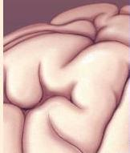

# The Eye

# 9

## INTRODUCTION

## PROPERTIES OF LIGHT

LIGHT

OPTICS

## THE STRUCTURE OF THE EYE

GROSS ANATOMY OF THE EYE

OPHTHALMOSCOPIC APPEARANCE OF THE EYE

- Box 9.1 *Of Special Interest:* Demonstrating the Blind Regions of Your Eye

CROSS-SECTIONAL ANATOMY OF THE EYE

- Box 9.2 *Of Special Interest:* Eye Disorders

## IMAGE FORMATION BY THE EYE

REFRACTION BY THE CORNEA

ACCOMMODATION BY THE LENS

- Box 9.3 *Of Special Interest:* Vision Correction

THE PUPILLARY LIGHT REFLEX

THE VISUAL FIELD

VISUAL ACUITY

## MICROSCOPIC ANATOMY OF THE RETINA

THE LAMINAR ORGANIZATION OF THE RETINA

PHOTORECEPTOR STRUCTURE

REGIONAL DIFFERENCES IN RETINAL STRUCTURE

## PHOTOTRANSDUCTION

PHOTOTRANSDUCTION IN RODS

PHOTOTRANSDUCTION IN CONES

*Color Detection*

- Box 9.4 *Of Special Interest:* The Genetics of Color Vision

DARK AND LIGHT ADAPTATION

*Calcium's Role in Light Adaptation*

## RETINAL PROCESSING

- Box 9.5 *Path of Discovery:* A Glimpse into the Retina, by John Dowling

TRANSFORMATIONS IN THE OUTER PLEXIFORM LAYER

*Bipolar Cell Receptive Fields*

## RETINAL OUTPUT

GANGLION CELL RECEPTIVE FIELDS

TYPES OF GANGLION CELLS

*Color-Opponent Ganglion Cells*

PARALLEL PROCESSING

## CONCLUDING REMARKS