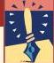

Box 9.3

OF SPECIAL INTEREST

## Vision Correction

When the ciliary muscles are relaxed and the lens is flat, the eye is said to be *emmetropic* if parallel light rays from a distant point source are focused sharply on the back of the retina. (The word is from the Greek *emmetros*, “in proper measure,” and *ope*, “sight.”) Stated another way, the emmetropic eye focuses parallel light rays on the retina without the need for accommodation (Figure A).

Now consider what happens when the eyeball is too short from front to back (Figure B). The light rays are focused at some point *behind* the retina, and the image of a point of light is a blurry spot on the retina. This condition is known as *hyperopia*, or farsightedness, because the eye can focus on far objects but the lens cannot accommodate enough to form an image on near points. Farsightedness can be corrected by placing a convex glass or plastic lens in front of the eye (Figure C). The curved front edge of the lens, like the cornea, bends light toward the center of the retina. Also, as the light passes from glass into air as it exits the lens, the back of the lens also increases the refraction (light going from glass to air speeds up and is bent *away* from the perpendicular).

If the eyeball is too long rather than too short, parallel rays will converge before the retina, cross, and again be imaged on the retina as a blurry circle (Figure D). This condition is known as *myopia*, or nearsightedness. The amount of refraction provided by the cornea and lens is too great to focus distant objects. Thus, for the nearsighted eye to see distant points clearly, artificial concave lenses must be used to move the point image back onto the retina (Figure E).

Some eyes have irregularities such that the curvature and refraction in the horizontal and vertical planes is different. This condition is called *astigmatism*, and it can be corrected

by using an artificial lens that is curved more along one axis than others.

Even if you are fortunate enough to have perfectly shaped eyeballs and a symmetrical refractive system, you probably will not escape *presbyopia* (from the Greek meaning “old eye”). This condition is a hardening of the lens that accompanies the aging process and is thought to be explained by the fact that while new lens cells are generated throughout life, none are lost. The hardened lens is less elastic, leaving it unable to change shape and accommodate sufficiently to focus on both near and far objects. The correction for presbyopia, first introduced by Benjamin Franklin, is a bifocal lens. These lenses are concave on top to assist far vision and convex on the bottom to assist near vision.

In *hyperopia* and *myopia*, the amount of refraction provided by the cornea is either too little or too great for the length of the eyeball. But modern techniques can now change the amount of refraction the cornea provides. In *radial keratotomy*, a procedure to correct *myopia*, tiny incisions through the peripheral portion of the cornea relax and flatten the central cornea, thus reducing the amount of refraction and minimizing the *myopia*. The most recent techniques use lasers to reshape the cornea. In *photorefractive keratotomy* (PRK), a laser is used to reshape the outer surface of the cornea by vaporizing thin layers. In *laser in situ keratomileusis* (LASIK), a thin flap of the cornea is lifted so the laser can reshape the cornea from the inside. Nonsurgical methods are also being used to reshape the cornea. A person can be fitted with special retainer contact lenses or plastic corneal rings, which alter the shape of the cornea and correct refractive errors.

Recall that the ciliary muscle forms a ring around the lens. During accommodation, the ciliary muscle contracts and swells in size, thereby making the area inside the muscle smaller and decreasing the tension in the suspensory ligaments. Consequently, the lens becomes rounder and thicker because of its natural elasticity. This rounding increases the curvature of the lens surfaces, thereby increasing their refractive power. Conversely, relaxation of the ciliary muscle increases the tension in the suspensory ligaments, and the lens is stretched into a flatter shape.

The ability to accommodate changes with age. An infant’s eyes can focus objects just beyond his or her nose, whereas many middle-aged adults cannot clearly see objects closer than about arm’s length. Fortunately, artificial lenses can compensate for this and other defects of the eye’s optics (Box 9.3).