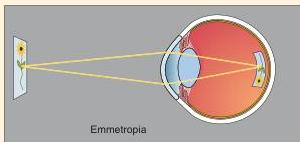
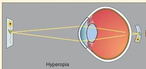
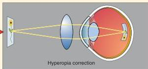
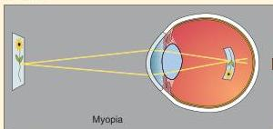
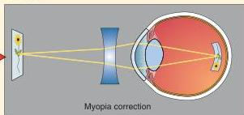

FIGURE A

FIGURE B

FIGURE C

FIGURE D

FIGURE E

## The Pupillary Light Reflex

In addition to the cornea and the lens, the pupil contributes to the optical functioning of the eye by continuously adjusting for different ambient light levels. To check this for yourself, stand in front of a bathroom mirror with the lights out for a few seconds, and then watch your pupils change size when you turn the lights on. This **pupillary light reflex** involves connections between the retina and neurons in the brain stem that control the muscles that constrict the pupils. An interesting property of this reflex is that it is *consensual*; shining a light into only one eye causes the constriction of the pupils of both eyes. It is unusual, indeed, when the pupils are not the same size; the lack of a consensual pupillary light reflex is often taken as a sign of a serious neurological disorder involving the brain stem.