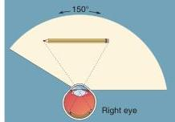
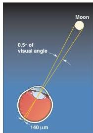

FIGURE 9.9

**The visual field for one eye.** The visual field is the total amount of space that can be viewed by the retina when the eye is fixated straight ahead. Notice how the image of an object in the visual field (pencil) is inverted on the retina.

FIGURE 9.10

**Visual angle.** Distances across the retina can be expressed as degrees of visual angle.

just like decreasing the aperture size (increasing the f-stop) on a camera lens. To understand why this is true, consider two points in space, one close and the other far away. When the eye accommodates to the closer point, the image of the farther point on the retina no longer forms a point, but rather a blurred circle. Decreasing the aperture—constricting the pupil—reduces the size of this blurred circle so that its image more closely approximates a point. In this way, distant objects appear to be less out of focus.

## The Visual Field

The structure of the eyes, and where they sit in our head, limits how much of the world we can see at any one time. Let's investigate the extent of the space seen by one eye. Holding a pencil in your right hand, close your left eye and look at a point straight ahead. Keeping your eye fixated on this point, slowly move the pencil to the right (toward your right ear) across your field of view until the pencil disappears. Repeat this exercise, moving the pencil to the left where it will disappear behind your nose, and then up and down. The points where you can no longer see the pencil mark the limits of the **visual field** for your right eye. Now look at the middle of the pencil as you hold it horizontally in front of you. Figure 9.9 shows how the light reflected off this pencil falls on your retina. Notice that the image is inverted; the left visual field is imaged on the right side of the retina, and the right visual field is imaged on the left side of the retina.

## Visual Acuity

The ability of the eye to distinguish two nearby points is called **visual acuity**. Acuity depends on several factors, but especially on the spacing of photoreceptors in the retina and the precision of the eye's refraction.

Distance across the retina can be described in terms of degrees of **visual angle**. A right angle subtends (spans) 90°, and the moon, for example, subtends an angle of about 0.5° (Figure 9.10). We can speak of the eye's ability to resolve points that are separated by a certain number of degrees of visual angle. The Snellen eye chart, which we have all read at the doctor's office, tests our ability to discriminate letters and numbers at a viewing distance of 20 feet. Your vision is 20/20 when you can recognize a letter that subtends an angle of 0.083° (equivalent to 5 minutes of arc, where 1 minute is 1/60 of a degree).

## ▼ MICROSCOPIC ANATOMY OF THE RETINA

Now that we have an image formed on the retina, we can get to the neuroscience of vision: the conversion of light energy into neural activity. To begin our discussion of image processing in the retina, we must introduce the cellular architecture of this bit of brain.

The basic system of retinal information processing is shown in Figure 9.11. The most direct pathway for visual information to exit the eye is from **photoreceptors** to **bipolar cells** to **ganglion cells**. The ganglion cells fire action potentials in response to light, and these impulses propagate down the optic nerve to the rest of the brain. Besides the cells in this direct path from photoreceptor to brain, retinal processing is influenced by two additional cell types. **Horizontal cells** receive input from the photoreceptors and project neurites laterally to influence surrounding bipolar cells and photoreceptors. **Amacrine cells** receive input from bipolar cells and project