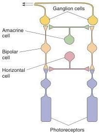
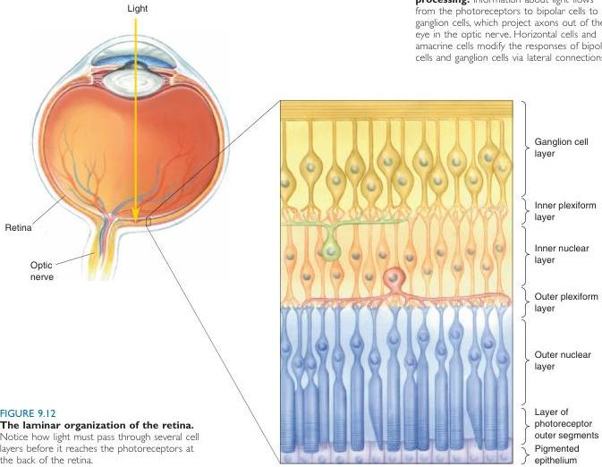
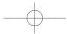

amacrine cells.

There are two important points to remember here:

1. The only light-sensitive cells in the retina are the photoreceptors. All other cells are influenced by light only via direct and indirect synaptic interactions with the photoreceptors. (We will see in Chapter 19 that there is one exception to this rule involving neurons that control circadian rhythms. However, these unusual photoreceptive cells do not appear to be involved in visual perception.)
2. The ganglion cells are the only source of output from the retina. No other retinal cell type projects an axon through the optic nerve.

Now let's take a look at how the different cell types are arranged in the retina.

## The Laminar Organization of the Retina

Figure 9.12 shows that the retina has a laminar organization: Cells are organized in layers. Notice that the layers are seemingly inside-out; light must pass from the vitreous humor through the ganglion cells and bipolar cells before it reaches the photoreceptors. Because the retinal cells above the

Ganglion cell axons projecting to forebrain

FIGURE 9.11

The basic system of retinal information processing. Information about light flows from the photoreceptors to bipolar cells to ganglion cells, which project axons out of the eye in the optic nerve. Horizontal cells and amacrine cells modify the responses of bipolar cells and ganglion cells via lateral connections.

FIGURE 9.12

The laminar organization of the retina.

Notice how light must pass through several cell layers before it reaches the photoreceptors at the back of the retina.

