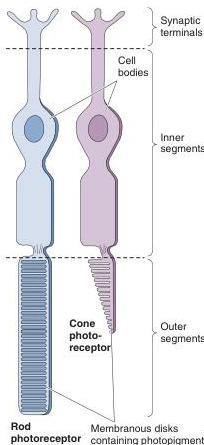

light passes through them. One reason the inside-out arrangement is advantageous is that the *pigmented epithelium* that lies below the photoreceptors plays a critical role in the maintenance of the photoreceptors and photopigments. The pigmented epithelium also absorbs any light that passes entirely through the retina, thus minimizing the reflection of light within the eye that would blur the image.

The cell layers of the retina are named in reference to the middle of the eyeball. Thus, the innermost layer is the **ganglion cell layer**, which contains the cell bodies of the ganglion cells. Next is the **inner nuclear layer**, which contains the cell bodies of the bipolar cells, the horizontal and amacrine cells. The next layer is the **outer nuclear layer**, which contains the cell bodies of the photoreceptors. Finally, the **layer of photoreceptor outer segments** contains the light-sensitive elements of the retina. The outer segments are embedded in the pigmented epithelium.

Between the ganglion cell layer and the inner nuclear layer is the **inner plexiform layer**, which contains the synaptic contacts between bipolar cells, amacrine cells, and ganglion cells. Between the outer and inner nuclear layers is the **outer plexiform layer**, where the photoreceptors make synaptic contact with the bipolar and horizontal cells.

## Photoreceptor Structure

The conversion of electromagnetic radiation into neural signals occurs in the 125 million photoreceptors at the back of the retina. Every photoreceptor has four regions: an outer segment, an inner segment, a cell body, and a synaptic terminal. The outer segment contains a stack of membranous disks. Light-sensitive *photopigments* in the disk membranes absorb light, thereby triggering changes in the photoreceptor membrane potential (discussed below). Figure 9.13 shows the two types of photoreceptor in the retina, easily distinguished by the appearance of their outer segments. **Rod photoreceptors** have a long, cylindrical outer segment, containing many disks. **Cone photoreceptors** have a shorter, tapering outer segment with fewer membranous disks.

The structural differences between rods and cones correlate with important functional differences. For example, the greater number of disks and higher photopigment concentration in rods makes them over 1000 times more sensitive to light than cones. Indeed, under nighttime lighting, or *scotopic* conditions, only rods contribute to vision. Conversely, under daytime lighting, or *photopic* conditions, cones do the bulk of the work. For this reason, the retina is said to be *duplex*—a scotopic retina using only rods, and a photopic retina using mainly cones.

Rods and cones differ in other respects as well. All rods contain the same photopigment, but there are three types of cone, each containing a different pigment. The variations among pigments make the different cones sensitive to different wavelengths of light. As we shall see in a moment, only the cones, not the rods, are responsible for our ability to see color.

## Regional Differences in Retinal Structure

Retinal structure varies from the fovea to the retinal periphery. In general, the peripheral retina has a higher ratio of rods to cones (Figure 9.14). It also has a higher ratio of photoreceptors to ganglion cells. The combined effect of this arrangement is that the peripheral retina is more sensitive to light, because (1) rods are specialized for low light, and (2) there are more photoreceptors feeding information to each ganglion cell. You can prove

FIGURE 9.13

**A rod and a cone.** Rods make vision possible in low light, and cones enable us to see in daylight.