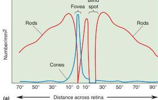
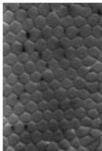
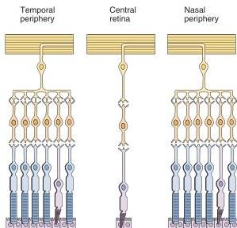
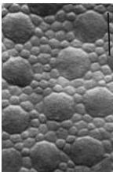

(c)

(b) Peripheral retina Central retina Peripheral retina

(d)

FIGURE 9.14

**Regional differences in retinal structure.** (a) Cones are found primarily in the central retina, within 10° of the fovea. Rods are absent from the central fovea and are found mainly in the peripheral retina. (b) In the central retina, relatively few photoreceptors feed information directly to a ganglion cell; in the peripheral retina, many photoreceptors provide input. This arrangement makes the peripheral retina better at detecting dim light but the central retina better for high-resolution vision. (c) This magnified cross section of the human central retina shows the dense packing of cone inner segments. (d) At a more peripheral location on the retina, the cone inner segments are larger and appear as islands in a sea of smaller rod inner segments. (Source for parts c and d: Curcio et al., 1990, p. 500.)

this to yourself on a starry night. (It's fun; try it with a friend.) First, spend about 20 minutes in the dark getting oriented, and then gaze at a bright star. Fixating on this star, search your peripheral vision for a dim star. Then move your eyes to look at this dim star. You will find that the faint star disappears when it is imaged on the central retina (when you look straight at it) but reappears when it is imaged on the peripheral retina (when you look slightly to the side of it).

The same characteristics that enable the peripheral retina to detect faint stars at night make it relatively poor at resolving fine details in daylight. This is because daytime vision requires cones, and because good visual acuity