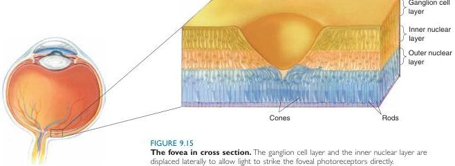

FIGURE 9.15

The fovea in cross section. The ganglion cell layer and the inner nuclear layer are displaced laterally to allow light to strike the foveal photoreceptors directly.

requires a low ratio of photoreceptors to ganglion cells. The region of retina most highly specialized for high-resolution vision is the fovea. Recall that the fovea is a thinning of the retina at the center of the macula. In cross section, the fovea appears as a pit in the retina. Its pitlike appearance is due to the lateral displacement of the cells above the photoreceptors, allowing light to strike the photoreceptors without passing through the other retinal cell layers (Figure 9.15). This structural specialization maximizes visual acuity at the fovea by pushing aside other cells that might scatter light and blur the image. The central fovea also is unique because it contains no rods; all the photoreceptors are cones.

# ▼ PHOTOTRANSDUCTION

The photoreceptors convert, or transduce, light energy into changes in membrane potential. We begin our discussion of phototransduction with rods, which outnumber cones in the human retina by 20 to 1. Most of what has been learned about phototransduction by rods has proven to be applicable to cones as well.

# Phototransduction in Rods

As we discussed in Part I, one way information is represented in the nervous system is as changes in the membrane potential of neurons. Thus, we look for a mechanism by which the absorption of light energy can be transduced into a change in the photoreceptor membrane potential. In many respects, this process is analogous to the transduction of chemical signals into electrical signals that occurs during synaptic transmission. At a G-protein-coupled neurotransmitter receptor, for example, the binding of transmitter to the receptor activates G-proteins in the membrane, which in turn stimulate various effector enzymes (Figure 9.16a). These enzymes alter the intracellular concentration of cytoplasmic second messenger molecules, which (directly or indirectly) change the conductance of membrane ion channels, thereby altering membrane potential. Similarly, in the photoreceptor, light stimulation of the photopigment activates G-proteins, which in turn activate an effector enzyme that changes the cytoplasmic concentration of a second messenger molecule. This change causes a membrane ion channel to close, and the membrane potential is thereby altered (Figure 9.16b).