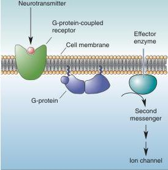
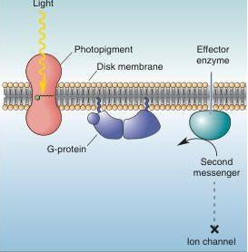

|  (a) G-protein-coupled neurotransmitter receptor |   | (b) Photopigment  |   |
| --- | --- | --- | --- |
|  Stimulus: | Transmitter | Stimulus: | Light  |
|  Receptor activation: | Change in protein conformation | Receptor activation: | Change in protein conformation  |
|  G-protein response: | Binds GTP | G-protein response: | Binds GTP  |
|  Second messenger change: | Increase second messenger | Second messenger change: | Decrease second messenger  |
|  Ion channel response: | Increase or decrease conductance | Ion channel response: | Decrease Na^{+} conductance  |

FIGURE 9.16

Light transduction and G-proteins. G-protein-coupled receptors and photoreceptors use similar mechanisms. (a) At a G-protein-coupled receptor, the binding of neurotransmitter activates G-proteins and effector enzymes. (b) In a photoreceptor, light begins a similar process using the G-protein transducin.

Recall from Chapter 3 that a typical neuron at rest has a membrane potential of about -65 mV, close to the equilibrium potential for K$^{+}$. In contrast, in complete darkness, the membrane potential of the rod outer segment is about -30 mV. This depolarization is caused by the steady influx of Na$^{+}$ through special channels in the outer segment membrane (Figure 9.17a). The movement of positive charge across the membrane, which occurs in the dark, is called the dark current. Sodium channels are stimulated to open—are gated—by an intracellular second messenger called cyclic guanosine monophosphate, or cGMP. Evidently, cGMP is continually produced in the photoreceptor by the enzyme guanylyl cyclase, keeping the Na$^{+}$ channels open. Light reduces cGMP, causing the Na$^{+}$ channels to close, and the membrane potential becomes more negative (Figure 9.17b). Thus, photoreceptors hyperpolarize in response to light.